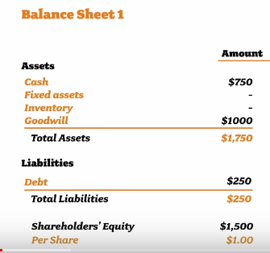
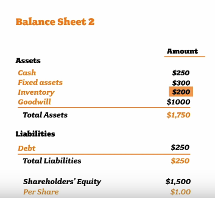
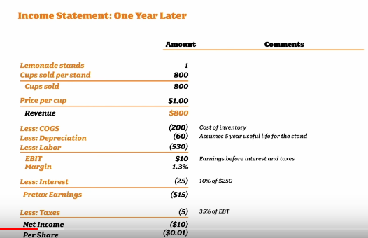
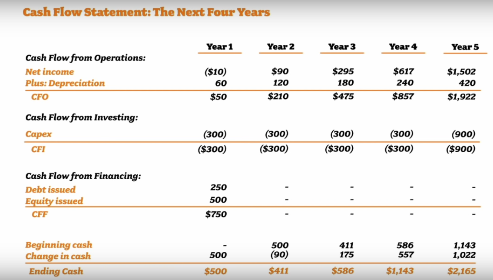
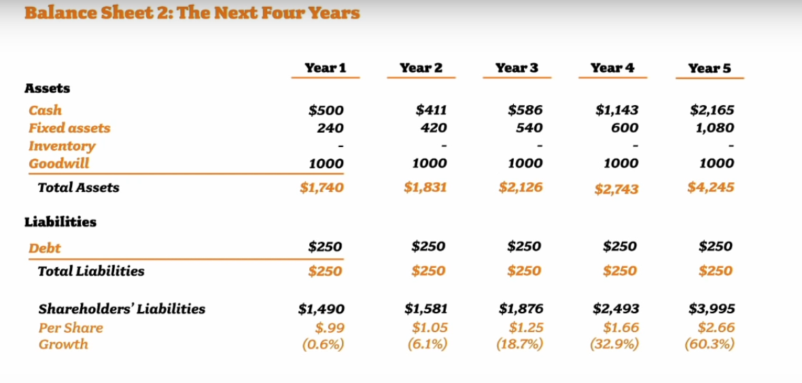
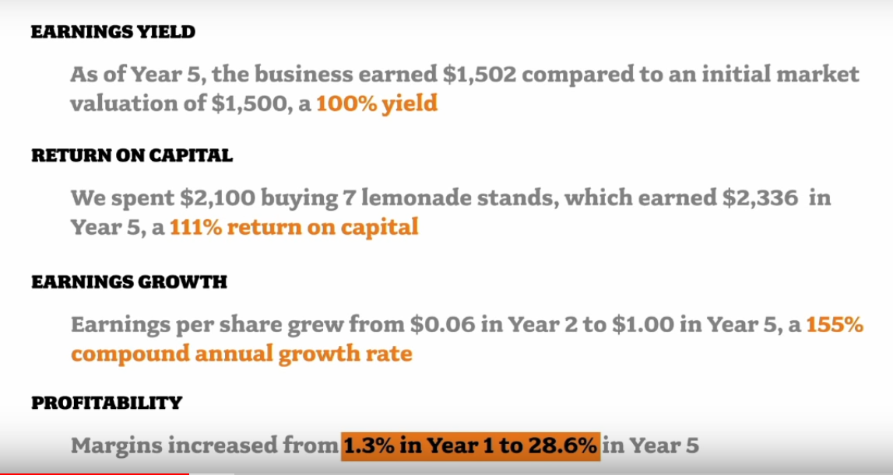

https://www.youtube.com/watch?v=WEDIj9JBTC8

## Start a business a lemonade stand

-   Put in 1000 shares of your own money (1000 \$)

-   Borrow 500 through shares to an investor (1\$ each)

-   Borrow 250 \$ from a friend at 10% interest p.a. (money earned
    through this does not need to be redistributed to shareholders)

Buy a lemonade stand (fixed assets) and supplies (inventory)

## First year of operation income statement

Income statement:

-   Profitability

-   Revenues

-   Expenses

-   Net profits

**Assumptions:**

-   It takes one year to sell 800 cups

-   Price 1\$ / cup

-   530\$ / year staff payments

## Growing the business

Operating assumptions:

-   All cash is used to buy addition lemonade stands

-   No dividend paid

-   We can charge .05\$ more / cup / year

-   We can sell 5% more cups / stand / year

    

## Cashflow statement

## Evaluating value

