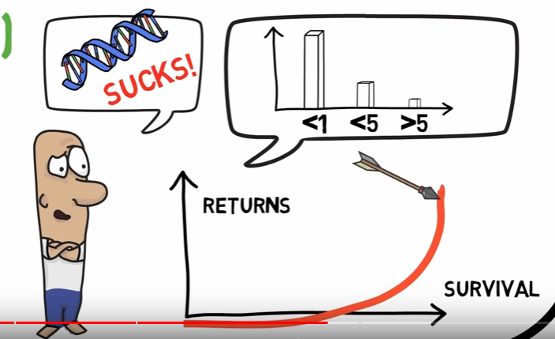
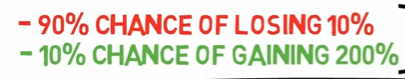
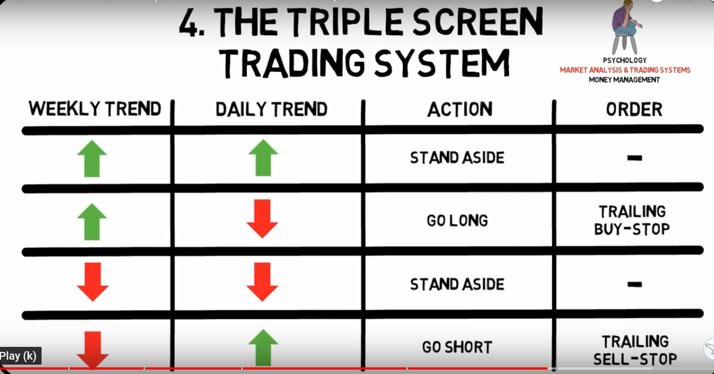
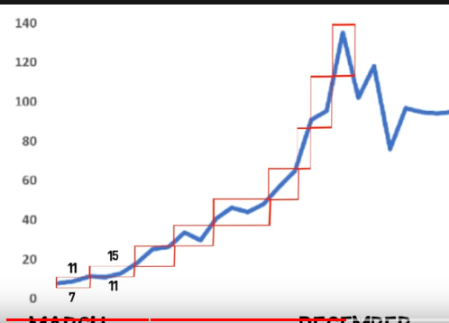
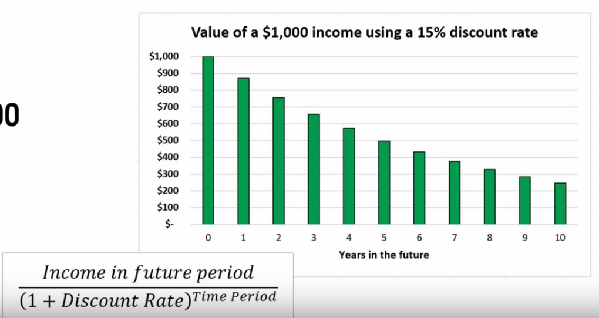
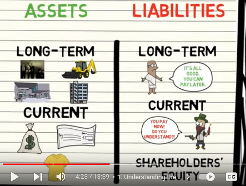

A stock is technically a loan with infinite maturity, so the company
won't actually ever pay back the loan. In reality, most companies come
to an end eventually, but there are many companies that have lasted for
100 years or more. Furthermore, a stock may not ever pay out any cash
dividends at all, so you may not get any interest on the loan either.

**Short selling:** an investor borrows securities, sells the borrowed
securities immediately, and then hopes to buy them back later at a lower
price. Investors borrow securities when they believe that their value
will fall.

Dividend discount model
-----------------------

-   The cash flows that investors receive from stock are the dividends,
    so fundamentals-based models of stock price note that the current
    price of a share of stock is equal to the present discounted value
    of the sum of all its future dividends. Technically, this represents
    an infinite number of future dividends.

-   There's a surprisingly simple formula for the present value of the
    sum of all future dividends: D/(r − g). This formula is called the
    dividend discount model.

    -   the amount of the next annual dividend: D = \$1.72 per share

    -   the expected return on the stock (based on CAPM): r

        -   To use the CAPM to estimate the expected return, or discount
            rate, on a stock, we use the following formula:

        -   

        -   E(r~i~) = expected return

        -   r~f~ = risk-free-rate = return on a 10-year treasury bond
            (about 5%)

        -   ß~i~ = beta

        -   The final term is the difference between the expected return
            on the entire market and the risk-free rate---called the
            market risk premium, or the compensation for bearing one
            unit of risk.

-   average growth rate of the dividend: g (average dividend growth rate
    over the past 5 years.)

Dividends
---------

Companies usually don't reduce the relative amount of dividends
(dividend yield) the pay but rather try to keep them stable or even
increase. Reducing or increasing dividends is an indicator of strength
or weakness.

Several academic studies show that the higher the fraction of earnings a
company pays out as dividends, the higher the growth rate of earnings
tends to be over the next 10 years.

A **stock buyback, or share repurchase**, is a transaction in which a
company goes into the stock market and repurchases, or buys back, some
of its outstanding shares. This is a **substitute for a dividend**
because the company has to pay cash for these repurchased shares, which
returns cash to the company's shareholders.

Advantage of long term investment over short term
============================================================================================================================================

<https://www.visualcapitalist.com/stock-market-returns-time-periods-1872-2018/>

<https://themeasureofaplan.com/us-stock-market-returns-1870s-to-present/>

Interest rates and stocks prices have a reverse relationship (compare
P/E ratio overall in relation to interest rates)

Earnings yield = opposite of P/E shows % earning per stock price

10-yr- US treasure bonds as indicator for interest

Three pillars of trading
========================

Psychology
----------

-   Keep track of your trades including your assumptions and reasoning
    (plan to sell)

-   Setup rules and follow them

    -   Analyse your performance and change rules accordingly

    -   Measure adherence to rules

    -   Mood when entering and exiting the trade

-   

Trading system
--------------

Man = trend

Dog = oscillator (oscillates around trend sometimes strays away may end
up in a different direction=

-   Exponential moving averages are better than normal moving averages
    (stronger weight of more recent trend)

-   Try to confirm trends in related markets (e.g., ema of different
    stocks trending in the same direction)

-   Longer EMA = stronger signal

    Entry criteria:

    

<!-- -->

-   Market tide: weekly MACD histogram (trend) - buy in that direction

-   Market wave: 2-day EMA (oscillator) - opposite of that direction

-   Intraday breakout: buy order 1 tick above the high of the previous
    day.

Money management
----------------

Cut losses short and let winners run

Box model for exit strategy

-   Buy stock when it moves into a higher box

-   Stop loss is lower end of box (previous high)

-   When box exceeds upper bound of box

-   Establish a new upper bound and make previous upper bound the new
    lower bound

### Kelly Criterion

Determine position size based on:

-   Equity Balance (how much money available for trading)

-   Expected return (average R over time (Risk/Reward ratio)

-   Probability of winning/losing

    Example:

    Balance: 20K

    Expected return: 4.04 (needs to be constantly adjusted to actual
    averages)

    Win Rate: 59% (needs to be constantly adjusted to actual averages)

    If the downside-case loss is less than 100%, as in the scenario
    above, a different Kelly formula is required: **Kelly % = W/A -- (1
    -- W)/B**, where W is the win probability, B is the profit in the
    event of a win (20%), and A is the potential loss (also 20%).

    (Expected return \* (Win Rate - Losing Rate)) / Expected Return

    (4.04 \* .59 - (1-.59))/ 4.04 = 0.488 / 3 = .163% (/3 = fractional
    Kelly)

    20000 \* .163% = 3256.77 (actual risk is determined based on stop
    loss e.g. 10% of position size)

### Van Tharp 

-   R = Unit of risk

-   Buy price 100 \$ price and 90 \$ stop-loss = 1R = 10\$

-   Sale price = 140 \$ = 4R profit

-   Expectancy = average R over time

    

-   **Look of the distribution of R multiples not only the average (e.g.
    volatility and drawdowns)**

-   Exiting strategies

-   Percentage (7-8%) could be trailing

-   Time based (if based on fundamentals)

-   Volatility based (if outside normal vola of stock)

-   Opportunity (how often does the system generate signals)

-   

-   Position sizing

-   

1.  Survival (never risk \> 2% of equity in one trade including fees)

    a.  Set up stop-loss according to strategy

    b.  Stop-loss amount (stock prices - stop-loss amount) defines \# of
        stocks to buy

    c.  Only move stop-loss in direction of the trade (higher)

> 

2.  Steady returns

3.  High returns

Valuation of stock prices
=========================

Compare this in conjunction with P/E

Relative evaluation
-------------------

Compare stocks to a similar competitor and take the cheaper one.

Competitive advantage

-   Find comparable

-   Compare price based on P/E ratio

-   Adjust for differences (e.g. take earning growths)

> 

Intrinsic valuation (follow-up of above)
----------------------------------------

-   Discount rate = yearly return of the stock

-   Company share = claim against portion of the future earnings

Interpretation of financial statements
======================================

-   Watch out for overstated values in the balance sheet (e.g.
    intangible assets)

-   Look for consistency over several years (ideally 10)

-   Compare within the same industry

Intrinsic value (liquidation value)
-----------------------------------

Use book value = Sell all assets and repay all liabilities

Income statement (over a period)
--------------------------------

Best is to express everything as a % of the of total revenue (top line)
and compare with average of top 5 competitors

Balance sheet (snapshot in time)
--------------------------------

Look at a percentage of total assets and compare with top competitors

Bad signs

Cash flow statement
-------------------

Statement of actual ins and outs of money

Indicators
----------

### ROE return on equity

Net income (income statement) / Total equity (Balance sheet)

### Return on tangible assets

### Net margin

-   Highly dependent on industry

-   Net margin = Net income (earnings) / Revenue (+20% ideal)

-   Gross margin = gross profit / revenue (+40% ideal)

-   Tells you what percentage of how much the company earns on a dollar

### Current Ratio

-   Current Ratio = Current Assets / Current liabilities

-   Should be positive (higher for low inventory industries)

-   Indicator of whether a company is able to fulfil its short-term
    obligations

### P/B ratio price to book ratio

-   Highly dependent on industry

-   P/B = market cap (number of stocks \* price of stock) / total assets

Inflation
=========

-   During inflation it's good to invest in companies that have low
    capital requirements (low debt ratio) and high return on assets
    (produce once and sell many times)

-   Companies that can scale easier (intangible assets e.g. software)

-   Companies that have pricing power (e.g. they can increase the price
    according to inflation or higher)

Cycles
======

A market cycle oscillates around a secular trend.

The stock market is driven by bust and boom periods. Those are
exaggerations in both directions followed by reversion to the mean.

Cycles are influenced by other cycles:

-   Economy (GDP)

-   Cycle of profits of businesses (P/E price to earnings ratio)
    (multpl.com)

-   

-   Credit cycle

-   Psychology (attitudes towards risk)
    

    

Ideas
=====

Look for most valuable brand with the lowest P/E

Conservative base investment
----------------------------

-   Dividend stocks (paying dividends for 10+ years)

-   Current ratio = assets / liabilities \> 2 (conservative finance)

-   Earning money + earning growth (5+ years)

-   Net current assets (current assets -- liabilities) \> price

    Don't bet on companies that do a lot of acquisitions rather focus on
    organic grows

Acquirer\'s multiple
--------------------

-   P/E = market cap / net earnings

-   AM = Enterprise value (market cap + cash reserves - debt) /
    operating earnings

-   Buy companies with low acquirer multiple

-   <https://acquirersmultiple.com/largecapsuccess/>

Diversify
=========

10-20 stocks

Focus on avoiding mistakes instead of trying to be right all the time 
======================================================================

-   Try to be consistently not stupid.

-   Focus on what you don't want to do (e.g. not investing in...)

-   Avoid disaster (e.g. running out of money)

Stay in circle of competence with humility (but think independently)
--------------------------------------------------------------------

-   Know what you don't know

-   Look for evidence that goes against your conclusion/view

-   Don't follow the herd

-   Don't follow analysts or irrelevant news.

    

Evaluate risk
-------------

-   Use a margin of safety (e.g. buy under valued stocks)

-   More risk = higher compensation

-   What could go wrong?

Resist the urge to act (FOMO)
=============================

-   Avoid transaction fees

-   But not when it comes to cutting losss

Focus on macro rather than micro decisions
==========================================

-   Don't save on small expenses or try to win on small bets

-   Use a credit card to get bonuses

-   Automatic saving plan

-   Compare based on total cost of ownership rather than purchase price

    

Don't fall in love with your investment/position
================================================

-   Always set a value at which you will sell before investing and
    follow it

-   What you paid for your house, stock, or car has no relevance to its
    value. If the value is below what you paid, you don\'t have to get
    even. If you bought a stock for \$100 and it is now \$50, you should
    sell it, if it is not worth more than \$50. Ask: Suppose I hadn\'t
    made the investment, would I make this investment today at today\'s
    price?
