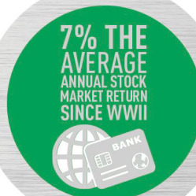
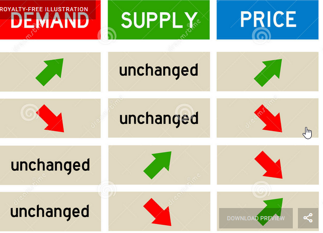
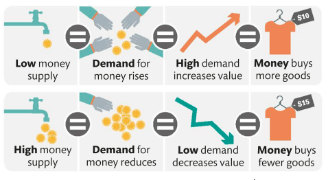
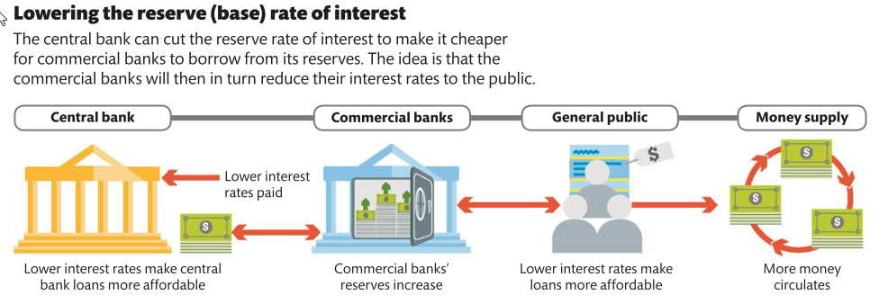
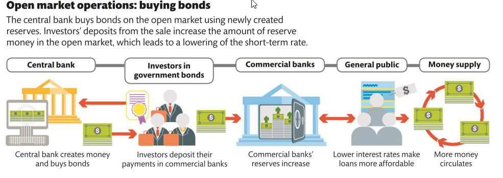
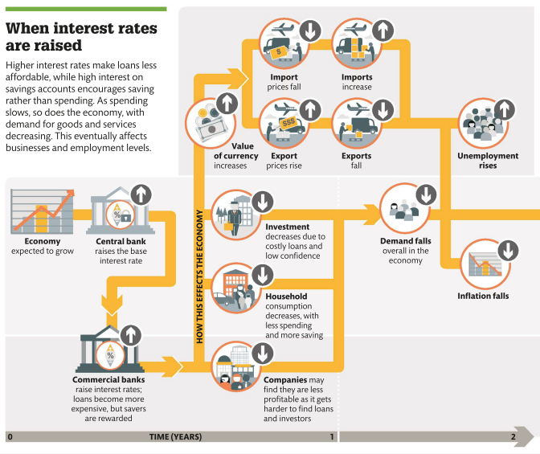
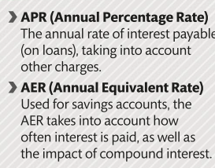

# 

# What is money?

A dollar, whether under a Gold Standard or not, is something that would
be intimately familiar to the faceless bureaucrats of the International
Bureau of Weights and Measures: it is a unit of measurement for economic
value---an arbitrary increment on an abstract scale. So like a metre or
a kilogram, a dollar itself doesn't refer to any physical thing at
all---even if the length or mass or value of some particular physical
thing has been agreed on as its standard.

Economic value is a property of the social world; whereas linear
extension, mass, temperature, and so on are properties of physical
world. The choice of standard for the measurement of physical concepts
is a question of technical efficiency. But the uses to which measurement
of the social property of economic value are put are qualitatively quite
different; It is, therefore, not just a technical, but also an ethical
question; and the criterion for choosing it is not only which standard
unit is efficient, but which is fair.

The universal application of the new concept of economic value brings
with it a major problem: the lack of any intrinsic limit to consumption,
accumulation, and the quest for status.

Money is not a commodity medium of exchange, but a social technology
composed of three fundamental elements.

-   The first is an abstract unit of value in which money is
    denominated.

-   The second is a system of accounts, which keeps track of the
    individuals' or the institutions' credit or debt balances as they
    engage in trade with one another. The third is the possibility that
    the original creditor in a relationship can transfer their debtor's
    obligation to a third party in settlement of some unrelated debt.

-   This third element is vital. Whilst all money is credit, not all
    credit is money: and it is the possibility of transfer that makes
    the difference. An IOU which remains for ever a contract between
    just two parties is nothing more than a loan. It is credit, but it
    is not money. It is when that IOU can be passed on to a third
    party---when it is able to be "negotiated" or "endorsed," in the
    financial jargon---that credit comes to life and starts to serve as
    money. Money, in other words, is not just credit---but
    *transferable* credit.

### Bill Discounting Process:

The step-by-step process of bill discounting is given below:

-   A seller supplies goods or services to a buyer and raises an
    invoice.

-   The buyer accepts the invoice. This approval means the buyer
    acknowledges the invoice and promises to make the payment on the due
    date.

-   The seller approaches the financial institution to get the bill
    discounted.

-   The financial institute verifies the creditworthiness of the buyer
    and the legitimacy of the bill.

-   Once approved, the bank disburses the funds to the seller after
    deducting the pre-defined fee, discount, or appropriate margin.

-   Thus, the seller gets a quicker payment for the invoice, which can
    be used for other business purposes.

-   At the end of the original credit period, the buyer makes the
    payment to the financial institution.

    -   

**For sellers to accept buyers' IOUs in payment, they must be convinced
of two things.**

-   **That the money's issuer is creditworthy.**

-   **For credit to become money, sellers must also trust that third
    parties will be willing to accept the debtor's IOU in payment as
    well. They must believe that it is, and will remain indefinitely,
    transferable---that the market for this money is liquid.**

Both these factors are determined not technologically or physically but
by the general levels of trust and confidence.

## History commodity vs system

Looking at the bartering example from Adam Smith's book. In every case,
these were examples of trade that was accounted for in pounds,
shillings, and pence, just as it was in modern England. Sellers would
accumulate credit on their books, and buyers debts, all denominated in
monetary units. The fact that any net balances that remained between
them might then be discharged by payment of some commodity or other to
the value of the debt did not mean that that commodity was "money." To
focus on the commodity payment rather than the system of credit and
clearing behind it was to get things completely the wrong way round.

A moment's reflection shows that a staple commodity could not be used as
money, because *ex hypothesis* the medium of exchange is equally
receivable by all members of the community. Thus if the fishers paid for
their supplies in cod, the traders would equally have to pay for their
cod in cod, an obvious absurdity.

If the *fei* of Yap (the big stones used at a German owned island in the
pacific) were not a medium of exchange, then what were they? The *fei*
were just tokens by which these accounts were kept. As in Newfoundland,
the inhabitants of Yap would accumulate credits and debts in the course
of their trading in fish, coconut, pigs, and sea cucumber. These would
be offset against one another to settle payments. Any outstanding
balances carried forward at the end of a single exchange, or a day, or a
week, might, if the counterparties so wished, be settled by the exchange
of currency---a *fei*---to the appropriate value; this being a tangible
and visible record of the outstanding credit that the seller enjoyed
with the rest of Yap.

Coins and currency, in other words, are useful tokens to record the
underlying system of credit accounts and to implement the underlying
process of clearing. They may even be necessary in an economy larger
than that of Yap, where coins could drop to the bottom of the sea and
yet no one would think to question the wealth of their owner**. But
currency is not itself money. Money is the system of credit accounts and
their clearing that currency represents or simply tokens to keep track
of the underlying and ever-fluctuating balances of millions upon
millions of credit and debt relationships**

Why, in short, is the conventional theory of money so resilient? There
are two basic reasons, and they are worth dwelling on.The first reason
has to do with the historical evidence for money. The second reason why
the nature of money is so difficult to pin down, and why it has been and
remains a subject of such controversy, is precisely *because* it is such
an integral part of our economies. When we try to understand money, we
are like the fish of the Chinese proverb, trying to know the very water
in which it moves.

## Bank closure Ireland

On 4 May 1970, a prominent notice appeared in Ireland's leading daily
newspaper, the *Irish Independent*, with a simple but alarming title:
"CLOSURE OF BANKS." At the time, however, this development was widely
expected---not least because it had happened once before, in 1966. The
matter of dispute between the banks and their employees was a familiar
one in the Europe of the late 1960s: the extent to which pay was keeping
up with prices. High inflation throughout 1969---by the autumn, the cost
of living had risen by more than 10 per cent over the previous fifteen
months---had prompted a demand by the employees' union for a new pay
settlement. The banks had refused, and the Irish Bank Officials'
Association had voted to strike.

The review of the closure concluded not only that "the Irish economy
continued to function for a reasonably long period of time with its main
clearing banks closed for business," but that "the level of economic
activity continued to increase" over the period.

The closure of the Irish banks showed that the system of credit creation
and clearing need not be the officially sanctioned one. The official
system---the banks---was suspended for the best part of seven months.
But money did not disappear.

## History of numbers, accounting and language

In Mesopotamia, Schmandt-Besserat realised, a complex system of clay
tokens had enabled this ancient method to attain a previously unknown
level of sophistication. Each different shape and size of token
represented a different type and quantity of a particular staple
commodity: incised cones for bread, ovoids for oil, rhomboids for beer,
and so on. Around 3100 bc, in Mesopotamian Uruk, a critical innovation
was made. Records began to be kept not using collections of the tokens
themselves, but by making impressions of the tokens on moist clay
tablets. Soon after the invention of writing, however, another momentous
improvement was made. Instead of writing five sheep symbols to signify
five sheep, separate symbols for the number five and the category sheep
were introduced. Now, only two symbols were required, instead of five.

Correspondence-counting (making notches in tally sticks) requires no
notion of abstract number; no concept, that is, of number separate from
the things being counted. The new system did. Not only had Ur invented
writing, it had almost simultaneously invented the concept of
number---and thereby opened the way to the development of mathematics.
The invention of writing and abstract number set the stage for the
development of the third technology at the heart of Mesopotamian
society: accounting.

Money was a technology built on the basis of the revolutionary notion of
economic value---an invisible substance that was both everywhere and
nowhere, and which had a presence in the physical world only via the
symbolism of coinage. As such, the "nominalist" view that money has
value only by convention came naturally to the Greeks.

Smith's metaphor for Mandeville's paradoxical process---the "invisible
hand" which ensures that "by pursuing his own interest \[the
individual\] frequently promotes that of the society more effectually
than when he really intends to promote it"---is so famous that it has
long ago taken on a life of its own

## Banks and intermediators

During the 14-16 a hierarchical organisation of credit was established
as a predecessor to banking and an alternative to state/monarchy
ownership of money (minting and determining the value of money). A local
tradesman's promise to pay might not be worth much beyond his small
circle of suppliers and clients. But the promise of one of the
international merchant houses, with their much larger volume of trade,
their great stocks of reserves, and their long histories of success, was
a different matter. If a great merchant substituted his word for that of
a local tradesman, an IOU that might previously have circulated at most
within the local economy could be transformed into one that could
circulate anywhere where the great merchant's prestige was acknowledged.
A pyramid of credit could be constructed, with the obligations of local
tradesmen as the base, larger wholesalers in the middle, and the most
exclusive, well-known, and tight-knit circle of international merchants
at the top.

**A bank is in essence an institution which writes IOUs on the one
hand---these are its deposits, its bonds, its notes; generically, its
liabilities---and accumulates IOUs on the other---its loans and its
securities portfolio; generically, its assets.**

**While in normal businesses the main assets are plants, premises,
inventories** almost all a bank's assets are nothing but promises to
pay, and almost all its liabilities likewise.

IOUs has two fundamental characteristics: its creditworthiness---how
likely it is that it will be paid when it comes due---and its
liquidity---how quickly it can be realised, either by sale to a third
party or simply by coming due if no sale is sought. Accepting a promise
to pay in a year's time entails more risk than accepting a promise to
pay tomorrow: a lot more can go wrong in year than in twenty-four hours.
This is the dimension of **liquidity risk**---Then there is the
possibility that the IOU's issuer will not be able to pay at all,
regardless of the time frame this is the dimension of **credit risk**.

**The whole business of banking resolves into the management of these
two types of risk, as they apply both to a bank's assets and to its
liabilities.**

**Banks' liabilities remain short-term and of fixed nominal value, and
their assets remain long-term and of uncertain nominal value**

When the higher complications of credit risk are absent, the essence of
the banker's art comes into focus. It is nothing more than ensuring the
synchronisation, in the aggregate, of incoming and outgoing payments due
on his assets and liabilities---which are themselves, of course, the
aggregated liabilities and assets of all his borrowers and creditors.

Bit by bit, the exchange-bankers had assembled all the moving parts of a
great machine that enabled private credit to circulate as money
throughout Europe. All three of money's fundamental components were
there

1.  the system had its own unit of abstract value, the *écu du marc*.

2.  It had its own system of accounting---the rules of book-keeping set
    out in Pacioli's *De Arithmetica*, and the standard protocols agreed
    between the great merchant houses for applying it.

3.  And it had its system for the transfer and clearing of credit
    balances using the bill of exchange and the great clearing house of
    the central fair.

The system of exchange by bills had become nothing other than "a
supranational private money interacting with domestic public monies."
With their perfection of the system of exchange by bills, they had
constructed a viable private money on a continent-wide scale.

It is as true of the field of economic activity, as in every other, that
there is a certain amount of inescapable risk in the world. Money is, on
the unconventional view, a system for deciding how this risk is shared
out. In the jargon of economists, genuine economic risk---uncertainty
about whether the harvest will be plentiful or poor, or whether next
month's meticulously planned product launch works or it doesn't

Money answers the question of who bears which risks under what
circumstances. Of course, money is not the only system for organising
society that can answer this question. The redistributive engine of the
Western welfare state, in which social rights rather than economic value
determine who gets what, is an obvious example of an alternative. But
the way that money organises the distribution of economic risk in
society---by making a simultaneous promise of stability and
freedom---has made it epidemically successful throughout history.

## Creation of the bank of England (around 1650)

To be granted the privilege of note issue by the crown (to merchants or
others), which would anoint the liabilities of a private bank with the
authority of the sovereign---this, they realised, was the Philosopher's
Stone of money. It was the endorsement that could liberate private bank
money from its parochial bounds. They would lend their credit to the
sovereign---he would lend his authority to their bank. What they would
sow by agreeing to lend, they would reap a hundredfold in being allowed
to create private money with the sovereign's endorsement. Henceforth,
the seigniorage would be shared.

Although all money is transferable credit, there is one issuer of money
whose obligations are, under normal circumstances, more creditworthy and
more liquid than all the rest: the sovereign, which in the modern
financial system had delegated its monetary authority to the Bank of
England. Money depends on social trust, and "\[c\]redit in business is
like loyalty in government," wrote Bagehot in a famous comparison,
"\[it\] is a power which may grow, but cannot be constructed."

# Supply and demand

## Central bank 

Usually, the central bank will try to maintain its target interest rate
by pumping reserve money into or out of the banks. This affects demand
for reserve money and, therefore, the price the central bank can charge
commercial banks to borrow---the reserve rate.

**To lower interest rate:** Central bank buys securities from commercial
banks, to increase the supply of reserves. Higher supply, will decrease
the cost of borrowing and the interest rate will go down.

**To increase interest rates:** Central bank sells securities to
commercial banks, to decrease the supply of reserves. Lower supply, will
increase the cost of borrowing and the interest will go up.

When there is high demand for central bank money, the reserve interest
rate rises.

When the demand for central bank money is low, the reserve interest rate
falls

By raising or lowering its reserve rate of interest, a central bank can
influence the size of commercial banks' reserves, and thus their
borrowing and lending rates and the amount of money in circulation. This
affects spending, and inflation, because **when interest rates are
lower, saving is less and borrowing more attractive**, and when interest
rates are higher, the opposite is true.

## Increase money supply

# Government

# Money

Money must have (people must be confident and trust that if they accept
money, they can use it to pay for good) ...

-   Value not perishable

-   be durable

-   portable

-   uniform,

-   divisible

-   in limited supply

-   and be usable as a means of exchange.

-   Underlying all of these

