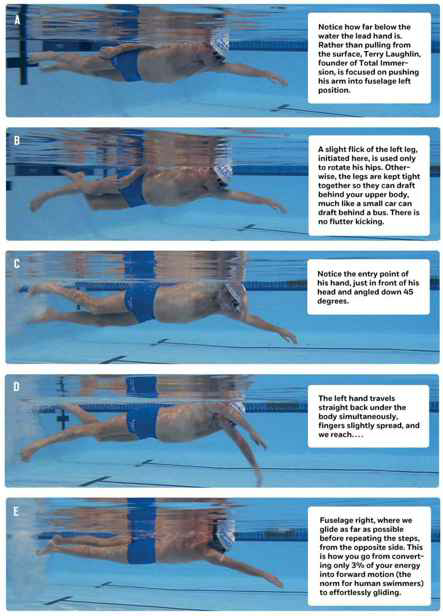

## Fire

-   Put the largest logs at the bottom, ensuring there is no space
    between them whatsoever.

-   Lay a second perpendicular layer of smaller logs on top of the
    largest, again ensuring there are no spaces between them.

-   Repeat with perpendicular layers until you get to the top, where you
    will put strips of crumpled paper and---at the very top---3--5
    fire-starter squares (my preference) or fire-starter oil sticks.
    From bottom to top, I like to use large logs (unsplit), split logs,
    sapling wood, cedar shingle wood, then paper and fire-starting
    squares.

-   The upside-down fire won't look like much for about 20 minutes. Be
    patient. The goal is to create embers that then fall to the layer
    below, which is why there cannot be any spaces between logs. Real
    flames take a while.

-   Ensure that the paper strips are bent or otherwise prop up the
    fire-starting squares/sticks so they don't lie flat on the shingles
    or the layer below. If you don't have this slight spacing for the
    fire-starting material to catch, you will have trouble lighting the
    fire and get frustrated. This is the only place where a little space
    is good.

    

## Swimming

## Unusual food combos

-   Cinnamon and chile powder on vanilla ice cream.

-   Olive oil on chocolate ice cream (bonus point: put an olive
    oil--fried sage leaf on top).

-   Cinnamon on bacon.

-   Almond butter on hamburger.

-   Black pepper on watermelon.

-   Mustard on black-eyed peas.

-   Cinnamon on grilled pineapple (a favorite in churrascaria, grilled
    meat restaurants in Brazil).

## Best herbs

-   Rosemary

-   Smoked paprika (Mark Bittman, Erik Cosselmon)

-   Thyme (considered the most versatile by many chefs; one of the most
    universally liked by diners)

-   Chiles (Jean-Georges Vongerichten)

-   Basil (Gary Danko, Bradley Ogden)

-   Marjoram (Mario Batali; this one also pairs well with brains, if
    that's someday relevant to you. Use sparingly.)

-   Chives (my favorite green garnish)

-   Lemongrass (Personally, I think the choking hazard isn't worth the
    flavor. Ditto with bay leaves.)

-   Chervil (Odd fact: can be smoked like marijuana for similar effects,
    or so I've been told.)

### Herb pairings

-   Fish → fennel or dill

-   Beef → rosemary

-   Pork or lamb → rosemary

-   Lamb → mint

-   Eggs → tarragon (tarragon goes with little else, but it's miraculous
    on eggs)

-   Non-protein bonus: tomatoes → basil

## Condiments

-   Montreal steak rub

-   Guacamole

-   Ghee

-   Thyme

-   Coconut oil

-   Macadamia nut oil

-   Maldon sea salt

-   SHERRY VINEGAR

## Preparation procedures

-   Braising

-   Brown the outside of the meat, then remove.

-   Sauté mirepoix (carrots, onions, celery) in the same pan.

-   Return meat to pan.

    Add enough liquid to cover ⅓--⅔ of the meat.

-   Sautéing

-   Grilling

## Misc cooking

LEFT has four letters; RIGHT has five letters---The FORK (four letters)
goes to the LEFT (four letters) of the plate. The KNIFE and SPOON (each
five letters) both go to the right of the plate.

B and D---Make the "OK" sign with both hands, touching index fingers to
thumbs. The left hand now looks like a lowercase "b" and your right hand
looks like a lowercase "d." This tells you where your "b"read is (left
side) and where your "d"rink is (right side).

Work from the outside in---If faced with a Swiss Army knife collection
of silverware around your plate, work from the outside in (farthest from
the plate to the closest). This also tells you where to put the spoon
relative to the knife on the RIGHT side: on the outside.

Just steam vegetables: Put ½\" of water in a pot, throw in the veggies,
cover, and leave for 15 minutes on a burner set to high. Squeeze lemon
juice on them just before serving.

Set the oven at 350°F (180°C). But what about roast chicken, squash, or
brownies? Doesn't matter. Setting the oven at 350 will work more than
90% of the time. Just use the probe thermometer and cook all proteins
(steak, chicken, etc.) until the internal temperature reaches 140°F
(60°C), and yank 'em when the alarm goes off.
