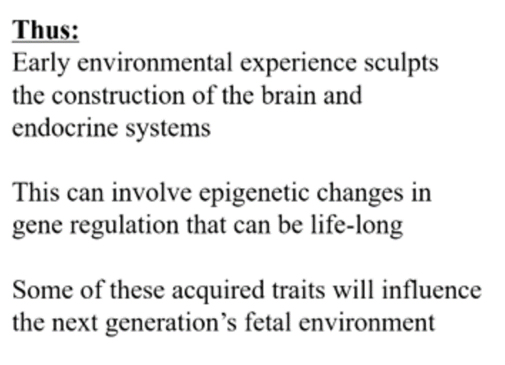

<https://www.youtube.com/playlist?list=PL848F2368C90DDC3D>

Behavioural evolution
=====================

Natural selection as an explanation for evolution
-------------------------------------------------

-   There are traits that are heritable

-   There is variability in those traits

    -   Sometimes there are new traits (mutations)

-   Some versions of those traits are adaptive (they make it more likely
    that more copies of genes are passed on to the next generation)

The same as above applies to behaviour (just replace traits with
behaviour).

Sexual selection
----------------

**Sexual selection** is a mode of [natural
selection](https://en.wikipedia.org/wiki/Natural_selection) in which
members of one [biological
sex](https://en.wikipedia.org/wiki/Biological_sex) [choose
mates](https://en.wikipedia.org/wiki/Mate_choice) of the other sex to
[mate](https://en.wikipedia.org/wiki/Mating) with (intersexual
selection), and compete with members of the same sex for access to
members of the opposite sex (intrasexual selection). These two forms of
selection mean that some individuals have greater [reproductive
success](https://en.wikipedia.org/wiki/Reproductive_success) than others
within a [population](https://en.wikipedia.org/wiki/Population), for
example because they are more
[attractive](https://en.wikipedia.org/wiki/Animal_sexual_behaviour) or
prefer more attractive partners to produce
[offspring](https://en.wikipedia.org/wiki/Offspring). Successful males
benefit from frequent mating and monopolizing access to one or more
fertile females. Females can maximise the return on the energy they
invest in reproduction by selecting and mating with the best males.

Natural and sexual selection often work against each other e.g. a
brightly colored animal might attract more mates but also more
predators.

**Animals don't behave for the good of their species.**

Three main factors driving behaviour
------------------------------------

Based on three main factors:

1.  **Individual selection** driven by maximizing the number of copies
    of your own genes. Reproducing.

2.  **Kin selection**. Achieving 1 by increasing the number of copies of
    your own genes through reproduction of your next kins (the closer
    they are related the more genes you have in common). Corporate with
    relatives based on how closely related they are.

3.  **Reciprocal altruism**. Only do good if good is returned.
    Equilibrium based on rock-paper-scissor situation competition is
    increased. Cooperative behaviour increases the likelihood of
    survival.

    **Tit-for-tat strategy** (cooperate if the other cooperates, stop if
    they do and start again if they start again). Tit-for-tat is
    vulnerable to signal errors, if one party cooperates but due to a
    signal error it is received as cheating.

    Forgiving tit-for-tat adds cooperation after a chain of cheating
    (giving it another try) but this is again open to exploitation.

    The best strategy is starting off with T-F-T and then, after some
    trust has been established you switch to forgiving T-F-T

    Detection and applying cheating is an important factor.

    In practice there are multiple games playing out in parallel.

Humans are in-between tournament (difference between male and female
body-size is big) and pair-bonding (monogamous) species

<https://naturallawinstitute.com/2018/07/tournament-species-vs-pair-bonding-species/#gsc.tab=0>

Examples of behaviour
---------------------

Infanticide is found within groups of langur monkeys, lions, vervet
monkeys, mountain gorillas and other species as well. Initial attempts
were made to dismiss the events as abnormal, with a variety of reasons
to set aside the behavior as psychopathological but not typical of the
species. It tends to be adult males doing the killing. The actions are
not random; the infants are the offspring of other males. It\'s a
competitive strategy that reduces the other guy\'s reproductive success
while improving the killer\'s since the female no longer has anything to
mother and can now move back into the birthing cycle and have his
offspring. There is a formula for this - competitive infanticide occurs
when the time between births by the mother is shorter than the average
reign for the top male. So the competitive infanticide is there to
ensure that he doesn\'t miss out on the chance to breed with the female
when she\'s busy rearing her offspring instead of mating with him.

With chimpanzees females leave the group at the age of puberty in order
to avoid inbred (incest) (make the gen pool more diverse). Therefore,
the group usually consists of males that are related to each other.
While this discourages fights between the males (kinship selection) it
usually leads to intergroup warfare, where the group of chimps organizes
itself and does warfare against another group of chimps.

This relates to military techniques that aim to create a sense of
kinship among the troops. This makes them a band of brothers that will
cooperate with each other, though it can have divisive effects as well,
such as was seen in the Vietnam War, because the group may agree to
disagree with orders and commands from above, the hierarchical other.

Examples where reciprocal altruism out competes individual selection
--------------------------------------------------------------------

A bio-geographic (or other) event occurs that separates out a subset
from a larger group. This smaller subset soon becomes more inbred than
the larger whole, simply as a by-product of being a smaller group. This
translates into having a higher degree of relatedness, which introduces
the whole business of kin selection. Because these guys are more closely
related, they will work together more as a group and will end up
outcompeting the original group members when they are reunited. This is
called a founder effect.

\
Another scenario is demonstrated through the example of two chickens,
one that\'s highly aggressive and one that\'s more laid back. When
competing one on one, the more aggressive chicken will lay more eggs,
but there\'s the drawback in which a group of aggressive chickens will
harass each other and thus impair their own breeding while the calmer
group will lay more eggs because as a group they cause less grief for
each other.

A\>B but BB(as a group) \> AA (while individual A's out compete B's as a
group the BB's out compete the AA's)

<https://www.robertsapolskyrocks.com/behavioral-evolution-ii.html>

Not all traits are based on natural section but just a side effect of
other traits (e.g. the chin of a human).

Molecular Genetics
==================

Proteins hold the shapes of cells together, they form messengers and
hormones, they are the enzymes that do all kinds of important stuff;
proteins are the workhorses.\
\
So what codes for proteins? This is where genes come in. Genes specify
(code for) proteins. Proteins are built from amino acids, of which there
are approximately 20 that commonly occur. Each one has to be coded for
with a different DNA sequence, a different DNA sequence of 3 letters (3
nucleotides). He notes that in the process DNA first specifies a code
string of RNA which then specifies the protein construction (amino acid
string). Thus if you know the DNA then you will know the RNA which in
turn gives you a sense of the amino acids which will form the protein
and knowing that informs you of the shape of the protein (different
amino acids vary in their attraction toward water and these levels
influence the ultimate shape) which clues you in on the function of the
protein. That is the critical link from the DNA to the function and the
notion of a behavior being genetically controlled.

Francis Crick is credited with establishing a central dogma of genetics
- DNA codes for RNA which codes for proteins. Sapolsky focuses the
listener on a subtle element of this dogma, which is that DNA is
ultimately in charge, sitting around and deciding what will happen and
when, and then releasing the instructions that become the RNA to protein
chain. Surprisingly, DNA isn\'t always in charge. Viruses are mentioned
as an example. Viruses are basically snippets of DNA that get into a
living organism and hijack its DNA, taking over the plane and directing
where it goes, making it function for the virus\'s desire. In the
1970\'s viruses made of RNA were discovered. The pathway is facilitated
by enzymes which convert the RNA into DNA and start up the whole
parasitic process. Accordingly, these are called retroviruses because
they are reverting from RNA back to DNA.

Next up is the whole sibling chimpanzee percentage topic. You share 50%
of your genes with a sibling, but you share 98% of your genes with
chimpanzee. What? This is about the level we look at. For example,
chimps and humans have noses, so that\'s a commonality when compared to
a tree, which only has a nose when it\'s in \"The Lord of the Rings\" or
wandering around Stanford. However, humans can have button noses,
aristocratic noses, etc. which is a DNA difference but at a much more
specific level.

The instruction booklet part of DNA is all about when and under what
circumstances to activate and start and stop creating proteins. (For
example, human growth hormone is released throughout life but has peak
periods.) For better or worse this means that DNA doesn\'t \"know\" what
it\'s doing. Instead it\'s a read-out that\'s under the control of lots
of other factors. Among these are the regulatory sequences upstream from
the gene. These might be called promoter or repressive sequences that
promote or repress the expression of DNA snippets downstream. They are
like switches. And they are turned on when the right event (internal or
external) happens. These events are triggered by transcription factors.
These might turn on single genes or whole networks in the DNA. On the
flipside, any given gene can have a whole bunch of different promoters
that it\'s waiting to hear from before it does its thing.

Behavioural Genetics
====================

<https://www.youtube.com/watch?v=GRYcSuyLiJk>

Why do we do what we do?
========================

Understanding the context!

Based on different parts of the brain
-------------------------------------

### Pre-frontal cortex

Responsible for delayed gratification and impulse control

### Dopamine

Reward system. Triggered by anticipation.

Environment
-----------

Sports team loyalties (and individuation, according to 69:00 Susan
Fiske\'s studies) can override racial bias. Racial bias is not innate
but acquired.

Hormones
--------

### Testosterone and Oxytocin

Testosterone doesn't make you more aggressive it just makes us defending
our status stronger. E.g. in a hierarchy of monkey where A is stronger
than B and B is stronger than C and so on, if you give monkey C
testosterone he will not fight A,B but only stronger fight D;E....

In a test with humans where you could win a game by being more generous.
Humans with higher testosterone levels were more generous.

Adolescence
-----------

Childhood
---------

Genes
-----

Not DNA determines what genes do (producing proteins) but environment
does

Ancestors and culture
---------------------

Evolution
---------

