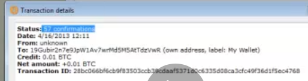
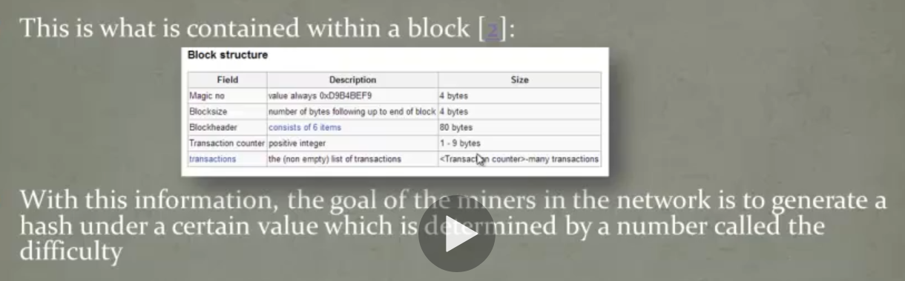
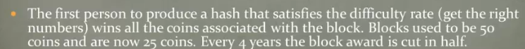
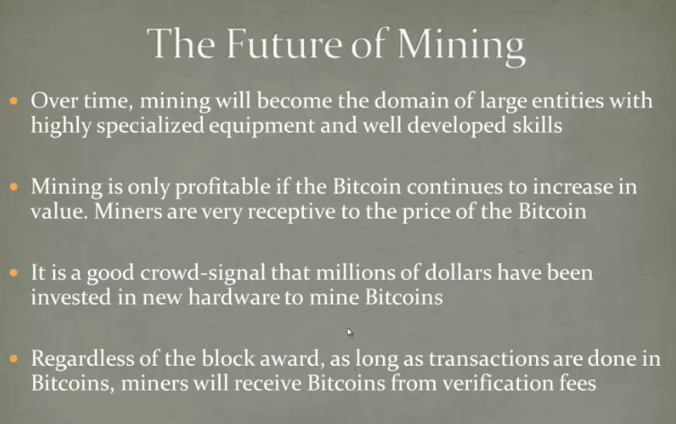

<https://www.udemy.com/course/bitcoin-or-how-i-learned-to-stop-worrying-and-love-crypto/learn/lecture/280010#overview>

Invented in 2009

-   Replaces the typical trusted middleman in the money system (federal
    reserve, banks, governments) with a completely decentralized
    peer-2-peer system governed by open sourced algorithms.

-   The Bitcoin system is a collection of clients analogous to torrent
    clients downloading a file. Every Bitcoin client has a record of
    every single transaction and the amount of Bitcoins in each account.

-   Accounts are anonymous. They are just public key addresses without
    any personally identifiable information attached.

-   When someone wishes to spend a Bitcoin, he uses a private key
    associated with his account and simply enters the address he wants
    to send the Bitcoins to. The network verifies all transactions
    automatically.

-   The currency has a maximum circulation of just under 21 million
    coins (reached in 2140) causing the value of each coin to increase
    over time.

-   That makes it deflationary (it's value increases over time) since
    > the supply of it is limited)

-   This is countered by its ability to by split into arbitrary small
    > amounts (fractions of BC)

    <https://bitcoincharts.com/charts/volumepie/>

    

    Bitcoin days destroyed = metric of velocity (how fast money moves)
    since it can't be determined whether money is moved between the same
    person using different wallets.

    It's based on the duration and amount of BC held (between received
    and send).

    

    Predicted price levels (min.) per level (as of 2013):

1.  100\$

2.  1000\$

3.  30,000 \$

    

# Blockchain

https://www.blockchain.com/explorer

-   Ledger = transaction history based on blockchain technology

Block = blob of transactions during approx. 10 minutes

# Bitcoin wallet

-   Bitcoin wallet address = public key = something like a bank account
    number

-   Private key only known to wallet's owner

-   Desktop, Mobile, Cloud, versions

-   Ledger = transaction history based on blockchain technology

> Bitcoin.org / choose your wallet

# Bitcoin mining

Ledger = transaction history based on blockchain technology

Replaces central authority that issues and verifies the currency

one takes a queue of transactions over a finite time period (approx. 10
minutes) = block and then create a math problem that takes roughly 10
minutes to solve, which also verifies the transactions by doing so. The
first computer to resolve the problem receives an award of Bitcoins.

The difficulty of the calculation can be changed (as more computing
power gets available)

See blockchain at <https://tronscan.org/#/> or blockchain.org

