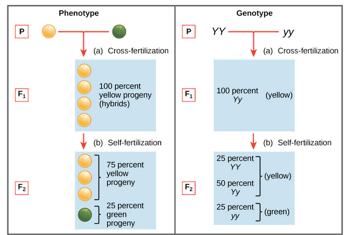

# Definition of life

Chemists classify matter into two kinds: organic and inorganic. All
living things are made up of organic compounds, combinations of
molecules containing only a handful of elements---carbon, nitrogen,
sulphur, hydrogen, and oxygen being the main players. By definition, an
organic compound is simply one whose molecules contain carbon, an
admittedly fairly arbitrary distinction. But it is curious that all
living things contain carbon. There is nothing fundamentally different
between the elements that comprise animate and inanimate things.

Not adequate:

Intrinsic properties:

-   Organization (composed of cell(s) that are highly organized)

-   Growth (increasing in size rather than by simply swallowing other
    matter)

-   Reproduction

Extrinsic properties

-   Transform energy by converting chemicals into cellular components

-   regulate their internal environments

-   adapt over time in response to their environments

-   respond to stimuli or changes in their surroundings

**Water** is the molecule that supports all life, and **carbon** is an
element that every molecule of life contains.

## Water

-   All of the living organisms that we're familiar with are mostly
    water.

-   About three-quarters of the Earth is covered by water.

-   We now know that life on Earth started in the water and, for the
    first 3 billion years of evolution, stayed there.

-   cells themselves are 70% to 95% water.

-   made up of two hydrogen atoms bonded to an oxygen atom.

-   Oxygen has more negatively charged electrons than hydrogen,

-   The life-giving properties of water stem from the fact that there
    are attractions between oppositely charged atoms of different water
    molecules. So, the hydrogen atoms of one water molecule are
    attracted to the oxygen atom in another. This attraction between
    molecules creates weak bonds that can form, break, and re-form very
    quickly and very often.

    -   cohesion,

    -   temperature moderation

    -   solvency, and expansion.

-   

## Carbon

-   uniquely capable of forming large, complex, and diverse molecules.

-   Other elements such as hydrogen, oxygen, nitrogen, sulfur, and
    phosphorus are also common in organic compounds, but it's carbon
    that takes the starring role.

-   has four valence electrons in its outer shell--- electrons that it
    can share with other elements, making it possible for carbon to be
    the centerpiece in an almost infinite number of molecules.

-   Carbon is ubiquitous in living organisms because it's compatible
    with many other elements and because it can form complex chains with
    other carbon atoms.

## Organic compounds

-   amino acids, which make up proteins

    -   Almost every protein works by recognizing and binding to some
        other molecule, so if the shape is off, it can't function.

    -   Many proteins are tasked with the job of speeding up chemical
        reactions---as catalysts. These proteins are called enzymes, and
        they can perform their duties over and over again, making them
        the true worker bees in the cell.

-   nucleic acids, the building blocks of DNA (deoxyribonucleic acid),
    our genetic code;

-   carbohydrates, such as sugars, starches

-   cellulose; and lipids, which are fats and hormones.

# Genetics

-   A gene is a distinct chain of DNA---that's a chemical compound
    called deoxyribose nucleic acid---that contains the biochemical
    instructions for the production of a protein. Genes and a lot of
    so-called junk DNA (called introns) are coiled tightly into little
    bundles called chromosomes. Junk DNA doesn't provide any code for
    proteins, the usual function of DNA, but it likely has some other
    biological function related to genetics. We just don't know what
    that is yet.

-   Humans have two sets of 23 chromosomes, 46 in total, in the nuclei
    of our cells. One set of chromosomes comes from each of our parents,
    so every gene has two alleles: one from the mother and one from the
    father.

-   sYou can think of DNA as a simple language---a code, like Morse
    code---that can be read by a cell's machinery to produce new
    cellular components called proteins. If cells are the building
    blocks of our bodies, proteins are what keep them functioning. They
    are the agents that are responsible for all of the actions of our
    cells.

-   DNA utilizes four nucleobases (or bases, for short), which are four
    specific compounds that each contain nitrogen. These bases can be
    thought of like letters in the alphabet, such that different
    combinations of them form different genes, just as different
    combinations of the same 26 letters of the alphabet make up many
    different words. In fact, these four letters, or bases, make up the
    entire alphabet in the genetic code.

-   The four bases are adenine (A), guanine (G), cytosine (C), and
    thymine (T), each made up of different combinations of nitrogen,
    carbon, oxygen, and hydrogen. Their different combinations of
    elements give them different shapes.

## Mendel's laws

-   Gregor Mendel studied inheritance of traits in pea plants. He
    proposed a model where pairs of \"heritable elements,\" or
    **genes**, specified traits.

-   Genes come in different versions, or **alleles**. A **dominant**
    allele hides a **recessive** allele and determines the organism\'s
    appearance.

-   When an organism makes gametes, each gamete receives just one gene
    copy, which is selected randomly. This is known as the **law of
    segregation**.

**The law of segregation states** that, for every characteristic, such
as eye color or hair color, each parent possesses two possible versions
of that characteristic and that during the reproductive process, these
two traits, known as alleles, are separated (that is, segregated), with
only one version passing on to the offspring.

There are dominant and recessive version of each of those traits. Going
back to the pea plants, purple was the dominant flower color while white
was the recessive color, because when one white plant and one purple
plant were crossed, the offspring were always purple.

The set of alleles carried by an organism is known as its **genotype**.
Genotype determines **phenotype**, an organism\'s observable features.
When an organism has two copies of the same allele (say, *YY* or *yy*),
it is said to be **homozygous** for that gene. If, instead, it has two
different copies (like *Yy*), we can say it is **heterozygous**.
Phenotype can also be affected by the environment in many real-life
cases, though this did not have an impact on Mendel\'s work.

.

#  Electricity

-   Every atom with an electron has the potential to create an electric
    charge; electrons have an inherent negative charge. Most atoms found
    in nature are electrically neutral because the number of electrons
    equals the number of protons in the atom and the charges cancel each
    other out, leaving the atom with no net charge.

-   Electrons can be transferred from one atom to another. This flow of
    electrons is what we call electricity. The transfer of electrons can
    be initiated by:

    -   When two different surfaces are rubbed together (static energy)

    -   chemical reactions

    -   electrical circuits

    -   radioactive decay are just

Electrons get transferred, but no new electrons or other particles are
created---so, whereas one substance becomes more negative, the other
becomes more positive.

-   Because like charges repel each other and opposite charges attract,
    electric forces can alter the motion of an object. For example, if
    you move two like-charged objects toward each other, the force
    between them will cause one to repel the other---moving them away
    from each other.

-   An electric field is made by static electric charges. When these
    charges are in motion, the field is **electromagnetic**, as the
    motion induces a magnetic field as well.

-   A concept that incorporates the idea that more charges mean more
    energy is the electric potential. The electric potential energy of
    an object is a combination of its own electric charge and its
    relative position to other charged objects. The potential difference
    between two points is measured in volts and is called **voltage**.

-   An **electric circuit** is a closed-loop system in which electrons
    can flow to generate electricity. In every circuit, there is some
    power source, such as a battery or a generator, that produces the
    pressure or force necessary to move electrons.

-   The electric **current** is measured in **amperes**, the amount of
    electric charge passing a point per unit time (flow rate). To
    calculate the total power in the circuit, we multiply the current by
    the force and get the **wattage**.

-   The physical structure of a wire can increase or decrease the
    resistance to the flow. In an electrical circuit, we measure the
    **resistance** in units of **ohms**, which is the voltage divided by
    the current.

# Thermodynamics

Thermodynamics, from the Greek words for "heat" and "movement," is the
study of heat's relationship to work, and to energy in other forms.

**Heat** is **energy that flows from a higher temperature to a lower
temperature** (to get something to go from cold to hot, then, requires
work), often across objects in contact with one another. We measure heat
in **joules**.
