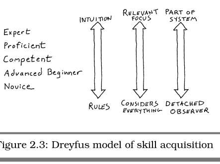
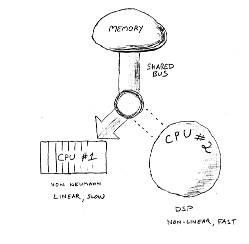
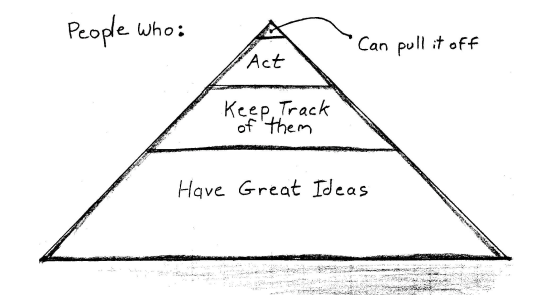
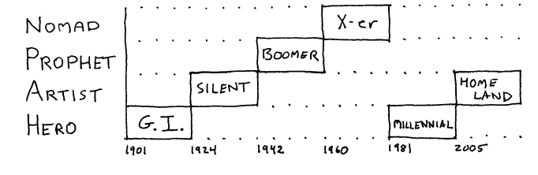

Pragmatic Thinking and Learning:
================================

Dreyfus model from novice to expert
-----------------------------------

**Always consider the context.**

**Use rules for novices, intuition for experts.**

**Novices need quick successes and context-free rules.**

-   Imitate

-   Assimilate

-   Innovate

-   Cultivate more intuition

-   Realize the increasing importance of context and of observing
    situational patterns

-   Better harness our own experience

    **Avoid formal methods if you need creativity, intuition, or
    inventiveness.**

The brain as a computer
-----------------------

if CPU \#1 is hogging the bus, CPU \#2 can't get at memory to perform
searches. Similarly, if CPU \#2 is cranking away on a high-priority
search, CPU \#1 cannot get at memory either. They interfere with each
other.

**R -mode Sees Forest; L-mode Sees Trees**

### L-Mode

CPU \#1 is probably the most familiar to you: it is chiefly responsible
for linear, logical thought, and language processing. CPU \#1 is
relatively slow and uses a relatively small amount of overall brain real
estate. It's programmed with an "idle loop" routine as well. If CPU \#1
is not processing anything else, it will simply generate an internal
stream of verbal chatter. It's that little voice in your head.

### R-Mode

CPU \#2 is more like a magic digital signal processor. It's your brain's
answer to Google: think of it like a super regular-expression search
engine, responsible for searching and pattern matching. **As such, it
might grab matching patterns that aren't obviously related. It can go
off searching while you are "thinking" of something else and return a
result set asynchronously---and possibly days later. Since CPU \#2
doesn't do any verbal processing, that means its results aren't verbal,
either.**

It can retrieve and recognize verbal elements, but it can't do anything
with them by itself because of that memory bus contention between L-mode
and R -mode. For instance, have you ever had the experience of trying to
describe a dream when you first wake up? Many times it seems that a
crystal-clear, vivid dream evaporates from your memory as soon as you
try to describe it in words. That's because the images, feelings, and
overall experience are R -mode things: your dream was generated in R
-mode. As you try to put your dream into words, you experience a sort of
bus contention. L-mode takes over the bus, and now you can't get at
those memories anymore. In effect, they aren't verbalizable.

You have amazing perceptual powers, many of which can't be effectively
put into words. For instance, you can instantly recognize the faces of a
large number of familiar people. It doesn't matter whether they've
changed their hairstyle, changed their manner of dress, or put on ten
pounds or twenty years. But try to describe the face of even your
closest loved one. How do you put that recognition ability into words?
Can you make a database describing the faces of the people you know in
such a way that you could recognize them based on that description?

R -mode is quite diligent at storing input. In fact, it's possible that
every experience you have, no matter how mundane, is stored. But it is
not necessarily indexed.

Researchers in Japan did a study of a bank's ATM interfaces; subjects
found the aesthetically pleasing button layouts much easier to use than
the ugly ones, even though the functionality and workflow was the same.

Positive emotions are essential to learning and creative thinking. Being
"happy" broadens your thought processes and brings more of the brain's
hardware online.

Creativity comes from the selection and assembly of just the right
components in just the right presentation to create the work. And
selection---knowing what to select and in what context---comes from
pattern matching.

R -mode to L-mode flow
---------------------

**Add sensory experience to engage more of your brain.**

For instance, try fiddling with a paper clip or some sort of tactile
puzzle while stuck on a tedious conference call or while pondering a
tricky problem. When you involve an additional input mode, you are
activating more areas of the brain---you're bringing more processing
power online.

What we need is a better way of synchronizing our L-mode and R -mode
processing so that the whole mind can work better and more efficiently.
Example rock climbing lessons where the instructor first let the
participants climb for 30 minutes before starting the formal lecture. He
first presented a multisensory, experiential context so that participants
could "get our heads around it," as it were. Then he followed up with a
more traditional, fact-filled lecture.

Don't be in such a hurry. When problem solving, learn to be comfortable
with uncertainty. When creating, be comfortable with the absurd and the
impractical. When learning, don't try so hard to learn and memorize;
just get "used to it" first. Try to understand the meaning first; get the
overall gist of it. Then follow up with traditional L-mode activities to
get to the next step: an R -mode to L-mode flow.

**Metaphor, a common ground for both verbalizations and images, is a way
to voyage back and forth between the subconscious and conscious, between
right and left hemispheres.**

Metaphor comes from the Greek meaning "to transfer," with the idea that
you are transferring the properties of one object to another in a way
that is not literally possible.

**Trust ink over memory; every mental read is a write.**

Instead, augment your memory with some kind of reality check. Whether
it's notes that you keep or a conversation with someone else with their
own memories, you need something to help keep your memories from
drifting too far from reality.

<http://themindsetlist.com/lists/the-mindset-list-for-the-class-of-2018-born-in-1996/>

Coursera learning to learn
==========================

-   The better you get at something the more you can enjoy it

-   Diffuse mode

    -   (more big picture thinking (lots of space between the bumpers in
        the pinball analogy))

-   Try taking a \"picture walk\" through the material to gain big
    picture context before diving into the detail

-   Focused mode (focused attention, step by step, small spaces between
    the bumpers)

-   Hard practice makes for better understanding and better retention of
    information

-   Recall from memory

-   Practicing the hard stuff (don't overdo the easy things)

<!-- -->

-   Mini tests (coding challenges)

-   Interleaving with different kinds of information or practicing in
    different ways/in different environments

-   Use pen and paper rather than digital

-   Use breaks

-   Building chunks (connected pieces of information)

    -   Focused attention

    -   Understanding (basic idea rather than 100%)

        -   Sometimes it's better to move on in order to understand the
            big picture

    -   Practice

-   There is a bottom up chunking process where practice and repetition
    can help you both build and strengthen each chunk, so you can easily
    gain access to it when needed.

-   There is a top down "big picture" process that allows you to see
    where what you are learning fits in.

-   Chunking may involve your learning how to use a certain problem
    solving technique. Context means learning when to use that technique
    instead of some other technique

Luck 
-----

lucky people generate good fortune via four basic principles.

1.  They are skilled at creating and noticing chance opportunities

2.  make lucky decisions by listening to their intuition

3.  create self-fulfilling prophesies via positive expectations

4.  Adopt a resilient attitude that transforms bad luck into good.

-   Unlucky people often fail to follow their intuition when making a
    choice, whereas lucky people tend to respect hunches. Lucky people
    are interested in how they both think and feel about the various
    options, rather than simply looking at the rational side of the
    situation. I think this helps them because gut feelings act as an
    alarm bell - a reason to consider a decision carefully.

<!-- -->

-   Unlucky people tend to be creatures of routine. They tend to take
    the same route to and from work and talk to the same types of people
    at parties. In contrast, many lucky people try to introduce variety
    into their lives. For example, one person described how he thought
    of a colour before arriving at a party and then introduced himself
    to people wearing that colour. This kind of behaviour boosts the
    likelihood of chance opportunities by introducing variety.

<!-- -->

-   Lucky people tend to see the positive side of their ill fortune.
    They imagine how things could have been worse. In one interview, a
    lucky volunteer arrived with his leg in a plaster cast and described
    how he had fallen down a flight of stairs. I asked him whether he
    still felt lucky and he cheerfully explained that he felt luckier
    than before. As he pointed out, he could have broken his neck.

Habits
------

1.  Cue (that triggers the habit)

    -   Location

    -   Time

    -   How you feel

    -   Reactions

> Counter measure: try to remove cues when possible to avoid
> procrastination)

2.  Routine (the habitual response to the cue you are falling into)

    Counter measure: have a plan in place

-   Sit in a place where you are comfortable

-   With no access to distractions

-   Try to change things one at a time

3.  Reward (in response to the habit which supports the habit)

    -   Counter measure: reward yourself for changing bad habits into
        good one's

4.  Belief (a fundamental belief that the habit works/is good)

    -   Counter measure: try to surround yourself with positive people
        in order to avoid falling back into old habits especially during
        stressful times.

In order to change the habit, we need to change the belief.

Ways to counter procrastination
-------------------------------

-   Focus on the process rather than the product

    -   Step by step (e.g. study session instead of looking at the exam)

    -   Put in your best for each step

    -   Using pomodoro

    -   Get into the flow of work rather than procrastinating on the
        longer term goal/outcome
