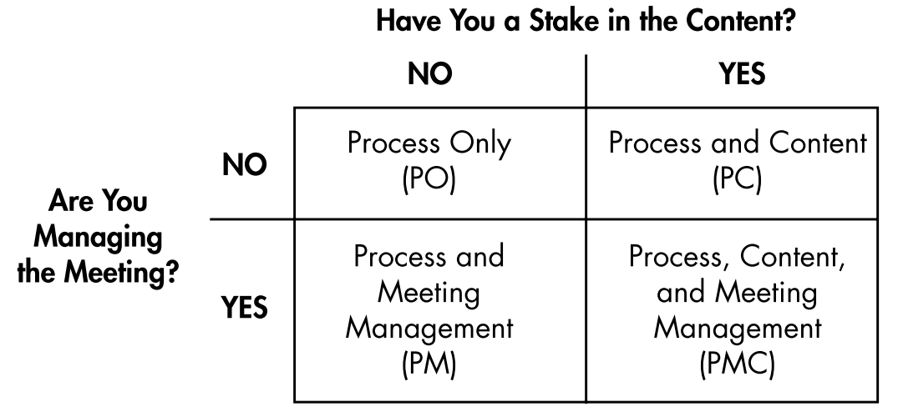
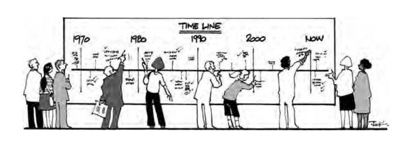
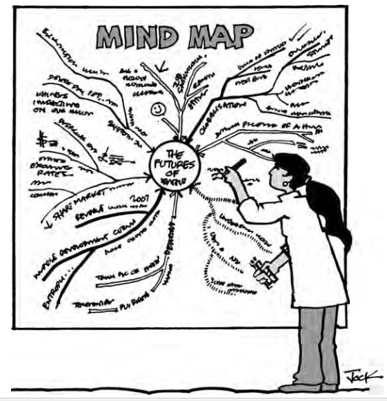
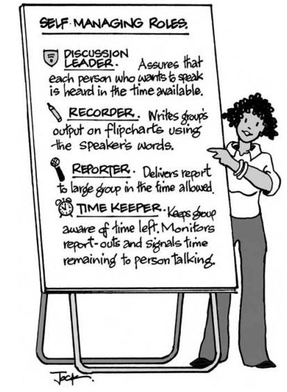

**Don't Just Do Something, Stand There!**

**Ten principles for meetings that matter**

DIFFERENTIATION/INTEGRATION THEORY
==================================

-   Help people differentiate their stakes without excluding anybody and
    integrate their goals without our forcing unity.

-   Our job as leaders/managers/facilitators is to set things up so that
    people can accept their differences and integrate their capabilities
    for the good of all.

Get the whole system in the meeting
===================================

### Define a "whole system" as those who have among them authority, resources, expertise, information, and need. Get the right cross section if you want action on problems and decisions without a lot more meetings.

Define your system in relation to each meeting's purpose
-------------------------------------------------------

a.  **A**uthority to act (e.g., decision-making responsibility in an
    organization or community);

b.  **R**esources, such as contacts, time, or money;

c.  **E**xpertise in the issues to be considered;

d.  **I**nformation about the topic that no others have; and

e.  **N**eed to be involved because they will be affected by the outcome
    and can speak to the consequences.

Give People Time to Express Themselves
--------------------------------------

> When people have strong feelings about what is happening, they need
> time to come to grips with their feelings before they will "own" the
> needed action steps.

Manage Meetings Using D/I Principles
------------------------------------

-   Enable **differentiation** by asking people to speak individually or
    to work in groups where all share a functional similarity, each
    group clarifying their stakes. Simply asking people to form small
    groups is not what we mean here. If you organize random groups, with
    no basis in similarities, differences, or preferences, you are not
    "differentiating.". In our framework, we differentiate to integrate.
    Integration requires that people interact across boundaries of
    differences made explicit, seeking to build on all their resources
    and needs.

    E.g.:

    -   create differentiated perspectives

    -   give interest groups a chance to clarify their positions

    -   organize action groups differentiated by the tasks they
        undertake

-   Help people i**ntegrate** their diverse perspectives; we have people
    work in mixed groups that cover the spectrum of those present.

    1.  Ask small groups, whether functional or mixed, to report to the
        whole.

    2.  Talk over, question, or respond to what they hear from other
        groups

Control what you can let go what you can't
==========================================

Let go of controlling: People's behavior, commitment, motivation, and
outcomes.

Control: structure and your own behavior

Know your role
--------------

**Process Only (PO)---** You have no management or content tasks. Your
role is to observe and comment on how the group is doing.

**Process and Meeting Management (PM)---** You may be employed to manage
a meeting without responsibility for its content. Participants provide
information, analysis, conclusions, decisions, and action plans. Future
Search facilitators and internal consultants typically take this role.
The responsibility is for structure rather than content. If you use a
particular meeting model, you advocate explicit structures within which
to frame goals, time required, room setups, and formal subgroups.
However, the content comes entirely from participants.

**Process and Content (PC)---** This is a typical role for experts
hired, for example, to help a group plan a building, raise money, fix an
environmental problem, or mount a public health campaign. In this case
you have experience with solutions, interact with the group, and deliver
your best advice. A person in authority runs the meeting, but you are on
stage much of the time; and you will have great influence over goals,
time frames, and agenda.

**Process, Content, and Meeting Management (PMC)---** In this role,
usually, but not always, you are a member of the group and may have
formal authority, too. In short, you assume a great deal of
responsibility for process, content, and, therefore, outcomes.

Clarify the Purpose---for Yourself
----------------------------------

Every meeting has a purpose. Does the purpose make sense to you? What
will the output be? Is it achievable in the time you have?

Why? What is required here? Information, decisions, solutions, action
plans---any or all

At the start of every meeting check your understanding of the purpose
against that of the participants.

Explore the whole elephant
==========================

Exploring the whole before acting on any part helps to contain anxiety
about differences. If you tap into what every person knows before
acting, people will act systemically without being told that they
should. People learn that together they can do things none would have
considered alone. We are thinking about what people see out there, what
their world means to them, how they feel about it, and what they are
doing now. We also are interested in what, if anything, they are willing
to do. **Enable everybody to talk about a world that includes all of
their perceptions.**

Everything is connected to everything else. The best way to find all the
connections is to hear from people who have firsthand experience. Find
out what every person has to contribute. In a short time, all
participants will have a more realistic and complex view than any one
person had at the start. Get everybody on the same page before asking
them to problem-solve or decide. They will make better choices and be
more likely to accept responsibility for action.

Apply a go-around
-----------------

You can stop a meeting at any point where people bog down in ambiguity,
conflict, or confusion, and ask to hear from every person, another way
of saying to differentiate themselves.

The go-around can be used anywhere, anytime, for quickly getting a lot
of information from each to all. You simply have every person willing to
speak say something in turn about a topic. We usually start meetings
with a go- around, asking people for their names, affiliations, and why
they have come. By using this procedure, we validate every person's
views, check expectations, and give all a sense of where others stand.
We begin building a community where every person's presence is
acknowledged.

Use Timelines
-------------

We use time lines to learn from the past, find patterns in the present,
and discover implications for action. A time line consists of a strip of
blank paper, vertical or horizontal, with key dates posted at intervals.
In our version, we use long rolls of plain paper, 2 feet wide (0.61
meter), available in any stationery store. We cut strips from the roll
(up to 24 feet or 7.32 meters) and put them on walls around a room. We
label each strip with a topic (e.g., Health Care in X; Organization Y;
Community Z) and add time frames at 5-year intervals. With small groups
you can use shorter strips of paper.

Make a mind map
---------------

Mind mapping can be used for any purpose, from brainstorming to problem
solving and decision making. It can be done in as little as 15 or 20
minutes, followed by as much conversation as you have time for. Larger
groups may need 45 minutes. We use a sheet of paper 6 feet high and 12
feet long (about 2 by 4 meters) if there is enough wall space. In the
center of the sheet we put the meeting topic and circle it. Then we have
people brainstorm trends in society that affect their topic now. We
define a trend as a direction of change, from more to less, from smaller
to greater, and so forth.

Each new item is written on a new line coming off the circle or tied to
an existing line. The person who names the trend indicates where it goes
on the map. All trends are valid---that is, legitimate to put on the
map. We ask for concrete examples so that every person will know what
the speaker is thinking. If somebody says, "Health care is getting
worse," we ask for an example. "I had to wait 4 hours with my child in
the emergency room last week." Somebody else may say, "I think health
care is getting better. I had a heart bypass that saved my life." Both
statements are legitimate, and both go on the map. The purpose of this
activity is to develop a view of the world that includes all
perceptions. All conversations that follow will be in relation to the
same world---the one that includes every trend on the map.

Draw a flowchart
----------------

Let people be responsible
=========================

Leading meetings in a way that encourages participants to share
responsibility.

Accept That Everybody Is Doing the Best They Can
------------------------------------------------

People only do what they are ready, willing, and able to do. That is all
you have to work with.

Let People Hide Their Hidden Agendas
------------------------------------

Let hidden agendas stay buried if that's where people want them. We do
not ask people what they are not saying. If people wish to conceal their
"real" feelings or "real" data that is a choice they must live with.
Their choice is, for us, the real data. In our philosophy, people have a
right to hold back.

Do Less So That Others Will Do More
-----------------------------------

If you want others to take responsibility, we urge you to try doing less
than you are used to doing. Nature hates a vacuum. When you step back,
others come forward. The more you busy yourself---explaining,
rationalizing, interpreting, justifying---the less room there is for
other people. They will sit back, watch you work, and evaluate your
style.

Encourage Self-Management
-------------------------

You can encourage people to share responsibility for a meeting and its
outcomes if you don't take the entire burden on yourself. One way to
free yourself is to give up trying to diagnose individuals and groups, a
task that grows more difficult the more diverse the group. Instead,
learn to work with people the way they are. Make structure the focus of
your attention rather than individual behavior.

Do less so that others do more. In the next meeting where something
unexpected happens, just stand there. Pause. Notice your thoughts.
Notice what your body wants to do. Then look around and make eye contact
with as many people as you can. Find a person who wants to talk and nod
in their direction.

Find common ground
==================

We define "common ground" as those statements every person will agree
with after all views have been heard and disagreements made public. The
major benefit of finding common ground is increased cooperation and fast
action on matters of shared concern. When some people agree and others
don't, treat that as a reality to live with, not a problem to be solved.

Advantages:

-   Ambiguity and uncertainty are reduced knowing where there is full
    agreement and where there isn't

-   Energy can go toward implementation instead of convincing those who
    do not agree

-   People are more inclined to accept responsibility when they know
    where everybody stands

-   Action is likely to be swifter

-   People are pleasantly surprised when they discover how much
    agreement exists.

Hold Off Problem Solving
------------------------

Save problem solving until all can talk about the same world. Everyone
likes to have their problems heard, and one way to find out who shares
them is to say them out loud. But rushing to solve problems too quickly
diverts people from discovering what aspirations they hold. People may
endorse solutions to move the meeting along and not follow through.

Get Conflicts into the Open, and Leave Them There
------------------------------------------------

Focus on the Future
-------------------

When a meeting calls for future scenarios, we ask people to put
themselves X years in the future and imagine their dreams as if they
have been realized; describe structures, policies, and relationships in
the present tense; and look back on the single most important step they
had to take X years earlier to get started.

**After common ground has been established:**

**Option 1 work in small groups:**

Have people work alone or in small groups to write down what they think
every person in the room would agree to. Then have each person or group
post its statements on the wall. Ask people to cluster similar items
together. Then have volunteers read each cluster aloud. Ask for
questions for clarification. If a person challenges the wording, ask the
original writer what was meant. If all agree to small modifications,
have a volunteer write a new statement. If, after a few minutes of
dialogue, people cannot agree, move the item to a "not agreed" list.

**Option 2 work with the whole group:**

Have people call out what they think everybody wants while volunteers
write the items on flipcharts. (You can ask people to make notes alone
first, if you wish.) Typical instruction: "Based on our conversations so
far, what do you believe would be agreed to by every person in this
room?" Then continue with reading and discussing each item in turn, as
described earlier.

**Option 3 Line-up Small-Group Easels (No Posting Required):**

Have small groups each make a single flipchart of items they think all
would agree to. Line the charts up in the front of the room. Have one
person stand beside each chart. Ask the first person to read each item
in turn from the chart he or she is monitoring. Ask the other monitors
to cross off any duplicates they have. Do the same with each monitor in
turn. When you get down to an unduplicated list, continue with a
dialogue as noted before.

**What to Do with "Not Agreed" Items**. Inevitably, there will be one or
more items on the "not agreed" list. We always have these read aloud,
too. We suggest you ask people if they understand the nature of their
disagreements. Talk for a few minutes until they do. We are not looking
for resolution, just clarity on the differences. If appropriate, ask
people how they want to handle these items. At the very least document
them. We are conscious that there are no perfect processes, and you
can't tie up every loose end.

Depersonalize Conflict
---------------------

To depersonalize conflict is to reassure the parties that they need
their unique orientations to do their best. Task conflict is more
manageable than interpersonal hassles. Watch people relax when you tell
them the strong feelings they have about their work are legitimate. Of
course different goals lead to divergent expectations. Of course people
with different deadlines march to different drummers.

Master the art of sub-grouping
==============================

Functional subgrouping is the practice of inviting people to ally with
others based on similar experiences, feelings, or points of view. Groups
will keep working so long as no member becomes a victim of stereotyping.
The way to head off fight or flight is to help people experience their
differences as functional rather than stereotypical. We do this by
invoking subgroups if scapegoating or splitting seems probable. In
conflict situations, you can go further and form temporary subgroups in
which people explore their positions. Most of the time they will resolve
and move on when they discover a legitimate spectrum of views, making
confrontation unnecessary.

As you apply the theory outlined here to meetings, you will discover a
wholly new way of keeping groups on task regardless of their
differences. As you learn to do this, you will free yourself from
needing to fix every problem that comes up.

Getting people to differentiate themselves---to heighten their awareness
of their differences---holds the key to integrated problem solving and
decision making.

No matter what formal structures you use, group members from the first
moment will be drawn into invisible subgroups. Because people keep most
projections secret, even those meetings that seem smooth and orderly
become a jumble of unspoken wishes, energies, and frustrated impulses.
Somebody forms a judgment and be- comes part of a subgroup that includes
every other person with similar thoughts. Of course, no one knows it
unless you take the trouble to poll the group. There is at work an
informal system functioning apart from the people in it.

On the surface, you have people doing what they do in meetings.
Underneath, each person is aligning with, distancing from, or ignoring
every statement made. Each audible remark becomes a focal point for new,
invisible subgroups forming and re-forming from moment to moment.

With a few well-chosen words, you can change a stereotypical subgroup
into its functional equivalent. We use the adjective functional here to
suggest "contributing to growth," not to describe people's jobs.
Functional subgroups transcend the stereotypical subgroups that people
form and re-form in their heads.

So long as every person has a functional ally--- somebody who carries
the same ideas and/or feelings---a group is more likely to keep working.
Members will not distract themselves with side trips into rejecting,
rescuing, or scapegoating those who take risks. Our minimal job becomes
helping people experience functional differences when stereotypes might
prevail. If we do this job right, group members will take care of the
rest.

When we lead meetings, we just stand there so long as people stay with
the task. Even when we seem relatively quiet on the outside, just
standing there for us involves actively observing potential subgroups
and their impact on the work.

When people say or do something that visibly heightens the tension, when
we hear the crackle of fragmentation and splitting, fight or flight, we
go on high alert. Those are the moments when we must be ready to act.
Here we de- scribe four key techniques that make up the core of our
meeting management.

Technique 1: Ask an "Anyone Else" Question
------------------------------------------

This practice is stunningly simple. Act when you hear people make
statements so emotionally charged that they put themselves at risk of
being isolated or labeled. We judge the impact of such statements by the
extent to which tension rises in the group.

PARTICIPANT: *We have been at this for 2 hours, and I'm frustrated that
we haven't made more progress!*

Try to build an informal subgroup for the person that made a statement.
For many people, this will be counterintuitive. Rather than look for
somebody who is not frustrated to counterbalance the person that made
the statement, your best move is to get the person that made the
statement joined by people that share the same opinion.

LEADER: *Anyone else feeling frustrated?*

We expect one or more people to raise their hands. When they do, we ask
for their experience. Usually we discover they have a spectrum of
frustrations. Speakers see that they are not alone. Frustration is OK.
Confrontation is avoided. Everyone has new information on where others
stand. The group moves on. Sometimes, however, people ignore the
frustrated per- son, moving on to other topics, leaving emotionality
hanging like fog in the air.

LEADER (recognizing the unfinished feelings): *I want to go back to what
\_\_\_\_\_ said a minute ago. Is anyone else feeling frustrated?*

LEADER (to those nodding): *What do you experience?*

One person gives his or her version. Perhaps another chimes in. At this
point the group is working again. What might have been a fight becomes a
dialogue on a key issue---the degree to which the work frustrates
people. This is not a denial of the reality of the person who brought up
the issue.

Rules for asking "Anyone else"

1.  Listen for the intensity of feeling, and note what happens in the
    group. Many statements require no response. The person making them
    is satisfied to get it out, and people accept the comment as part of
    the dialogue.

2.  Cite the content of a statement only when the content does not
    threaten a personal attack or a divisive argument.

Note that we can't anticipate functional subgroups. We discover them as
the meeting progresses. It takes only one ally to form a subgroup,
validate a person's right to an opinion, and keep the meeting on track.

In managing meetings, we need to emphasize, we are not standing there
saying "anyone else" every few minutes. Even in meetings lasting 2 or 3
days, we rarely ask this question more than once or twice. We attribute
this to the fact that we seek from the start to validate every person's
experience. I

**Suppose Nobody Joins?** In our learning workshops, somebody inevitably
asks, "Suppose nobody joins?" Well, we have been there, too. Once in a
great while---maybe every year or two---one of us will ask an "anyone
else" question and be greeted by silence.

PARTICIPANT: *This has been a big waste of time for me.*

LEADER: *Anyone else feel they are wasting their time?*

Nobody says a word.

In that case, we see whether we can authentically join the person who
has gone out on a limb. We may wait as long as 20 seconds after asking,
"Anyone else?" which seems like an eon longer than eternity. When nobody
speaks, tension builds while we consult our experience for an honest
response.

LEADER*: I've had moments here when I thought I was wasting my time,
too.*

Suppose we can't authentically join. The meeting has been great from our
point of view.

LEADER: *It seems you're the only one at this moment. Are you able to
move on?*

Technique 2: Use Subgroup Dialogue to Interrupt Polarization
------------------------------------------------------------

Now and then people become deeply polarized over conflicting beliefs,
problem definitions, solutions, or decisions. In such cases, people may
strongly disagree without stereotyping each other, but their conflict
threatens to derail the task. There is a second technique we use for
instances that paralyze a group. Our objective is to have people explore
both sides of the conflict, but not in the way you might imagine.

Instead of encouraging a dialogue between polarized subgroups, we stop
the action and have people in Sub- group A identify themselves. We do
the same with Subgroup B. Then, we encourage the A's to talk with each
other while the B's listen. After all the A's have had their say, we ask
Subgroup B to do the same while Subgroup A listens.

The reason for this may not seem obvious. When people dialogue with
those who are ostensibly similar, comparing notes on what they believe
and why, they nearly always discover differences that were not apparent
at first. There is a spectrum of views within Subgroup A (just as
members of a political party vote the same way for different reasons).
Often this comes as a surprise to both Sub-groups A and B. Moreover,
when people listen in on conversations among those they consider
different, they nearly always discover positions similar to theirs that
they could not discern until now.

In short, we affirm Yvonne Agazarian's principle that within apparent
similarities, differences always exist, and within apparent differences,
similarities will emerge. As people make these finer distinctions, they
develop a more grounded sense of what they consider relevant. They
experience a continuum of opinions rather than two opposite poles. They
suspend for the time being their stereotypes and projections and get on
with the business at hand. Differentiation leads to integration.
Both/and replaces either/or as the unspoken group assumption.

Technique 3: Listen for the Integrating Statement
-------------------------------------------------

How do you know when a group is ready to take a next step? One clue is
when people start recycling earlier statements. This usually indicates
that a spectrum of views is now on the table. No one has more to add. An
even more reliable sign that a group has all it needs to move on is what
we call an "integrating statement." Polarized groups often get stuck in
tense "either/or" conversations. An integrating statement takes the form
of a "both/and" comment, recognizing that each side of a polarity has
validity. When we wait long enough for a dialogue to run its course, a
group member will nearly always volunteer such a statement.

Fortunately, we find many natural integrators in groups. Suppose no one
comes forward? Well, in a pinch, we can always state the obvious. "We
hear two points of view, A and B. What would you like to do with these?"
When all else fails, we consult group members on what they want to do.

Technique 4: Get Everybody to Differentiate Their Positions
-----------------------------------------------------------

We never run an interactive meeting without giving everyone a chance to
comment on what they do, why they came, what they want, and/or what they
know. In groups of up to 50 or 60, we nearly always start with a
go-around. We might ask people for their name, role, and interest, for
their expectations, or for their understanding of the goal.

We use the go-around any time we feel stuck and need to break an
apparent logjam. We simply stop the action and say, "We'd like to hear
one sentence from every person who wants to speak. How do you feel (or
think) about situation \_\_\_\_\_? Then we will decide what to do."
Nearly a ways this act of differentiation produces information that
gives all of us choices not obvious a few minutes earlier.

Make friends with anxiety
=========================

Learn to accept anxiety as an inevitable traveling companion when the
stakes are high, issues complicated, perceptions diverse, and answers
uncertain. You can grow your capacity for leadership by increasing your
tolerance for such natural conditions as disorder, ambiguity, and
uncertainty.

You can grow your capability for leadership many fold by increasing your
tolerance for disorder, ambiguity, and tension. Often you do not need to
know why you are anxious, only that you are. When a meeting falls into
confusion, the urge to retreat or fix it immediately can be
irresistible. Don't panic. You will help yourself immeasurably by
hanging in despite your queasy feelings. If you wait just a while
longer, you can help people find greater clarity and move in new
directions.

1. Visit the "Four Rooms of Change"
-----------------------------------

For example, in Contentment (we tell the group), we're happy with the
status quo and don't need to change anything. However, stuff happens.
When struck by turbulent circumstances, such as information we'd rather
not have, Denial is a normal retreat, a room to pass through but not
live in. (If you confront people in Denial, they will deny it.) When we
acknowledge that we don't like where we are, we move ourselves into
Confusion. This is the room of uncertainty and high anxiety. It is also
the room of possibility, for we now are looking full-time for a way out.
As we confront the mess and confusion, we begin to see patterns not
visible before. As we move toward creative solutions, we find ourselves
in the Renewal Room. We point out that people in this meeting could live
in any room at any moment. We have known groups to move quickly from
room to room as they deal with a sea of information. We also are not
surprised that groups spend time in Denial and Confusion before moving
into Renewal and Contentment. Nor are we shocked when, on rare
occasions, people freeze in place for what seems like an eternity. We
tell people we are not predicting what they will do or requiring that
they do anything. We're describing what could happen. We know that
people would prefer that we, as leaders, keep everybody in Contentment
or Renewal. Alas, we say, we don't know how to do that! We accept all
the rooms as possibilities when you do purposeful work. We end our
briefing with the hope that group members will do the same. Over the
years, we have repeatedly heard people refer to the four rooms during a
meeting, making legitimate their feelings, especially when things get
rough. This structure makes things easier for everybody and helps us
keep ourselves centered.

Nobody likes Confusion, but in the middle of a tense meeting Confusion
is not a bad place to be. Why would we con- sider it functional to live
in a space no one likes? A physical/emotional state that some people
take drugs to relieve? Well, we are not talking about clinical anxiety,
that unfocused, nameless dread that overcomes many of us now and then
and a few of us all of the time. We are talking about commonplace
anxious meetings in a diverse world of non- stop change, when people
wonder whether they will agree on a goal, be heard, solve the problem,
make the decision, fashion the plan, cooperate, learn, and still make it
home for dinner. In short, the Confusion Room has many doors. One leads
back to Denial. The others welcome you to Renewal. Anxiety represents
energy looking for a constructive outlet.

Manage anxiety
--------------

### Use the Four Rooms of Change in Meetings

### Just Stand There and . . . Breathe

-   Just stand there. Contain your feelings.

-   Be aware of your agitation, your fear that things are getting out of
    hand, your impulse to fix it fast.

-   Wait. Look around.

-   Exhale as much air as you can.

-   Take a big, deep breath.

-   Hold it a few seconds.

-   Repeat as needed, until somebody says what needs saying.

### Check Your Negative Predictions

> First, check your own thoughts. Are you making a negative prediction?
> If yes, pull yourself back by thinking, "It hasn't happened yet."
> Group members may have similar apprehensions. You have the advantage
> of knowing that if you wait, stay engaged, and keep alert, the
> situation will clarify.

### Track Your Inner Dialogue

> To follow our own streams of consciousness while leading meetings is
> to explore an underground river so vast it is a wonder how we navigate
> it. Consider it normal. Contain your anxiety. Recognize it, accept it,
> and consider it part of your job. Are you reacting to something in the
> room, or just what's in your head? Give yourself a reality check. Stay
> open to possibilities.

### Experiment with Silence

> We keep the door open by listening without acting. We are mindful that
> each time we break the silence, we deprive someone of a chance to make
> a valuable observation. If we treat silence as a problem to be solved,
> we deprive others of a chance to take care of themselves. Just waiting
> often is all a group needs from us to shift toward active dialogue,
> reality checking, and creative collaboration.

### Get people moving

> Nothing relieves anxiety better than physical movement. When people
> want to run from the task, that's the perfect time to invite them to
> get up---and keep working. In large- group meetings, we look for
> opportunities to let people move. It is natural for people to move
> when breaking into small groups. We ask people to post their own
> flipcharts. We solicit their help in taking notes, leading
> conversations, summarizing what they hear. It is natural for people to
> move if they need a break. We suggest that people who need a break
> take it at any time.

-   State the obvious

> Here are some phrases we have used over the years:

-   "There are many opinions on this. Do we have them all?"

-   "We've spent a long time on this topic. Is there more to say, or can
    we move on?"

-   "I don't know about you, but I'm ready for a break."

-   "Clearly, this issue stirs up strong feelings."

-   "I'm confused about how this conversation relates to our purpose."

-   "At this moment I haven't the foggiest idea what to do."

> Anytime you state the obvious, wait 5 or 10 seconds for a reaction.

-   Consult the Group

-   Grow Yourself by Listening to What You'd Rather Not Hear

In each meeting, we seek to stretch our capacity for tolerating
statements we don't believe, ideas we oppose, and interaction styles
that make us cringe. We stay aware of our internal tug of war between
our own and others' concepts of right and wrong, truth and falsity,
valid information, and what ordinary words mean. As we experience our
potential for negative predictions, mind reading, stereotyping,
mistrust, and anxiety, we find it easier to accept that this is where
groups usually start.

The more we learn to hear all views without reacting, the more a group
is likely to express all sides of polarized issues. We train ourselves
to listen for the parts of each statement with which we agree. We
counteract our tendency to make a case (inside our heads, of course) for
the parts we oppose. To the extent we act congruent with our philosophy
that all statements contain value, the easier we make it for task groups
to do the same.

-   Know Why You Are There

    -   Process is more important than content.

    -   Don't get distracted with last-minute panic attacks.

    -   Repeat the goals.

    -   Repeat the ground rules.

    -   You're really not in control of anything.

Get used to projections
=======================

Projection means experiencing as originating "out there" parts of
ourselves that we like or reject. We may project our hopes and fears on
others, making them responsible for our feelings and our fate. Others do
the same to us, especially when we take leadership. There are many
benefits to becoming aware of your projections. Not least of these is
learning to detach enough from what happens in meetings that you stop
taking personally whatever people say or do.

When you are leading a meeting, do you get agitated with people who say
nothing? Or with those who won't shut up? If someone expresses anger, do
you become angry? Do you sometimes suspect that people are telling you
what you want to hear? Or silently judging you on criteria never made
explicit? Do you sometimes decide this group is "resistant," another
group "ready to work"? Have you ever found yourself disliking,
mistrusting, or ignoring somebody before you knew anything about that
person? Or found yourself liking a complete stranger at first sight? In
each of these scenarios, you are caught up in the experience of
projection. You attribute to things and people "out there" qualities
that originate in you. Whether they have any basis in fact is irrelevant
when you are projecting.

Now comes the tricky part. To keep your projections from leading you to
act unskillfully, own as many of them as you can. By "owning," we mean
experiencing yourself with awareness, accepting traits that you don't
like along with the ones that you do. The payoffs are many if you take
the time:

-   You will be less likely to reject or idealize others.

-   You become less judgmental.

-   You free yourself from having to be perfect.

-   You contain anxiety when people say things you'd rather not hear.

-   You experience fewer threats to your ego.

-   You increase the range of people you can work with and not act out
    inappropriate feelings.

-   You may learn at long last how to live that facile advice, "Don't
    take it personally!"

From the Weirs we learned how we turn the evidence of our senses into
stories we create to satisfy whatever worldviews we have internalized.
Our senses provide the factual information. Our brains turn sensory
evidence (sights, sounds, smells, etc.) into personal perceptions
("percepts"), each one of which is unique. Every external stimulus sends
an instant message to the brain, which compares the new sensation with
those stored in memory. Our brains then form an image to reinterpret the
experience in a way that satisfies us. Every experience we have from
"out there" we turn into a percept "in here." We tell ourselves a story
and act as if it is true.

1\. You choose your own judgments, fears, and fantasies. Nobody does
anything to you. You "do" your- self. You may be tempted, for example,
to imagine some group members are "undermining" your agenda. In the
world of percept, you undermine yourself with the group-in-you.

2\. You are unlikely to convince others that their truths are wrong and
yours right. Hear others' statements of "fact," "truth," and "reality"
as percept parts-of- them (the them-in-you!).

3\. Reduce any tendency you may have to blame others for what you do or
feel.

Be a dependable authority
=========================

Anytime you assume authority, people test your depend- ability. The more
emotional the agenda, the tougher the testing. Being dependable means
staying cognizant of a authority dynamics as they play out in every
group. You can- not avoid authority projections. They come at you
anytime you lead. You can learn to keep your head and not take things
personally. You can respond appropriately to dependency and
counter-dependency without becoming hooked on your own brilliance or
undermined by your suspected shortcomings.

Learn to say no if you want yes to mean something
=================================================

Saying no is an underused skill in a shorter-faster-cheaper society. If
you say no to conditions where you are not likely to succeed, you will
save yourself and others much time and effort in meetings. If you
prepare yourself to say no, you will feel more secure, successful, and
centered each time you say yes.
