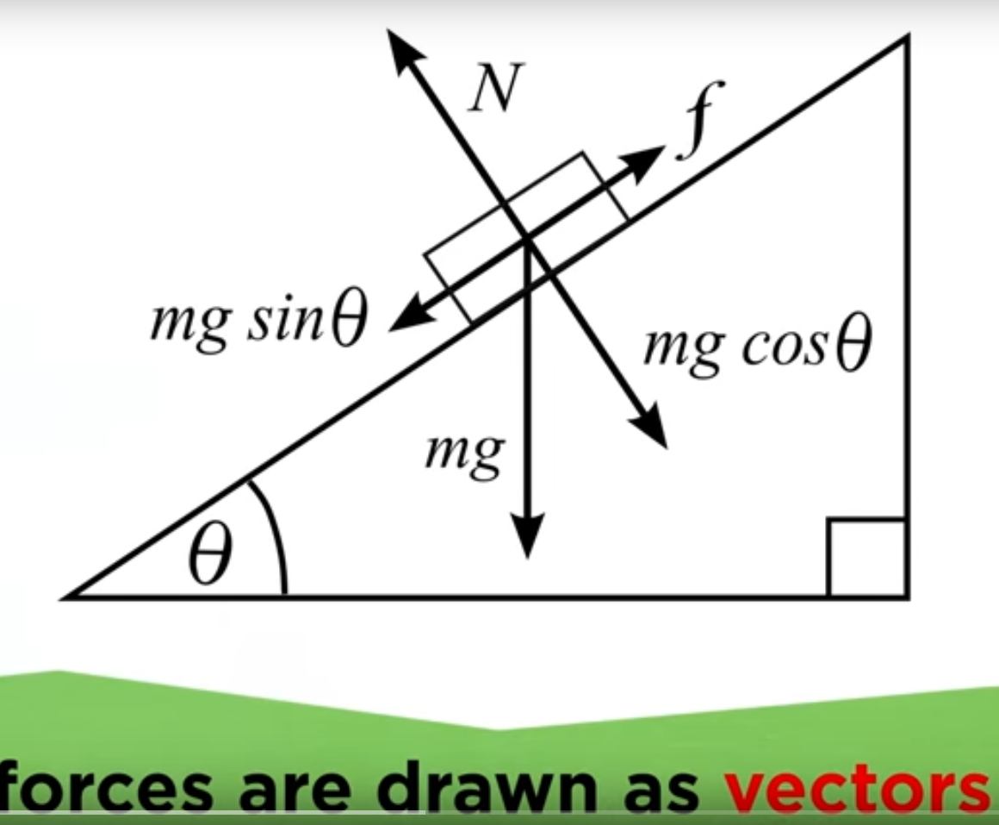
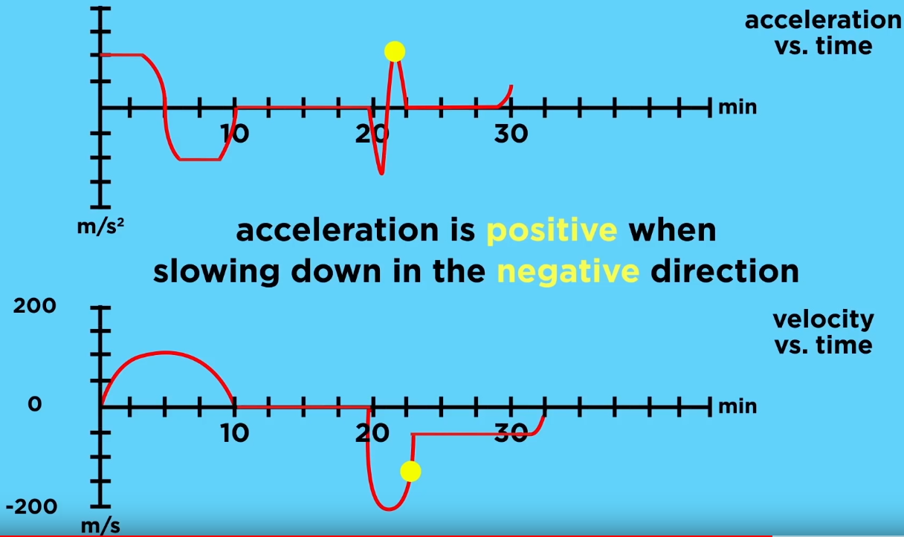
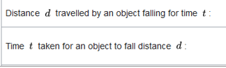
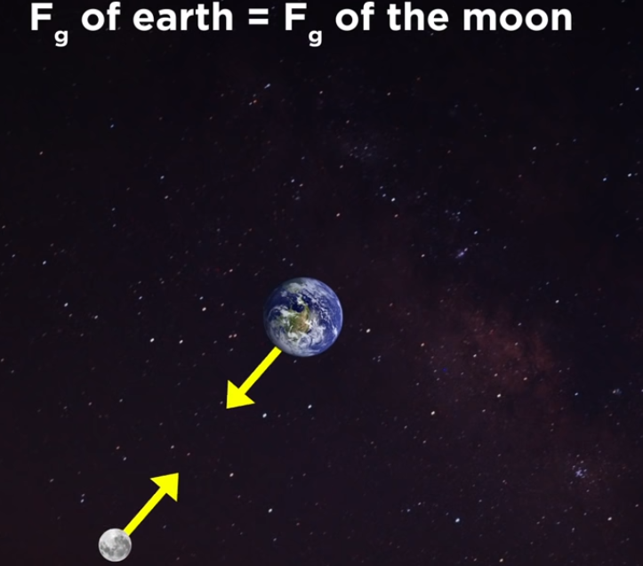
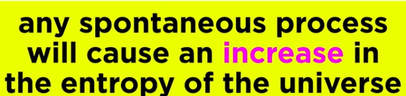
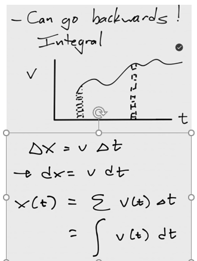

# <https://www.youtube.com/playlist?list=PLybg94GvOJ9HjfcQeJcNzLUFxa4m3i7FW>

https://www.youtube.com/watch?v=liVg8LCU6i4&list=PLrxfgDEc2NxZJcWcrxH3jyjUUrJlnoyzX&index=3

# Scalars

# 

# Vectors

Forces are drawn as arrows with an angle pointing in the direction of
the force or symbolized as a letter with an arrow on top of it. The
length of the arrow indicates the magnitude of the force.

If multiple forces act on an object operation on the vectors need to be
carried out in order to calculate the forces.

## Vector addition:

## Trigonometry

Adjacent and opposite = relative to theta (the angel to be found)

Hypothenuse = longest side of triangle

Any of the functions can be used to solve for theta.

e.g. Sin.

Theta = inverse sin(3/5) = 36.9 degrees

## Vector subtraction

When subtracting vectors they are also lined up as for addition but the
2^nd^ vector's direction is inverted.

## Break up a vector into X and Y components

## Example calculations

Hypotenuse = SQRT(16 + 1)

Angle = Inverse tan (1/4) = 14.04 degrees

# Position Velocity Acceleration

### Position

Distance is a scalar (how much have you moved?) and displacement is a
vector (since it also includes the direction of the movement):

While both friends walk different differences they both have the same
displacement since they end up in the same place.

### Velocity

Change in position per unit of time (5m/5s = 1m/s)

Speed is a scalar (since it only describes the magnitude) and velocity
is a vector (since it describes the magnitude and the direction)

Velocity can also be negative

### Acceleration

Change in velocity over time:

-   Start velocity = 0 m/s

-   End velocity = 5 m/s

-   Time 5 s

-   5m/s per 5s

-   $\frac{5m}{5ss}$=$\frac{1m}{ss}$ = 1m/s^2^

Acceleration is a vector and can be positive or negative (negative
acceleration will point backwards)

# Graphical analysis

# Kinematics

Galileo discovered that the distance an object falls is proportional to
the square root of time:

E.g. if the object travels 1m in 1s it will travel 4m in 2s and 16m in
4s.

Furthermore the acceleration that is acted upon the object is gravity
which is on earth 9.81 m/s^2^

Gravity speeds up a falling object by 9.81m/s for every seconds it drops

after one second, an object will have fallen a distance of 1/2 × 9.8 ×
1^2^ = 4.9 m. After two seconds it will have fallen 1/2 × 9.8 × 2^2^ =
19.6 m. 4.6 \* 4 = 19.6m

### Fundamental kinematic equations: 

Additional derived equations

d = displacement (positional change in a direction)

v = velocity (speed + direction)

a = acceleration (will be always constant)

t = time

## Horizontal motion

A car accelerates from standing with 2.5 m/s^2^s. What is the velocity
and the distance after 10 seconds?

Acceleration on an inclined plane height = H and length = L:
acceleration = **gH/L**

If the plane is 90 degrees H/L = 1 and a=g (g = acceleration of body in
free fall)

**g = aL/H**

**Velocity = a\*t**; acceleration \* time (m/s^2^ \* s = m/s)

Average velocity = start velocity + end velocity / 2

If start velocity = 0 then average velocity = at/2

**Distance =** $\frac{\mathbf{at}^{\mathbf{2}}}{\mathbf{2}}$

v = 0 + 2.5 m/s^2^ \* 10s = **25 m/s**

x = 0m + 0 m/s^2^ + .5 \* 2.5m/s^2^ \* (10 s)^2^

x = .5 \* 2.5 \* 100 = **125 m**

Car is driving at 27 m/s you hit the brakes with deceleration of -8.4
m/s^2^. How long will it take to stop and how long is the braking
distance?

t = (v~t~ -- v~i~) / a

t = 0 - 27 m/s / -8.4 m/s^2^

t = 27/8.4 s = **3.2 s**

x = 0 + 27 m/s \* 3.2 s + .5 \* -8.4 m/s^2^ \* (3.2) s ^2^

x = 86.4 m + .5 \* -86.02

x = **43.4 m**

You are riding your bike downtown at a speed of 15 m/s and you see a red
light ahead. You gently brake over a distance of 50 m and come to a
complete stop. What is your acceleration during this time?

a = (v~f~^2^ - v~i~^2^)/2d

a = -15m/s^2^/2\*50m

a = -225 m^2^/s^2^/100m

a = -2.25 m/s^2^

## Vertical motion

Positive = upwards, negative = downwards

Acceleration = gravity = -9.8 m/s^2^

Unique to earth:

-   Mass = 6 \* 10^24^ kg

-   Radius = 6.4 \* 10^6^ m

Drop a rock from 100m

How long was the rock in the air?

What was the velocity upon the impact?

t^2^ = (x~t~ -- x~0~) / .5 \* a

t^2^ = -100m / -4.9m/s^2^

**t = 4.52 s**

v~f~ = -9.8m/s^2^ \* 4.52s

v~f~ = -**44.1 m/s**

## Projectile motion

An object moves along a curved path, which can be described as a
parabola under the influence of gravity. The horizontal and vertical
motion are independent of each other and are also measured
independently:

E.g. if one marble is pushed from a table (with some force in the
horizontal direction) and another is just dropped from the same height.
Their y-direction velocities and time in the air are identical.

Inertial reference frame

How long does it take for the rock to hit the ground? (only dependent on
y-direction e.g. gravity)

How far away from the cliff will it land? (dependent on both vectors)

Horizontal velocity will be constant but vertical velocity will decrease

**Initial velocities in x and y directions**

Cos 30 degrees = adj./hyp.

Vx = adj.

Vx = Cos 30 degress \* hyp.

Vx = Cos 30 deg. \* 8.5 m/s

Vx = 7.36 m/s

Vy = opposite

Sin 30 deg. = Vy / hyp.

Vy = Sin 30 deg. \* 8.5 m/s

Vy = 4.25 m/s

Time in the air = y-direction

-100m = (4.25 m/s) t + .5 (-9.8 m/s^2^)t^2^

Quadratic equation:

<https://www.wolframalpha.com/input/?i=-100m+%3D+%284.25+m%2Fs%29+t+%2B+.5+%28-9.8+m%2Fs%5E2%29t%5E2>

**t = 4.97 s**

Distance travelled

Since there is no horizontal acceleration (a) the formula can be
simplified to:\
x = v~i~ \* t

= 7.36 m/s \* 4.97s

**36.6 m**

# Inertial reference frame

When we measure movements we just measure them relative to the earth.
Assuming as if the earth would stand still and not fly through the
universe.

The earth is in this case used as an inertial reference frame (we
pretend it does not move).

**When we move with a constant velocity (no acceleration or
deceleration) in a straight line we are not able to distinguish whether
we move or not.**

**If you throw a ball up into the air while you are on a train. To you
it will feel as if the ball goes up and down in a straight line. From
the perspective of the train the ball has no horizontal velocity.**

**From the perspective of someone standing outside the train the ball
will move in a curve since from their inertial reference frame there is
a horizontal velocity which is the speed of the train.**

# Forces

Force: any interaction that if unopposed will alter the motion of an
object.

Four fundamental forces:

1.  strong nuclear force

2.  weak nuclear force

3.  electromagnetic force

4.  gravity

Force unit of measure = Newton

One Newton is force it takes to accelerate a mass of 1kg by 1 m/s^2^

1 N = 1 kg \* 1 m/s^2^

## Newton's 1^st^ law of motion (law of inertia)

An object at rest will remain at rest and an object in motion will
remain in motion unless acted upon by some external net force.

Objects with a greater mass have a higher inertia, it is harder to move
and stop them from moving.

In space there is almost no friction or wind therefore objects move with
a constant velocity in space unless they are accelerated or decelerated
or affected by other forces (e.g. gravitation pull of a planet)

## Newton's 2^nd^ law of motion

Describes what will happen if there is indeed a net force (sum of
vectors of forces will be positive).

F = ma ; force = mass x accelation

If no (net) force is applied to an object: ma = 0

Since every object has a mass != 0 it follows that a must be 0 (m\*0=0).
If no net force acts on a body it undergoes no acceleration and must
therefore be either at rest or travelling at a constant velocity.

The above is an expression of Newton' s 1. law and proves that the 1.
law is just a special case of the 2^nd^ law of motion.

Bigger mass requires more force to achieve the same acceleration:

1m/s^2^ = 25 N / 25 kg; 1m/s^2^ = 5 N / 5 kg

## Newton's 3^rd^ law of motion

For every action there is an equal and opposite reaction

Whenever a body exerts a force on a second body, the second body exerts
a force on the first body. The forces are equal in magnitude and
opposite in direction.

If every force involves an equal and opposite counterforce why don't the
two forces always cancel out by vector addition? This happens only when
they are exerted on the same body. The law of interaction involves equal
and opposite forces exerted on two separate bodies. If you push a rock
the rock also pushes you in the opposite direction ( usually this is not
noticeable because of friction between your shoes and the ground). (The
horse is pulling the wagon and the wagon pulls the horse.)

## Mass vs. Weight vs normal force

Mass is a scalar in kg = the amount of matter an object contains

Weight is a vector (having magnitude and direction)

Weight -\> The force exerted on an object by virtue of its position in a
gravitational field. The force with which a body is attracted to the
earth.

Objects and mass are proportional (object with more mass will weigh
more)

Weight -\> F = ma where a = gravity on earth (W=mg) mass \* gravity

Weight = 100kg \* 9.81 m/s^2^ = 981 Newton

Mass will not change but the weight changes depending on location
(outside earth)

### Normal force

Is the force opposite to weight. It is exerted by whatever surface an
object sits on and it points in the direction that is perpendicular to
the surface. On a flat horizontal surface the normal force directly
opposes weight (they both have the same magnitude) and the object will
remain still.

## Friction

A surface exerts two forces on a moving object. Normal force (see above)
and the frictional force which acts perpendicular to movement of the
object in the opposite direction.

Static friction resists the initiation of motion. The static friction
increases as more force is applied to an object in order to move it. The
friction will increase (it will equal the applied moving force) until
its maximum before the object starts moving.

Each surface has a different friction coefficient, the max force to move
an object can be calculated as follows:\

Kinetic friction resists the motion of a moving object

Kinetic friction is less than static friction

Air and water also have friction

## Work and Energy

### Work

Work -\> Action done on an object that displaces the object.

**W = Fd** (Force \* displacement magnitude) e.g. (100 N)(10 m) = **1000
Nm = 1000 J (joules)**

only the component of force parallel to the displacement counts towards
work (e.g. Fx)

Work can also be negative if the work applied is in the opposite
direction of the movement of the object.

### Energy

Energy -\> The capacity to do work

# Conversation of energy (kinetic)

Momentum = mass \* velocity (mv) (kg\*m/s)

Momentum -\> Quantity of motion present in a body.

Kinetic energy = ½ \* mass \* (velocity)^2^

Kinetic energy -\> the work needed to accelerate a body of a given mass
from rest to its stated velocity.

Kinetic energy = accumulated momentum as velocity changes : mv vs. ½ \*
mv^2^

There are different types of energy:

#### Kinetic energy

Kinetic energy -\> The energy an object possesses by virtue of its
motion

W = Fd

F = ma

W = mad

#### Potential energy

The energy an object possesses by virtue of it position in a field.

If you a lift a ball into the air, the higher you lift it the more you
will increase its gravitational potential energy. If you drop the ball
from a height the potential gravitational energy is converted into
kinetic energy. The closer an object is to the gravitational center of
the earth the less potential energy it has.

Also a compressed spring or a bow in an arrow has that potential energy
(elastic potential energy)

Gravitational potential energy:

PE = mgh kg \* 9.81 m/s^2^ \* height in meters

# Newton's law of universal gravitation

When a canon is fired with greater force it hits the ground later. If a
canon could be fired with a great force it would never hit the ground
since its velocity would counter the gravitational force and orbit
around the earth.

A satellite maintains its orbit by balancing two factors: its velocity
(the speed it takes to travel in a straight line since objects in a
vacuum keep going in straight line) and the gravitational pull that
Earth has on it. A satellite orbiting closer to the Earth requires more
velocity to resist the stronger gravitational pull.

Since F = ma

a = f/m = G \* m/r^2^

F~G~ = Gravitational force between to objects

m~1~ = mass of first object

r = radius = distance between the two object's centre of gravity.

Earth and moon exert the same gravitational force at each other

The earth-moon system rotate around its center of mass (which lies
within earth but not its center)

Since F=ma and a = f/m the moon is moving much faster than the earth.
More massive objects have more inertia, or resistance to being
accelerated.

The gravitational force decreases with the inverse square of distance.
The moon is roughly 60 times further from the center of the earth than
something on the surface of the earth and therefore the gravitational
force is 60\*60 weaker.

Gravity on earth decreases with altitude but even more so the closer you
move towards the equator since the shape of the earth bulges towards its
centre due to centrifugal forces (as if you squash a soft ball)

Therefore, the gravitational force is stronger at the poles than (9.82)
than at the equator (9.79)

# Fluid buoyancy Archimedes

Liquids and gases are both fluids

Density = mass / volume

Buoyancy = upward force exerted on an object by a fluid it is submerged
into

An object floats if its density is lower than that of water (1g/cm^3^).
Because the displaced water by the object is of the same volume as the
object but has more weight therefore producing a greater buoyancy force
than the object's weight. This is because a submerged object will
experience a buoyant force equal to the weight of the displaced fluid.

A floating object displaces fluid based on its mass. (Water
level/buoyancy based on mass)

A sinking object displaces fluid based on its volume. (Water level rises
based on volume)

# 

# Misc

Age of the universe 13.7 billions years.

Age of the earth \<\> 4 billion years

Black holes have at their center near infinite gravity, since gravity
also influences time, time almost stands still at this point.

Time runs slower and objects gets shorter if watching an object that
moves near speed of light from outside the object.

# Light

http://thehappyneuron.com/2020/12/there-are-no-green-stars/?utm_source=rss&utm_medium=rss&utm_campaign=there-are-no-green-stars

But what is this light? Light is simply perpendicular waves in the
electrical and magnetic fields. When one goes up and down, the other
goes left and right. Together they are called an electromagnetic wave,
or EM wave. EM waves include the X-rays fired at you by your doctor, the
microwaves heating your left overs, the radio waves bringing you your
favorite tunes, the light detected by your eye, etc. It's all the same
stuff, the only differences being its wavelength, which is the distance
between each crest or trough, and its frequency, which is the rate at
which it oscillates.

**The higher the temperature, the shorter the wavelength and therefore
the higher the frequency.** Blue stars appear blue because they are
hotter and emit most of their light in the blue part of the visible
spectrum. And red stars are red because they are cooler and emit a
majority of red light.

Infra red = beyond red = long wave length (heat camera even longer and
micro-waves -\> radio waves)

Ultra violet = very violet = short wave length (x-ray even shorter)

Color is seen by different objects absorbing certain parts of the light
and reflecting the remainder of the spectrum.

# Temperature and heat

Temperature -\> the amount of heat energy available for work in a system
this relates to the average kinetic energy of the molecules in the
system

Higher temperature = faster moving particles. A hot object will have
kinetic energy more faster which means moving particles.

Heat moves from hot to cold. Substances do not contain heat, heat is a
transfer of internal energy

To make an engine more efficient one needs to increase the heat
difference between the engine (heat source) and the cooler surroundings

## Entropy

Based on observations of steam engines Work = Heat energy input -- heat
energy lost (friction, sound). No such flow exists.

Entropy -\> The **entropy** of an object is a measure of the amount of
[energy](https://simple.wikipedia.org/wiki/Energy) which is unavailable
to do [work](https://simple.wikipedia.org/wiki/Work_(physics)). Entropy
is also a measure of the number of possible arrangements the atoms in a
system can have. In this sense, entropy is a measure of uncertainty or
[randomness](https://simple.wikipedia.org/wiki/Randomness). **The higher
the entropy of an object, the more uncertain we are about the states of
the atoms making up that object because there are more states to decide
from.** A law of physics says that it takes work to make the entropy of
an object or system smaller; without work, entropy can never become
smaller -- you could say that everything slowly goes to disorder (or
being from more concentrated into more dispersed) (higher entropy).

Number of arrangements for identical objects (based on combinations):

Arrange 5 books in 3 shelves

n = 5 + 3 -1 = 7

r = 3 -- 1 = 2

=FACT(7)/(FACT(2)\*FACT(7)) or combin(7,2)

**https://aatishb.com/entropy/**

**2 farms with 3 sheep in 3 plots each. Representing to solids with 3
atoms and 3 boundaries.**

**Combin(6+6-1,6-1) = 462**

| **\# sheep 1st farm** | **Count multiplier 1** | **\# sheep 2nd farm** | **Count multiplier 2** | **Total** | **% of 462** |
|--------------|----------------|---------------|----------------|-------|------|
| 0                     | 1                      | 6                     | 28                     | 28        | 6%           |
| 1                     | 3                      | 5                     | 21                     | 63        | 14%          |
| 2                     | 6                      | 4                     | 15                     | 90        | 19%          |
| 3                     | 10                     | 3                     | 10                     | 100       | 22%          |
| 4                     | 15                     | 2                     | 6                      | 90        | 19%          |
| 5                     | 21                     | 1                     | 3                      | 63        | 14%          |
| 6                     | 28                     | 0                     | 1                      | 28        | 6%           |

Since atoms have much higher numbers of "moving parts" the likelihood of
a low entropy state (skewed distribution of sheep) is very low. This is
why systems tend to move towards equilibrium over time.

Example with 200 sheep and 300 plots

We learned that the entropy of our universe keeps rising, and this is
because **higher entropy states are more probable than lower entropy
ones**. Based on this, we can extrapolate that our universe must have
started off in a very improbable state of very low entropy.

### Maxwell's daemon:

Only by knowing which particles are moving fast vs. slow a daemon could
separate cold from hot molecules, thereby creating order from disorder
only by using information and no energy. But it turns out that the
daemon needs to store the information and in order to delete the
information (if the storage runs out of space) it will take energy to do
so.

# Calculus

Rates of change and their accumulation over time

Velocity = x/t = slope of line

One could look at short parts of the line and approximate those as
straight lines and measure their slopes.

Limit = infinitely zooming in

Can also be imagined by using discrete time steps:

Integral = opposite e.g. measure position based on velocity per time:

Measure the area under the curve

# Relativity

<https://www.youtube.com/watch?v=>

Special relativity = E=mc^2^

Gravity = curvature of space-time

More gravity = slower time -\> clocks on mountains tick faster

Approaching the **speed of light**, a person inside a spaceship would
age much **slower** than his twin at home. Even at the \"low **speed**\"
of 10% of the **speed of light** (300,000 km per second, or 186,300
miles per second) our clocks **would slow down** by only around 1%, but
if we travel at 95% of the **speed of light time** will **slow down** to
about one-third of that measured by a stationary observer.

The satellite clocks are moving at 14,000 km/hr in orbits that circle
the Earth twice per day, much faster than clocks on the surface of the
Earth, and Einstein\'s theory of special relativity says that rapidly
moving clocks tick more slowly, by about seven microseconds (millionths
of a second) per day.

Also, the orbiting clocks are 20,000 km above the Earth, and experience
gravity that is four times weaker than that on the ground. Einstein\'s
general relativity theory says that gravity curves space and time,
resulting in a tendency for the orbiting clocks to tick slightly faster,
by about 45 microseconds per day. The net result is that time on a GPS
satellite clock advances faster than a clock on the ground by about 38
microseconds per day.

https://www.youtube.com/watch?v=XFV2feKDK9E

<https://www.youtube.com/watch?v=XFV2feKDK9E>

Additive and subtractive property of speed

If A throws a ball to B while B is running towards A the speed of the B
(W) is added to the speed of the ball

V

A B

W

V+W

If A throws a ball to B while B is running away from A the speed of the
B (W) is subtracted from the speed of the ball

V

A B

W

V-W

Since the speed of light is constant the equivalent formulas need to be
adjusted considering special relativity:

V+W = $\frac{v + w}{1 + vw \slash C^{2}}$ if V = speed of light C+W =
$\frac{c + w}{1 + cw \slash C^{2}}$ = c
<https://www.wolframalpha.com/input/?i=%28c%2Bw%29%2F%281%2Bcw%2Fc%5E2%29>

V-W = = $\frac{v - w}{1 - vw \slash C^{2}}$

Treaty ceremony two presidents only want to sign a treaty at the same
time. Therefore it has been decided that they sign only if the light
from a light bulb that sits on a table that they sit the same distance
away from reaches their eye while sitting in a train.

For observers that stand outside the train (while it's moving), the
light does not reach the eyes of the presidents at the same time since
the movement of the train moves towards the president on the left
hand-side (train is moving from left to right).

Time difference (from perspective of platform):

L = Length of train

V = speed of train

F = president forward land

B = president backward land

t~F~= time it takes the light to reach F

t~B~= time it takes the light to reach B

Distance travelled for B = L/2 + V t~B~

Distance travelled for F = L/2 - V t~F~

c t~B~= L/2 + V t~B\ =~ L/2 (C-V)

c t~F~ = L/2 (C+V)

Time difference = $\frac{VL}{C^{2 -}V^{2}}$

# Information theory

Shannon: information content is biggest for inprobable outcomes. The
basic intuition behind information theory is that learning that an
unlikely event has occurred is more informative than learning that a
likely event has occurred.

Let's say there is a 75% chance that Nazis will surrender and a 25%
chance that they won't.

How much information does the event 'surrender' have?

**log (1/0.75) = log(1.333) = 0.41** (log base 2 omitted going forward)

How much information does the event 'not surrender' have?

**log (1/0.25) = log(4) = 2**

Thus, **the information in EVERY possible news** is 0.25 \* log(4) +
0.75 \* log(1.333)= 0.81

| **Info**         |          |          |                |                    |
|------------------|----------|----------|----------------|--------------------|
| Don\'t surrender | 0.42     |          | =LOG(1/0.75,2) |                    |
| Don\'t surrender | 0.42     |          | =LOG(1/0.75,2) |                    |
| Don\'t surrender | 0.42     |          | =LOG(1/0.75,2) |                    |
| Surrender        | 2.00     |          | =LOG(1/0.25,2) |                    |
|                  | **3.25** | ** **    | =SUM(B2:B5)    |                    |
|                  | **3.25** | **0.81** | =C7\*4         | =0.25\*B5+0.75\*B2 |

Suppose a variable can take on 3 different values a,b,c with the
following probabilites

| Value | Probability | Bit representation | \# Bits | Entropy |
|-------|-------------|--------------------|---------|---------|
| a     | 50% 2/4     | 0                  | 1       | .5      |
| b     | 25% 1/4     | 10                 | 2       | .5      |
| C     | 25% 1/4     | 11                 | 2       | .5      |
|       |             |                    |         | **1.5** |

This is Huffman Coding. When the first bit is a 0, the receiver knows to
stop reading that "word" right there; when the first bit is a 1, the
readers knows to also read the next bit to complete the "word".

With the above representation, what is the number of bits needed to
represent this variable?! Well, we need just 1 bit half the time (when
the value taken on is \'a\'), and 2 bits each the other 2 times

When p(x==c)=1/4 (i.e., p(c)), the numerator 1 and denominator 4 say
that the value \'c\' is taken on once in 4 times, which means there
might be up to 3 other values that the variable can take on at other
times (i.e., when it does not take on the value c). In which case, there
are 4 values altogether and we will need the following number of bits to
represent them all: log~2~ (1/p) bits = 2 bits

For 'a', we can interpret p(a) = 2/4 as the value 'a' being taken on
twice in four times. Or, we can now say that of the 4 values the
variable can take on, two are 'a's, one is 'b', and one is 'c'. Now, to
represent the two \'a\'s among the four values, we don\'t need two
different storage representations, as the two 'a's are the same. So,
from the overall number of bits required to represent the two 'a's of
the variable, we can deduct log 2 (2) bits, since presumably those log 2
(2) bits were meant to differentiate the two \'a\'s which are actually
identical. Thus, to represent 'a', we will need:

log~2~(4) -- log~2~(2) = 1 bit
