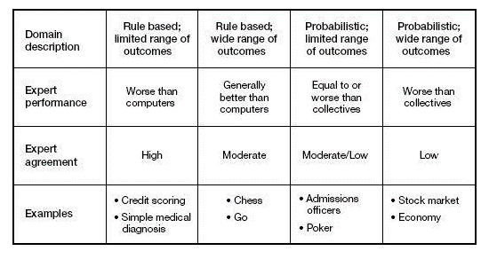
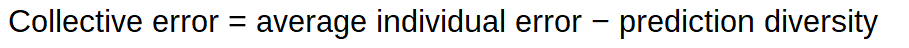
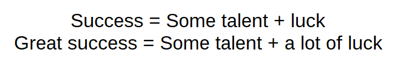

**EdX course UQx Think101xThe Science of Everyday Thinking**

**Think Twice (harnessing the power of counterintuition)**

## Wisdom of the crowd and the algorithm

### Wisdom of the crowd

The diversity prediction theorem tells us that a diverse crowd will
always predict more accurately than the average person in the crowd. Not
sometimes. Always. This suggests that modesty is in order, but most
people do not think of themselves as average---and certainly not as
below average. Yet in reality, half of all people must be below average,
and so you should sort out when you are likely to be one of them.

Also important is that collective accuracy is equal parts ability and
diversity. You can reduce the collective error either by increasing
ability or by increasing diversity. Both ability and diversity are
essential.

With the diversity prediction theorem in hand, we can flesh out when
crowds predict well. Three conditions must be in place: **diversity
(diverse set of opinions), aggregation (everyone's information), and
incentives (make good predictions)**.

Loss of diversity usually stems from a dominant leader, an absence of
facts, or cognitive homogeneity in the group. Without diversity,
collectives large or small can be wildly off the mark.

## Causation vs. correlation

Three conditions must hold to make a claim that X causes Y.

-   X must occur before Y.

-   functional relationship between X and Y, including the requirement
    that cause and effect take on two or more values. For example, the
    statement "smoking causes lung cancer". A scientist must consider
    all the relationships between the variables: does the person smoke
    (yes or no) and does the person have cancer (yes or no).

-   there cannot be a factor Z that causes both X and Y.

## Regression to the mean:

-   Notice that a beginner would be more likely to regress towards the
    > mean than an expert, because regression towards the mean is most
    > apparent when there is lots of randomness or 'noise' in a
    > measurement.

-   Remember that subsequent performance tends not to be as extreme as
    > initially observed extreme scores, and there\'s greater regression
    > with less precise measurement. There are two extremes:

-   At one extreme, predict complete regression to the mean. You\'re
    > saying that any deviation from the mean in the first sample is
    > just chance, like the coin flipping students who don\'t understand
    > English.

-   At the other extreme, if you have a perfect predictor (a measurement
    > with no error in it), predict no regression: the next score is
    > just as extreme as the last.

-   Most of the time, we are dealing with imperfect predictors, so we
    > would expect regression between these two extremes.

-   **even as reversion to the mean occurs from one generation to the
    > next, the *overall* distribution of heights remains stable over
    > time.**

    **Avoid regression to the mean errors:**

-   Evaluate the mix of skill and luck in the system that you are
    analyzing*. (skill = if you can lose* on purpose)

-   *Carefully consider the sample size*. (The more that luck
    contributes to the outcomes you observe, the larger the sample you
    will need to distinguish between skill and luck. In addition, when a
    large number of people participate in an activity that is influenced
    by chance, some of them will succeed by sheer luck.

-   Streaks are good indicators of skill in a field**.** Since streaks
    > require both skill and luck. For instance, a basketball player who
    > makes 60 percent of her shots has about a 7.8 percent chance
    > (0.6)^5^ of making five in a row. A player who makes 40 percent of
    > his shots has only a 1 percent chance (0.4)^5^ of hitting five in
    > a row. The best players have more streaks than the worst players,
    > just as you would expect, given the statistics.

-   *Watch for change within the system or of the system*.

### Halo effect

The **halo effect** (sometimes called the **halo error**) is the
tendency for positive impressions of a person, company, brand or product
in one area to positively influence one\'s opinion or feelings in other
areas.

A whole cottage industry, including business school professors and
consultants, is working hard to offer businesspeople tidy solutions for
their problems. Here's how you grow sales. Here's how you innovate.
Here's how you manage your people. But any time you see an approach
offering secrets, formulas, rules, or attributes to achieve success, you
can be sure that someone is selling you a nostrum

For example, Rosenzweig suggests that the press will praise a company
that is doing well for having "a sound strategy, a visionary leader,
motivated employees, an excellent customer orientation, a vibrant
culture, and so on." But if the company's performance subsequently
reverts to the mean, onlookers will conclude all of those features went
wrong, when in reality nothing of the sort happened. In many cases, the
same people are running the same business with the same strategy. Mean
reversion shapes company performance, which in turn manipulates
perception.

## Inside vs. outside view

Whereas the inside view attempts to make predictions based on an
understanding of the details of a problem, the outside view---also
called reference class forecasting---instead looks at similar past
situations and predicts based on those outcomes.

**The main lesson from the inside-outside view is that while decision
makers tend to dwell on uniqueness, the best decisions often derive from
sameness.**

The outside view asks if there are similar situations that can provide a
statistical basis for making a decision. Rather than seeing a problem as
unique, the outside view wants to know if others have faced comparable
problems and, if so, what happened.

People who believe that they have some control have the perception that
their odds of success are better than they actually are. People who
don't have a sense of control don't experience the same bias

**Mergers and acquisition example**

The problem is that most deals don't create value for the shareholders
of the acquiring company (shareholders of the companies that are bought
do fine, on average). In fact, researchers estimate that when one
company buys another, the acquiring company's stock goes down roughly
two-thirds of the time.[^1^](dummy_split_065.html#filepos394769)

### The Plural of Anecdote Is Not Evidence

If you want to know how something is going to turn out for you, look at
how it turned out for others in the situation. The reason most people
don't use this approach is that they think of themselves different, and
better, than those around them.

How to use the outside view:

-   ***Select a reference class*.** Find a group of situations, or a
    reference class, that is broad enough to be statistically
    significant but narrow enough to be useful in analyzing the decision
    that you face.

-   ***Assess the distribution of outcomes*.** Once you have a reference
    class, take a close look at the rate of success and failure. The
    statistical rate of success and failure must be reasonably stable
    over time for a reference class to be valid. If the properties of
    the system change, drawing inference from past data can be
    misleading.

-   ***Make a prediction*.** With the data from your reference class in
    hand, including an awareness of the distribution of outcomes, you
    are in a position to make a forecast.

-   ***Assess the reliability of your prediction and fine-tune*.** How
    good we are at making decisions depends a great deal on what we are
    trying to predict. Weather forecasters, for instance, do a pretty
    good job of predicting what the temperature will be tomorrow. Book
    publishers, on the other hand, are poor at picking winners, with the
    exception of those books from a handful of best-selling authors.
    **The worse the record of successful prediction is, the more you
    should adjust your prediction toward the mean** (or other relevant
    statistical measure).

## Insufficient consideration of alternatives

You can call it tunnel vision. Failure to entertain options or
possibilities can lead to dire consequences, from a missed medical
diagnosis to unwarranted confidence in a financial model. Incentives are
a strong contributor to tunnel vision.

Anchoring: In deciding, people often start with a specific piece of
information or trait (anchor) and adjust as necessary to come up with a
final answer. The bias is for people to make insufficient adjustments
from the anchor, leading to off-the-mark responses. Systematically, the
final answer leans too close to the anchor, whether or not the anchor is
sensible.

How do you avoid the tunnel vision trap? Here's a five-point checklist:

-   **Explicitly consider alternatives.** You should examine a full
    range of alternatives, using base rates or market-derived guidelines
    when appropriate to mitigate the influence of the representativeness
    or availability biases.

    **Know your best alternative to a negotiated agreement, your
    walkaway price, and the same two sums for the party across the
    table.** These figures allow you to improve the odds of an
    advantageous deal and to avoid

-   ***Seek dissent*.** Much easier said than done, the idea is to prove
    your views wrong. There are a couple of techniques. The first is to
    ask questions that could elicit answers that might contradict your
    own views. Then listen carefully to the answers.

-   ***Keep track of previous decisions*.** Life must be understood
    backwards ...But it must be lived---forwards. Write down the
    rationale behind decisions and to consistently revisit past actions.

-   ***Avoid making decisions while at emotional extremes*.** Whenever
    possible, try to postpone important decisions if you feel at an
    emotional extreme.

-   ***Understand incentives***. Consider carefully what incentives
    exist, and what behaviors the incentives might motivate.

## Intuition

People become experts by using deliberate practice to train their
experiential systems. Deliberate practice has a very specific meaning:
it includes activities designed to improve performance, has repeatable
tasks, incorporates high-quality feedback, and is not much fun.

Intuition therefore works well in stable environments, where conditions
remain largely unchanged (e.g., the chess board and pieces), where
feedback is clear, and where cause-and-effect relationships are linear.
Intuition fails when you are dealing with a changing system, especially
one that has phase transitions. Despite its near-magical connotation,
intuition is losing relevance in an increasingly complex world.

## Situation trumps disposition

Also see [Fundamental attribution
error](#_Fundamental_attribution_error)

Don't underestimate the impact of the situation over people's
personality. We selectively attend to what people are doing or saying
rather than the context and we don't have many labels for situations
that prompt certain behaviours. If you expose people to situations,
usually novel situations under well-controlled circumstances and, to
some extent, even if you observe them in their day-to-day life, the
degree of cross-situational consistency in behavior is relatively low.

If you want people something to do make the situation comfortable, easy,
and suitable for them (e.g. pre-filling forms, people might avoid to
help not because they are necessarily bad but just because they were in
a hurry).

Make use of channel factors, an aspect of the situation that bridges
between an intention and action and has a major impact on behavior.

Some of the greatest atrocities known to mankind resulted from putting
normal people into bad situations. While we all like to believe that our
choices are largely independent of our circumstances, the evidence
strongly suggests otherwise.

Decisions are usually not independent of the situation, context,
experience.

Here are some ideas to help you cope with the power of the situation

1.  ***Be aware of your situation*.**

> There is the conscious element, where you can create a positive
> environment for decision making in your own surroundings by focusing
> on process, keeping stress to an acceptable level.
>
> Then there is coping with the subconscious influences. Control over
> these influences requires awareness of the influence, motivation to
> deal with it, and the willingness to devote attention to address
> possible poor decisions.

2.  **Consider the situation first and the individual second**

3.  **Watch out for the institutional imperative.** tendency of
    organizations to "mindlessly" imitate what peers are doing. There
    are typically two underlying drivers wanting to be part of the
    in-group, second incentives

4.  ***Avoid inertia (resistance to change)*.** Periodically revisit
    your processes and ask whether they are serving their purpose.

## Complex Adaptive Systems---The Whole Is Smarter Than Its Parts

In complex adaptive systems, there is no simple method for understanding
the whole by studying the parts, so searching for simple agent-level
causes of system-level effects is useless.

Just as watching one bee won't help you understand the hive's behavior,
listening to individual investors will give you scant insight into the
market.[^10^](dummy_split_065.html#filepos437576)

I have explained to executives countless times that the opinion of the
market is far more relevant than the utterances of individuals. By
studying the market, we can get a much better sense of how various
decisions affect economic value than we can by listening to partially
informed individuals

You and I both might be irrationally overconfident, for example, but if
you are an overconfident buyer and I am an overconfident seller, our
biases may cancel out. In dealing with systems, the collective behavior
matters more. You must carefully consider the unit of analysis to make a
proper decision.

## Misc

People usually get more drunk if they usually drink in the evening and
drink once during lunch. People usually don't die of an overdose of a
drug, but because they take it in unusual circumstances. The body
prepares in anticipation of the drug. This is to keep homeostasis, a
stable narrow range of conditions the body can survive in.

Pupil expands by 30-40% if you are involved in a mental task (conscious
effort). In addition to the effect that the pupil gets larger when in
the dark.

For experts processing switching from System 2 to System 1 from
consciousness mental effort to unconscious pattern matching (e.g.
doctors seeing scans and making a diagnosis). They are learning things
through conscious effort and then through practice in combination with
rapid feedback they can perform the processing through System 1.

<http://whatstheharm.net/>

## Skill vs luck

The main lesson is that feedback should focus on the part of the outcome
a person can control. Call it the skill part, or the process. Feedback
based only on outcomes is nearly useless if it fails to distinguish
between skill and luck.

For instance, a basketball player who makes 60 percent of her shots has
about a 7.8 percent chance (0.6)5 of making five in a row. A player who
makes 40 percent of his shots has only a 1 percent chance (0.4)5 of
hitting five in a row. The best players have more streaks than the worst
players, just as you would expect, given the statistics.

Streaks, continuous success in a particular activity, require large
doses of skill and luck. In fact, a streak is one of the best indicators
of skill in a field. Luck alone can't carry a streak. My analysis of
various sports streaks in basketball and baseball clearly suggests
streak holders are among the most skilled in their fields.

## Experiment and find things out

-   Question assumptions

-   The law of large numbers says that with a large enough
    denominator---in other words, in a big wide world---stuff will
    happen, even very weird stuff. \"The really unusual day would be one
    where nothing unusual happens,\"

-   Be methodical and careful about moving through the process of
    answering a question.

-   Try to isolate the variables that they think will be important that
    will make good predictions.

-   Test things by using controlled experiments (only change one
    variable at the time and control the others)

-   When testing a claim, you need to decide what level of performance
    would convince you that there is a genuine effect.

-   Be willing to find evidence that is against what you believe and be
    willing to change your opinion based on better evidence to the
    contrary.

-   Define what it is that you really believe in.

-   How well based is the opinion that I hold? What is the evidence?

-   Does the new evidence contradict my opinion/belief?

-   If the current evidence is insufficient to make you change your
    > mind, which evidence would be?

-   What is the cost/benefit of changing my opinion?

-   Less (contextual) information can sometimes lead to better outcomes.
    E.g. a teacher grading exams can better grade when he doesn't know
    the student he's grading.

## How to learn

-   **Interleaving**: Mixing up learning and quizzes from across
    different topics/chapters.

-   Associate new knowledge with existing. Having more knowledge in a
    domain will make it easier.

-   Write summaries instead of highlighting or copy and paste.

-   **Retrieval**/quizzing instead of re-reading. Make it more difficult
    will pay off in the long run (desirable difficulties). Current/short
    term performance does not reflect learning effectiveness well. If
    something goes down easy we usually misinterpret that ease with
    understanding.

-   Practice and apply the knowledge in different domains.

-   **Spaced learning/recalling** instead of cramming.(flash cards).
    Cramming might work to ace an exam but is not good for long term
    retention of the information.

-   **Make use of your unconscious by spending a few minutes, think
    about what the problem is, how you\'re going to get this thing
    across, it\'s been handed over to the unconscious and the
    unconscious. (think what is the best I want to get out of this
    meeting or conversation)**

## Illusions and Biases

### Overly relying on past successes

After a success, we become overly optimistic risk-takers. After a
failure, we become overly pessimistic and risk-averse even in cases
where success or failure was merely a result of chance. Good
consequences don\'t necessarily mean we made a good decision, and bad
consequences don\'t necessarily mean we made a bad decision.
[]{#_Fundamental_attribution_error .anchor}This automatic association to
what worked in the past causes people to under-react to new conditions
and circumstances.

### Comparing relatives or gradual changes instead of absolutes

In one experiment, a group of people was asked to choose between \$6 and
an elegant pen. Most choose the cash. Another group of people was asked
to choose between \$6, the elegant pen, or an inferior pen. Most choose
the elegant pen. By adding an inferior option, another option seemed
more attractive.

**Evaluate people and objects by themselves and not by their contrast.**

### Representativeness bias "Don't judge a book by its cover"

Encouraging us to remain open to options even as our mind seeks to shut
them down. In this case, the doctor's error was to rule out a heart
attack because the patient appeared to be a model of health and fitness.
"You have to be prepared in your mind for the atypical and not so
quickly reassure yourself, and the patient, that everything is okay,"

Think carefully about how the representativeness and availability
heuristics may impose on your decisions. Have you ever judged someone
solely based on how he or she looks? Have you ever feared flying more
after hearing of a plane crash? If the answer is yes, you are a normal
human. But you also risk misunderstanding, or missing altogether,
plausible outcomes.

### Is the Trend Your Friend?

This mistake is tough because our minds have a deep-seated desire to
make out patterns and our prediction process is very rapid (the
researchers call it "automatic and obligatory"). This pattern
recognition ability evolved through the millennia and was profoundly
useful for most of human existence. "In a natural environment, almost
all patterns are predictive," but these causal relationships don't
necessarily hold in the technological world.

We can restate the problem of induction as inappropriately projecting
into the future, based on a limited number of observations. Failure to
reflect reversion to the mean is the result of extrapolating earlier
performance into the future without giving proper weight to the role of
chance. Models based on past results forecast in the belief that the
future will be characteristically similar to history.

### Fundamental attribution error

**[Underestimate the impact of the situation.]{.mark} (**Personality is
not a good predictor for future behaviour since it's usually more
dependent on the circumstances or the situation. E.g. people are more
likely to help if they are not in a hurry. We tend to focus too much on
the actor rather than the situation.

**[We way overestimate our own individuality (e.g. if the movie has a
95% rating you are most likely going to like it too).]{.underline}**

**[We readily think that when people disagree with us, it\'s because
there\'s something wrong with them, not something wrong with us, or at
least not something that\'s affecting both of us that\'s making us
simply disagree.]{.underline}**

We judge others by their actions and ourselves by our intentions.

###  Fundamental cognitive error

Failure to recognize the extent to which our interpretations are shaped
by our prior knowledge and experiences.

### Cognitive dissonance

Cognitive dissonance is one facet of our next mistake, the rigidity that
comes with the innate human desire to be internally and externally
consistent. Cognitive dissonance, a theory developed in the 1950s by
Leon Festinger, a social psychologist, arises when "a person holds two
cognitions---ideas, attitudes, beliefs, opinions---that are
psychologically inconsistent."15 The dissonance causes mental discomfort
that our minds seek to reduce. Many times we resolve the discomfort by
figuring out how to justify our actions (self justification).

### Penny-wise and dollar foolish

Describes focusing on short-term goals rather than long term benefits
due to stress responses.

### Must be in the middle heuristic 

I.e. there is a bit of truth in both sides. Many times this is not the
case. For example if 99% of scientists support the idea that climate
change is mainly caused by humans and someone with the opposite opinion
discusses the topic the climate change denier is very much over
represented.

### Post hoc ergo propter hoc 

.. is an informal fallacy that states: \"Since event Y followed event X,
event Y must have been caused by event X.\" Correlation vs. causation.

### Multiple-endpoints fallacy

Ray and his brother, Robert, are having a little competition over who
can be the first to toss a kernel of popcorn into a bowl. They alternate
tosses for a while, both of them consistently failing. Eventually,
Robert grabs a double handful of popcorn and tosses it at the bowl. A
few fall in, and he immediately claims victory.\
\
Breaking it down, here\'s what happens: At first, they try to throw the
popcorn in individually. This has a single endpoint of success: that the
popcorn goes in. Then Robert throws a bunch at once. This has multiple
successful endpoints: one for each individual kernel going in. A few of
these go in, so Robert claims success. He points to the endpoints he
reached and used those declare victory.\
\
Simply put, the multiple endpoints phenomenon describes how if you have
a specific measure for success, it\'s hard to achieve it, but the more
you generalize it, the easier it gets. What you have to watch out for is
people who act like they had a specific measure when in fact they were
going from more generalized criteria.

If you\'re observing 500 such counties, then every year that will happen
to some one of them. You just never notice the 499 data points where it
didn\'t.

### Gambler's fallacy

**..** is the incorrect belief that, if a particular event occurs more
frequently than normal during the past, it is less likely to happen in
the future (or vice versa), when it has otherwise been established that
the probability of such events does not depend on what has happened in
the
past.

### Availability bias

A distortion that arises from the use of information, which is most
readily available, rather than that which is necessarily most
representative. (e.g., what is currently overrepresented in the media
vs. actual most common causes)

#### End-point bias

A tendency to interpret a recent short-term fluctuation as a reversal of
a long-term trend.

#### Representative bias

Judge the frequency or likelihood of an event by the extent to which it
resembles the typical case. Linda the feminist bank teller.

Sales people might use of the **anchoring effect** by offering an
extremely high price at the beginning.

Consider choices from a zero base level and remember what you want to
achieve.

#### Misc

Our memories don't work like a tape or video recorder.

We are constantly making interpretations of what we perceive based the
sum of our previous experiences. It doesn\'t really make sense to talk
about things objectively as seeing objects and events as they are in the
world instead of being filtered by our own experiences.

Memories of things change over time. Memories for the details of events
can be transformed or distorted with misinformation.

**Make use of your unconscious by spending a few minutes, think about
what the problem is, how you\'re going to get this thing across, it\'s
been handed over to the unconscious and the unconscious. (think what is
the best I want to get out of this meeting or conversation)**

**We are also not good at assessing our own skill level (are you in
bottom or top half of ...)**

We are influenced by factors that we are not aware of (e.g., fishy smell
makes us more suspicious)

We don\'t have any real privileged access to our own memory, own
perception, and the determinants of our own behavior. (We don't know why
we do things, nor are we good at interpreting our prediction whether and
why we like things or made choices). Usually, we overestimate the
duration of negative effects, unpleasantness only lasts for a small
length of time. We underestimate how good our internal coping mechanisms
work and how well we can adapt.

The brain structure is more analogous to a scaffold (the more structure
you put up the more places you have to place things) rather than
computer storage.

The idea is that it\'s really difficult to put yourself in the shoes or
see things from the perspective of other people (recognizing the tapping
a familiar song).

Music being played backwards with subliminal messages (Judas Priest).

People tend to see patterns where there are no patterns or see things
that are actually not there.

Randomness doesn't mean that events don't occur in runs. It's normal
that random events cluster (e.g. 6 heads in a row).

## Health Claims

There is not much evidence of physiological effects of the placebo, but
it is mainly based on reported feeling of people (pain and depression).
Many of the effects of alternative medicine or placebos can be explained
by the regression to the mean effect. When people take the treatments,
they are usually at an extreme point and there is a natural tendency to
go back to a better normal/average state. When looking for a placebo
effect you need to test with a group that gets the drug, a group that
gets the placebo and a group that gets no treatment.

Cochrane library to check for tested alternative medicines or treatments

2 Way contingency table to consider alternative causes/explanations for
treatments/outcomes:

<table>
<colgroup>
<col style="width: 14%" />
<col style="width: 43%" />
<col style="width: 42%" />
</colgroup>
<thead>
<tr class="header">
<th>Outcome</th>
<th rowspan="2"><strong>Yes</strong></th>
<th rowspan="2"><strong>No</strong></th>
</tr>
<tr class="odd">
<th>Prediction</th>
</tr>
</thead>
<tbody>
<tr class="odd">
<td><strong>Yes</strong></td>
<td>Predicted yes and it yes</td>
<td>Predicted yes and it was no (false positive very common to avoid big
negative consequences like not diagnosing appendix conditions)</td>
</tr>
<tr class="even">
<td><strong>No</strong></td>
<td>
Predicted no and it was yes

(not common since it is avoided by false positives
</td>
<td>Predicted no and it is no</td>
</tr>
</tbody>
</table>

