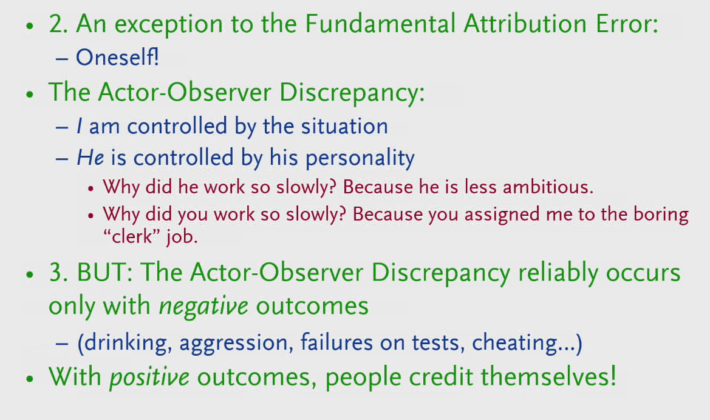

EdX course UQx Think101xThe Science of Everyday Thinking
========================================================

Situation 
----------

Don't underestimate the impact of the situation over people's
personality. We selectively attend to what people are doing or saying
rather than the context and we don't have many labels for situations
that prompt certain behaviours. If you expose people to situations,
usually novel situations under well-controlled circumstances and, to
some extent, even if you observe them in their day-to-day life, the
degree of cross-situational consistency in behavior is relatively low.

If you want people something to do make the situation comfortable, easy,
and suitable for them (e.g. pre-filling forms, people might avoid to
help not because they are necessarily bad but just because they were in
a hurry).

Make use of channel factors, an aspect of the situation that bridges
between an intention and action and has a major impact on behavior.

Misc
----

People usually get more drunk if they usually drink in the evening and
drink once during lunch. People usually don't die of an overdose of a
drug, but because they take it in unusual circumstances. The body
prepares in anticipation of the drug. This is to keep homeostasis, a
stable narrow range of conditions the body can survive in.

Pupil expands by 30-40% if you are involved in a mental task (conscious
effort). In addition to the effect that the pupil gets larger when in
the dark.

For experts processing switching from System 2 to System 1 from
consciousness mental effort to unconscious pattern matching (e.g.
doctors seeing scans and making a diagnosis). They are learning things
through conscious effort and then through practice in combination with
rapid feedback they can perform the processing through System 1.

<http://whatstheharm.net/>

Experiment and find things out
------------------------------

-   Question assumptions

-   The law of large numbers says that with a large enough
    denominator---in other words, in a big wide world---stuff will
    happen, even very weird stuff. \"The really unusual day would be one
    where nothing unusual happens,\"

-   Be methodical and careful about moving through the process of
    answering a question.

-   Try to isolate the variables that they think will be important that
    will make good predictions.

-   Test things by using controlled experiments (only change one
    variable at the time and control the others)

-   When testing a claim, you need to decide what level of performance
    would convince you that there is a genuine effect.

-   Be willing to find evidence that is against what you believe and be
    willing to change your opinion based on better evidence to the
    contrary.

-   Define what it is that you really believe in.

-   How well based is the opinion that I hold? What is the evidence?

-   Does the new evidence contradict my opinion/belief?

-   If the current evidence is insufficient to make you change your
    > mind, which evidence would be?

-   What is the cost/benefit of changing my opinion?

-   **Regression to the mean:**

-   Notice that a beginner would be more likely to regress towards the
    > mean than an expert, because regression towards the mean is most
    > apparent when there is lots of randomness or 'noise' in a
    > measurement.

-   Remember that subsequent performance tends not to be as extreme as
    > initially observed extreme scores, and there\'s greater regression
    > with less precise measurement. There are two extremes:

-   At one extreme, predict complete regression to the mean. You\'re
    > saying that any deviation from the mean in the first sample is
    > just chance, like the coin flipping students who don\'t understand
    > English.

-   At the other extreme, if you have a perfect predictor (a measurement
    > with no error in it), predict no regression: the next score is
    > just as extreme as the last.

-   Most of the time, we are dealing with imperfect predictors, so we
    > would expect regression between these two extremes.

-   Less (contextual) information can sometimes lead to better outcomes.
    E.g. a teacher grading exams can better grade when he doesn't know
    the student he's grading.

How to learn
------------

-   **Interleaving**: Mixing up learning and quizzes from across
    different topics/chapters.

-   Associate new knowledge with existing. Having more knowledge in a
    domain will make it easier.

-   Write summaries instead of highlighting or copy and paste.

-   **Retrieval**/quizzing instead of re-reading. Make it more difficult
    will pay off in the long run (desirable difficulties). Current/short
    term performance does not reflect learning effectiveness well. If
    something goes down easy we usually misinterpret that ease with
    understanding.

-   Practice and apply the knowledge in different domains.

-   **Spaced learning/recalling** instead of cramming.(flash cards).
    Cramming might work to ace an exam but is not good for long term
    retention of the information.

-   **Make use of your unconscious by spending a few minutes, think
    about what the problem is, how you\'re going to get this thing
    across, it\'s been handed over to the unconscious and the
    unconscious. (think what is the best I want to get out of this
    meeting or conversation)**

Illusions and Biases
--------------------

### Fundamental attribution error

**Underestimate the impact of the situation. (**Personality is not a
good predictor for future behaviour since it's usually more dependent on
the circumstances or the situation. E.g. people are more likely to help
if they are not in a hurry. We tend to focus too much on the actor
rather than the situation.

**[We way overestimate our own individuality (e.g. if the movie has a
95% rating you are most likely going to like it too).]{.underline}**

**[We readily think that when people disagree with us, it\'s because
there\'s something wrong with them, not something wrong with us, or at
least not something that\'s affecting both of us that\'s making us
simply disagree.]{.underline}**

We judge others by their actions and ourselves by our intentions.

###  Fundamental cognitive error

Failure to recognize the extent to which our interpretations are shaped
by our prior knowledge and experiences.

### Cognitive dissonance

### Must be in the middle heuristic 

I.e. there is a bit of truth in both sides. Many times this is not the
case. For example if 99% of scientists support the idea that climate
change is mainly caused by humans and someone with the opposite opinion
discusses the topic the climate change denier is very much over
represented.

### Post hoc ergo propter hoc 

.. is an informal fallacy that states: \"Since event Y followed event X,
event Y must have been caused by event X.\" Correlation vs. causation.

### Multiple-endpoints fallacy

Ray and his brother, Robert, are having a little competition over who
can be the first to toss a kernel of popcorn into a bowl. They alternate
tosses for a while, both of them consistently failing. Eventually,
Robert grabs a double handful of popcorn and tosses it at the bowl. A
few fall in, and he immediately claims victory.\
\
Breaking it down, here\'s what happens: At first, they try to throw the
popcorn in individually. This has a single endpoint of success: that the
popcorn goes in. Then Robert throws a bunch at once. This has multiple
successful endpoints: one for each individual kernel going in. A few of
these go in, so Robert claims success. He points to the endpoints he
reached and used those declare victory.\
\
Simply put, the multiple endpoints phenomenon describes how if you have
a specific measure for success, it\'s hard to achieve it, but the more
you generalize it, the easier it gets. What you have to watch out for is
people who act like they had a specific measure when in fact they were
going from more generalized criteria.

If you\'re observing 500 such counties, then every year that will happen
to some one of them. You just never notice the 499 data points where it
didn\'t.

### Gambler's fallacy

**..** is the incorrect belief that, if a particular event occurs more
frequently than normal during the past, it is less likely to happen in
the future (or vice versa), when it has otherwise been established that
the probability of such events does not depend on what has happened in
the past.

### Availability bias

A distortion that arises from the use of information, which is most
readily available, rather than that which is necessarily most
representative. (e.g., what is currently overrepresented in the media
vs. actual most common causes)

### End-point bias

A tendency to interpret a recent short-term fluctuation as a reversal of
a long-term trend.

### Representative bias

Judge the frequency or likelihood of an event by the extent to which it
resembles the typical case. Linda the feminist bank teller.

Sales people might use of the **anchoring effect** by offering an
extremely high price at the beginning.

### Misc

Our memories don't work like a tape or video recorder.

We are constantly making interpretations of what we perceive based the
sum of our previous experiences. It doesn\'t really make sense to talk
about things objectively as seeing objects and events as they are in the
world instead of being filtered by our own experiences.

Memories of things change over time. Memories for the details of events
can be transformed or distorted with misinformation.

**Make use of your unconscious by spending a few minutes, think about
what the problem is, how you\'re going to get this thing across, it\'s
been handed over to the unconscious and the unconscious. (think what is
the best I want to get out of this meeting or conversation)**

**We are also not good at assessing our own skill level (are you in
bottom or top half of ...)**

We are influenced by factors that we are not aware of (e.g., fishy smell
makes us more suspicious)

We don\'t have any real privileged access to our own memory, own
perception, and the determinants of our own behavior. (We don't know why
we do things, nor are we good at interpreting our prediction whether and
why we like things or made choices). Usually, we overestimate the
duration of negative effects, unpleasantness only lasts for a small
length of time. We underestimate how good our internal coping mechanisms
work and how well we can adapt.

The brain structure is more analogous to a scaffold (the more structure
you put up the more places you have to place things) rather than
computer storage.

The idea is that it\'s really difficult to put yourself in the shoes or
see things from the perspective of other people (recognizing the tapping
a familiar song).

Music being played backwards with subliminal messages (Judas Priest).

People tend to see patterns where there are no patterns or see things
that are actually not there.

Randomness doesn't mean that events don't occur in runs. It's normal
that random events cluster (e.g. 6 heads in a row).

Health Claims
-------------

There is not much evidence of physiological effects of the placebo, but
it is mainly based on reported feeling of people (pain and depression).
Many of the effects of alternative medicine or placebos can be explained
by the regression to the mean effect. When people take the treatments,
they are usually at an extreme point and there is a natural tendency to
go back to a better normal/average state. When looking for a placebo
effect you need to test with a group that gets the drug, a group that
gets the placebo and a group that gets no treatment.

Cochrane library to check for tested alternative medicines or treatments

2 Way contingency table to consider alternative causes/explanations for
treatments/outcomes:

<table>
<thead>
<tr class="header">
<th>Outcome</th>
<th><strong>Yes</strong></th>
<th><strong>No</strong></th>
</tr>
</thead>
<tbody>
<tr class="odd">
<td>Prediction</td>
<td></td>
<td></td>
</tr>
<tr class="even">
<td><strong>Yes</strong></td>
<td>Predicted yes and it yes</td>
<td>Predicted yes and it was no (false positive very common to avoid big negative consequences like not diagnosing appendix conditions)</td>
</tr>
<tr class="odd">
<td><strong>No</strong></td>
<td>
Predicted no and it was yes

(not common since it is avoided by false positives
</td>
<td>Predicted no and it is no</td>
</tr>
</tbody>
</table>

