## Arithmetic:

Manually multiplication

| 5   | 3     | 8     | \*    | 2     | 1     | 7     |
|-----|-------|-------|-------|-------|-------|-------|
|     | 1     | 0     | 7     | 6     |       |       |
|     |       |       | 5     | 3     | 8     |       |
|     |       |       | 3     | 7     | 6     | 6     |
|     | **1** | **1** | **6** | **7** | **4** | **6** |
|     |       |       |       |       |       |       |

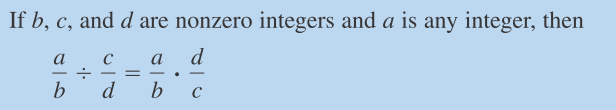

### Commutative property (multiplication and addition):

Addition and multiplication are said to be commutative operations. This
means that the order in which you add or multiply two or more integers
does not affect the result.

### Associative property (multiplication and addition):

If a, b, and c are integers, then (a + b) + c = a + (b + c)

If a, b, and c are integers, then (ab)c = a(bc)

### Distributive Property 

Multiplication distributes over addition and subtraction

If a, b, and c are integers, then

a(b \* c) = ab + ac

a(b - c) = ab - ac.

### Additive Inverse Property

For every integer a, there exists an integer a such that a + ( - a) = (
-a) + a = 0

The integer -a is called the additive inverse of a or the opposite of a.

A whole number is divisible by 3 if and only if the sum of the digits of
its base-ten numeral is divisible by 3. (51 = divisible because
(5+1)/3=2 -- Same applies to 9

### Greatest common multiple (factor)

*The greatest common factor (GCF) of two numbers is the largest divisor
of both numbers. Prime factor each number and select each common factor
the least number of times it appears in the factorizations.*

#### Find the greatest common factor of 48 and 60.

Since two 2s and one 3 are common to both, the greatest common factor of
48 and 60 is 12

48 = 4\*12= 2\*2\*[2\*2\*3]{.mark}

60=5\*12=5\*[2\*2\*3]{.mark}

#### Find the greatest common factor of 24, 56, and 120.

Since three 2s are common to the numbers, the greatest common factor of
24, 56, and 120 is 8

120 = 30\*4=6\*5\*4= [2 \* 2 \* 2]{.mark} \* 3 \* 5

24 = [2 \* 2 \* 2]{.mark} \* 3

56= [2 \* 2 \* 2]{.mark} \* 7

### Least common multiple

The least common multiple (LCM) is the smallest nonzero common multiple
of each number. Prime factor each number and select each factor the most
number of times it appears in the factorizations.

#### Find the least common multiple of 48 and 84.

Solution

We need four 2s in the least common multiple because of the four 2s in
48. We need one 3 because of the 3 in each of the numbers, and one 7 is
needed because of the 7 in 84. The least common multiple of 48 and 84 is
[2\*2\*2\*2\*3\*7]{.mark}=336

84 = 2 \*2 \* [3 \*7]{.mark}

48=[2 \* 2 \* 2 \* 2]{.mark} \* 3

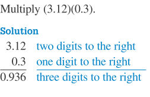

FOIL (First Outside Inside Last)

(a + b)(c + d) = [(First of 1^st^ set \* First of 2^nd^ set)]{.mark} +
[(Outside of 1^st^ set \* Outside of 2^nd^ set)]{.mark} + [(Inside of
1^st^ set \* Inside of 2^nd^ set)]{.mark} + [(Last of 1^st^ set \* Last
of 2^nd^ set)]{.mark}

(a + b)(c + d) = [ac]{.mark} + [ad]{.mark} + [bc]{.mark} + [bd]{.mark}.

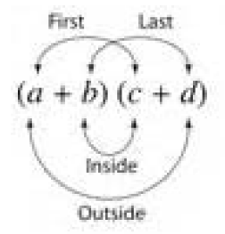

When you multiply or divide an inequality by a negative number, the
direction of

the inequality changes.

$\mathbf{- x < \ }\frac{\mathbf{- 2}}{\mathbf{5}}\mathbf{= \ \ x > \ }\frac{\mathbf{2}}{\mathbf{5}}$

### Cross-multiply proportions

$(\frac{a}{b} = \frac{c}{d}) = (ad = bc)$

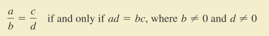

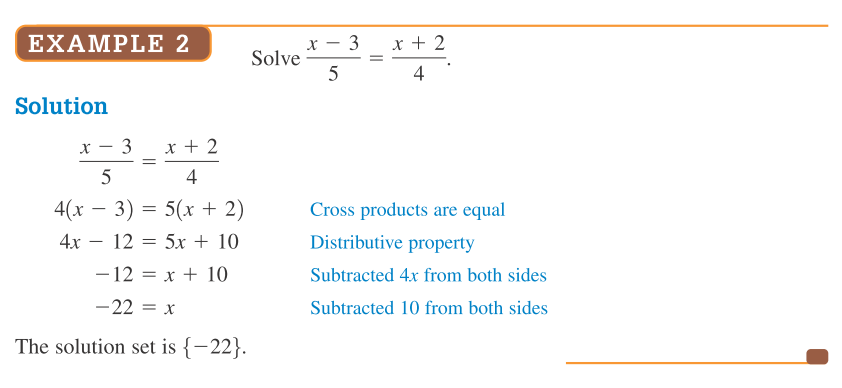

### Simplify fractions

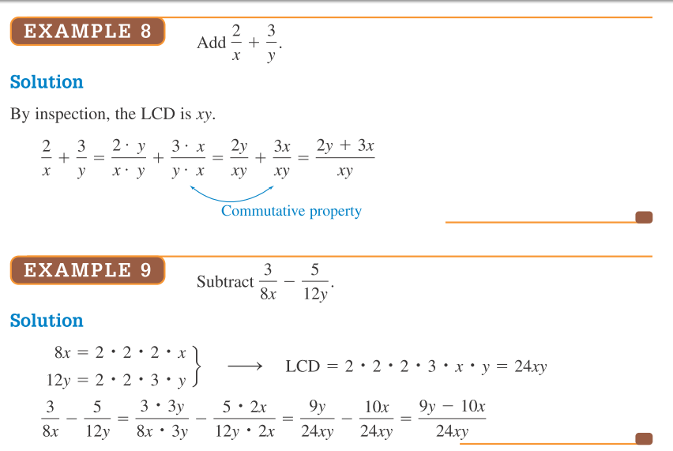

**If an equation contains several fractions, then it is usually easier
to clear the equation of all fractions by multiplying both sides by the
least common denominator of all the denominators.**

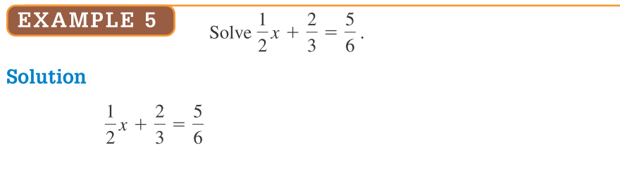
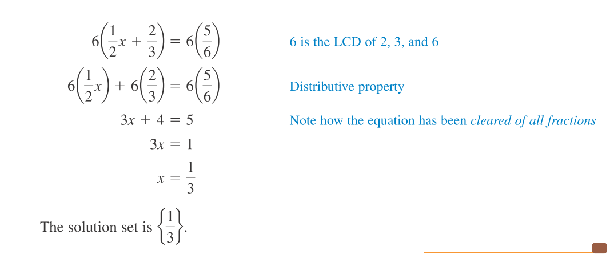
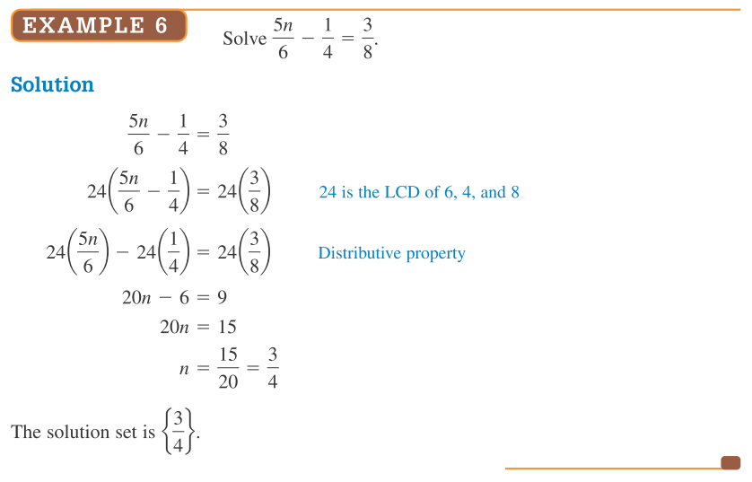

### Inequalities

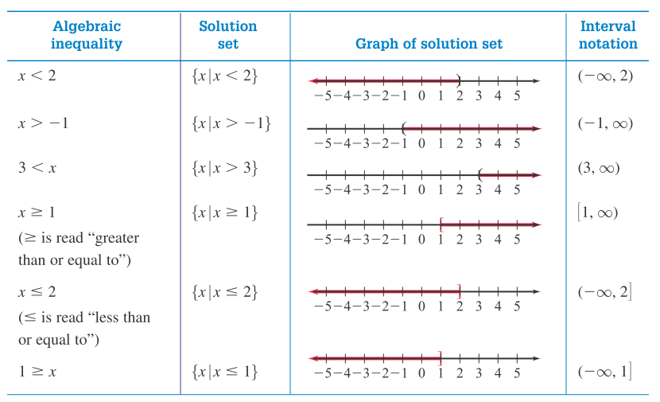

Solution set is X such that x is less than 2

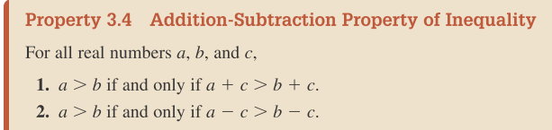

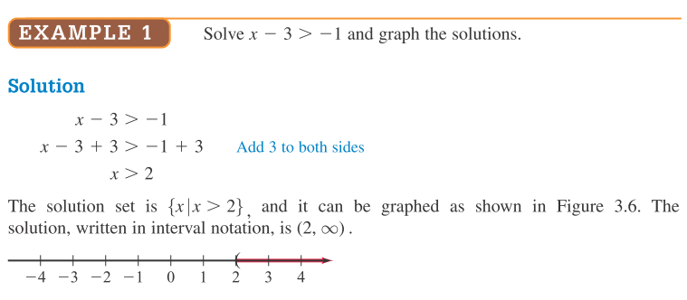
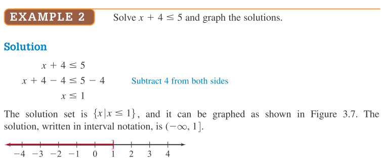

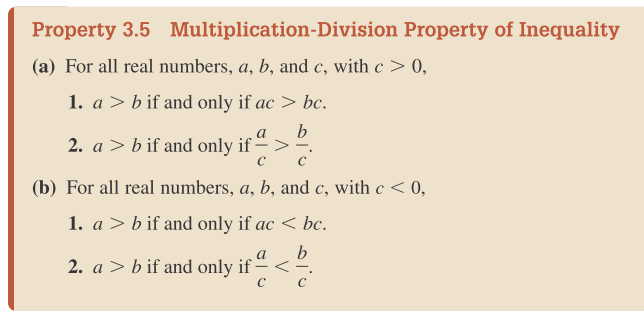

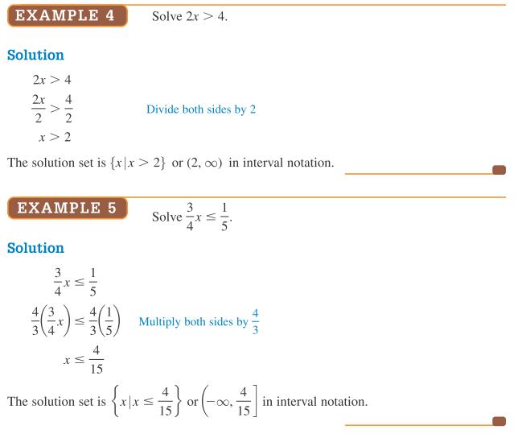
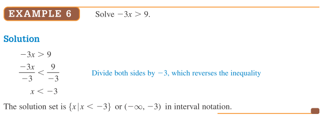
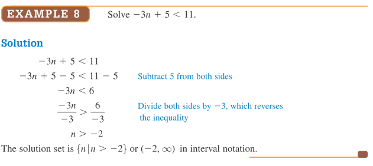

### Compound inequalities

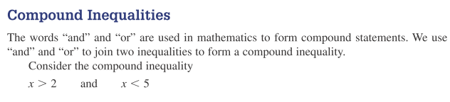
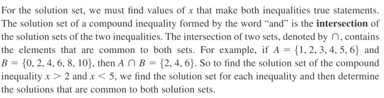
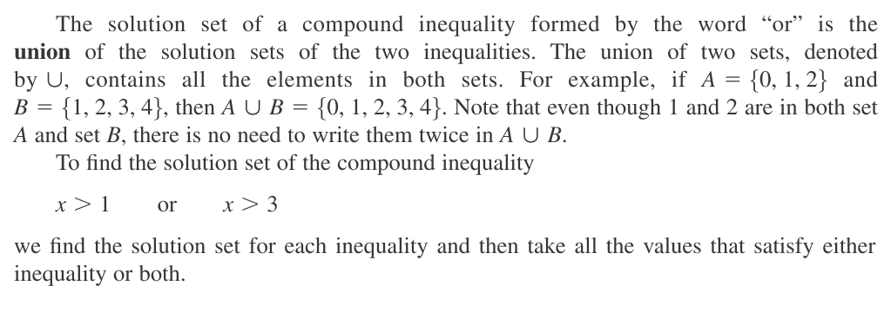

## Exponent rules:

Base, Exponent. Raising the base to the the x^th^ Power.

Kehrwert = reciprocal

Taking the square root of a number results in two possible answers---a
positive

answer and a negative answer. Taking the radical of a number results in
just

the positive square root of the number.

"Cubing" something means you raise it to the third power, or multiply it
by itself three times.

The square root of a negative number is not on a number line, but the

concept is so useful in science that we define the square root of -1 as
the

letter i. The number i is an imaginary number, and anything multiplied
by

i is also an imaginary number.

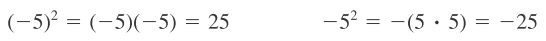

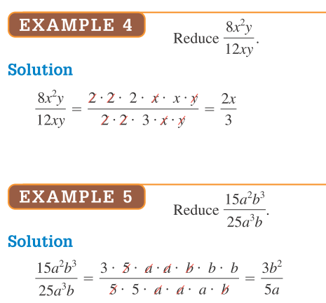

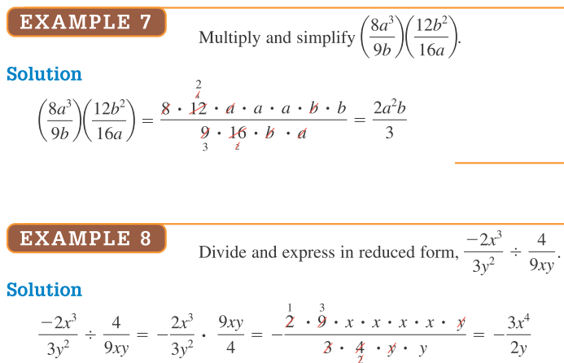

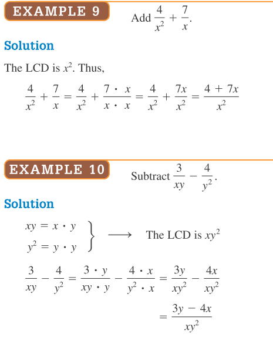

$2^{10}*2^{5\ } = 2^{15}$ $(2*9)^{100} = 2^{100}*9^{100}$

\-\-\-\-\-\-\-\-\-\-\-\-\-\-\-\-\-\-\-\-\-\-\-\-\-\-\-\-\--

$\frac{2^{12}}{2^{5}} = \ 2^{7}$ $4^{- 3} = \frac{1}{64}$

| a number with a negative                                               |
|------------------------------------------------------------------------|
| exponent is just the reciprocal of the number to the positive exponent |

$$a^{m}a^{n} = a^{(m + n\ )}$$

\-\-\-\-\-\-\-\-\-\-\-\-\-\-\-\-\-\-\-\-\-\-\-\-\-\-\-\-\-\--

$2^{10{}^{5}} = 2^{10*5}$ $2^{105}*2^{- 100} = 2^{5}$

\-\-\-\-\-\-\-\-\-\-\-\-\-\-\-\-\-\-\-\-\-\-\-\-\-\-\-\-\-\-\-\--

$4^{\frac{1}{2}} = \ \sqrt{4} = 2$ $27^{\frac{1}{3}} = \sqrt[3]{27 = 3}$

**Negative exponent means take the reciprocal of the base to the
positive exponent**

${\frac{\mathbf{1}}{\mathbf{a}^{\mathbf{n}}}\mathbf{=}\mathbf{a}^{\mathbf{- n}}\mathbf{\ \ \ \ \ \ \ \ \ \ \ \ \ \ \ \ \ \ \ \ \ \ \ \ \ \ \ \ \ \ }\frac{\mathbf{a}^{\mathbf{m}}}{\mathbf{a}^{\mathbf{n}}}\mathbf{=}\mathbf{a}^{\mathbf{m - n}}\ \ \ \ \ \ \ \ \ \ \ \ \ \ \ \ \ \ \ \ \ \ \ \ \ \ \ \ \ \ \ \ \ \ \ \ \ \ \ \ 16}^{- \frac{1}{2}} = {(\frac{1}{16})}^{\frac{1}{2}} = \frac{1^{\frac{1}{2}}}{16^{\frac{1}{2}}} = \frac{1}{4}$

${(\frac{2}{3})}^{- 3} = ({\frac{3}{2})}^{3} = \frac{27}{8}$

\-\-\-\-\-\-\-\-\-\-\-\-\-\-\-\-\-\-\-\-\-\-\-\-\-\-\-\-\-\--

${- 4}^{- 3} = - \frac{1}{4^{3}}^{} = - \frac{1}{64}$
${- 4}^{3} = - 64\ \ \ \ {- 4}^{2} = 1$`<!-- -->`{=html}6

## Radicals= squareroot with non negatives:

$$\sqrt{36} = 6;\ \sqrt{72} = \sqrt{36*2} = {(36*2)}^{\frac{1}{2}} = 36^{\frac{1}{2}}*2^{\frac{1}{2}} = \sqrt{36}*\sqrt{2} = 6*\sqrt{2}$$

## 

## Logarithms: (inverse of taking the exponent of something)

$2^{3} = 8;\ \log_{2}8 = 3$ (log2 8= 2 to what power is equal to 8 )
$\mathbf{\log}_{\mathbf{2}}\mathbf{8}\mathbf{= x;}\mathbf{2}^{\mathbf{x}}\mathbf{= 8}$

$\log_{4}64 = 3\ because\ 4^{3} = 64$ (log base 4 of 64

$$\log_{x}27 = 3;\ x^{3} = 27;3$$

If the base of a log is positive the number needs to be larger than 0
$\ \ \ \ \mathbf{\ }\mathbf{\log}_{\mathbf{3}}\mathbf{- 1}$**=undefined**

**Logarithm properties:**

$$a^{b} = c;\ \log_{a}{c = b}$$

$\log_{B}{A + \log_{B}{C = \log_{B}{A*C}}}$
$\log_{B}A - \ \log_{B}{C = \log_{B}{A/C}}$

$A*\log_{B}{C = \log_{B}C^{A}}$

$$\mathbf{\log}_{\mathbf{B}}{\mathbf{A =}\frac{\mathbf{\log}_{\mathbf{C}}\mathbf{A}}{\mathbf{\log}_{\mathbf{C}}\mathbf{B}}\mathbf{\ \ \ }\mathbf{\log}_{\mathbf{17}}{\mathbf{357 =}\frac{\mathbf{\log}_{\mathbf{10}}\mathbf{357}}{\mathbf{\log}_{\mathbf{10}}\mathbf{17}}\mathbf{\ there\ is\ no\ log}\mathbf{17\ option\ on\ calculator}}}$$

## Line equation:

The slope of a line is the ratio of the vertical change to the
horizontal change as we move from one point on a line to another point.

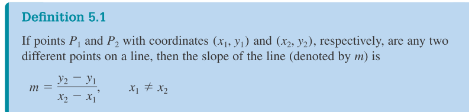

**Y=mx+b (slope\*x + y intercept) slope**=m
=$\frac{\Delta y}{\Delta x}$=$\frac{change\ in\ y}{change\ in\ x} = \frac{rise}{run}$

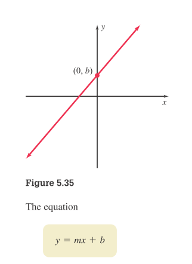

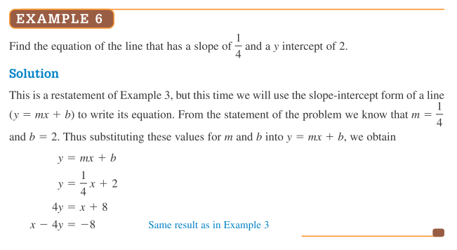

**(5,2) (3,5)** (x,y) =
$\frac{5 - 2}{3 - 5} = \frac{3}{- 2} = - \frac{3}{2}$ = 3 points down =
2 points to the right y=-$\frac{3}{2}x + b$

**B=y intercept**

y=-$\frac{3}{2}x + b$ insert one of the points for x and y=
$2 = - \frac{3*5}{2} + b\ \ \ b = 2 + \frac{15}{2} = \frac{4 + 15}{2}$

**y=**$\mathbf{-}\frac{\mathbf{3}}{\mathbf{2}}\mathbf{x +}\frac{\mathbf{19}}{\mathbf{2}}$

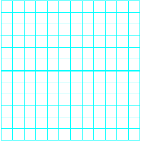

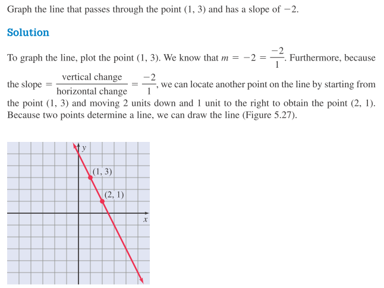

If the slope is downwards (upper left to down right)

Then the coefficient is negative y=-2x+2 (3=coefficient and 2=y axis
intercept)

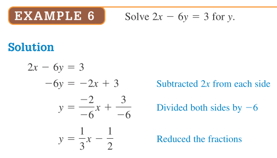

**In general, any equation of the form , where A, B, and C are constants
(A and B not both zero) and x and y are variables, is a linear equation
in two variables, and its graph is a straight line.**

**The statement "any equation of the form Ax + By = C" technically means
"any equation of the form Ax + By = C or equivalent to the form." For
example, the equation y = x + 3, which has a straight line graph, is
equivalent to - x + y = 3.**

**The knowledge that any equation of the form Ax + By = C produces a
straight line graph, along with the fact that two points determine a
straight line, makes graphing linear equations in two variables a simple
process. We merely find two solutions, plot the corresponding points,
and connect the points with a straight line. It is probably wise to find
a third point as a check point.**

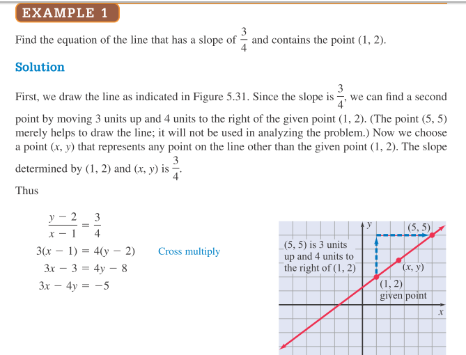

**Point slope form**

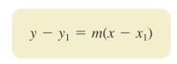

**M=slope**

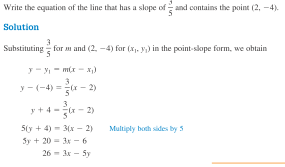

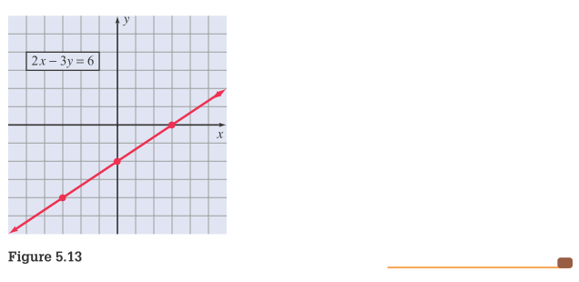

**Systems of equations:**

9x -- 4y= -78

4x + y = -18

When drawing both equations as a graph the solution of both equations
would be the intersection of those lines since it represents a point
that satisfies both equations.

Solve by x:

Make coefficient of y equal by multiplying by 4 (in case if that is not
possible multiply each to have a coefficient that is a common multiple)

4x + y = -18 \| \*4 16x + 4y = -72

9x -- 4y = -18

\-\-\-\-\-\-\-\-\-\-\-\-\-\-\-\-\--

25x = -150 \| /25

X = -6

Set in variable:

4 -\* -6 + y=-18 = -24+y=-18 y=24-18=6 **(-6,6)**

Systems of two linear equations

Suppose we graph x - 2y = 4 and x + 2y = 8 on the same set of axes. The
ordered pair (6, 1), which is associated with the point of intersection
of the two lines, satisfies both equations. In other words, we say that
(6, 1) is the solution for x - 2y = 4 and x + 2y = 8.

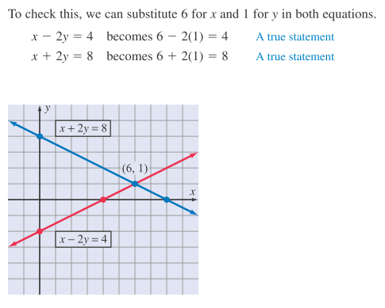

1.  To solve a system of linear equations by graphing, we proceed as in
    the opening discussion of this section. We graph the equations on
    the same set of axes, and then the ordered pairs associated with any
    points of intersection are the solutions to the system.

2.  

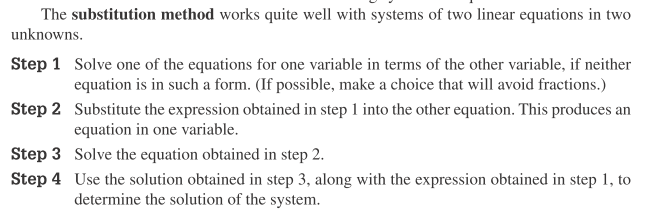
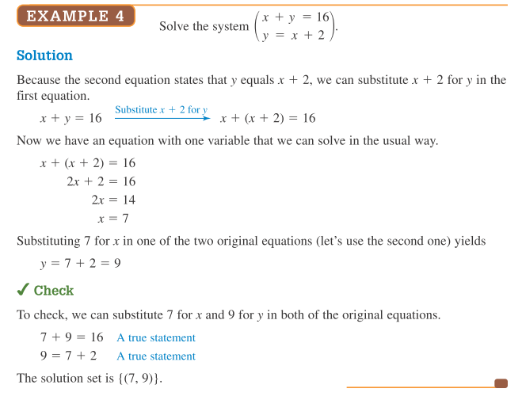

3.  
    
    

## Exponents and Polynomials

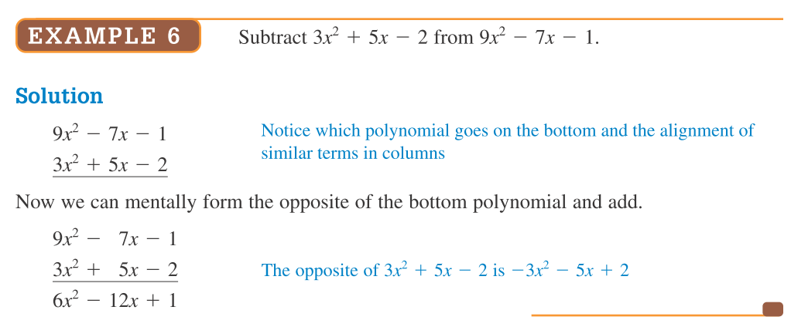

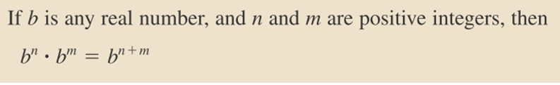
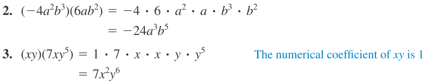

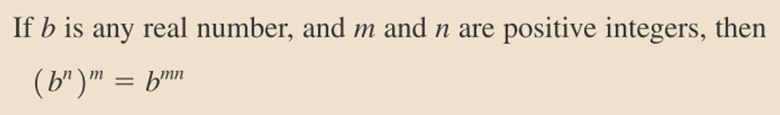

FOIL (First -- Outside -- Inside -- Last)

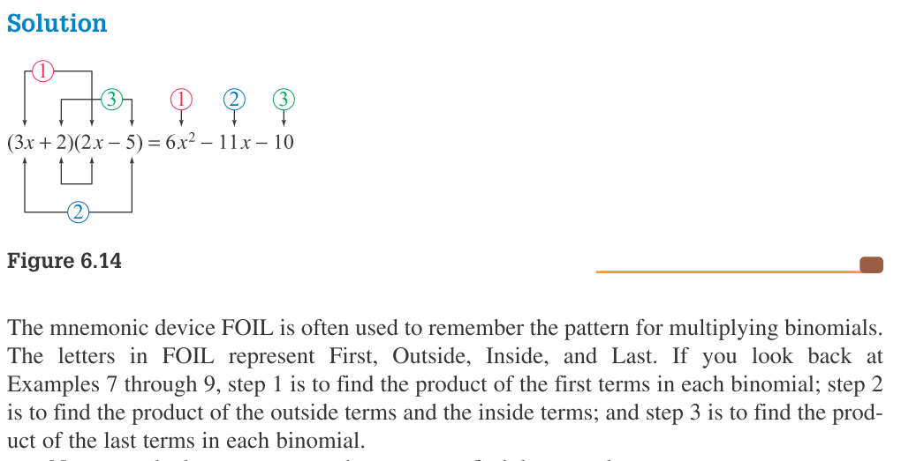

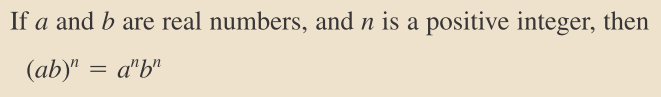
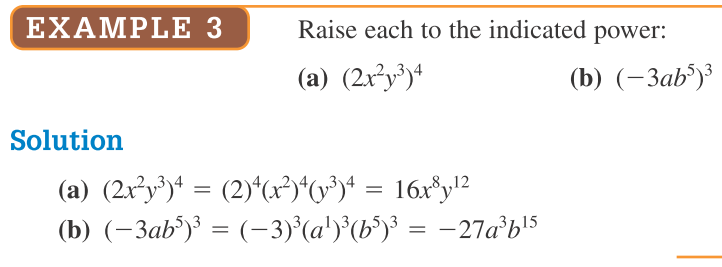

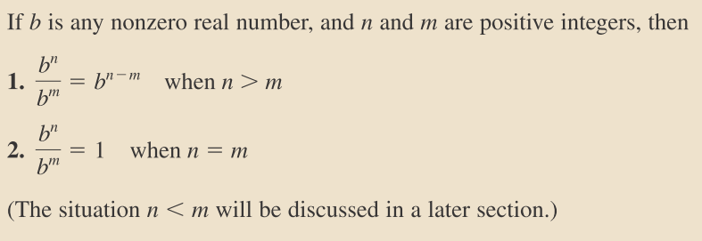
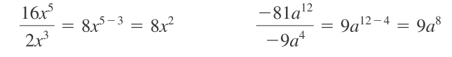
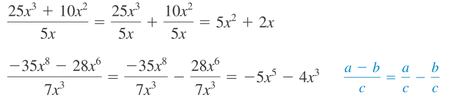
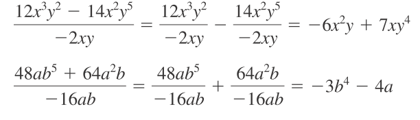

Combination problems

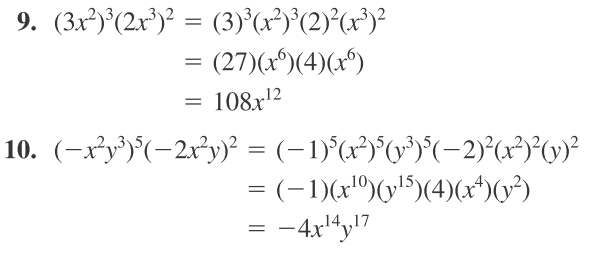
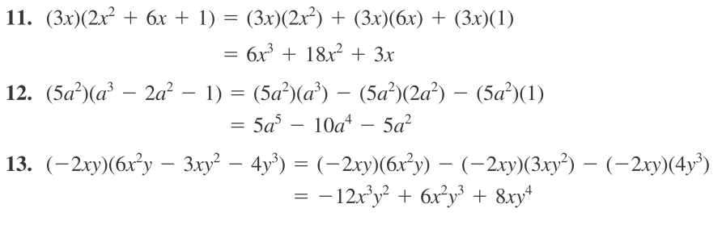

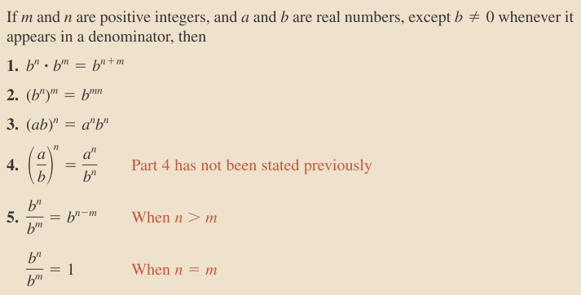

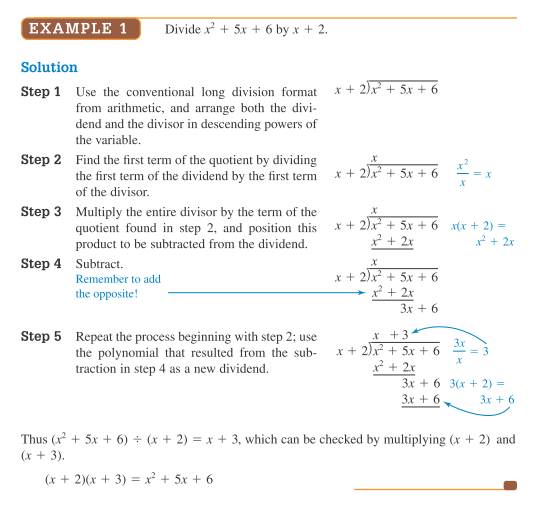

## Scientific notation:

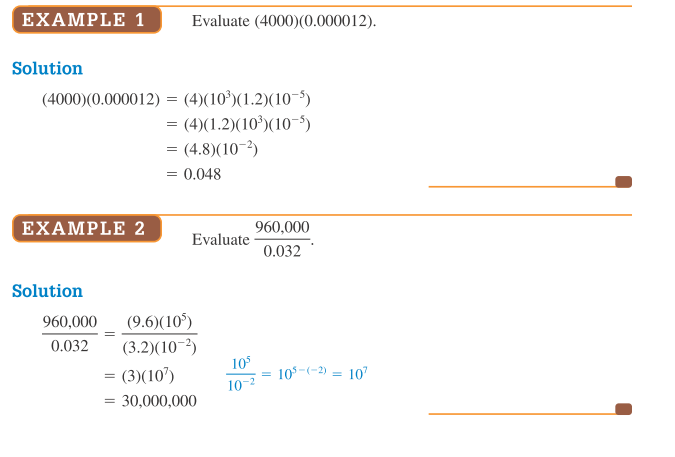

## Factoring

Find the greatest common factor

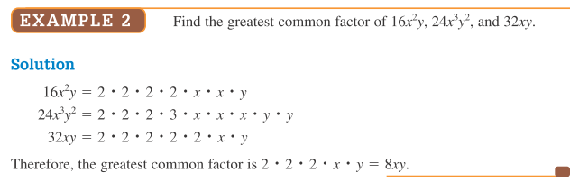

## Summary elementary algebra

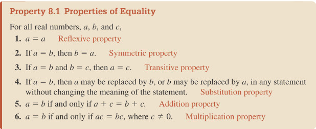

## Fractions

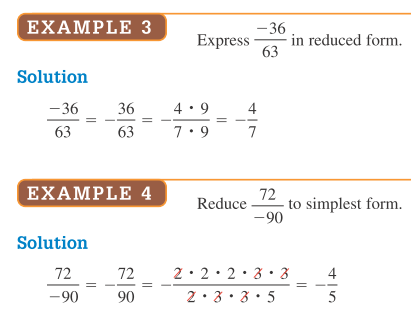
