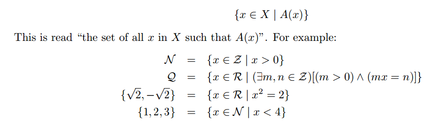
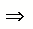
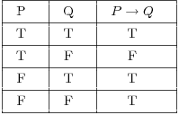

## Sets

N : the set of all natural numbers (i.e., the numbers 1, 2, 3, etc.)

Z : the set of all integers (0 and all positive and negative whole
numbers)

Q : the set of all rational numbers (fractions)

R : the set of all real numbers

## Implication

Implication has a truth and a causation part.

The truth part is called the conditional part.

Implication = Conditional + causation

**In math we focus only on the conditional part**.

A

B

A= Antecedent , B= consequent

Defines the truth of A implies B in terms of truth or falsity of A,B.

P: n \>7

Q: N^2^\>40

(second row of truth table ) T F T = following the real meaning of
implication if P would imply Q then if P would be true Q would have to
be true also therefore if P is true and Q is false the implication is
False.

(third and fourth row): if the antecedent is False then it is easier to
look at a negated implication instead:

P does not imply Q: Is true if even though P is true Q is nevertheless
false. In all other cases it will be false.

Therefore for non negated implication for all other cases the
implication will be True

P implies Q is equivalent to (⌐ P) **Or** Q

| P   | ⌐P  | Q   | P implies Q | ⌐P Or Q |
|-----|-----|-----|-------------|---------|
| T   | F   | T   | T           | T       |
| T   | F   | F   | F           | F       |
| F   | T   | T   | T           | T       |
| F   | T   | F   | T           | T       |

P does not imply Q is equivalent to P **And** ⌐Q

| P   | Q   | ⌐Q  | P implies Q | P does not imply Q | P And ⌐Q |
|-----|-----|-----|-------------|--------------------|----------|
| T   | T   | F   | T           | F                  | F        |
| T   | F   | T   | F           | T                  | T        |
| F   | T   | F   | T           | F                  | F        |
| F   | T   | F   | T           | F                  | F        |

## Equivalence

P and Q is said to equivalent (logically) if each implies the other.

Biconditional P ⇔ Q is an abbreviation of (P ⇒Q) and (Q ⇒ P)

| P   | Q   | P ⇔ Q |
|-----|-----|-------|
| T   | T   | T     |
| T   | F   | F     |
| F   | T   | F     |
| F   | F   | T     |

One way to show that two statements are equivalent is to show that they
have the same truth table.

A:(P And Q) OR (¬ P) is equivalent to B: P ⇒ Q

| P   | Q   | P And Q | ¬ P | (P And Q) OR (¬ Q) | P ⇒ Q (known) |
|-----|-----|---------|-----|--------------------|---------------|
| T   | T   | T       | F   | T                  | T             |
| T   | F   | F       | F   | F                  | F             |
| F   | T   | F       | T   | T                  | T             |
| F   | F   | F       | T   | T                  | T             |

### Equivalence and Implication in Language

The following all means "P implies Q":

1.  If P then Q

2.  P is sufficient for Q

3.  P only if Q

4.  Q if P

5.  Q whenever P

6.  Q is necessary for P

The following all means "P is equivalent to Q":

-   P is necessary and sufficient for Q (statements 2. and 6. from above
    combined)

-   P if and only if Q (statements 3. and 4. From above combined)
    (abbrev. Iff)

## Quantifiers

### There exists... (Existential quantifier ∃)

There is an object X having property P.

There exists a real number x such that x^2^ + 2x + 1 = 0

∃x\[x^2^ + 2x + 1 = 0\] find example that solves equation (-1)

∃x\[x^3^ + 3x + 1 = 0\]

For all...(universal quantifier)

### ∀ x "For all x it is the case that..."

Combinations of quantifiers

There is no largest natural number

(∀ m ∈ ℕ) (∃ n ∈ ℕ) (n \> m)

For all m in the set of natural numbers there exists a natural number n
such that n is greater than m

Swapping quantifiers changes meaning

(∃ n ∈ ℕ) (∀ m ∈ ℕ) (n \> m)

There is a natural number n that is the biggest natural number.

Let A(x) be some property of x (e.g. x is a real root of the equation
x^2^\*2x+1=0)

We show that ⌐(∀x A(x)) is the same as ∃x(⌐A(x))

It's not the case that for all x A(x) is true is the same as saying that
there is an x where A(x) is not true
