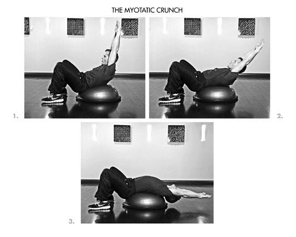
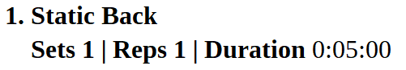
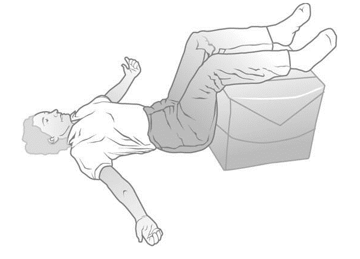
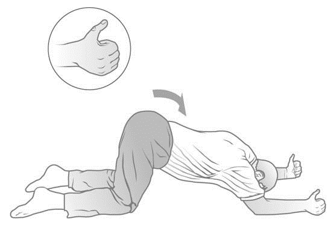
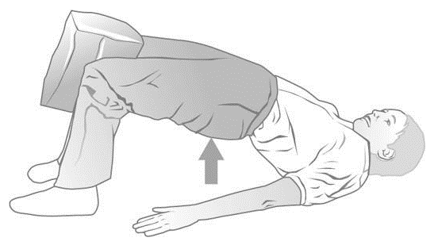
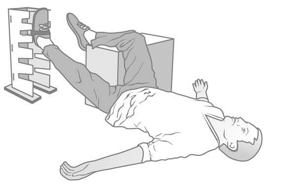
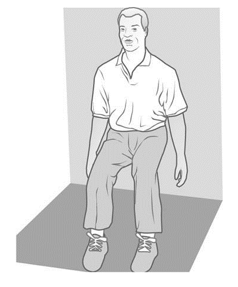

Potassium supplement = Avocado or 99-mg tables

magnesium + calcium

macadamia oil instead of olive oil

dry red wine

breakfast: spinach, 2-3 eggs, lentils

20g protein per meal (30 for breakfast)

no chickpeas

Binge day
=========

-   Eat beans + eggs for breakfast

-   Drink grapefruit juice with coffee afterwards

-   Add lime or lemon juice thought out the day

-   Drink plenty of coffee

-   60--90 seconds of exercises (squad, push-up against table 30-50
    reps.) a few minutes before you eat and, ideally, again about 90
    minutes afterward

    policosanol (10--25 milligrams before bed)

    Alpha-lipoic acid (ALA) 300--900 milligrams total per day.

    GREEN TEA FLAVANOLS (EGCG) Epigallocatechin gallate (EGCG) 325
    milligrams three to four times per day source = decaffeinated green
    tea extract pills

    GARLIC EXTRACT (ALLICIN POTENTIAL, S-ALLYL CYSTEINE)

Policosanol: 20--25 mg

Alpha-lipoic acid: 100--300 mg (I take 300 mg with each meal, but some
people experience acid reflux symptoms with more than 100 mg)

Green tea flavanols (decaffeinated with at least 325 mg EGCG): 325 mg

Garlic extract: 200 mg

Prior to breakfast: AGG

Prior to lunch: AGG

Prior to dinner: AGG

Prior to bed: PAGG

Place an ice pack on the back of the neck or upper trapezius area for
20--30 minutes, preferably in the evening, when insulin sensitivity is
lowest. I place a towel on the couch while writing or watching a movie
and simply lean back against the ice pack.

One and a half teaspoon cinnamon per day.

Eat decent quantities of fat at each larger meal. Saturated fat is fine
if meat is untreated with antibiotics and hormones.

• Spend at least 30 minutes eating lunch and dinner. Breakfasts can be
smaller and thus consumed more quickly.

• Experiment with cinnamon and lemon juice just prior to or during
meals.

Exercise
========

n 2005, my interest in kettlebells reinvigorated, I returned to the
United States from Argentina and purchased one 53-pound kettlebell. I
did nothing more than one set of 75 swings one hour after a light,
protein-rich breakfast, twice a week on Mondays and Fridays. In the
beginning, I couldn't complete 75 consecutive repetitions, so I did
multiple sets with 60 seconds between until I totaled 75.

DAY 1 (MONDAY)

• High-rep kettlebell (53 pounds) two arm kettlebell swings to at least
75 reps (ultimately, I got to 150+ reps in a single set)

• Slow myotatic crunch ([[next
chapter]{.underline}](The_4-Hour_Body_An_Uncommon_Gui_split_063.html#filepos495714))
with max weight x 10--15 slow reps

DAY 2 (WEDNESDAY)

I alternated these two exercises for a total of 3 sets × 5 reps for
each. I took two minutes between all sets and therefore had at least
four minutes between the same exercise (e.g., dumbbell \[DB\] press,
wait two minutes, row, wait two minutes, DB press, etc.):

• Iso-lateral dumbbell incline bench press

• "Yates" bent rows with EZ bar (palms-up grip and bent at the waist
about 20--30 degrees)

Then:

• Reverse "drag" curls using a thick bar twice the diameter of a
standard Olympic bar (I put plates on metal piping I bought from Home
Depot, secured with \$5 pinch clamps): 2 sets of 6 reps, three minutes'
rest between sets

DAY 3 (FRIDAY)

• High-rep kettlebell (53 pounds) swings to 75-rep minimum

• Slow myotatic crunch ([[next
chapter]{.underline}](The_4-Hour_Body_An_Uncommon_Gui_split_063.html#filepos495714))
with max weight x 12--15 reps

Every other week: single-arm kettlebell swings to 25 minimum reps each
side

Based on several months of testing myself and other laptop hunchers, I
can recommend six 80/20 exercises for desk-dwellers' postural
imbalances. For the minimalists who work at home (or who have
understanding coworkers), I suggest performing \#1, \#2, and \#3 after
every two or three hours at a desk or in a sitting position and
performing all five movements at least once per week.

The supine groin progressive, the most inconvenient, unusual, and
time-consuming of the five, is the singular most effective tool I've
found for eliminating psoas and other hip flexor tightness to unlock the
pelvis and relieve hamstring tightness.

https://www.youtube.com/watch?v=rqNnmC09eUU

Lie on your back with your legs up over a block or chair.

2\. Place your arms out to the sides at approximately 45 degrees from
your body with palms up. Touch your thumbs to the floor.

3\. Relax your upper back and ensure your lower back flattens to the
floor evenly from left to right.

4\. Hold this position for five minutes.

**2. Static Extension Position on Elbows**

Sets 1 \| Reps 1 \| Duration 0:01:00

Start on the floor on your hands and knees, ensuring your higher joints
are aligned (i.e., shoulders, elbows, and wrists in a straight line;
hips directly above the knees).

2\. Walk your hands forward about six inches, and then, noting placement
of the hands, replace them with your elbows.

3\. Make a light fist of each hand and pull them away from each other,
pivoting on your elbows and turning the thumbs out.

4\. Push your hips backward toward your heels to place an arch in your
lower back.

5\. Let your head drop down.

6\. Hold for 60 seconds.

**3. Shoulder Bridge with Pillow**

**Sets 1 \| Reps 1 \| Duration 0:01:00**

Lie on your back with your knees bent and your feet pointed straight
ahead.

2\. Place a pillow between your knees and apply a constant pressure
inward while executing the exercise.

3\. Relax your upper body and lift your hips and back up off the floor.

4\. Hold in top position for one minute.

**Active Bridges with Pillow**

**Sets 3 \| Reps 15 \|**

1\. Follow the instructions for the last exercise, but, instead of
holding at the top of the movement, lift your hips as high as you can
and slowly lower them back down. Keep the motion as smooth and
continuous as possible.

2\. Repeat 15 times for three total sets.

**5A. Supine Groin Progressive in Tower**

**https://www.youtube.com/watch?v=W8znRwZP0ME**

**Duration 25 minutes each side**

Lie on the floor with one leg up over a block or chair, bent to 90
degrees (in the illustration, the right leg). Your arms should be out to
your sides at 45 degrees, with palms facing up.

2\. Place the other foot in the boot used with the tower.

3\. Place your booted foot on the tower, starting at the lowest level and
moving it up until an arch begins to form in your lower back. This is
the level where you will complete your first 5 minutes.

4\. Hold until your back is flat on the floor. Pay more attention to the
flattening of your back than the specified time.

5\. After 5 minutes, lower your foot one level on the tower and again
hold.

6\. Continue this until your leg is extended straight out on the lowest
level.

7\. Switch legs and repeat the entire sequence.

**Sets 1 \| Reps 1 \| Duration 0:02:00**

1\. Stand with your back against a wall with feet and knees hip width
apart. Feet point straight ahead.

2\. Walk your feet away from the wall while sliding your body down at the
same time until your knees are bent at 90 degrees. Ensure your ankles
are slightly ahead of your knees. Your lower back should be completely
flat against the wall. Your arms can hang down to your sides, or you can
rest your hands gently on your lap. Keep the weight in your heels and do
not press forward on your toes.

3\. Hold for two minutes.
