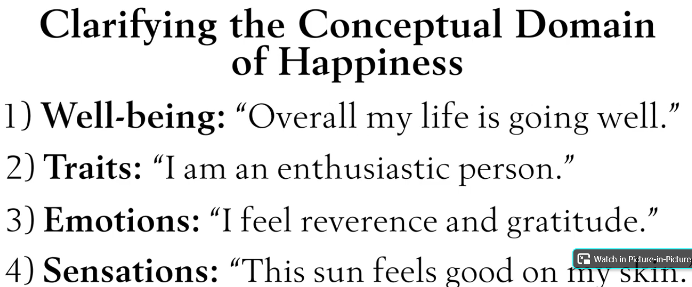
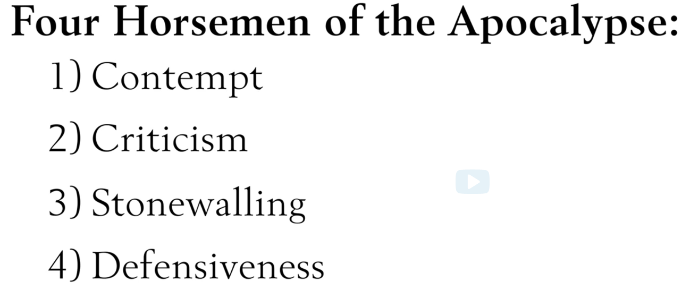
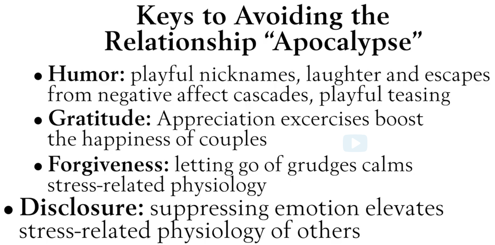
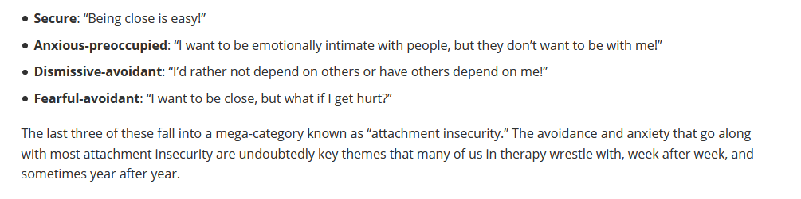
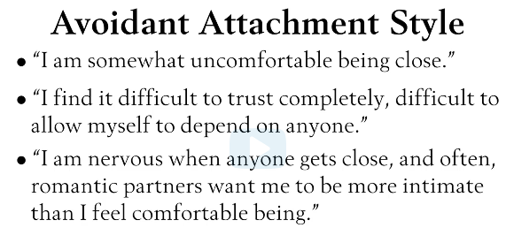
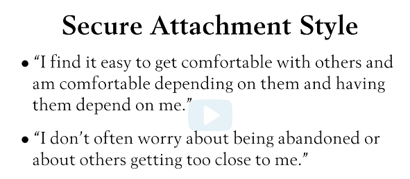
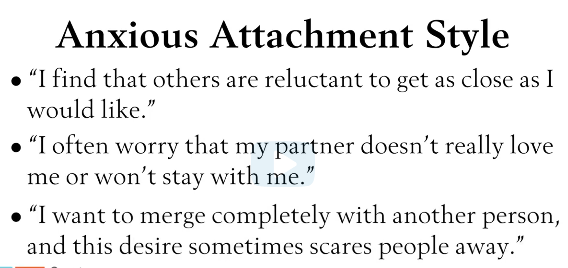
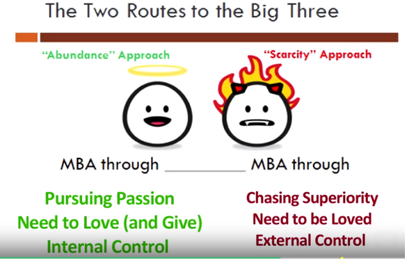

### Based on [\"The Science of Happiness\" (GG101x on edX)](https://www.youtube.com/playlist?list=PL1t8gs-WJprDHaTTZozWnC6O56n9jHD0A) and "A Life of Happiness and Fulfillment" course on coursera (https://www.coursera.org/learn/happiness)

Happy
=====

What can it mean:

Definition: Happiness means being light-hearted and joyful. It means not
taking yourself so seriously that it robs you of the fun of living.

-   "evaluative" (satisfaction with our lives)

-   "hedonic" (positive and negative feelings)

-   "eudaimonic" (meaning in life). 

-   [psychological
    richness](https://link.springer.com/article/10.1007/s42761-020-00011-z).having
    new, interesting experiences that promote curiosity or transform how
    you think.

Books:
------

-   Working Identity Herminia Ibarra

-   The Element Ken Robinson

-   Drive Dan Pink

-   Influence practice and science

Devalue happiness
-----------------

\- even though happiness is considered important it is deprioritized
over other things (salad bar) sacrificing happiness for the sake of
other goals

\- having negative beliefs about happiness

\- will not last

\- makes you lazy

\- failing to define happiness in concrete terms

\- focus on the means rather than the end goal (e.g. money vs.
happiness)

### Habit

Prioritize but do not pursue happiness

Give happiness a higher priority

Define happiness

-   Abundance/joy

-   Love/connection

-   Calm/tranquility (serenity)

> Enjoying the moment at it is without worry about the future or the
> past. Being content with myself and my life.
>
> Believing in the good of people

Chasing superiority
-------------------

Flow happens when the task is not overly demanding but still challenges
you.

### Get a hobby that challenges me and do it 2-3 hours a week

-   Writing

-   Drawing

-   Instrument

### Get more flow in your job

### Express gratitude to people that helped me in my life

The need to be loved -- the need to go it alone
-----------------------------------------------

### Develop healthy relationships

Be neither needy nor avoidant

Usually that are on either spectrum received a lack of love during their
childhood. Be self-compassionate (kind to yourself) and grateful.

Strengthen the need to love and give. (be kind and generous) but also
don't forget about yourself

-   Give in an effective way

-   Give according to your strength and what you like (have fun)

-   Give where it makes a difference (see the impact)

Self-compassionate

Gratitude

Four signs a marriage will not work
-----------------------------------

Based on study of young couple's conversations early in the marriage and
following them for a decade:

Attachment styles
-----------------

The attachment style, resulting from early social experiences, affects
brain responses to positive and negative social input, e.g., a scowl or
a smile in response to failure or success. This data reinforces the
importance of our early social connections to our capacity for strong
social connections\--and thus happiness\--later in life, through the
lens of our nervous system.

Avoidant

Securely attached = more happy

Anxious

Being overly control seeking
----------------------------

-   Control is important and to a certain extent healthy and good

-   Leads to unhappiness since not being able to control leads to
    dissatisfaction and frustration -\> since outcomes are mostly not in
    our control

-   Leads to high willingness to take too much risk

-   Leads to superstition (illusion of control)

-   Leads to obsessive pursuit of passion -\> which can lead to burnout

-   But seeking too much control is not good either

    -   Overly controlling of other people

        -   People like to be in charge rather than being controlled
            (desire of autonomy)

        -   People like to defeat authority

    -   Overly controlling of outcomes

-   Surround yourself with people that are not afraid to disagree
    (otherwise it leads to poor decision making)

-   Surround yourself with people of diverse background and skills

### Take control of your thoughts in order to control your emotions

The desire for external control usually comes from a lack of ability for
internal control (through controlling your feelings through controlling
your thoughts)

when people are stressed, they have a lack of internal control and try
to compensate it through external control (clean up\...)

### Tactics for taking control of your thoughts

-   avoid situations that evoke unwanted feelings

-   labelling emotions

-   direct your attention towards more positive things

-   reinterpret the situation

### Leading a healthy lifestyle

-   appreciate uncertainty and lack of control

-   eat well

-   move well

-   sleep well

Distrust in life and others
---------------------------

### Distrusting Others and Why Trust is Important

-   Generally, people are more trustworthy than expected

-   By trusting others, one increases their chance of happiness by
    building mutual trust in our community

-   You can build a network of trusted people by starting to trust more
    people

-   66 = low end of average level of interpersonal trust in people

-   Smart trust = maximizing benefit of trust while avoiding to get hurt

-   Learn to forgive those who cheated you

-   Make people who violate your trust accountable (no revenge, no
    feeling of superiority)

### Distrusting life

-   Don't rely on outcomes for happiness. A good outcome may lead to
    negative things and a negative outcome may lead to good things

-   Focus on the process rather than the outcome as a source of
    happiness

-   External outcomes only account for 10% of our happiness

-   Genetic propensity = 50%

-   Attitude towards life = 40%

-   Good thing bad thing who knows (story of the guy who wanted to have
    horses)

-   Try to pursue the outcome you desire and enjoy the process

-   Don't judge the outcome after it occurred and accept it, even if it
    > is not the outcome you desired

-   Keep in mind that previously perceived negative outcomes turned into
    > positive ones

-   Look for opportunities that a negative outcome might have

-   Believe that everything happens for a good reason

MBA
---

Mastery 

Belongingness

Autonomy

the approach we take towards the above can be one of scarcity or
abundance.

