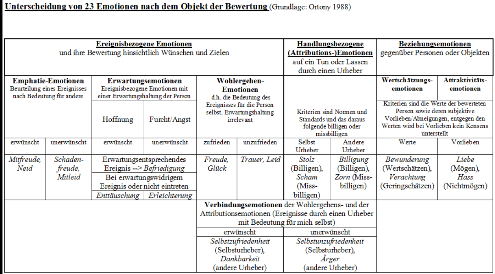

Aristoteles (mit seiner *Nikomachischen Ethik)* 

Thomas von Aquin *(Summe der Theologie). (Thomas Anquinas)*

# Laster und Tugenden (vices and virtues)

**Tugend = Abeleitet von Tauglichkeit/Tüchtigkeit = Gesundheit der
Seele**

**Laster = Abeleitet von schmähen, tadeln, verbieten = Abgeleitet von
lästern = Zur Gewohnheit gewordener Fehler**

**Tugenden -\> Führen zum Glück \| Laster versperren den Weg zum Glück**

**Wenn wir danach streben, im Tun, Sprechen, Denken und Fühlen möglichst
immer tugendhaft zu sein und das Laster und die Leidenschaften zu
verringern und zu meiden, kann sich die Tugend zunehmend von einem
vereinzelten Ereignis zu einer gewohnheitsmäßigen Haltung entwickeln,
freiwillig das Gute zu tun.**

## Mittelweg

## humanistische Liberalismus 

Ohne Geiz, Habgier und Neid gäbe es kein ständig fortschreitendes
Wirtschaftswachstum, keine Triebfeder zur Anhäufung von Kapital, während
sich die Werbung unsere Eitelkeit und Genusssucht eifrig zunutze macht.

Dennoch muss man sich angesichts einer immer weiter fortschreitenden
Ausbeutung der Natur, der schamlosen Geldgier ganzer Wirtschaftszweige,
einer erschreckenden zwischenmenschlichen Entfremdung, der raschen und
unbedachten Bereitschaft zur Ehrverletzung im Alltag sowie einer um sich
greifenden psychischen Destabilisierung des Individuums fragen: **Leben
wir nicht vielleicht in einer ausgesprochen dekadenten Gesellschaft,
deren Grundübel im Fehlen einer Lebensführung besteht, die sich an den
Tugenden orientiert und an dem, was wirklich gut ist, statt lediglich an
dem, was sich gerade gut anfühlt?**

Die westliche Gesellschaft leidet allerdings auch an einer Störung.
**Deren Ursache liegt in der Verwechslung des wirklichen Glücks mit
einer zwanghaften Suche nach dem Ersatzglück in den Lastern. Die
kollektive Gemütsverfassung, die große Teile der kapitalistischen
Gesellschaft erfasst, zeichnet sich durch einen Verlust an Sinn,
Geborgenheit, Lebensfreude und Seelenfrieden aus.**

## autoritäre Fundamentalismus

dogmatischen Vorschriften bezüglich Sitten und Moral, mit
gesellschaftlicher Intoleranz und der Verfolgung Andersdenkender
ersetzen. Doppelmoral -\> moralisches Handeln aus Egoismus.

# Tugend- und Laster

Basierend auf dem Mittelweg (golden rule Aristotetle):

**Tugend als Mittelmaß zwischen zwei einander entgegengesetzten
Lastern.** Die Tugend, die dazwischenliegt, bildet einen Ausgleich zu
diesen beiden Extremen, **nicht unbedingt im Sinne eines Mittelmaßes,
das ein wenig von beiden enthält, sondern eher im Sinne einer Synthese,
welche die Einseitigkeiten der beiden Laster auf einer höheren Ebene
auflöst.** So findet sich zum Beispiel bei einem tugendhaften Menschen
nicht so sehr eine gesunde Mischung zwischen wütendem Jähzorn und
Unempfindlichkeit gegenüber Ärger; vielmehr ist er in der Lage, mit der
Tugend der Geduld und Sanftmut eine Wutreaktion, die automatisch
abläuft, bewusst zu kontrollieren und den auftretenden Ärger auf eine
Weise zu äußern, die andere nicht verletzt.

Jede Tugend kann lediglich vorgespielt und geheuchelt sein. Nur die
echten Tugenden sind dazu in der Lage, das entsprechende Laster zu
überwinden. Verstellung und Heuchelei sind Ausdruck des Lasters der
Ungerechtigkeit und Falschheit, womit der Gerechtigkeit und der
Wahrhaftigkeit -- ähnlich wie der Klugheit und der Weisheit -- eine
gewisse Sonderstellung vor den anderen Tugenden zukommt.

**Es ist ein Irrtum zu glauben, die Tugend sei nicht mit der Erfüllung
angeborener Triebe**, Instinkte und Bedürfnisse vereinbar. Der
Unterschied zwischen einem »Heiligen« und einem »Sünder« besteht nicht
darin, dass der »Heilige« sich von allem Triebhaften fernhält, während
der »Sünder« den natürlichen Leidenschaften freien Lauf lässt.

Ganz im Gegenteil ist ein tugendhafter Mensch kennt den Unterschied
zwischen Lust und Glück und käme nicht auf die Idee, das Glück in der
kurzfristigen Lustbefriedigung zu suchen, was aber nun auch nicht
bedeutet, dass die Lust verboten wäre.

Nicht nur sind die Triebe und Instinkte nichts Schlechtes, vielmehr sind
sie ganz besonders gut, ja heilig, denn sie entspringen dem Leben, das
sich aus der Fülle ergießt. Das gilt für all jene Instinkte, die Freud
als »Lebenstrieb« oder Eros zusammenfasste.

»Das Böse handelt kraft eines mangelnden Gut«, schreibt Thomas von
Aquin. Das Gute ist dem Licht vergleichbar, das Böse der Dunkelheit. Die
Dunkelheit ist nichts anderes als die Abwesenheit des Lichts und somit
eigentlich aus sich selbst heraus nichts. Treffen Licht und Dunkelheit
aufeinander, dann wird die Dunkelheit erhellt, nicht das Licht
verdunkelt. **Wo das Gute ist, kann sich das Böse nicht halten. Doch wo
das Gute fehlt, da breitet das Böse sich aus. Konkret äußert sich das
Böse als Zusammentreffen von bestimmten Lastern mit entsprechenden
Gelegenheiten in der Außenwelt, die destruktives Verhalten begünstigen
(Krieg)**

# Leidenschaften

Die Leidenschaften sind von einer Defizitmotivation bestimmte Triebe,
die aus einem Gefühl der Sinnlosigkeit, der Leere und der
Abgeschiedenheit des Ichs heraus entstehen. Sie streben zwar nach einer
Verwirklichung der unbefriedigten Sehnsucht und nach einer
Wiederherstellung eines Zustandes der Erfüllung und Zufriedenheit,
verhindern dies jedoch gleichzeitig.

## Emotion vs. Gefühle (Emotion vs. Feeling)

Leidenschaften sind nicht das Gleiche wie Gefühle. Kant verglich die
Gefühle mit Wasser, das durch einen Damm bricht, die Leidenschaften aber
mit einem reißenden Strom, der sein Bett tiefer und tiefer gräbt.
Emotionen sind notwendige und hilfreiche Zustände unseres Organismus,
mit denen wir unmittelbar auf Ereignisse reagieren und dadurch zu
erkennen vermögen, ob etwas gut oder schlecht, angenehm oder unangenehm,
wichtig oder unwichtig für uns ist. Dagegen sind die Leidenschaften wie
eine Krankheit, die sich tiefer und tiefer in den Organismus
hineinfrisst, wenn ihr nicht durch entsprechende Heilmittel
entgegengewirkt wird. Werden wir von Leidenschaften gepackt, dann sind
wir nicht mehr wir selbst, sondern handeln wie von einer fremden Macht
besessen.

**Rochefoucauld: »Man mag noch so weit den Leidenschaften entrückt
erscheinen, man ist ebenso gefährdet, von ihnen weggeschwemmt zu werden,
wie zu erkranken, wenn man gesund ist.«**

Meist benutzen wir die gleichen Begriffe, um ein Gefühl und um eine
Leidenschaft zu bezeichnen, obschon es sich dabei eigentlich um
Unterschiedliches handelt. Die Emotion des Stolzes zum Beispiel, die wir
erleben, wenn wir erfolgreich etwas Schwieriges geleistet haben, liegt
in der Nähe des Glücksgefühls und stellt eine positive Bewertung dar.
Dagegen ist Stolz als Leidenschaft mit dem Laster des Hochmuts verbunden
und kann einen Menschen innerlich verzehren, wenn sein Leben
ausschließlich darum kreist, das eigene Ansehen abzusichern.

### Emotion

Emotion hingegen ist eine ex-motion - eine Bewegung von innen nach
aussen. Manche lesen es auch als e-motion - Energie in Bewegung.**Es
geht um Ausdruck, Handlung - und auch um Beurteilung.**

**Emotion ist eine Bewertung dessen, was gefühlt wurde, und wie dies
ausgedrückt wird: der Tee ist heiss - das ist angenehm. Das Essen ist
kalt - das ärgert mich.**

**Emotion** bezeichnet eine Gemütsbewegung im Sinne eines Affektes.
Affekt ist eine besondere Qualität des Fühlens, das durch die bewusste
oder unbewusste Wahrnehmung eines Ereignisses oder einer Situation
ausgelöst wird. Das Wahrnehmen **geht einher mit physiologischen
Veränderungen**, **spezifischen Kognitionen, subjektivem Gefühlserleben
und reaktivem Sozialverhalten. Im Gegensatz zum Gefühl sind Emotionen
als ein Affekt − vom agierenden Individuum aus gesehen − meist nach
außen gerichtet kurz und intensiv. Der Begriff Affekt betrifft im
deutschen Sprachgebiet eine oftmals mit einem Verlust der
Handlungskontrolle einhergehende kurzfristige emotionale Reaktion.**
Physiologische Reaktionen auf Emotionen sind auch mit Messungen
neurophysiologischer Parameter nachzuweisen. Es wurden jedoch keine
Muster physiologischer Reaktionen gefunden, die eine eindeutige Diagnose
einer Emotion erlauben würden.

Emotionen:

-   Freude

-   Wut

-   Ekel

-   Furcht

-   Verachtung

-   Traurigkeit

-   Überraschung

### Gefühl

Ein Gefühl ist, was gefühlt wird, was wahrgenommen wird. Gefühl ist das,
was über die Sinnesorgane an Impulsen und Empfindungen in das
Bewusstsein hinein tritt. Da ist Wärme; da ist Kälte; da ist Hunger; da
ist Angst\...**Ein Gefühl ist ohne Bewertung. Es wird einfach
festgestellt, was da ist, ohne Urteil darüber, ob das gut oder schlecht,
angenehm oder unangenehm sei. Es ist einfach so. Punkt.**

**Fühlen hat eine weibliche, passive Qualität. Es geht um Aufnehmen,
Hingabe und Wahrnehmung.**

Die Emotion oder der Affekt ist vom **Fühlen oder dem Gefühl** zu
unterscheiden. So erfassen die Begriffe des Fühlens oder des Gefühls die
unterschiedlichsten **psychischen Erfahrungen und Reaktionen die sich
beschreiben und damit auch versprachlichen lassen, wie u. a. Liebe,
Angst, Ärger, Komik, Ironie sowie Mitleid, Eifersucht, Furcht, Freude
und Liebe.**

# Vom Laster zur Tugend

Grundvoraussetzung für alles ist Liebe und guter Wille.

## Von der Unvernunft zur Weisheit (Angemessner Einsatz des Verstandes)

<table>
<colgroup>
<col style="width: 27%" />
<col style="width: 24%" />
<col style="width: 18%" />
<col style="width: 29%" />
</colgroup>
<thead>
<tr class="header">
<th>Übermaß</th>
<th>Mangel</th>
<th>Scheintugend</th>
<th>Tugend</th>
</tr>
</thead>
<tbody>
<tr class="odd">
<td>
Unvernunft und Verblendung (übermäßige Selbstischerheit)

<ul>
<li>
Einseitigkeit
</li>
<li>
Kurzsichtigkeit
</li>
<li>
Befangenheit
</li>
<li>
Voreingenommenheit
</li>
<li>
Parteilichkeit
</li>
<li>
Unduldsamkeit
</li>
<li>
Borniertheit
</li>
<li>
Intoleranz
</li>
<li>
Vorurteil
</li>
<li>
Dogmatismus
</li>
<li>
Chauvinismus
</li>
<li>
Fanatismus
</li>
<li>
Wahn
</li>
</ul></td>
<td>
Dummheit und Nachlässigkeit

<ul>
<li>
Unwissenheit
</li>
<li>
Unbesonnenheit
</li>
<li>
Überstürzung
</li>
<li>
Stumpfsinnigkeit
</li>
<li>
Wankelmut
</li>
</ul></td>
<td>Besserwisserei</td>
<td>
Klugheit und Weisheit

<strong>Klugheit</strong> -&gt; durch Einsicht gewonnenes Wissen das
als gut Erkannte zu tun und das als schlecht Erkannte zu lassen

<ul>
<li>
Überlegung - Urteil – Beschluss
</li>
<li>
Mehrere angemessene langfristige Ziele
</li>
<li>
Rat einholen
</li>
<li>
Alle relevanten Informationen einbeziehen
</li>
<li>
Flexibel
</li>
<li>
Risikobereit und schnell handeln wenn nötig
</li>
<li>
Aus Fehlern lernen
</li>
</ul></td>
</tr>
<tr class="even">
<td>
Gegenmittel:

<ul>
<li>
Offenheit
</li>
<li>
Erkenntnisfähigkeit
</li>
<li>
sapere aude, »Habe den Mut, dich deines eigenen Verstandes zu
bedienen«.
</li>
<li></li>
</ul></td>
<td>
Gegenmittel:

Nicht zu bequem, zu eingebildet oder ist intellektuell zu beschränkt,
sein um sich in seinen Handlungen durch kluge Überlegungen leiten zu
lassen.
</td>
<td></td>
<td>
<strong>Weisheit -</strong> Wer weise ist, ist zugleich klug,
aber nicht jeder, der klug ist, ist auch weise. Wer weise ist, vermag
über alles richtig zu urteilen. Weisheit beruht auf Erkenntnis und guten
Willen. Weisheit ist ein vollkom-menes Zusammenspiel zwischen Geist und
Charakter, zwischen Wissen und Tun.

Voraussetzung für Weisheit:

<ul>
<li>
Abwesenheit von Laster und Leidenschaft
</li>
</ul>
<ul>
<li>
Wissbegierde
</li>
<li>
Freude am Lernen (Anwenden)
</li>
<li>
Kreativität
</li>
<li>
Geistige Offenheit
</li>
<li>
Demut
</li>
</ul></td>
</tr>
</tbody>
</table>

Der Mensch ist fähig zur Einsicht. Durch den Intellekt gehen wir über
reine Sinnestätigkeit hinaus und sehen in das innere Wesen der Dinge
hinein. Der Verstand befähigt, den eigenen Standpunkt zu verlassen und
einen anderen einzunehmen (zu verstehen).

### Vernunft:

**Den Verstand für das zu benutzen was (langfristig) zu meinem (und
meiner Mitmenschen) besten Wohl führt.**

Der Mensch ist dann vernünftig, wenn seine verschiedenen psychischen
Kräfte und Fähigkeiten geregelt zusammenspielen und auf die
Verwirklichung eines höheren Ziels und einer gesunden, förderlichen
Entwicklung ausgerichtet sind. Verstand und Vernunft sind somit nicht
das Gleiche. Der Verstand als Teilaspekt der psychischen Fähigkeiten
lässt sich sowohl vernünftig als auch unvernünftig gebrauchen.

## Von der Falschheit zur Wahrhaftigkeit

<table>
<colgroup>
<col style="width: 27%" />
<col style="width: 24%" />
<col style="width: 18%" />
<col style="width: 29%" />
</colgroup>
<thead>
<tr class="header">
<th>Übermaß</th>
<th>Mangel</th>
<th>Scheintugend</th>
<th>Tugend</th>
</tr>
</thead>
<tbody>
<tr class="odd">
<td>
Ungerechtigkeit und Falscheit

<strong>Ungerechtigkeit -&gt;</strong> Bewusste und willentlichen
Grenzüberschreitung, die jemandem etwas Gutes wegnimmt oder etwas
Schlechtes zufügt, ohne dass diese Person es verdient hätte. Warum?
Täter wollen keine Gerechtigkeit wollen oder bedenken die Folgen ihrer
Taten nicht.

Gerechtigkeit ohne Liebe kann in Grausamkeit enden.

<ul>
<li>
öffentlich beschimpften
</li>
<li>
hinter dem Rücken reden
</li>
<li>
verspotten
</li>
<li>
Physisches verletzen
</li>
<li>
Stehlen
</li>
<li>
Betrügen
</li>
</ul></td>
<td>Gewissenslosigkeit</td>
<td>Scheinheiligkeit und Spießertum</td>
<td>
Gerechtigkeit und Wahrhaft

Nicht nur nach eigenen Bedürfnissen handeln sonder bewusst sein, dass
jedes Geschöpf bestimmte Rechte besitzt.

<strong>Gerechtigkeit:</strong>

<ul>
<li>
Ausgleichende: Beziehungen einzelner zueinander
</li>
<li>
Austeilende: Beziehungen des sozialen Ganzen zu den einzelnen
(Staat)
</li>
<li>
Gesetzliche: Beziehungen der einzelnen zum sozialen
Ganzen
</li>
</ul>

Freundlichkeit, Dankbarkeit, Freigebigkeit, Fairness, Respekt
gegenüber den Eltern
</td>
</tr>
<tr class="even">
<td><strong>Falscheit -&gt;</strong> Täuschung, Lügen, Heuchlei,
Prahlerei, Manipulation, Hinterhalt, Verrat, Verlogenheit, List,
Unaufrichtig gegenüber sich selbst. Die Warheit wird erkannt aber
absichtlich verdreht. Sich selbst etwas vormachen.</td>
<td></td>
<td></td>
<td>
<strong>Wahrhaftigkeit</strong> -&gt; Ehrlichkeit

Der äußere Ausdruck entspricht dem inneren Sein -&gt; Authentizität.
Umgekehrt bedeutet authentisch zu leben jedoch nicht, dass man alles,
was man innerlich erlebt, ungefiltert nach außen kommuniziert.

Ein wahrhafter Mensch kann nicht lügen, weil er nicht irgendetwas
anderes sein kann, als er ist.

Persönliche Integrität:

<ul>
<li>
Handeln basierend auf Werten (Idealen)
</li>
<li>
Zu Überzeugungen stehen
</li>
<li>
Andere mit Respekt
</li>
<li>
Keine Falschheit
</li>
<li>
Rechtes Reden und Handeln
</li>
</ul></td>
</tr>
</tbody>
</table>

## Vom Hochmut zur Demut

<table>
<colgroup>
<col style="width: 27%" />
<col style="width: 24%" />
<col style="width: 18%" />
<col style="width: 29%" />
</colgroup>
<thead>
<tr class="header">
<th>Übermaß</th>
<th>Mangel</th>
<th>Scheintugend</th>
<th>Tugend</th>
</tr>
</thead>
<tbody>
<tr class="odd">
<td>
Hochmut (Arroganz) und Stolz

Beide sind anmaßend, arrogant und überheblich. Hochmut -&gt; unkluge
Fehleinschätzung des eigenen Seins und Könnens.

Stolz -&gt; eigenen Vorzüge werden richtig erkannt, doch auf unkluge
und ungerechte Weise benutzt. Schwer zu beurteilen, ob jemand zu Recht
auf einen Vorzug stolz ist oder ob er diesen nur hochmütig
vorspielt.

Durch ein betont »cooles« Gehabe (rar machen), wird versucht, sich
selbst und die eigene Referenzgruppe als außergewöhnlich
darzustellen.

<ul>
<li>
<strong>Ansicht, das Gute komme aus einem
selbst</strong>
</li>
<li>
<strong>Glauben, das von Gott Gegebene erhalte man aufgrund
eigener Verdienste</strong>
</li>
<li>
Prahlerei, etwas zu besitzen, das man gar nicht hat
</li>
<li>
Anschein, den man sich selbst gibt: im Streben nach dem eigenen
Vorrang
</li>
</ul></td>
<td>
Selbstverachtung, Unterwürfigket

Bescheidenheit und Demut befreien und lösen ruhige, zufriedene
Gefühle aus. Unterwürfigkeit dagegen führt zu Anspannung, zu Scham und
Frustration. Wer sich nie zutraut, <strong>offen zu seiner Meinung zu
stehen, seine Wünsche zu äußern, für seine Bedürfnisse einzustehen oder
sich bei Ungerechtigkeiten zur Wehr zu setzen</strong>, erstickt den
natürlichen Impuls des Ichs, seine eigenen Grenzen zu wahren.
</td>
<td>
Falsche Bescheidenheit

Wenn jemand bescheiden feststellt, Ehre und Lob wären ihm nicht
wichtig, ein kleines Wort des Dankes würde schon genügen, verrät dieser
als Bescheidenheit getarnte enttäuschte Wunsch nach Anerkennung, dass
sich dieser Mensch in seinem Hochmut darin gefällt, innerlich auf all
die Undankbaren hinabzublicken.
</td>
<td>
Demut/Bescheidenheit und Seelengröße

Wahre Demut erwartet weder Lohn noch Dank, denn sie geschieht aus
Freude und Liebe, die sich selbst Lohn genug sind.

Demut:

<ul>
<li>
Sich nicht aufblasen
</li>
<li>
Zugeben dass man sich irren kann
</li>
<li>
wissen, dass man die meisten Gaben, als unverdientes Geschenk
erhalten hat
</li>
<li>
nicht zu eingebildet, um den Anteil anderer an ihren Verdiensten
dankbar anzuerkennen
</li>
<li>
glauben nicht, dass sie ein größeres Stück des Kuchens verdienten
als andere, nur weil sie sich mehr anstrengen oder besser
aussehen
</li>
</ul></td>
</tr>
<tr class="even">
<td>
Eine andere Strategie, sich einen Vorrang zu sichern, wählt
derjenige, der versucht, andere offen herabzusetzen, sie zu
kritisieren,

Eitelkeit -&gt; übertriebenen Sorge um die eigenen Vorzüge.

Während der Eitle äußere Ehrenzeichen leidenschaftlich begehrt, der
Hochmütige sie rücksichtslos fordert, verschmäht sie der Stolze

Ehrgeiz -&gt; Im Sinne von Gier nach Ehre

Töchtern der Ruhmsucht

<ul>
<li>
Unfolgsamkeit
</li>
<li>
Prahlerei
</li>
<li>
Heuchelei
</li>
<li>
Zanksucht
</li>
<li>
Rechthaberei
</li>
</ul></td>
<td></td>
<td></td>
<td>
Großsinnigkeit -&gt; sich aufgrund der eigener Gaben großer Dinge
für würdig halten. Sie schätzt andere dann gering ein, wenn sie
scheinbar keinerlei Gaben besitzen oder diese nicht nutzen.

Demut -&gt; sich selbst in Anbetracht der eigenen Unzulänglichkeiten
gering schätzen und andere wegen der ihnen verliehenen Gaben hoch.

Seelengröße verhindert es, dass die Demut in Selbstverachtung und
Unterwürfigkeit abgleitet, während die Demut verhindert, dass sich die
Seelengröße zu Hochmut und Stolz aufbläht. Eigennutz abzulegen macht es
möglich, anderen Menschen freiwillig und mit Freuden zu dienen, nicht
aus feiger Unterwürfigkeit, sondern aus Achtung und Liebe. Wir müssen
uns nicht mehr mit anderen vergleichen und nicht mehr abwägen, wer den
größeren Nutzen davonträgt. Wir müssen nicht mehr stolz an unserer
Version der Wahrheit festhalten und benötigen keine Nahrung für den
Hochmut, indem wir uns trotzig im Recht wissen wollen.
</td>
</tr>
</tbody>
</table>

### Demut

Exkurs: Die zwölf Stufen der Demut

Selbstlosigkeit zu erlernen ist eine lebenslange Herausforderung. Der
Begründer des abendländischen Mönchstums, Benedikt von Nursia,
beschreibt im siebten Kapitel seiner Regel zwölf Stufen der Demut, Die
ersten Schritte in der Entwicklung der Demut beziehen sich somit auf die
richtige spirituelle Verankerung. Je höher wir steigen, desto mehr
verkörpert sich die Demut auch bis hinab ins Leibliche.

1\. Gottesfurcht: Die Gottesfurcht ist somit nichts anders als
unbedingte Liebe zu Gott, wozu die Stärke notwendig ist, **stets das
Gute zu tun und das Böse zu meiden.**

2\. Willenlosigkeit: Auf der zweiten Stufe soll man den eigenen **Willen
nicht lieben und sich nicht in der Befriedigung seiner Wünsche
gefallen**. Statt eifrig immer neue Ziele zu verfolgen, die nur dem
eigenen Stolz dienen, ermöglicht **das Loslassen der aktiven
Willenstätigkeit eine Öffnung für das reale Leben, das größer und
schöner ist, als sich das kleine Ich erträumen könnte.**

3\. Gehorsam: Gehorsam im spirituellen Sinn bedeutet **die Fähigkeit,
auf die innere Stimme zu horchen.** Der Gehorsam ermöglicht es, dass
**dasjenige, das klein ist, sich demjenigen unterordnet, das groß ist.**
Dadurch wird der Hochmut unmöglich gemacht, denn dieser beruht auf einer
Verwechslung des Kleinen mit dem Großen. Wir **öffnen uns für die
hilfreiche Führung durch andere Menschen, die auf dem Pfad der Demut
vielleicht schon weiter vorangeschritten sind.**

4\. Geduld: Die vierte Stufe der Demut ermöglicht es, **widrige Umstände
geduldig anzunehmen, sie als notwendige Prüfungen zu verstehen und sogar
still und selbstbeherrscht auszuharren, wenn einem Unrecht getan wurde.
Ohne zu ermatten oder uns zu entziehen, entwickeln wir die Fähigkeit zur
geduldigen Akzeptanz, indem wir versuchen, den Wert aller Ereignisse zu
ergründen, auch der unangenehmen und schmerzhaften.**

5\. Wahrhaftigkeit: **Statt dass wir uns selbst etwas vormachen und
anderen etwas vorspielen, sind wir bereit, ehrlich unsere
Unzulänglichkeiten anzuschauen und uns stets zu fragen, ob wir Unrecht
getan haben. Indem wir unsere Mängel einer Person des Vertrauens offen
mitteilen, verstecken wir uns nicht, sondern entwickeln den Mut zur
Authentizität und Integrität.**

6\. Bescheidenheit Es geht vielmehr darum, seinen maßlosen **Egoismus
zurückzunehmen und sich nicht zu scheuen, auch kleine, glanzlose
Arbeiten ohne Aussicht auf Ruhm zufrieden und heiter auszuführen. Auch
niedrige Arbeiten können Spaß machen. Auch einfache Lebensverhältnisse
können beglücken. So stellt sich langsam die Fähigkeit zur heiteren
Genügsamkeit ein.**

7\. Selbstlosigkeit: Hier entwickelt sich **die Fähigkeit, seine ganze
ichbezogene Persönlichkeit mit ihrem Anspruch auf Durchsetzung,
Kontrolle und Macht loszulassen**. Das Ich **verzichtet auf jegliche
Anspruchshaltung sowie auf Verteidigung**..

8\. Lernbereitschaft: Es geht um **die Fähigkeit und den Willen, von
denjenigen zu lernen, die mehr wissen und erlebt haben als ich, die
weiser und demütiger sind. Dies schließt auch die Bereitschaft ein, sich
für neue und zunächst vielleicht ungewohnte Dinge zu öffnen, anstatt
alles immer besser zu wissen und nur das hören und lernen zu wollen, was
man ohnehin schon weiß.**

9\. Schweigen: **sich von der ständig kommentierenden und alles besser
wissenden Stimme des urteilenden Verstandes zu distanzieren und still zu
werden, um die leise Stimme des Herzens besser zu hören. Zugleich führt
das Schweigen im zwischenmenschlichen Verkehr dazu, dass man sich mit
Urteilen erst einmal zurückhält, um möglichst unvoreingenommen
hinzuhören.**

10\. Ernsthaftigkeit: **Nur eine ruhige, ernsthafte Haltung macht es
möglich, dass die Demut auch bis in den Körper hinein vordringen kann.
Aus der stillen Ernsthaftigkeit und Tiefsinnigkeit heraus kann dann aber
durchaus Humor entstehen, und es darf auch lautes, herzhaftes Lachen
ertönen. Es ist dies ein ganz anderer, feinfühligerer Humor, Ausdruck
einer heiteren Seele und eines gelösten Leibes.**

11\. Ruhige Rede: Benedikt empfiehlt eine **ruhige, bescheidene Rede und
dass man nur wenig und wohlbedacht sprechen soll. Statt loszulärmen,
drauflos zu plappern und pausenlos zu schnattern, verbreitet der
demütige Mensch mit seiner Rede eine Stimmung um sich herum, die andere
in die Stille und in die Demut einlädt**.

12\. Verneigung: **Als bewusste Geste und Übung kann aber das Verneigen
des Hauptes noch tiefer in die Demut hineinführen. Indem ich mich vor
allem, was größer ist als ich, verneige, kann ich alles geduldig
annehmen und bin vollkommen zufrieden. Das Sich-Verneigen in Demut als
innere Grundhaltung des gesamten Lebens führt mit der Zeit zu einer
vollkommenen Entspannung im Körper, die zugleich von Energie und
Lebendigkeit erfüllt ist.**

### Seelengröße

-   Selbstwert

-   Optimismums

-   Hoffnung

-   Selbstvertrauen, Vertauen darauf, dass man etwas beeinflussen kann

-   Zielorientierung (Realismus, Energie, Mut)

## Vom Neid zur Dankbarkeit

<table>
<colgroup>
<col style="width: 27%" />
<col style="width: 24%" />
<col style="width: 18%" />
<col style="width: 29%" />
</colgroup>
<thead>
<tr class="header">
<th>Übermaß</th>
<th>Mangel</th>
<th>Scheintugend</th>
<th>Tugend</th>
</tr>
</thead>
<tbody>
<tr class="odd">
<td>
Neid und Eifersucht

Verbunden mit Vorstellungen des Ungenügens und des Mangels

Neid -&gt; Die Person oder Gruppe, mit der ein Neider sich
vergleicht, kommt besser weg als er selbst.

Der Begriff Missgunst bezeichnet die weniger schlimme Form des
Neides. Bei der schlimmeren Form sprechen wir von
Schadenfreude.
</td>
<td>Selbstüberhöhung</td>
<td>
Moralische Entrüstung

Man empört sich nicht deshalb über die Lasterhaftigkeit anderer
Menschen, weil man sich aufrichtig um ihr Wohlergehen sorgt oder weil
man selbst ein so leuchtendes Beispiel für Tugendhaftigkeit abgibt,
sondern um dem verzehrenden Neid oder der nagenden Eifersucht Luft zu
verschaffen. »Moralische Entrüstung ist Eifersucht mit einem
Heiligenschein«
</td>
<td>
Dankbarkeit und Großherzigkeit (Güte)

Der Grund für die Herzensgröße gütiger Menschen ist ihre Dankbarkeit.
Großherzige Menschen schauen nicht auf das, was sie nicht besitzen oder
nicht sind, sondern sind zutiefst für alles Gute dankbar, das ihnen
geschenkt wird.

Ein dankbarer Mensch vergisst nie, was ihm Gutes widerfährt. Eine
schonungslose Analyse des eigenen Neides kann dazu beitragen, sich mit
der Zeit immer mehr vom Neid zu lösen und eine Haltung der Dankbarkeit
einzunehmen. Der Weg von einem missgünstigen Dasein zur Dankbarkeit
führt über die Akzeptanz eigener Gefühle des Neides oder der
Eifersucht.
</td>
</tr>
<tr class="even">
<td>
Eifersucht -&gt; »Eifersucht ist eine Leidenschaft, die mit Eifer
sucht, was Leiden schafft.«

Als Emotion erleben wir Eifersucht, wenn wir meinen, seitens einer
Drittperson nicht genügend Aufmerksamkeit oder Zuneigung zu erhalten,
während scheinbar eine andere Person, von der wir ausgestochen werden,
in einem höheren Maße durch die Drittperson begünstigt wird.
</td>
<td></td>
<td></td>
<td>
<strong>Ein Leben, das sich am Sein statt am Haben ausrichtet,
betrachtet das Dasein stets vom Standpunkt der Ewigkeit aus – im Wissen
darum, dass jeglicher Besitz wieder verloren geht, es sei denn, der
Besitz kann im eigenen Herzen aufbewahrt werden.</strong>

Die Dankbarkeit über das eigene Dasein führt zum Wunsch, anderen
Menschen mit Nächstenliebe, mit Mitgefühl, Freundschaft, Sympathie und
ohne Vorurteile oder Egoismus zu begegnen.
</td>
</tr>
</tbody>
</table>

## Vom Jähzorn zur Sanftmut

<table>
<colgroup>
<col style="width: 27%" />
<col style="width: 24%" />
<col style="width: 18%" />
<col style="width: 29%" />
</colgroup>
<thead>
<tr class="header">
<th>Übermaß</th>
<th>Mangel</th>
<th>Scheintugend</th>
<th>Tugend</th>
</tr>
</thead>
<tbody>
<tr class="odd">
<td>
Jähzorn und Grausamkeit

Jähzorn -&gt; aggressiven Gefühlsausbruch, der plötzlich und
unvermittelt (»jäh«) aus kleinstem Anlass gegenüber Personen oder Dingen
auftritt.

<ul>
<li>
Streiterei
</li>
<li>
Ärger, Wut, Zorn
</li>
<li>
Rache
</li>
<li>
Beschimpfung, Lärmerei
</li>
<li>
Abstoßung
</li>
<li>
Fluchen
</li>
<li>
Unfreundlichkeit oder Unverträglichkeit.
</li>
</ul>

Feindschaft, Hass, Rachsucht, Grausamkeit -&gt; Wer hasst,
verabscheut nicht nur einen Menschen, sondern möchte ihm auch schaden.
Hass entspringt oft anderen Lastern, insbesondere dem Neid, dem
gekränkten Ehrgeiz oder der Eifersucht. <strong>Ohne vorangehende Liebe
kann Hass nämlich gar nicht auftreten.</strong>
</td>
<td>Aggressionshemmung, Unerzürnbarkeit</td>
<td>Falsche Friedfertigkeit gespielte Freundlichkeit</td>
<td>
Sanftmut (Milde) und Freundlichkeit

<ul>
<li>
<strong>Friedfertig</strong>
</li>
<li>
<strong>Empathie</strong>
</li>
<li>
<strong>Respekt</strong>
</li>
<li>
<strong>Vergebung</strong>
</li>
<li>
<strong>Gelassenheit</strong>
</li>
<li>
<strong>Ruhe</strong>
</li>
</ul>

<strong>Friedfertigkeit &lt;&gt; Schwäche Aggressivität &lt;&gt;
Stärke</strong>

Freundlichkeit -&gt; ein freundlicher Mensch ist allen gegenüber
rücksichtsvoll, taktvoll und höflich, auch gegenüber Personen, die er
nicht mag.
</td>
</tr>
</tbody>
</table>

### Zorn in Sanftmut umwandeln

Bei der Verwandlung des Zornes ist es ganz besonders wichtig, seine
eigenen Erlebnisse und Reaktionen ganz genau und möglichst
unvoreingenommen zu beobachten. Hass und Rachsucht sind oft der traurige
Endpunkt einer langen Entwicklung.

Jähzornigen Reaktionen geht praktisch immer ein leiser, unterdrückter
Ärger voraus.

Diese erste leise Ärgerreaktion sollte man als Signal dafür wahrnehmen
und schätzen lernen, dass man sich in seinem Respekt herabgesetzt, in
seinen Grenzen verletzt fühlt und eine bestimmte Äußerung oder Handlung
als ungerecht erlebt. **Wenn es gelingt, diese frühe, oft berechtigte
Ärgerreaktion wahrzunehmen und das Gefühl auf angemessene Weise
auszudrücken, nicht aggressiv und verletzend, sondern selbstbewusst und
respektvoll, dann kann ein weiteres Aufschaukeln unterbrochen und eine
Zornesexplosion verhindert werden. Tatsächlich stellt der Ärger oft eine
gesunde Reaktion auf Übergriffe und Verletzungen dar, weitaus
angemessener als ein niedergeschlagener und ängstlicher Rückzug.**

**Einfach ungehemmt »Dampf abzulassen«, seinen Ärger und seinen Zorn
ungefiltert »abzureagieren«, verstärkt diese Gefühle nur noch weiter und
lässt die Hemmschwelle für zukünftige aggressive Ausbrüche sinken**;
stattdessen ist ein kluger Umgang mit dem Ärger erforderlich. Mit der
Selbstbeobachtung in Situationen, in denen man sich ärgert, sollte eine
Art Selbstgespräch einhergehen, indem man sich Fragen wie die folgenden
stellt: **Was macht mich am meisten wütend? Wieso bin ich gerade auf
diese Person zornig? Was verletzt mich so sehr? Gäbe es eine
Möglichkeit, meine negativen Gefühle angemessen auszudrücken?**

Es geht nun darum, diesen **Dialog mit sich selbst bewusst neu zu
gestalten. Statt dass wir weiter Öl ins Feuer gießen und uns in den Zorn
hineinsteigern, lernen wir, uns selbst zu beruhigen und Kontrolle über
die Situation zu erlangen. So können eingefahrene Denkmuster, die Wut,
Zorn und Rachgier zur Folge haben, langsam abgebaut und durch
sanftmütigere und friedlichere Reaktionen ersetzt werden.**

-   **Ärger direkt und knapp mitteilen (»das macht mich wahnsinnig
    ärgerlich«)**

-   **auf globale negative Zuschreibungen verzichten**

-   **Kritik nur ganz spezifisch äußern (»weil du mich einfach ignoriert
    hast«)**

-   **die Position des andere verstehen durch geduldiges und tolerantes
    zuhören**

-   **identifiziere unausgesprochene Forderungen an andere oder an das
    Leben die uns frustrieren, weil sie nicht erfüllt werden**

**Man darf und soll sich ärgern, aber so, dass man weder sich noch
andere schädigt und kein neues Unrecht schafft.**

## Vom Trübsinn zum Fleiß

<table>
<colgroup>
<col style="width: 27%" />
<col style="width: 24%" />
<col style="width: 18%" />
<col style="width: 29%" />
</colgroup>
<thead>
<tr class="header">
<th>Übermaß</th>
<th>Mangel</th>
<th>Scheintugend</th>
<th>Tugend</th>
</tr>
</thead>
<tbody>
<tr class="odd">
<td>
Trübsinn und Lustlosigkeit

<ul>
<li>
Stress
</li>
<li>
Depression
</li>
<li>
Schlappheit
</li>
<li>
Müdigkeit
</li>
<li>
Unzufriedenheit
</li>
<li>
Überdruss
</li>
<li>
innere Unruhe/Leere
</li>
<li>
Gleichgültigkeit und Ignoranz
</li>
<li>
Ziellos
</li>
<li>
Kummer
</li>
<li>
Selbstmitleid
</li>
</ul>

Kummer und Trübsinn sind somit die Folge einer Frustration, die wegen
der Unbeständigkeit und Vergänglichkeit aller materiellen Dinge
eintritt.
</td>
<td>
Agitiertheit, Zerstreuung

Party-Gesellschaft -&gt; Krampf-hafte Ausgelassenheit gespielte
Freude,

Suche nach Zerstreuung, Ablenkung, oberflächlicher Unterhaltung und
Stimulation sind nichts anderes als die unruhige Kehrseite von Trübsinn
und Überdruss.
</td>
<td>Übertriebener Arbeitseifer, demonstrative Ausgelassenheit</td>
<td>
Hoffnung und Fleiß

<ul>
<li>
Hauptsächlich im Hier und Jetzt sein
</li>
<li>
Kein Selbstmitleid
</li>
<li>
Humor
</li>
<li>
Den Überdruss heilen Standhaftigkeit und dass man alles mit
großer Sorgfalt, Gottesfurcht und Ausdauer tut.
</li>
<li>
Kleine positive Ziele setzen
</li>
<li>
Geduld/Ausdauer -&gt; achtsames verweilen in der
Gegenwart
</li>
</ul></td>
</tr>
</tbody>
</table>

## Von der Ängstlichkeit zum Mut

<table>
<colgroup>
<col style="width: 27%" />
<col style="width: 24%" />
<col style="width: 18%" />
<col style="width: 29%" />
</colgroup>
<thead>
<tr class="header">
<th>Übermaß</th>
<th>Mangel</th>
<th>Scheintugend</th>
<th>Tugend</th>
</tr>
</thead>
<tbody>
<tr class="odd">
<td>
Ängstlichkeit und Feigheit

Übertriebene Vermeidung von Risiken

Peinlichkeit/Scham

ie gleiche Person kann sich in unterschiedlichen Situationen einmal
als mutig, dann als feige erweisen, und beides kann klug sein, wenn die
zu erwartenden Ergebnisse der verschiedenen Handlungsalternativen
abgewogen werden. Draufgängerisches Handeln ist nicht immer klug,
während »Feigheit nicht selten auf guten Informationen beruht«, wie der
englische Schauspieler Peter Ustinov bemerkte.

<strong>Herrschaft der Mehrzahl fördert Passivität und
Kleinmut</strong>
</td>
<td>Furchtlosigkeit, Schamlosigkeit</td>
<td>Tollkühnheit und Vermessenheit</td>
<td>
Mut und Gelassenheit

Mutig ist, wer sich trotz Risiken und Widerwärtigkeiten auf eine
Gefahr einlässt, weil er sich davon einen großen Gewinn erhofft.

<strong>Mut -&gt; überlegte und hoffnungsvolle Selbsthingabe aus
Liebe.</strong>

<strong>Mut zeigt sich nicht nur im aktiven Tun (Energie), sondern
auch im unerschütterlichen Festhalten (Standhaftigkeit) an dem, was
wesentlich ist, und im Loslassen (Gelassenheit) dessen, was ich nicht
mehr festhalten kann oder will</strong>
</td>
</tr>
</tbody>
</table>

## Vom Geiz zur Großzügigkeit

<table>
<colgroup>
<col style="width: 27%" />
<col style="width: 24%" />
<col style="width: 18%" />
<col style="width: 29%" />
</colgroup>
<thead>
<tr class="header">
<th>Übermaß</th>
<th>Mangel</th>
<th>Scheintugend</th>
<th>Tugend</th>
</tr>
</thead>
<tbody>
<tr class="odd">
<td>
Habgier und Verschwendungssucht

Habgier -&gt; suchtartiges Streben nach materiellem Besitz,
weitgehend unabhängig von dessen tatsächlichem Nutzen

»Habsucht ist nichts anderes als Völlerei mittels unverdaulicher
Güter«, schreibt Sofsky
</td>
<td>
Geiz (Sparsucht), mangelnder Erwerbstrieb

Geiz -&gt; übertriebene Sparsamkeit und Unwillen, etwas von seinem
Besitz herzugeben.
</td>
<td>
Falsche Freigiebigkeit, geheuchelte Bedürfnislosigkeit

nur deshalb von seinem Besitz hergibt, um als großzügiger Wohltäter
zu erscheinen
</td>
<td>
Großzügigkeit, Armut und Nicht-Anhaften

Die Haltung, den Besitz nicht so wichtig zu nehmen, lässt sich am
besten einüben, indem man wertvolle Dinge loslässt und verschenkt. Durch
bewusste Freigebigkeit lässt man andere am eigenen Besitz Anteil haben
und verleiht dadurch zwei wichtigen Tatsachen Ausdruck:

<ul>
<li>
materielle Besitz ist nur geliehen (spätestens beim Tod
zurückgeben)
</li>
<li>
Beziehung zu den Menschen, mit denen man teilt, einen ungleich
höheren Wert hat als der materielle Besitz, den man ihnen
schenkt.
</li>
</ul>

Ein freigebiger Mensch ist sich bewusst, dass sich das Rad des
Schicksals beständig dreht. Sogar wenn er nur wenig besitzt, denkt er
immer noch daran, was er anderen geben kann.

<strong>Geld und andere wertvolle Dinge bewusst spenden und
verschenken, nicht wahl- und ziellos, sondern so, dass wirklich etwas
Gutes und Sinnvolles bewirkt wird.</strong>

<strong>Der Unterschied zwischen Geben und Nehmen ist unwichtig
geworden. Vollkommen entspannt öffnet sich das Herz für die
unermessliche Fülle des Daseins.</strong>
</td>
</tr>
</tbody>
</table>

## Von der Genusssucht zur Ausgeglichenheit

<table>
<colgroup>
<col style="width: 27%" />
<col style="width: 24%" />
<col style="width: 18%" />
<col style="width: 29%" />
</colgroup>
<thead>
<tr class="header">
<th>Übermaß</th>
<th>Mangel</th>
<th>Scheintugend</th>
<th>Tugend</th>
</tr>
</thead>
<tbody>
<tr class="odd">
<td>
Wollust und Genussucht

die Bedürfnisbefriedigung übersteigt das sozial akzeptierte
Maß
</td>
<td>
Lustfeindlichkeit, Empfindungslosigkeit

Abstumpfung des Geistes
</td>
<td>Vorgespielte Zucht</td>
<td>
Ausgeglichenheit und Harmonie

Mäßigkeit

Sinnliches geniessen

Das Schöne geniessens

Im Zustand der Nüchternheit nimmt der Organismus nicht mehr und nicht
weniger auf, als er braucht. Statt dass Fantasien und Lüste alles mit
sich reißen, verhilft die Nüchternheit zu einer festen Verankerung in
der Realität und im Moment.
</td>
</tr>
</tbody>
</table>
