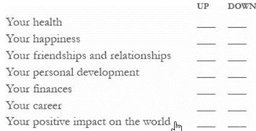

***The difficult is what takes a little time; the impossible is what
takes a little longer.***

In each area of my life, did I do those things that are easy to do, and
easy not to do? Did I continue my momentum on the success curve?"

Time is the force that magnifies those simple daily disciplines into
massive success.

There is a natural progression to success: plant, cultivate,
harvest---and the central step, *cultivate,* can only happen over the
course of time.

No genuine success in life is instant. Life is not a clickable link.

To grasp how the slight edge works, you have to view your actions
through the eyes of time.

**Success is not the key to happiness. Happiness is the key to success**

Daily:

-   **Each morning, write down three things you're grateful for.** Not
    the same three every day; find three *new* things to write about.
    That trains your brain to search your circumstances and hunt for the
    positive.

<!-- -->

-   **Journal for two minutes a day about one positive experience you've
    had over the past twenty-four hours.** Write down every detail you
    can remember; this causes your brain to literally reexperience the
    experience, which doubles its positive impact.

<!-- -->

-   **Meditate daily.** Nothing fancy; just stop all activity, relax,
    and watch your breath go in and out for two minutes. This trains
    your brain to focus where you want it to, and not get distracted by
    negativity in your environment.

<!-- -->

-   **Do a random act of kindness over the course of each day.** To make
    this simple, Shawn often recommends a specific act of kindness: at
    the start of each day, take two minutes to

<!-- -->

-   write an email to someone you know praising them or thanking them
    for something they did.

<!-- -->

-   **Exercise for fifteen minutes daily.** Simple cardio, even a brisk
    walk, has a powerful antidepressant impact, in many cases stronger
    (and more long-lasting) than an actual antidepressant!

*The Happiness Advantage*, Shawn Achor

*Before Happiness*, Shawn Achor

*As a Man Thinketh*, James Allen

*Multiple Streams of Income*, Robert G. Allen

*The Automatic Millionaire*, David Bach

*Start Over, Finish Rich*, David Bach

*The Go-Giver*, Bob Burg and John David Mann

*Go-Givers Sell More*, Bob Burg and John David Mann

*It's Not About You*, Bob Burg and John David Mann

*The Aladdin Factor*, Jack Canfield and Mark Victor Hansen

*How to Win Friends and Influence People*, Dale Carnegie

*Acres of Diamonds*, Russell H. Conwell

*The Richest Man in Babylon*, George S. Clason

*The 7 Habits of Highly Effective People*, Stephen R. Covey

*The Power of Habit: Why We Do What We Do in Life and Business*, Charles
Duhigg

*Positivity*, Barbara Fredrickson

*Outliers*, Malcolm Gladwell

*The Dip*, Seth Godin

*Think and Grow Rich*, Napoleon Hill

*Delivering Happiness*, Tony Hsieh

*Conversations with Millionaires*, Mike Litman, Jason Oman, et al.

*The How of Happiness*, Sonja Lyubomirsky

*The Myths of Happiness*, Sonja Lyubomirsky

*The Greatest Salesman in the World*, Og Mandino

*Failing Forward*, John C. Maxwell

*The Power of Positive Thinking*, Norman Vincent Peale

*Drive: The Surprising Truth about What Motivates Us*, Daniel Pink

*Cultivating an Unshakable Character*, Jim Rohn

*Seven Strategies for Wealth and Happiness*, Jim Rohn

*The Art of Exceptional Living*, Jim Rohn

*The Challenge to Succeed*, Jim Rohn

*The Five Major Pieces to the Life Puzzle*, Jim Rohn

*The Seasons of Life*, Jim Rohn

*The Happiness Project*, Gretchen Rubin

*The Magic of Thinking Big*, David Schwartz

*Authentic Happiness*, Martin Seligman

*Flourish*, Martin Seligman

*Little Things Matter*, Todd Smith

*The Millionaire Next Door*, Thomas J. Stanley and William D. Danko

*SUCCESS for Teens: Real Teens Talk about Using the Slight Edge*, The
Success Foundation

*21 Success Secrets of Self-Made Millionaires*, Brian Tracy

*The Thank You Economy*, Gary Vaynerchuk

*The Science of Getting Rich*, Wallace D. Wattles
