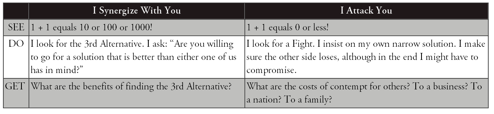

Synergy
=======

**Most conflicts are two-sided (Black or White). The 1st Alternative is
my way, the 2nd Alternative is your way. By synergizing, we can go on to
a 3rd Alternative---our way, a higher and better way to resolve the
conflict.**

-   Without synergy: 1 + 1 \< 2

-   With synergy: 1 + 1 \> 2

**The natural principle that the whole is greater than the sum of the
parts. Rather than going my way or your way, we take the path of synergy
to higher and more productive results. You and I together are far
greater than we are alone.**

**Our paradigms govern our behavior, which in turn governs the
consequences of our actions. We GET results based on what we DO, and
what we DO depends on how we SEE the world around us.**

4 step process of 3rd alternative thinking
------------------------------------------

**To arrive at a 3rd Alternative, I must first practice self-awareness
and value the different viewpoint that you represent. Then I must seek
to understand that viewpoint thoroughly. Only then can we move up to
synergy.**

### I see myself

Seeing myself as a unique human being capable of independent judgment
and action. I am not merely "my side" of a controversy. I am more than
the sum of my prejudices, party, and preconceptions. My thoughts are not
predetermined by my family, my culture, or my company. I can mentally
stand apart from myself and evaluate how my paradigms are influencing my
actions.

I see myself as a creative, self-aware human being who is more than the
"side" I favor in a conflict. I might share certain beliefs or belong to
certain groups, but these do not define me. I choose my own "story."

-   What's my story? Do I need to change the script?

-   Where might I have blind spots about myself?

-   How has my cultural programming influenced my thinking?

-   What are my real motives?

-   Are my assumptions accurate?

-   In what ways are my assumptions incomplete?

-   Am I contributing to an outcome---an end to the story---that I
    really want?

### I see you

This is about seeing others as people instead of things. When we look at
others, what do we see? Do we see an individual, or do we see age,
gender, race, politics, religion, disability, national origin, or sexual
orientation? Do we see a member of an "out group" or an "in group"? Or
do we really see the uniqueness, the power, the gifts of every diverse
individual?

**I See You. I see a whole human being unlike any other, a person of
innate worth, endowed with talents, passions, and strengths that are
irreplaceable. You are more than your "side" in a conflict. You deserve
dignity and my respect.**

### I seek you out

This paradigm is about deliberately seeking out conflicting views
instead of avoiding or defending yourself against them.

**If a person of your intelligence and competence and commitment
disagrees with me, then there must be something to your disagreement
that I don't understand, and I need to understand it. You have a
perspective, a frame of reference I need to look at.**

**Instead of seeing your different viewpoint as a threat, I avidly seek
to learn from you. If a person of your character and intelligence
differs from me, I need to listen to you. I listen empathically until I
genuinely understand you.**

**The heart of each one is tender, and when we touch that tenderness, we
are in a sacred place.**

"I Seek You Out" starts with the principle that truth is complicated and
that everybody likely has a little slice of it. "Truth is never pure and
rarely simple," said Oscar Wilde. No one has it all. 3rd Alternative
thinkers recognize that the more slices of truth they have, the more
they see things as they really are. So these thinkers deliberately seek
out different slices of truth. If you have truth that I don't have, why
wouldn't I come and find you so you can teach me?

#### Talking stick

The Talking Stick. An ancient Native American tradition, the Talking
Stick is a symbol of peaceful communication. So long as the speaker
holds the stick in hand, no one may interrupt until the speaker feels
heard and understood.

*Whoever holds the Talking Stick has within his hands the sacred power
of words. Only he can speak while he holds the stick; the other council
members must remain silent. The eagle feather tied to the Talking Stick
gives him the courage and wisdom to speak truthfully and wisely. The
rabbit fur on the end of the stick reminds him that his words must come
from his heart and that they must be soft and warm. The blue stone will
remind him that the Great Spirit hears the message of his heart as well
as the words he speaks. The shell, iridescent and ever changing, reminds
him that all creation changes---the days, the seasons, the years---and
people and situations change, too. The four colors of beads---yellow for
the sunrise (east), red for the sunset (west), white for the snow
(north) and green for the earth (south)---are symbolic of the powers of
the universe he has* *in his hands at the moment to speak what is in his
heart. Attached to the stick are strands of hair from the great buffalo.
He who speaks may do so with the power and strength of this great
animal.*

**Empathic Listening**. In a conflict, we are usually thinking about our
own rebuttals and responses while the other person talks. We can't hear
each other through that "wall." By contrast, an empathic listener seeks
to understand the thoughts and feelings of the other.

**Unless you've understood me, with my points and my feelings so well
that you could make my argument for me---you haven't actually heard
anything.**

In the paradigm "I Seek You Out," I argue with you to try out ideas, not
to impose them. I use argument as a vehicle for learning, not as a
weapon. My purpose is not to score points on you in the weary old game
of one-upmanship but to change the game.

#### Steps

-   Go to the other side and say, "You see things differently. I need to
    listen to you."

-   Pay the price to understand. Give your full attention. Don't
    multitask while you're listening. Don't judge, evaluate, analyze,
    advise, toss in your footnotes, commiserate, critique, or quarrel.
    The speakers don't need you on their side. All they need is your
    positive regard for them.

-   Be quiet. You don't have to provide an answer, a verdict, a
    solution, or a "fix." Free yourself from all that pressure. Just sit
    back and listen.

-   Speak only to keep the flow going. Say things like "Tell me more,"
    "Go on," or just "Hm."

-   Pay close attention to emotions. Affirm feelings: "You must feel
    (sorry, angry, hurt, worn out, anxious, disappointed, baffled,
    confused, betrayed, unsure, suspicious, skeptical, worried,
    frustrated) about this."

-   Use a Talking Stick---literally or figuratively---if that will help.

-   Remember, you're listening to a story. When you go to a movie, you
    don't interrupt and argue with the story and talk back to the
    screen. (If you do, you'll be asked to leave---and good riddance!)
    You're involved, your sense of reality is suspended, you're almost
    in a trance.

-   Be ready to learn. If you're open, you'll gain insights that will
    light up your own mind and complement your own perspective. Changing
    your viewpoint due to more data is natural---it is not a sign of
    weakness.

-   Make sure you really do understand. If necessary, tell the story
    back to the storyteller. Restate what you thought you heard. Talk
    about the feelings you perceived. Ask if he feels that you have
    thoroughly understood where he's coming from. If not, try again
    until he is satisfied.

-   **Show some gratitude. It's a great compliment to be invited into
    the mind and heart of another human being. And it's a real benefit
    to you because you've grasped a slice of truth you didn't understand
    before.**

### I Synergize With You

This last paradigm is about going for a solution that's better than
anyone has thought of before, rather than getting caught up in the cycle
of attacking one another. Once we understand each other fully, we are in
a position to go for synergy, to find a solution that is better than
anything we've come up with individually. Synergy is rapid, creative,
collaborative problem solving.

#### Steps to synergy

#####  Step 1: Ask the 3rd Alternative Question

The first step in the synergy process is to ask the 3rd Alternative
Question: "Are you willing to go for a solution that is better than
either one of us has in mind?"

##### Step 2: Define Criteria of Success

##### Step 3. Create 3rd Alternatives

##### Step 4: Arrive at Synergy

Values
======

1.  Beware of pride. Let go of needing always to be "right." Your grasp
    on reality is always partial anyway. Allow yourself to achieve the
    important breakthroughs in relationships and creative solutions that
    will never likely be realized if you stubbornly hold on to being
    "right."

2.  Learn to say "I'm sorry." Do it quickly once you realize you've
    fallen short or hurt someone. Be sincere and don't hold back. And
    don't go just half way. Apologize fully, take responsibility, and
    express your desire to understand.

3.  Be quick to forgive perceived slights. Remember, you choose whether
    or not to be offended. If you feel offended, let it go.

4.  Make and keep very small promises to yourself and others. Take baby
    steps. As you create a pattern of doing so, make and keep bigger
    promises. Your own integrity will become your greatest source of
    security and strength.

5.  Spend time in nature. Go on long walks. Create space in your life
    every day for reflection on the synergies of the world around you.

6.  Read widely---it's one of the best ways to make mental connections
    and get insights that can lead to 3rd Alternatives.

7.  Exercise often, each day if possible; and eat healthy food, with
    balance and moderation. The body is the instrument of the mind and
    spirit.

8.  Get enough sleep, at least 7 to 8 hours daily. Science tells us that
    the brain grows new connections during sleep, which is why we often
    awake with sparkling new ideas. And you'll find yourself so much
    more able to give the emotional, mental, and spiritual energy needed
    to create 3^rd^ Alternatives.

9.  Study inspiring or sacred literature. Ponder, meditate, or pray.
    Insights will come.

10. Make quiet time for yourself to think through creative 3rd
    Alternative solutions to your challenges.

11. Express love and appreciation to those with whom you associate.
    Listen empathically to them. Devote time to learning about them,
    what is important to them, what is their story.

12. You have two ears and one mouth: use them proportionally.

13. Practice being generous with others---with your time, your heart,
    your forgiveness, and your affirmation. Be wise and generous in
    sharing your resources with those in need. Be generous with and
    forgive yourself. We all have weakness. We all have strength. Look
    to the future and move on. All these things will cultivate within
    you a spirit of abundance.

14. Avoid comparing yourself to others. Just don't. You are unique. You
    are of infinite worth and have great potential. Define your own
    exceptional mission in life. Just be true to it, be yourself, and
    serve others and the world simply and magnificently!

15. Be grateful. Express it.

16. Learn to become enthusiastically relentless about discovering how to
    create great wins for others---wins that increase their peace, their
    happiness, and their prosperity. It will become infectious, and you
    may often find others seeking the same for you. This is the key to
    producing remarkable synergies.

17. When things aren't going well, take a break, take a walk around the
    block, get a good night's sleep, and come back at it with the
    freshness and perspective of a new day.

18. If you truly can't reach win-win, remember that "no deal" in some
    cases is the best alternative.

19. When it comes to other people, their reactions, their weaknesses,
    and peculiarities, just smile a lot. And when it comes to your
    teenagers, remind yourself, "This, too, shall pass."

20. Never stop believing in the possibility of the 3rd Alternative.
