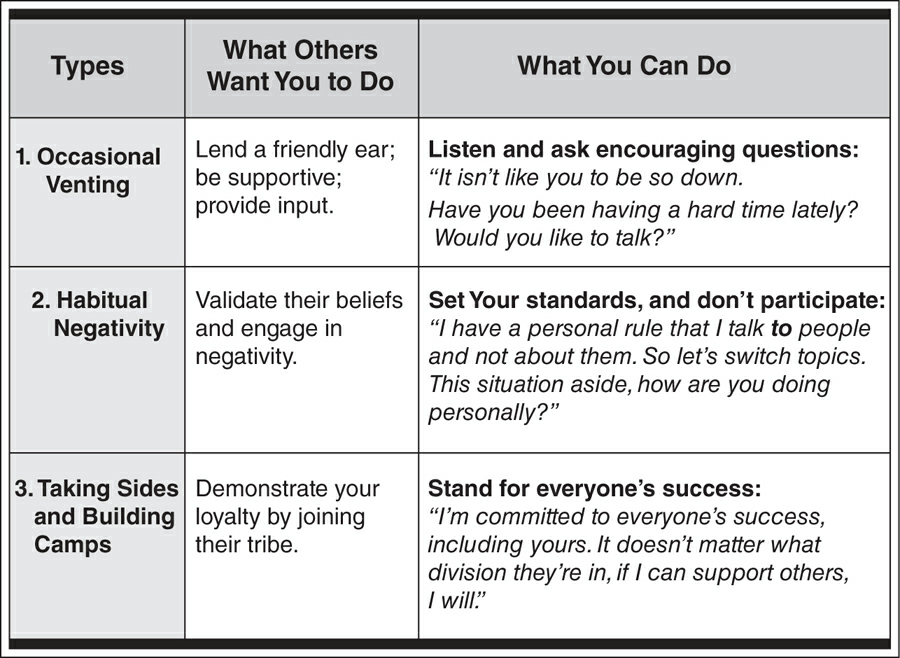

## Be 100% Accountable---Rise Above Circumstances

The three holes that we become trapped in are these:

-   Hole 1. Forming a rigid outlook

Perhaps you've experienced this "us-versus-them" divide such as
marketing versus sales, managers versus staff, or senior leaders versus
everyone else. Once you decide that certain individuals or groups fit a
negative label such as untrustworthy, incompetent, or controlling, you
give yourself permission to blame them as the cause of your frustrations
or disappointments.

-   Hole 2. Needing to be right

Are you aware of times when your need to be right is more important to
you than your need to be effective? When egos dominate, people lock
horns in contests over who's right. Collaboration comes to a standstill,
and relationships die.

-   Hole 3. Believing that you are powerless to change anything

This third hole, resignation, occurs when you feel you have exhausted
everything you can do. At this point, you become paralyzed with the
belief that nothing is ever going to change. You continue to put in
effort, but you make an unconscious decision to work around a person or
a situation. You continue blindly down a path where you tolerate
negative situations instead of resolving them.

By treating the relationship as something that you can't influence or
change, you lower your own standards and give up your power.

**Stop Digging Holes and Start Building Bridges**

How can you be taken seriously if your words and actions don't line up
with your beliefs? How can you gain respect if you blame other people
for your failures? How can you wield influence if you work around people
and don't resolve differences? The straight answer: you can't.

To reach the height of your personal power, you must be 100%
accountable, even when others take zero accountability. This may sound
unreasonable, but it's the only way you can take control of your future
and achieve what you want. If you believe that it's other people who
need to change---not you---you need to let go of that idea fast. You
can't change anyone who doesn't want to change. So put your attention on
what you can do: changing your behavior in a way that will decisively
influence others.

### Step 1. Raise your personal standards.

You may have a clear set of personal standards that you know and
understand. But for effective communication, you must communicate your
personal standards to others and consistently demonstrate them in your
behavior.

**When you compromise who you are by how you speak (or fail to speak
up), your relationships and performance suffer.**

Understand what's most important to you and decide that you are going to
make a conscious effort to behave consistently with your personal
standards, and put this into action.

### Step 2. Commit to everyone's success.

The place to start is by identifying the standards or values you both
share. It's not always obvious because people don't often talk about
their values. But they do give you clues by telling you what they don't
like. All you have to do is turn their statements about what they don't
want into a standard that represents what they believe in and do want.
You talk about the value you both believe in instead of dwelling on the
negative issues.

> **They say:** "You should know better than to leave that mess here."
>
> **Unspoken shared standard.** The need for an organized work
> environment.
>
> **You say:** "I agree that a clean and organized work space is
> important. I will fix this."
>
> Go beyond what appears obvious, and make the positive outcome bold and
> compelling. Don't worry if it is precise or not. The other person will
> correct you if you are off, and he or she will add more (if your
> statement is incomplete) to clarify what is important to him or her.
> The point is for you to find the strongest and highest ground that you
> both can stand on to solve the problem together.

### Step 3. Take a bold stand for what you believe in.

A stand is a public declaration about how you will live your life and
what you will and will not tolerate in yourself.

## Check Your Interpretation---Confront Your Assumptions

Assumption 1: An instant response is the best response. We expect others
to respond immediately, and we feel pressured to do the same.

Assumption 2: I am invincible behind my screen. We get a surge of
electronic courage when we're behind our devices, and we give ourselves
license to criticize and attack others and to exaggerate our image.

Assumption 3: My communication preference works for everyone. We use the
communication method that is most comfortable for us, and we disregard
both what is most effective and what is most comfortable for others.

## Make Expectations Clear---Don't Expect Others to Read Your Mind

If you want to dramatically boost your communication effectiveness, you
must accept accountability for not only what you communicate but also
for how others interpret what you say.

-   We aren't clear with ourselves about our expectations.

Most of the time, you won't even know you have an expectation until it's
not met. It's only after you feel let down that everything bubbles to
the surface and you can see the contrast between what you expected to
happen and what actually happened.

-   Even when we think we are clear, we don't express our expectations
    clearly to others, or we don't express them at all.

-   We expect others to read our minds and know exactly what we expect
    from them.

### First Things First: Get Clear About What You Want

### Identify Your Nonnegotiables Before You Agree to Anything

> **Brandy:** I'm happy to loan you my car, but I need three things from
> you. They may sound obvious, but they're important to me. First, I
> need you to return my car by 7 a.m. Second, the car needs to be washed
> and clean. And third, please make sure it has a full tank of gas. Can
> I count on you to do this?

*Why It Works:* Brandy identifies her nonnegotiables, and the conditions
must be met before she agrees to loan her car. She runs through how she
will articulate her criteria and adds a clear and direct request at the
end of her communication.

### Put the Onus on You: Make Sure Others Understand What You Want

I am responsible for communicating clear expectations and making sure
others understand what I need and want. I recognize that I have hidden
expectations. I will make sure I uncover them and get clear with what I
expect, before I communicate with others.

I will hold myself accountable for being clear about my needs, and I
will not expect others to read my mind. I will:

-   Communicate clear expectations from the outset.

-   Take accountability for making sure others accurately understand
    what I am saying.

-   Work with others to establish mutual criteria for a successful
    outcome.

-   Check in frequently to confirm and update expectations.

When I realize I have an unmet expectation, I will immediately talk to
the appropriate person. I will take accountability for the
misunderstanding, correct the problem, and strengthen the relationship.

I will let go of expectations about what I think others "should" or
"should not" do. Instead, I will take accountability for how I
communicate and the impact it has on others.

## Create Positive Partnerships---Stop Negative Talk

Stop the spread of negativity and make sustainable and great
relationships your goal. To do this you must set a high standard for
yourself---to stop negative talk---and consistently follow it.

Establish your personal rule for not engaging in negative conversations.
Explain your boundaries, but do not defend or justify them. It's your
rule, and it's not subject to the opinion of others.

Be consistent, and give the same response each time. Say, "Nothing has
changed for me. I'm going to say the same thing every time: talk to the
person and resolve the issue. If this isn't what you want to hear, then
I'm the wrong person to talk to."

**Behind every complaint is a positive intention. When you complain
about work, your organization, a coworker, your children, or your
health, there's something you care deeply about that you are not
expressing.**

**Your Solution: Catch Yourself and State Practice catching yourself in
the act the next time you complain. Ask yourself: "What is my positive
intention that I am not expressing?"**

**When you express your concern as a complaint.** Picture yourself
talking to a coworker about your boss and other higher-ups and saying:
"I'm tired of irresponsible managers who don't give us clear marching
orders and then blame us when things fall through the cracks." You come
across as a complainer who is not doing anything about the situation.

**When you express your positive intention first.** Now picture yourself
talking to your boss and saying: "My goal is to be effective and
efficient. I would like to clarify priorities with you so I can deliver
precisely what you want. I'd also like to share with you some of the
frustrations I've had. Would this be okay?" You come across as someone
who cares about progress and getting the job done.

## Speak Up---Stop Holding Yourself Back

## Commit or Do Not Commit---Don't Hedge

-   Get a Clear "Yes," "No, Not Until," or "No. Never." Response

-   Others Commit in Theory but Not in Time

    -   Agree on a Specific Due Date or Time

-   Communicate in advance of the due date. "I am not going to be able
    to deliver the report next week as I promised."

-   Take accountability for how you have affected others. "I sincerely
    apologize. I know this disrupts your schedule and delays the
    project."

-   Propose a new deadline, commitment, or action. "I can send you the
    report no later than 9 a.m. on Tuesday. Will that work for you?"

**Say "Yes" when I am committing without conditions.**

**Say "No, not until" when I have conditions that must be met before I
can give an unconditional "Yes."**

**Say "No. Never." when I have made the decision to end a conversation
on a specific topic.**

## Own the Problem---Don't Blame or Make Excuses

Why do we blame others and make excuses? There are two primary reasons:

1\. We do not want to be viewed as less than perfect or perceived as
incompetent.

2\. We believe there are only two options: "blame or be blamed," and we
protect ourselves accordingly.

**Resist the Overwhelming Desire to Engage in Counterblame**

## Recover Quickly and Come Back Stronger---Stop Defeating Yourself

-   Forgive yourself unconditionally.

-   Acknowledge that you are much wiser today as a result of your
    experiences.

-   Give yourself permission to let go of the past and regain your
    confidence and spirit.

-   Be generous and grant others a pardon so you can let go and move
    forward.

Make Things Right with Others

-   Take accountability and apologize.

No one wants to hear your "story" and all the drama that comes with
elaborating about what happened, especially when there are pressing
matters at hand. Resist the temptation to explain, and instead, go
straight to the apology. Acknowledge how your behavior has affected
others, and express your sincere regret.

-   Correct the immediate the situation.

-   Make a promise for the future.

## Be Precise---Avoid Word Traps That Derail You
