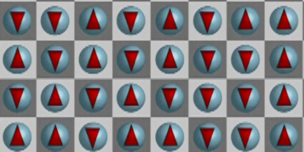
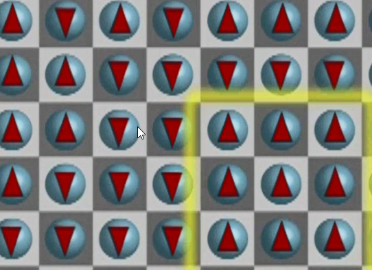
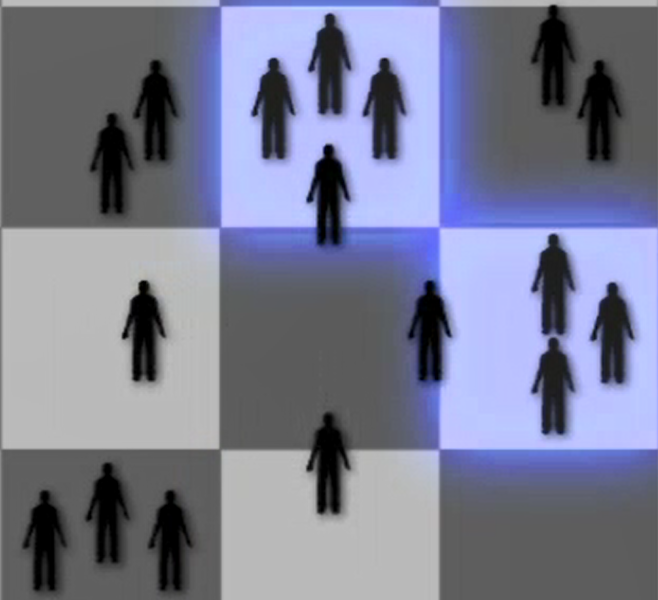
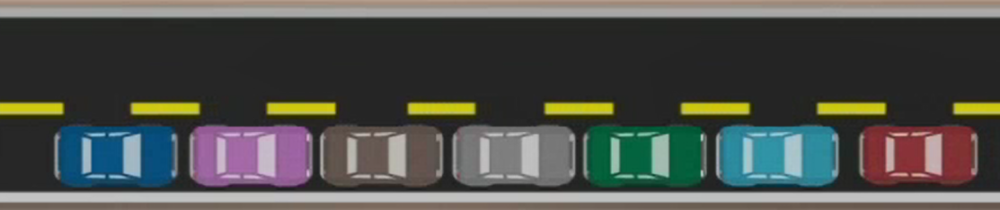
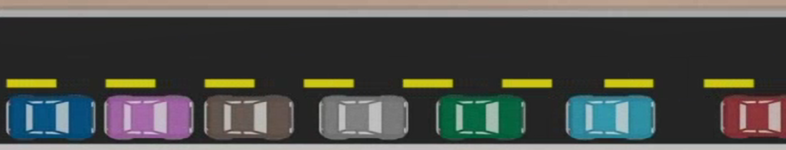
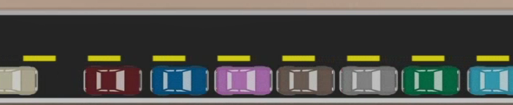
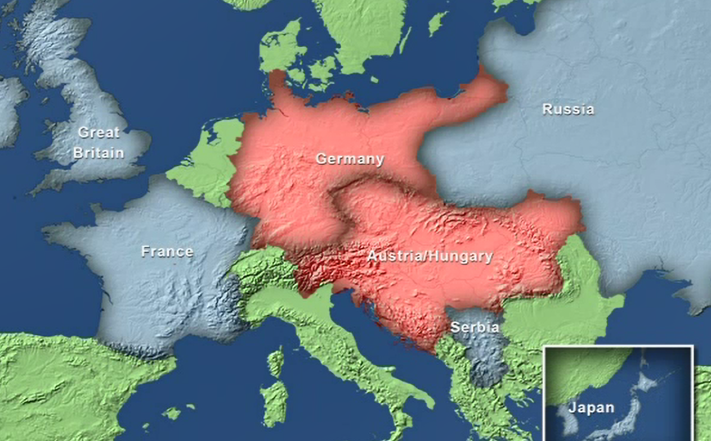

# Complexity

An actor in a complex system controls almost nothing but influences
everything.

Depends on:

-   Diversity (see further down for details)

    -   Applied to chemical elements:

        -   Mixing the same type of elements will not lead to anything
            interesting.

        -   Mixing few components together leads to new (sometimes
            emergent) phenomena.

        -   Mixing a lot of elements together leads to a mess.

-   Connectedness (how many people a person connects to)

-   Interdependence (whether other entities influence actions)

-   Adaptation/Learning

Complex systems don't lie at the extremes of those attributes but at a
moderate level.

It's easier to analyse games/models with only two players or an infinite
number of numbers since they are not complex.

A complex system produces interesting non-periodic patterns and emergent
structures and functionalities.

Social systems are usually complex because their attributes (diversity,
connectedness, interdependence, adaptation) at a moderate level.

# Classification of systems/models

based on:

1.  the rules followed by its parts

2.  the initial state of the system

    -   family at a dinner table

    -   family in a car for 36 hours

Classifications:

1.  single point equilibria (ball in a bowl)

2.  regular patterns (stop light)

3.  chaotic

-   extremely sensitive to initial conditions (starting at the same
    point under slightly different conditions will end up at a
    completely different point)

4.  complex

    -   no regular behaviour

    -   no regular pattern

    -   structure not easily discernible

## Diversity

Diversity measures

-   Variation average squared distance from the mean

-   Entropy

    -   Capture the evenness of a distribution across types. (kinda
        variation for categorical values)

    -   Also called Simpson's index

    -   Does not take the differences between the types into account
        (e.g. differences between apples and peers vs. elephants and
        apples)

    -   E.g. colors of tables

    -   There is 1/3 red 1/3 white and 1/3 white tables

    -   Square each result (i.e. 1/3^2^\*3) = 1/3

    -   Take the inverse of the number = 3/1

    -   The entropy is higher the more types there are

    -   The entropy is lower if the proportions of the type are unequal
        (more of one type as compared to the others)

    -   

-   Distance

    -   Take into account differences between types (see entropy which
        doesn't do this)

    -   Assume a pre-existing distance function between pairs of types.

        -   Some way to measure how equal the types are

    -   The more distance there is between the types the more diverse is
        the whole set of entities.

-   Attribute

    -   Take into account differences between types (see entropy which
        doesn't do this)

    -   Identify the attributes of each type in a set and count up the
        total number of unique attributes

## How diversity gets produced in complex systems

-   Positive feedbacks

    -   Diversity causes more diversity

    -   The more diversity you start with (e.g. more types of
        materials), the more diversity you can produce.

-   Week selective pressures

    -   Not like in a bank where you need to dress a certain way

-   Different landscapes

Thinking of possible actions actors can take as moves along geographic
coordinates. The fitness/success of the moves can be thought of as
elevation in the landscape. The actors objective is to climb and search
for elevations on the landscape with the ambition to find the highest
point.

-   Mount Fuyi (only one peak)

-   Rugged (multiple peaks)

```{=html}
<!-- -->
```
-   Dancing landscapes

    -   Changing/shifting height landscapes e.g. through competition or
        innovation

## Diversity produces innovation

Combinations:

Imagine Thomas Edison had 100 jars of elements on his shelf in his
laboratory.

To choose 2 jars there 100 choices to take one jar and 99 choices to
take the 2^nd^ jar. Since order does matter (i.e. element1 + element2 is
the same as element2 + element1) we need to divide the result by two:

Numbers of combinations to pick 2 out of 100 = 100 \* 99 /1\* 2 = 4950

3 out of 100 = 100 \* 99 \* 98 / 1\*2\*3 =

4 out of 100 = 100 \* 99 \* 98 \* 97 / 1\*2\*3\*4

Also diversity of thought/ideas i.e. different ways of seeing or
representing things can lead to reaching another peak.

## Diversity produces robustness

Robustness = Ability to maintain functionality despite disturbance

Variation produces robustness

-   Having a set of screwdrivers enables you to respond to fix any screw
    that is loose.

-   Variation in beaks of a population of birds of a specific type makes
    them robust against environmental changes (e.g. Darwin's finches)

Diversity produces robustness

-   Set of different tools enables you even better to respond to any
    problems.

-   The more species there are, the more likely it is that at least one
    of them will survive any kind of change.

## Explore vs. Exploit

Complex systems consist of agents/parts that have interdependent rules
and payoffs, which create robustness and emergent phenomena.

There is a fundamental trade-off for the agents in the system between
explore and exploit.

Exploration = Searching for better solutions (continue to search for new
solutions)

Exploitation = Taking advantage of what you know (use the information
you found previously)

Restaurant example:\
There are lots of different restaurants.

If you keep searching/trying out new one's your result will reflect the
average quality of all restaurants.

If you use the knowledge you have and keep going only to the restaurants
you already know and like you could miss out on something really good.

Ideally one should balance exploration against exploitation.

Rugged vs. mount fuyi landscape context:

The actor's objective is to climb and search for elevations on the
landscape with the ambition to find the highest point. There are only
limited time/resources to find the highest point therefore there must be
a balance between exploration and exploitation.

Going only in the direction that leads uphill and stay if there is no
such direction will only lead to the first local peak in a rugged
landscape, but is not effective to find the highest peak (greedy
algorithm).

### Simulated annealing

Annealing is a process used to harden glass and metals (E.g. tempered
glass or hardened steel

), or to make crystals.

Spin glass -\> checker board of particles pointing upwards = 1, pointing
downwards = -1



The goal is to change the particles such that they all point in the same
direction.

The particles/agents actually all want to point in the same direction.
If the material is too cold the particles are stuck in a frustrated
state. If the material's temperature is increased the agents/particles
are set free to move and try to align themselves in terms of the
direction they are pointing with their neighbours. This will cause
neighbourhoods of particles to point into the same direction.



At this stage the material is made gradually colder again. This will
cause the bigger regions to be fixed. But the boundaries where the
particles are pointing in opposite directions are still moving and will
eventually all point in the same direction at which point the particles
are organized and fixed since the material is cold again.

Simulated annealing applied to the hiker trying to find the highest
point in a rugged landscape:

High temperature = the hiker's moves cause a lot of mistakes (going
downhill). The hiker will move around all over the place doing
exploration.

Low temperature = less mistakes (mainly uphill moves).

On rugged landscapes the agents should start wit high temperature (more
exploration) and then gradually do more and more exploitation to end up
on a high local peak.

With dancing landscapes, the agents can never stop exploring since a
peak can turn into a valley.

This is causing complexity. What is preventing the system to do too much
exploration is that too much exploration would cause randomness which
would cause more and more agents to find local peaks (exploitation). The
benefits from exploration declines as there is more randomness and makes
more sense to exploit instead.

Applied to job search or other searches it might mean that it makes
sense to explore more, if you have the resources to do so.

# Emergence

Spontaneous creation of order and functionality from the bottom up (not
controlled from top-down). E.g. specific fire-flies that blink at the
same time by syncing only with their neighbour and hence reaching the
whole group to blink at the same time. Rather than by a central
conductor that tells them when to blink.

Something that is more than the sum of its parts.

Types of emergence

-   Simple or complex

    -   Simple -\> macro level property in an equilibrium system (e.g.
        wetness of water, a single water molecule cannot be wet)

    -   Complex -\> macro level property that exists in complex systems
        not in equilibrium. (e.g. slime moles can form a snail like
        organism or pile up (breaking the symmetry since they know act
        differently even though they are all the same)

-   Strong or weak emergence

    -   Strong -\> what occurs at the macro level **cannot be deduced**
        from the interactions at the micro level (e.g. consciousness)

    -   Weak -\> what occurs at the macro level **cannot be expected**
        from the interactions at the micro level, but can be explained
        once it is observed. (e.g. slime moles)

## Culture

Definition: Shared set of beliefs, behaviours, and routines.

Functions:

-   Cultures allow people to know how others will behave.

-   People know how to behave in novel situations.

Culture arises through series of coordination games (higher pay-off if
we pick the same) in conjunction with consistent choices (doing similar
things across different domains), builds characteristics of a specific
culture (e.g. Americans are more risk-taking than French).

# Networks

Functions of networks

## How quickly does information diffuse across a network?

## Are the networks that emerge robust to failures?

-   Random failures (internet is robust to random failure)

-   Strategic attacks

# Feedbacks and externalities

Feedback -\> dependencies between the same actions

Externalities -\> dependencies between different actions (e.g. the more
flowers the more vases are needed). There are positive and negative
externalities.

-   Positive feedback (more creates more, actions that create more of
    the same) can lead to tipping points

-   Negative feedback (more creates less, gas prices increase -\> less
    people buy gas -\> gas prizes go down) can create stability

-   Combinations of positive feedback and negative externalities can
    create path-dependence

    -   Path-dependence: future outcomes depend on the actions along the
        way. Outcomes in path-dependent processes can be difficult to
        understand.

-   Usually based on threshold rule. E.g. what is the % of people that
    run for the exit for me to run for the exit, too?

-   In complex systems (that are diverse) the extreme thresholds (at the
    tails of the distribution) can have a big impact on the behaviour of
    the system:

    -   E.g. people leaving mall based on how many other people are
        leaving. If the threshold is j for every j person
        (threshold:personN: 1:1, 2:2, ....) then there will be a cascade
        effect if only one person leaves that will make everyone follow.
        As compared to everyone having a threshold of 5, where nothing
        happens until at least 5 people leave.

    -   The same effect can lead to stock market crashes (the system is
        tipping) and segregated neighbourhoods (even though individual
        tolerance levels are pretty high)

    -   There won't be a tipping that moves the system back into the
        other direction.

# Self organized criticality

Systems self organize if the aggregation of individual actions produced
an organized pattern at the macro level (e.g. bird flocks, fish shoals).
A system is set to be critical if small events trigger large cascades.
If a system self organizes into a critical state it is called
self-organized criticality.

## Central limit theorem

if we add or average samples of individual independent events, they will
be normally distributed (e.g. weight of loaf of bread).

-   Regardless of their distribution

-   They only need to have finite variance (not too extreme)

This contributes to the stability of society since it makes events
predictable (there are usually not many events that deviate by large
from the mean).

## Power law distributions

Some events are not normally distributed but power laws(e.g. cost
overrun of projects, war size, floods, earth quake).

In a power law distribution huge events are not likely, but they can
occur.

Event sizes follow a power law if the probability of an event of size x
is proportional to x raised to some negative power. (e.g. with an
exponent of 2, the probability of an event with the size of 100 is
1/100\^2.

If you measure how long it takes to return to 0 in a game where I get
1\$ for heads for a coin flip and you get 1\$ for tail it will resemble
a power law distribution. Most of the time it will only take few steps
to go back to 0\$ but some times it will take a long time.

## Per Bak's sand pile model of self-organized criticality

In reality (if not simulated on a computer) the sand box model better
works with rice.

If you drop individual rice corns on a square table rice piles up on the
table. A pile is going to build up. At one point the pile gets high
enough so that additional rice corns will cause an avalanche causing
some of the rice corns to drop to the floor. Most of the time there will
be only few rice grains dropping to the floor. But some times there will
be huge avalanches. The distribution of the avalanche sizes will follow
a power law.

If we replace the table in the sand pile model with a checker board and
the sand with people from a group called bridge player anonymous. Every
person will drop on a specific square of the checker board.

Members of the group would like to avoid meeting in groups greater than
4. Because of 4 of them meet on a square they might want to start a game
of bridge.

If at any point 4 people of the group do meet at the same square they
will go off in 4 different directions.



Eventually this system will self-organize into a critical state where
dropping additional people will lead to huge cascades of movements
(similar to the avalanches within the sand pile model) because of the
**connectedness and interdependence within the system**.

## Avoiding critical events from happening

**As connectedness and interdependence increases within the world these
distributions become more likely to emerge. This can be prevented by**

-   Reducing connectedness (e.g. separating parts of a system in order
    to avoid cascade effects in case of emergencies)

-   avoiding systems to reach a critical stage (e.g. preventing cars
    entering a motor way if it's getting too busy).

-   Monitoring systems in order to recognize and release the build up of
    tension (e.g. monitoring political alliances).

## How do traffic jams happen?

If a car slows down when there are many other cars driving behind it,
the others cars will have to slow down too. Even if the car in front
will accelerate again it will take the other cars much longer to take up
speed again.





It might take long enough for others cars driving behind the lane of
cars also having to queue behind the same lane.



This can then cascade down to more cars causing a traffic jam.

## First world war

-   The arch duke of Austria-Hungary is assassinated by supposedly some
    group (black hand) from Serbia in Sarajevo.

-   They give Serbia an (unreasonable) ultimatum.

-   Russia is an ally of Serbia and Germany is an ally of
    Austria-Hungary

-   As soon as Serbia rejects the ultimatum Austria-Hungary declares war
    on Serbia

-   Russia and Germany join to support their allies.

-   Also France is an ally of Russia and Serbia and joins the war.

-   Later also Britain and Japan joined to help Russia, Serbia, and
    France



# Where does randomness come from?

-   Engineered (e.g. Rand() in Excel) or lottery system.

-   Disturbances (small changes) the disturbances are random as well as
    the cause of the disturbance (other random disturbances)

-   Fundamental property (e.g. quantum physics)

-   Interdependent rules

# Decision theory
