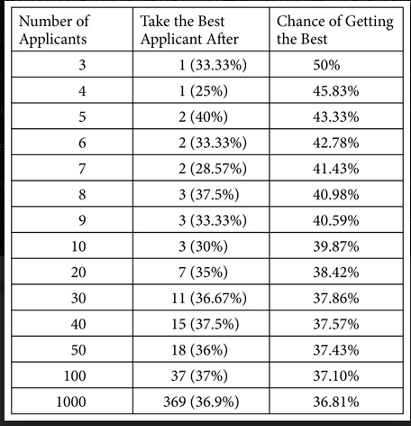
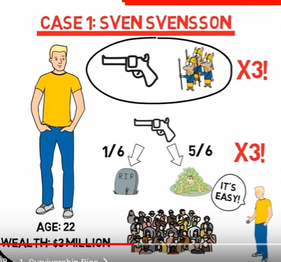

Focus on avoiding mistakes instead of trying to be right all the time 
======================================================================

-   Try to be consistently not stupid.

-   Focus on what you don't want to do (e.g. not investing in...)

-   Avoid disaster (e.g. running out of money)

Stay in circle of competence
----------------------------

-   Know what you don't know

-   Look for evidence that goes against your conclusion/view

Don't forget about randomness as a cause
========================================

When bad things happen, we try to find causal explanations or something
to blame. The more unexpected or negative we find an event, the more
likely we are to look for explanations. We underestimate the influence
of randomness.

Don't mistake cause and effect consider that a cause can have multiple effects and vice versa 
==============================================================================================

*We have tons of problems. We are losing customers, we can\'t deliver on
time, our inventory system doesn\'t work.*

What is the core cause of these problems? Many times when we have a lot
of problems, there may be one common reason for them all. When dealing
with problems we must focus on what we want to achieve and make sure
that we address the underlying cause and not act on symptoms that may
look like causes. Maybe the symptoms were due to wrong policies or
measuring instruments or goals, etc.

Think about opportunity cost
============================

-   If you say yes to one thing you say no to a million others.

-   Don't compare investments that are below your baseline interest

Look for positive feedback loops
================================

E.g. more creates more

Could be also combining multiple reinforcing positive factors
(coca-cola)

Learn from the masters in your field their mistakes and experiences
===================================================================

When adopting from someone else make sure to understand the context they
were living in / using when choosing their mindset/processes.

Use multi-disciplinary approaches to solve problems
===================================================

Don't be the man with the hammer but chose the mental model(s)
appropriate for the situation.

Kelly formula for optimal betting size
======================================

Coin flip:

-   Heads = 60% win 100%

-   Tails = 40% lose 100%

-   Edge = Probability of winning \* 2 -1 = .2

-   If the downside-case loss is less than 100%, as in the scenario
    above, a different Kelly formula is required: **Kelly % = W/A -- (1
    -- W)/B**, where W is the win probability, B is the profit in the
    event of a win (20%), and A is the potential loss (also 20%).

Bayes Theorem
=============

Refine probability of an event occurring based on prior (base)
probability. You can home after a weekend and find someone else\'s
underpants on your bed. How likely is it that your girlfriend has been
cheating on you?

Common sources of mistakes and misjudgements
============================================

-   **Bias from mere association** - We automatically feel pleasure or
    pain when we connect a stimulus - a thing, situation or individual-
    with an experience we\'ve had in the past or with values or
    preferences we are born with.

*John\'s supplier took him to the best steakhouse in town and picked up
the check. The next time it was time to buy new supplies, John
associated the supplier with pleasant feelings.*

-   Merely because you associate some stimulus with earlier pain or
    > pleasure doesn\'t mean the stimulus will cause the same pain or
    > pleasure today. Past experiences are often context dependent.

-   Create a negative emotion if you want to end a certain behavior. If
    you want someone to stop smoking, one way could be to show them what
    they stand to lose. Terrifying pictures may cause them to associate
    smoking with death. An action that is reinforced becomes stronger
    over time. This is how habits, superstitions and addictions are
    created.

-   **Underestimating** the **power of rewards and punishment** - people
    repeat actions that result in rewards and avoid actions that they
    are punished for.

> **After a success, we become overly optimistic risk-takers. After a
> failure, we become overly pessimistic and risk-averse.**
>
> **Praise is more effective in changing behavior than punishment. It is
> better to encourage what is right than to criticize what is wrong.**

-   Underestimating **bias from own self-interest and incentives**.

    People do what they perceive is in their best interest and are
    biased by incentives.

    *\"Never ask the village barber if you need a haircut.\"*

> Understand people\'s motivations. Money, status, love of work,
> reputation, position, power, envy? What are they rewarded or punished
> for? Are they benefiting or losing from the present system?

-   **Self-serving bias** - overly positive view of our abilities and
    future. Includes over-optimism.

> We see ourselves as unique and special and we have optimistic views of
> ourselves and our family. We overestimate the degree of control we
> have over events and underestimate chance.
>
> When we fail, we blame external circumstances or bad luck. When others
> are successful, we tend to credit their success to luck and blame
> their failures on foolishness.

-   **Self-deception and denial- distortion of reality to reduce pain or
    increase pleasure**. Includes wishful thinking.

> We deny and distort reality to feel more comfortable, especially when
> reality threatens our self-interest.

-   **Consistency tendency** - being consistent with our prior
    commitments and ideas even when acting against our best interest or
    in the face of disconfirming evidence. Includes confirmation bias -
    looking for evidence that confirms our actions and beliefs and
    ignoring or distorting disconfirming evidence.

-   **Deprival syndrome** - strongly reacting (including desiring and
    valuing more) when something we like and have (or almost have) is
    (or threatens to be) taken away or \"lost.\" Includes desiring and
    valuing more what we can\'t have or what is (or threatens to be)
    less available.

-   **Status quo bias and do-nothing syndrome** - keeping things the way
    they are. Includes minimizing effort and a preference for default
    options.

> Deciding to do nothing is also a decision. And the cost of doing
> nothing could be greater than the cost of taking an action.

-   **Impatience** - valuing the present more highly than the future.

> We give more weight to the present than to the future. We seek
> pleasure today at a cost of what may be better in the future. We
> prefer an immediate reward to a delayed but maybe larger reward.

-   **Envy and jealousy.**

-   Distortion by contrast comparison **- judging and perceiving the
    absolute magnitude of something not by itself but based only on its
    difference** to something else presented closely in time or space or
    to some earlier adaptation level. Also underestimating the
    consequences over time of gradual changes.

> The grossly overpriced \$100 tie seemed reasonable after John bought
> the fairly priced \$1,500 suit.

-   **Anchoring** - over-weighing certain initial information as a
    reference point for future decisions.

-   **Over-influence by vivid or the most recent information**.

> Accurate information is better than dramatic information. Back up
> vivid stories with facts and numbers.
>
> Separate noise and chance events from what is important. Ask: Is it
> relevant? Does it make sense? Is it representative evidence? Was it a
> random event?
>
> Trends may be wrong. Ask: Is it a permanent or temporary effect?

-   **Omission and abstract blindness** - only seeing stimuli we
    encounter or that grabs our attention, and neglecting important
    missing information or the abstract. Includes inattentional
    blindness.

-   **Reciprocation tendency** - repaying in kind what others have done
    for or to us like favors, concessions, information and attitudes.

-   **Over-influence by liking tendency** - believing, trusting and
    agreeing with people we know and like. Includes bias from
    over-desire for liking and social acceptance and for avoiding social
    disapproval. Also bias from disliking - our tendency to avoid and
    disagree with people we don\'t like.

-   Over-influence by social proof **- imitating the behavior of many
    others or similar others**. Includes crowd folly.

-   **Over-influence by authority** - trusting and obeying a perceived
    authority or expert. 19. Sensemaking - Constructing explanations
    that fit an outcome. Includes being too quick in drawing
    conclusions. Also thinking events that have happened were more
    predictable than they were.

-   **Reason-respecting** -- complying with requests merely because
    we\'ve been given a reason. Includes underestimating the power in
    giving people reasons.

    Our need for making sense makes us even believe in nonsense.

-   **Believing first and doubting later** - believing what is not true,
    especially when distracted.

-   **Memory limitations** - remembering selectively and wrong. Includes
    influence by suggestions.

    Keep records of important events.

-   **Do-something syndrome** - acting without a sensible reason.

-   **Mental confusion from say-something syndrome** - feeling a need to
    say something when we have nothing to say.

-   **Emotional arousal**- making hasty judgments under the influence of
    intense emotions. Includes exaggerating the emotional impact of
    future events.

-   **Mental confusion from stress**.

-   **Mental confusion from physical or psychological pain**, the
    influence of chemicals or diseases.

-   **Over-influence by the combined effect** of many psychological
    tendencies operating together.

Misjudgements based on principles from physics and mathematics
--------------------------------------------------------------

### Systems thinking 

-   Failing to consider that actions have both intended and unintended
    consequences. Includes failing to consider secondary and higher
    order consequences and inevitable implications.

-   Failing to consider the whole system in which actions and reactions
    take place, the important factors that make up the system, their
    relationships and effects of changes on system outcome.

    **Think about positive and negative feedback loops**

-   Failing to consider the likely reactions of others - what is best to
    do may depend on what others do.

-   Failing to consider the implications of winning a bid -
    overestimating value and paying too much. (winners curse. The winner
    at an auction pays the highest price)

-   Overestimating predictive ability or using unknowable factors m
    making predictions.

### Scale and limits 

-   Failing to consider that changes in size or time influence form,
    function and behavior.

Surface area increases at the square of length and volume at the cube of
length

-   Failing to consider breakpoints, critical thresholds or limits

-   Failing to consider constraints - that a system\'s performance is
    constrained by its weakest link.

-   Size and frequency:

Statistics show that the frequency of some events and attributes are
inversely proportional to their size. Big or small things can happen but
the bigger or more extreme they get, the less frequent they are. For
example, there are a few large earthquakes, fires, avalanches, or
cities, but many small ones. There are a few billionaires but many
millionaires.

### Causes 

-   Not understanding what causes desired results.

> What is the equation that achieves what we want to accomplish?
>
> What factors cause what we want to achieve? Under what circumstances?
>
> What causes business value?

-   Believing cause resembles its effect - that a big effect must have a
    big or complicated cause.

-   Underestimating the influence of randomness in bad or good outcomes.

-   Mistaking an effect for its cause. Includes failing to consider that
    many effects may originate from one common root cause.

-   Attributing outcome to a single cause when there are multiple
    causes.

-   Mistaking correlation for cause.

-   Failing to consider that an outcome may be consistent with
    alternative explanations.

-   Drawing conclusions about causes from selective data. Includes
    identifying the wrong cause because it seems the obvious one based
    on a single observed effect. Also failing to consider information or
    evidence that is missing.

-   Not comparing the difference in conditions, behavior and factors
    between negative and positive outcomes in similar situations when
    explaining an outcome.

    \"Look at where the bullet holes are and put extra armor every place
    else. \" (think about all the planes that haven\'t come back)

\'The drug obviously worked since I used it and got better. \" But the
same outcome could have happened without taking the drug. We need to
consider both confirming and disconfirming evidence. Ask: What is the
frequency of supporting cases compared to disconfirming cases? What is
the relative frequency of this condition or disease in the population?

### Two way contingency table

<table>
<thead>
<tr class="header">
<th>Outcome</th>
<th><strong>Yes</strong></th>
<th><strong>No</strong></th>
</tr>
</thead>
<tbody>
<tr class="odd">
<td>Prediction</td>
<td></td>
<td></td>
</tr>
<tr class="even">
<td><strong>Yes</strong></td>
<td>Predicted yes and it yes</td>
<td>Predicted yes and it was no (false positive very common to avoid big negative consequences like not diagnosing appendix conditions)</td>
</tr>
<tr class="odd">
<td><strong>No</strong></td>
<td>
Predicted no and it was yes

(not common since it is avoided by false positives
</td>
<td>Predicted no and it is no</td>
</tr>
</tbody>
</table>

### Numbers and their meaning 

-   Looking at isolated numbers - failing to consider relationships and
    magnitudes. Includes not using basic math to count and quantify.
    Also not differentiating between relative and absolute risk.

-   Underestimating the effect of exponential growth.

-   Underestimating the time value of money.

### Probabilities and number of possible outcomes 

-   Underestimating risk exposure in situations where relative frequency
    (or comparable data) and/or magnitude of consequences is unknown or
    changing over time.

-   Underestimating the number of possible outcomes for unwanted events.
    Includes underestimating the probability and severity of rare or
    extreme events.

-   Overestimating the chance of rare but widely publicized and highly
    emotional events and underestimating the chance of common but less
    publicized events.

-   Failing to consider both probabilities and consequences (expected
    value).

-   Believing events where chance plays a role are self-correcting -
    that previous outcomes of independent events have predictive value
    in determining future outcomes.

-   Believing one can control the outcome of events where chance is
    involved.

-   Judging financial decisions by evaluating gains and losses instead
    of final state of wealth and personal value.

-   Failing to consider the consequences of being wrong.

### Scenarios 

-   Overestimating the probability of scenarios where all of a series of
    steps must be achieved for a wanted outcome. Also underestimating
    opportunities for failure and what normally happens in similar
    situations. (P1\*P2\*P3)

-   Underestimating the probability of systems failure - scenarios
    composed of many parts where system failure can happen one way or
    another. Includes failing to consider that time horizon changes
    probabilities. Also assuming independence when it is not present
    and/or assuming events are equally likely when they are not.

-   Not adding a factor of safety for known and unknown risks. Size of
    factor depends on the consequences of failure, how well the risks
    are understood, systems characteristics and degree of control.

### Coincidences and miracles 

-   Underestimating that surprises and improbable events happen,
    somewhere, sometime, to someone, if they have enough opportunities
    (large enough size or time) to happen.

-   Looking for meaning, searching for causes and making up patterns for
    chance events, especially events that have emotional implications.

-   Failing to consider cases involving the absence of a cause or
    effect.

### Reliability of case evidence 

-   Overweighing individual case evidence and under-weighing the prior
    probability (probability estimate of an event before considering new
    evidence that might change it) considering for example, the base
    rate (relative frequency of an attribute or event in a
    representative comparison group), or evidence from many similar
    cases. Includes failing to consider the probability of a random
    match, and the probability of a false positive and false negative.
    Also failing to consider a relevant comparison population that bears
    the characteristic we are seeking.

### Misrepresentative evidence 

-   Failing to consider changes in factors, context or conditions when
    using past evidence to predict likely future outcomes. Includes not
    searching for explanations to why past outcome happened, what is
    required to make past record continue, and what forces can change
    it.

-   Overestimating evidence from a single case or small or
    unrepresentative samples.

-   Underestimating the influence of chance in performance (success and
    failure).

-   Only seeing positive outcomes - paying little or no attention to
    negative outcomes and prior probabilities.

-   Failing to consider variability of outcomes and their frequency.

-   Failing to consider regression - in any series of events where
    chance is involved unique outcomes tends to regress back to the
    average outcome.

### 
