# Exponential backoff

Originally used for TCP connections but can also be used in other
circumstances.

network to accommodate potentially any number of competing signals.
Since the maximum delay length (2, 4, 8, 16...) forms an exponential
progression, it's become known as Exponential Backoff.

# TCP connections

communication lapses are rarely so dire, and the need for certainty
rarely so absolute. In TCP, a failure generally leads to retransmission
rather than death, so it's considered enough for a session to begin with
what's called a "triple handshake." The visitor says hello, the server
acknowledges the hello and says hello back, the visitor acknowledges
that, and if the server receives this third message, then no further
confirmation is needed and they're off to the races. Even after this
initial connection is made, however, there's still a risk that some
later packets may be damaged or lost in transit, or arrive out of order.
In the postal mail, package delivery can be confirmed via return
receipts; online, packet delivery is confirmed by what are called
acknowledgment packets, or ACKs. These are critical to the functioning
of the network.

The way that ACKs work is both simple and clever. Behind the scenes of
the triple handshake, each machine provides the other with a kind of
serial number---and it's understood that every packet sent after that
will increment those serial numbers by one each time, like checks in a
checkbook. For instance, if your computer initiates contact with a web
server, it might send that server, say, the number 100. The ACK sent by
the server will in turn specify the serial number at which the server's
own packets will be

gin (call it 5,000), and also will say "Ready for 101." Your machine's
ACK will carry the number 101 and will convey in turn "Ready for 5,001."
(Note that these two numbering schemes are totally independent, and the
number that begins each sequence is typically chosen at random.)

This mechanism offers a ready way to pinpoint when packets have gone
astray. If the server is expecting 101 but instead gets 102, it will
send an ACK to packet 102 that still says "Ready for 101." If it next
gets packet 103, it will say, again, "Ready for 101." Three such
redundant ACKs in a row would signal to your machine that 101 isn't just
delayed but hopelessly gone, so it will resend that packet. At that
point, the server (which has kept packets 102 and 103) will send an ACK
saying "Ready for 104" to signal that the sequence has been restored.

## TCP congestion handling

At the heart of TCP congestion control is an algorithm called Additive
Increase, Multiplicative Decrease, or AIMD. Before AIMD kicks in, a new
connection will ramp up its transmission rate aggressively: if the first
packet is received successfully it sends out two more, if both of those
get through it sends out a batch of four, and so on. But as soon as any
packet's ACK does not come back to the sender, the AIMD algorithm takes
over. Under AIMD, any fully received batch of packets causes the number
of packets in flight not to double but merely to increase by 1, and
dropped packets cause the transmission rate to cut back by half (hence
the name Additive Increase, Multiplicative Decrease). Essentially, AIMD
takes the form of someone saying, "A little more, a little more, a
little more, whoa, too much, cut way back, okay a little more, a little
more..." Thus it leads to a characteristic bandwidth shape known as the
"TCP sawtooth"---steady upward climbs punctuated by steep drops.

# 

# Scheduling

In fact, the weighted version of Shortest Processing Time is a pretty
good candidate for best general-purpose scheduling strategy in the face
of uncertainty. It offers a simple prescription for time management:
each time a new piece of work comes in, divide its importance by the
amount of time it will take to complete. If that figure is higher than
for the task you're currently doing, switch to the new one; otherwise
stick with the current task. This algorithm is the closest thing that
scheduling theory has to a skeleton key or Swiss Army knife, the optimal
strategy not just for one flavor of problem but for many.

Only that you need to consider the task switching time too. Too much
context switching might lead to less optimal execution following this
algorithm.

|     |     |     |
|-----|-----|-----|
|     |     |     |

# Optimal stopping

When to stop searching. When there is no chance of rejection "secretary
problem":


With rejection working your way backwards from the last candidate:


Last candidate only hire if better than 50^th^ percentile

Penultimate better than around 70^th^ percentile

Of course, there's no reason that net worth---or, for that matter,
typing speed---needs to be the thing that you're measuring. Any
yardstick that provides full information on where an applicant stands
relative to the population at large will change the solution from the
Look-Then-Leap Rule to the Threshold Rule and will dramatically boost
your chances of finding the single best applicant in the group.

# Mergesort

Mergesort also has real applications in small-scale domestic sorting
problems. Part of the reason why it's so widely used is that it can
easily be parallelized. If you're still strategizing about that
bookshelf, the Mergesort solution would be to order a pizza and invite
over a few friends. Divide the books evenly, and have each person sort
their own stack. Then pair people up and have them merge their stacks.
Repeat this process until there are just two stacks left, and merge them
one last time onto the shelf. Just try to avoid getting pizza stains on
the books.

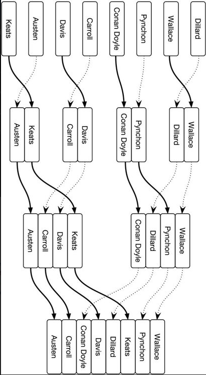

# Probability distributions


In a power-law distribution, the longer something has gone on, the
longer we expect it to continue going on. So a power-law event is more
surprising the longer we've been waiting for it---and maximally
surprising right before it happens. A nation, corporation, or
institution only grows more venerable with each passing year, so it's
always stunning when it collapses.

In a normal distribution, events are surprising when they're
early---since we expected them to reach the average---but not when
they're late. Indeed, by that point they seem overdue to happen, so the
longer we wait, the more we expect them.

And in an Erlang distribution, events by definition are never any more
or less surprising no matter when they occur. Any state of affairs is
always equally likely to end gardless of how long it's lasted. No wonder
politicians are always thinking about their next election.


Gambling is characterized by a similar kind of steady-state expectancy.
If your wait for, say, a win at the roulette wheel were characterized by
a normal distribution, then the Average Rule would apply: after a run of
bad luck, it'd tell you that your number should be coming any second,
probably followed by more losing spins. (In that case, it'd make sense
to press on to the next win and then quit.) If, instead, the wait for a
win obeyed a power-law distribution, then the Multiplicative Rule would
tell you that winning spins follow quickly after one another, but the
longer a drought had gone on the longer it would probably continue. (In
that scenario, you'd be right to keep playing for a while after any win,
but give up after a losing streak.) Up against a memoryless
distribution, however, you're stuck. The Additive Rule tells you the
chance of a win now is the same as it was an hour ago, and the same as
it will be an hour from now. Nothing ever changes. You're not rewarded
for sticking it out and ending on a high note; neither is there a
tipping point when you should just cut your losses. In "The Gambler,"
Kenny Rogers famously advised that you've got to "Know when to walk away
/ Know when to run"---but for a memoryless distribution, there is no
right time to quit. This may in part explain these games' addictiveness.

# Central limit theorem

We called this section "The Bell Curve," however, because the normal
distribution is especially useful due to one of the handiest results in
all of statistics, called the central limit theorem. This theorem states
that when numbers are drawn from the same distribution and then are
averaged, this resulting average approximately follows a normal
distribution. This is the case even if the numbers originally came from
a completely different distribution.


# Decision matrices

Contrarian mindset (e.g. for start-up investors)

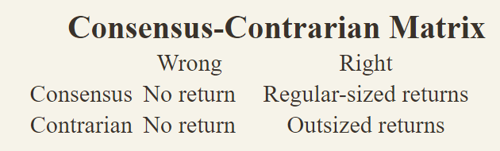

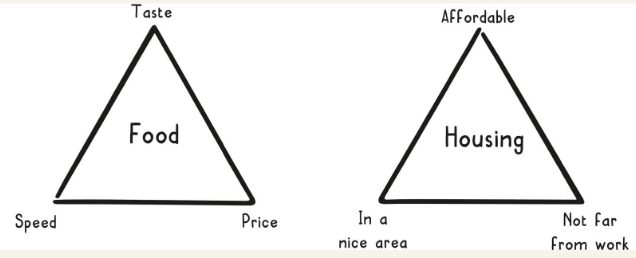

2x2 matrix with scatterplot to avoid dichotomy

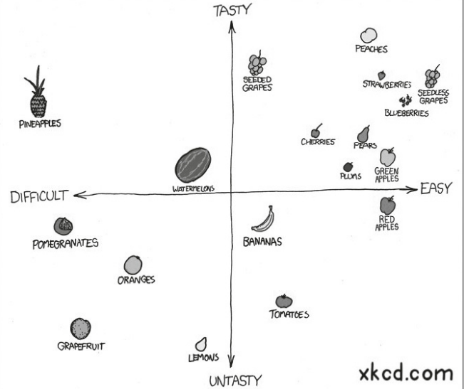

Reversible vs irreversible decisions

# Adverse selection

When parties select transactions that they think will benefit them,
based at least partially on their own private information, that's called
adverse selection. People who know they are going to need dental work
are more likely to seek out dental insurance. This unfortunately drives
up the price for everyone. Two ways to mitigate adverse selection in the
insurance market are to mandate participation, as many localities do for
car insurance, and to distinguish subpopulations based on their risk
profiles, as life insurers do for smokers.


# Moral hazard

This phenomenon, known as moral hazard, is where you take on more risk,
or hazard, once you have information that encourages you to believe you
are more protected. It has been a concern of the insurance industry
since the seventeenth century! Sometimes moral hazard may involve only
one person: wearing a bike helmet may give you a false sense of
security, leading you to bike more recklessly, but you are the one who
bears all the costs of a bike crash.

Moral hazards can also occur when a person or company serves as an agent
for another person or company, making decisions on behalf of this
entity, known as the principal. The problem arises when the agent takes
on more risk than the principal would if the principal were acting
alone, since the agent is more protected when things go wrong. For
instance, when financial advisers manage your money, they try to stick
to your risk profile, but they are more likely to take greater risks
than you would on your own, simply because it isn't their money, and so
losses do not impact their net worth as much.

# Coase theorem

There are many ways to internalize negative externalities, including
taxes, fines, regulation, and lawsuits. Smoking externalities are
internalized via cigarette taxes and higher health insurance premiums
for smokers. Traffic congestion externalities are internalized through
tolls. On a personal level, your neighbor might file a noise complaint
against you if you consistently play music too loud.

Another way to internalize externalities is through a marketplace.
Ronald Coase won the Nobel Prize in economics in 1991 in part for what
has become known as the Coase theorem, essentially a description of how
a natural marketplace can internalize a negative externality. Coase
showed that an externality can be internalized efficiently without
further need for intervention (that is, without a government or other
authority regulating the externality) if the following conditions are
met:

-   Well-defined property rights

-   Rational actors

-   Low transaction costs

When these conditions are met, entities surrounding the externality will
transact among themselves until the extra costs are internalized.

**Cap and trade systems**

The way these systems work is that the government requires emitters to
hold permits for the amount of pollutants they emit. The government also
sets a fixed number of total permits, which serves as the emission cap
in the market. Such a system satisfies the conditions of the Coase
theorem because property rights are well defined through the permitting
process, companies act rationally to maximize their profits, and the
open market provides low transaction costs.


# Emphasis

**Learnt helplessness** tendency to stop trying to escape difficult
situations because we have gotten used to difficult conditions over time
story of dogs that were put in a box and repeatedly choked at random
intervals when they were put in a similar box where they could easily
escape the shocks they did not actually try to escape

imagine a third story field forged between your story and someone
else\'s most respectful interpretation

**Birth lottery **(luck based on where you were born)


## Veil of ignorance 

Two primary principles supplement Rawls' veil of ignorance: the liberty
principle and the difference principle.

According to the liberty principle, the social contract should try to
ensure that everyone enjoys the maximum liberty possible without
intruding upon the freedom of others.

According to the difference principle, the social contract should
guarantee that everyone has an equal opportunity to prosper. In other
words, if there are any social or economic differences in the social
contract, they should help those who are the worst off. And, any
advantages in the contract should be available to everyone.

So, according to Rawls, approaching tough issues through a veil of
ignorance and applying these principles can help us decide more fairly
how the rules of society should be structured. And fairness, as Rawls
and many others believe, is the essence of justice.

# Survivor ship bias


# Deductive reasoning (from general to specific)


# Focus on avoiding mistakes instead of trying to be right all the time 

-   Try to be consistently not stupid.

-   Focus on what you don't want to do (e.g. not investing in...)

-   Avoid disaster (e.g. running out of money)

## Stay in circle of competence

-   Know what you don't know

-   Look for evidence that goes against your conclusion/view

# Don't forget about randomness as a cause

When bad things happen, we try to find causal explanations or something
to blame. The more unexpected or negative we find an event, the more
likely we are to look for explanations. We underestimate the influence
of randomness.

# Don't mistake cause and effect consider that a cause can have multiple effects and vice versa 

*We have tons of problems. We are losing customers, we can\'t deliver on
time, our inventory system doesn\'t work.*

What is the core cause of these problems? Many times when we have a lot
of problems, there may be one common reason for them all. When dealing
with problems we must focus on what we want to achieve and make sure
that we address the underlying cause and not act on symptoms that may
look like causes. Maybe the symptoms were due to wrong policies or
measuring instruments or goals, etc.

# Think about opportunity cost

-   If you say yes to one thing you say no to a million others.

-   Don't compare investments that are below your baseline interest

# Look for positive feedback loops

E.g. more creates more

Could be also combining multiple reinforcing positive factors
(coca-cola)

# Learn from the masters in your field their mistakes and experiences

When adopting from someone else make sure to understand the context they
were living in / using when choosing their mindset/processes.

# Use multi-disciplinary approaches to solve problems

Don't be the man with the hammer but chose the mental model(s)
appropriate for the situation.

# Kelly formula for optimal betting size

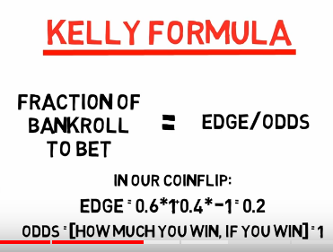

Coin flip:

-   Heads = 60% win 100%

-   Tails = 40% lose 100%

-   Edge = Probability of winning \* 2 -1 = .2

-   If the downside-case loss is less than 100%, as in the scenario
    above, a different Kelly formula is required: **Kelly % = W/A -- (1
    -- W)/B**, where W is the win probability, B is the profit in the
    event of a win (20%), and A is the potential loss (also 20%).

# Pareto = power law distro


# Statistical decision theory


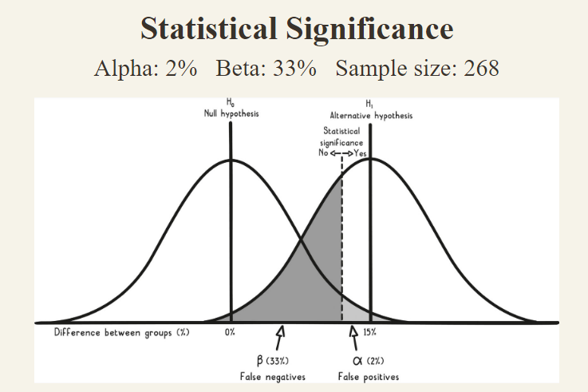

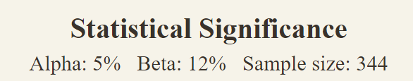


-   Hits and misses trade off by definition

-   Correct rejections and false alarms also trade off and..

-   Hits and false alarms and ..

-   Misses and correct rejections


-   Performance in a signal detection task depends on two parameters:

-   Criterion / Response bias / trigger-happiness / beta ß

-   Sensitivity / d\' (d-prime)

-   How separated the signal and noise distributions are (in standard
    > deviations)

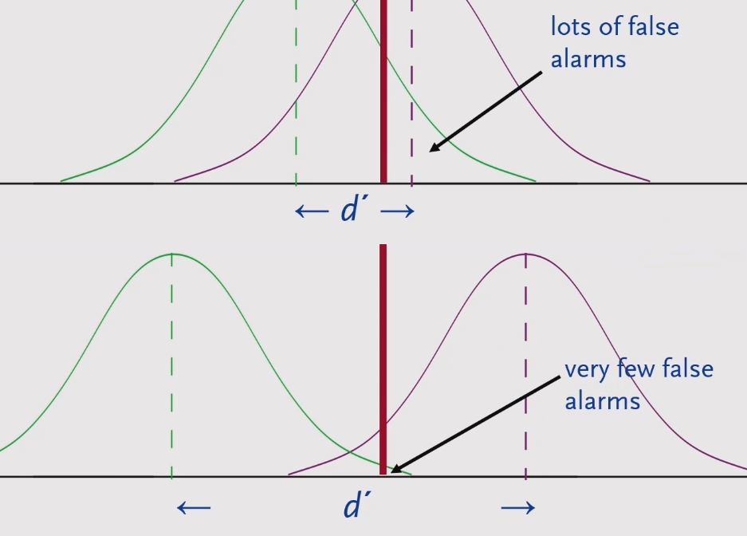

-   Improving Sensitivity (Better than twiddling with response bias (ß))

-   Enhance the signal, reduce the noise

-   Better instruments

-   More reliable forensic methods

-   More sensitive diagnostic tests

-   Combinations of evidence

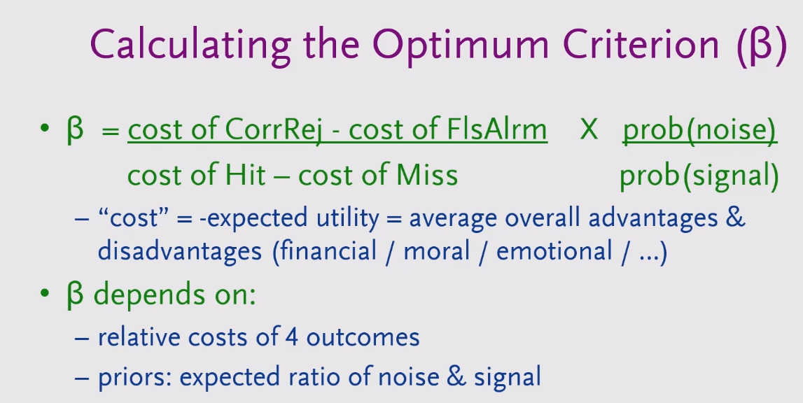

Applied to hypothesis testing


# Correlation and causation

The correlation co-efficient measures the closeness of the data to the
best fitting **straight-line.**

**All r = .82**


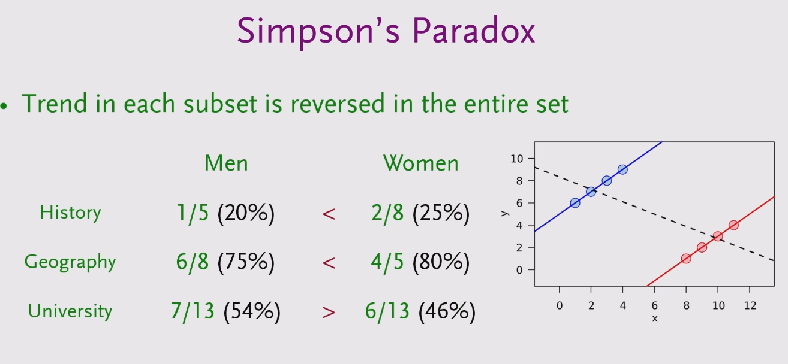

Simpsons paradox example note: The overall correlation was negative
because more women applied to departments where the general acceptance
rate was lower (hard to get into).

-   A cause must precede effect

-   If the effect still happens (to the same extend) after a potential
    cause is removed it was not (the only) cause. - There could be
    multiple causes that only work together to cause the effect though.

    

-   Effects might have multiple causes

    

-   Bayesian network

-   

-   

-   2\. Exclude reverse causation by checking whether the correlation
    > between the B and A is greater at a later time as compared to an
    > earlier time. Compared to the same for A and B

-   E.g. does democracy lead to peace, or are countries at peace more
    > likely to become democratic?

    Show correlation between Democracy at time 1 and Peace at time 2 \>
    Peace at time 2 and Democracy time 1

-   3\. Exclude confound

-   Partial/Multiple regression

-   Use randomized (subjects are assigned randomly to either group)
    controlled trial

-   If the intervention leads to a different outcome in one group only
    > it\'s likely caused by it.

# Bayes Theorem

Refine probability of an event occurring based on prior (base)
probability. You come home after a weekend and find someone else\'s
underpants on your bed. How likely is it that your girlfriend has been
cheating on you?


### LaPlace

How can we estimate the likelihood of winning in a raffle based on just
a few tickets.

After drawing a winning ticket on our first try we should expect that
the proportion of winning tickets in the whole pool is exactly 2/3. If
we buy three tickets and all of them are winners, the expected
proportion of winning tickets is exactly 4/5. In fact, for any possible
drawing of w winning tickets in n attempts, the expectation is simply
the number of wins plus one, divided by the number of attempts plus two:
(w+1)⁄(n+2).

This incredibly simple scheme for estimating probabilities is known as
Laplace's Law, and it is easy to apply in any situation where you need
to assess the chances of an event based on its history. If you make ten
attempts at something and five of them succeed, Laplace's Law estimates
your overall chances to be 6/12 or 50%, consistent with our intuitions.
If you try only once and it works out, Laplace's estimate of 2/3 is both
more reasonable than assuming you'll win every time, and more actionable
than Price's guidance (which would tell us that there is a 75%
metaprobability of a 50% or greater chance of success).

Count the number of times it has happened in the past plus one, then
divide by the number of opportunities plus two.

### Quasi Bayes approach to forecasting

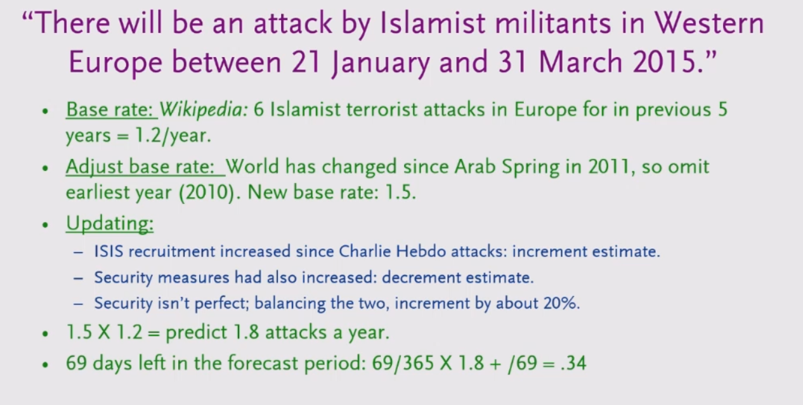

# Prospect theory

As opposed to utility theory takes into consideration human
preferences/biases (loss and risk aversion)


Prospect = Psychologically conceivable possibility


# Common sources of mistakes and misjudgements

-   **Base rate neglect**

    Not considering the prior/base rate probability when looking at test
    results

    

    

-   **Bias from mere association** - We automatically feel pleasure or
    pain when we connect a stimulus - a thing, situation or individual-
    with an experience we\'ve had in the past or with values or
    preferences we are born with.

*John\'s supplier took him to the best steakhouse in town and picked up
the check. The next time it was time to buy new supplies, John
associated the supplier with pleasant feelings.*

-   Merely because you associate some stimulus with earlier pain or
    > pleasure doesn\'t mean the stimulus will cause the same pain or
    > pleasure today. Past experiences are often context dependent.

-   Create a negative emotion if you want to end a certain behavior. If
    you want someone to stop smoking, one way could be to show them what
    they stand to lose. Terrifying pictures may cause them to associate
    smoking with death. An action that is reinforced becomes stronger
    over time. This is how habits, superstitions and addictions are
    created.

-   **Underestimating** the **power of rewards and punishment** - people
    repeat actions that result in rewards and avoid actions that they
    are punished for.

> **After a success, we become overly optimistic risk-takers. After a
> failure, we become overly pessimistic and risk-averse.**
>
> **Praise is more effective in changing behavior than punishment. It is
> better to encourage what is right than to criticize what is wrong.**

-   Underestimating **bias from own self-interest and incentives**.

    People do what they perceive is in their best interest and are
    biased by incentives.

    *\"Never ask the village barber if you need a haircut.\"*

> Understand people\'s motivations. Money, status, love of work,
> reputation, position, power, envy? What are they rewarded or punished
> for? Are they benefiting or losing from the present system?

-   **Self-serving bias** - overly positive view of our abilities and
    future. Includes over-optimism.

> We see ourselves as unique and special and we have optimistic views of
> ourselves and our family. We overestimate the degree of control we
> have over events and underestimate chance.
>
> When we fail, we blame external circumstances or bad luck. When others
> are successful, we tend to credit their success to luck and blame
> their failures on foolishness.

-   **Self-deception and denial- distortion of reality to reduce pain or
    increase pleasure**. Includes wishful thinking.

> We deny and distort reality to feel more comfortable, especially when
> reality threatens our self-interest.

-   **Consistency tendency** - being consistent with our prior
    commitments and ideas even when acting against our best interest or
    in the face of disconfirming evidence. Includes confirmation bias -
    looking for evidence that confirms our actions and beliefs and
    ignoring or distorting disconfirming evidence.

-   **Deprival syndrome** - strongly reacting (including desiring and
    valuing more) when something we like and have (or almost have) is
    (or threatens to be) taken away or \"lost.\" Includes desiring and
    valuing more what we can\'t have or what is (or threatens to be)
    less available.

-   **Status quo bias and do-nothing syndrome** - keeping things the way
    they are. Includes minimizing effort and a preference for default
    options.

> Deciding to do nothing is also a decision. And the cost of doing
> nothing could be greater than the cost of taking an action.

-   **Impatience** - valuing the present more highly than the future.

> We give more weight to the present than to the future. We seek
> pleasure today at a cost of what may be better in the future. We
> prefer an immediate reward to a delayed but maybe larger reward.

-   **Envy and jealousy.**

-   Distortion by contrast comparison **- judging and perceiving the
    absolute magnitude of something not by itself but based only on its
    difference** to something else presented closely in time or space or
    to some earlier adaptation level. Also underestimating the
    consequences over time of gradual changes.

> The grossly overpriced \$100 tie seemed reasonable after John bought
> the fairly priced \$1,500 suit.

-   **Anchoring** - over-weighing certain initial information as a
    reference point for future decisions.

-   **Over-influence by vivid or the most recent information**.

> Accurate information is better than dramatic information. Back up
> vivid stories with facts and numbers.
>
> Separate noise and chance events from what is important. Ask: Is it
> relevant? Does it make sense? Is it representative evidence? Was it a
> random event?
>
> Trends may be wrong. Ask: Is it a permanent or temporary effect?

-   **Omission and abstract blindness** - only seeing stimuli we
    encounter or that grabs our attention, and neglecting important
    missing information or the abstract. Includes inattentional
    blindness.

-   **Reciprocation tendency** - repaying in kind what others have done
    for or to us like favors, concessions, information and attitudes.

-   **Over-influence by liking tendency** - believing, trusting and
    agreeing with people we know and like. Includes bias from
    over-desire for liking and social acceptance and for avoiding social
    disapproval. Also bias from disliking - our tendency to avoid and
    disagree with people we don\'t like.

-   Over-influence by social proof **- imitating the behavior of many
    others or similar others**. Includes crowd folly.

-   **Over-influence by authority** - trusting and obeying a perceived
    authority or expert. 19. Sensemaking - Constructing explanations
    that fit an outcome. Includes being too quick in drawing
    conclusions. Also thinking events that have happened were more
    predictable than they were.

-   **Reason-respecting** -- complying with requests merely because
    we\'ve been given a reason. Includes underestimating the power in
    giving people reasons.

    Our need for making sense makes us even believe in nonsense.

-   **Believing first and doubting later** - believing what is not true,
    especially when distracted.

-   **Memory limitations** - remembering selectively and wrong. Includes
    influence by suggestions.

    Keep records of important events.

-   **Do-something syndrome** - acting without a sensible reason.

-   **Mental confusion from say-something syndrome** - feeling a need to
    say something when we have nothing to say.

-   **Emotional arousal**- making hasty judgments under the influence of
    intense emotions. Includes exaggerating the emotional impact of
    future events.

-   **Mental confusion from stress**.

-   **Mental confusion from physical or psychological pain**, the
    influence of chemicals or diseases.

-   **Over-influence by the combined effect** of many psychological
    tendencies operating together.

## Misjudgements based on principles from physics and mathematics

### Systems thinking 

-   Failing to consider that actions have both intended and unintended
    consequences. Includes failing to consider secondary and higher
    order consequences and inevitable implications.

-   Failing to consider the whole system in which actions and reactions
    take place, the important factors that make up the system, their
    relationships and effects of changes on system outcome.

**Think about positive and negative feedback loops**

-   Failing to consider the likely reactions of others - what is best to
    do may depend on what others do.

-   Failing to consider the implications of winning a bid -
    overestimating value and paying too much. (winners curse. The winner
    at an auction pays the highest price)

-   Overestimating predictive ability or using unknowable factors m
    making predictions.

### Scale and limits 

-   Failing to consider that changes in size or time influence form,
    function and behavior.

Surface area increases at the square of length and volume at the cube of
length

-   Failing to consider breakpoints, critical thresholds or limits

-   Failing to consider constraints - that a system\'s performance is
    constrained by its weakest link.

-   Size and frequency:

Statistics show that the frequency of some events and attributes are
inversely proportional to their size. Big or small things can happen but
the bigger or more extreme they get, the less frequent they are. For
example, there are a few large earthquakes, fires, avalanches, or
cities, but many small ones. There are a few billionaires but many
millionaires.

### Causes 

-   Not understanding what causes desired results.

> What is the equation that achieves what we want to accomplish?
>
> What factors cause what we want to achieve? Under what circumstances?
>
> What causes business value?

-   Believing cause resembles its effect - that a big effect must have a
    big or complicated cause.

-   Underestimating the influence of randomness in bad or good outcomes.

-   Mistaking an effect for its cause. Includes failing to consider that
    many effects may originate from one common root cause.

-   Attributing outcome to a single cause when there are multiple
    causes.

-   Mistaking correlation for cause.

-   Failing to consider that an outcome may be consistent with
    alternative explanations.

-   Drawing conclusions about causes from selective data. Includes
    identifying the wrong cause because it seems the obvious one based
    on a single observed effect. Also failing to consider information or
    evidence that is missing.

-   Not comparing the difference in conditions, behavior and factors
    between negative and positive outcomes in similar situations when
    explaining an outcome.

    \"Look at where the bullet holes are and put extra armor every place
    else. \" (think about all the planes that haven\'t come back)

\'The drug obviously worked since I used it and got better. \" But the
same outcome could have happened without taking the drug. We need to
consider both confirming and disconfirming evidence. Ask: What is the
frequency of supporting cases compared to disconfirming cases? What is
the relative frequency of this condition or disease in the population?

### Two way contingency table

<table>
<colgroup>
<col style="width: 14%" />
<col style="width: 43%" />
<col style="width: 42%" />
</colgroup>
<thead>
<tr class="header">
<th>Outcome</th>
<th rowspan="2"><strong>Yes</strong></th>
<th rowspan="2"><strong>No</strong></th>
</tr>
<tr class="odd">
<th>Prediction</th>
</tr>
</thead>
<tbody>
<tr class="odd">
<td><strong>Yes</strong></td>
<td>Predicted yes and it yes</td>
<td>Predicted yes and it was no (false positive very common to avoid big
negative consequences like not diagnosing appendix conditions)</td>
</tr>
<tr class="even">
<td><strong>No</strong></td>
<td><p>Predicted no and it was yes</p>
<p>(not common since it is avoided by false positives</p></td>
<td>Predicted no and it is no</td>
</tr>
</tbody>
</table>

### Numbers and their meaning 

-   Looking at isolated numbers - failing to consider relationships and
    magnitudes. Includes not using basic math to count and quantify.
    Also not differentiating between relative and absolute risk.

\"Research shows that the new drug reduces the risk of getting the
disease by 25%.\"

-   What benefits can be expected by taking the new drug?

-   Without the drug 20 people in 1 ,000 get the disease.

-   By taking the drug, the figure drops to 15 people in 1,000.

-   How efficient is the drug if we look at the absolute number of
    > people saved from the disease?

-   he reduction in absolute risk is 5 people in 1,000 (20-15) or 0.5%.

-   The reduction in relative risk or the relative number of people
    > saved from the disease is 25% (5120).

-   A 25% reduction only means something if many people are saved. How
    > many people need to take the drug in order to save one individual
    > from the disease? Since 5 people in 1,000 (or 1 in 200) are saved
    > from the disease by taking the drug, only one person out of 200
    > that take the drug will be saved. For the other 199 people the
    > drug does not have any positive effect.

-   Underestimating the effect of exponential growth. Underestimating
    the time value of money.

### Probabilities and number of possible outcomes 

-   Underestimating risk exposure in situations where relative frequency
    (or comparable data) and/or magnitude of consequences is unknown or
    changing over time.

-   Underestimating the number of possible outcomes for unwanted events.
    Includes underestimating the probability and severity of rare or
    extreme events.

-   Overestimating the chance of rare but widely publicized and highly
    emotional events and underestimating the chance of common but less
    publicized events.

-   Failing to consider both probabilities and consequences (expected
    value).

-   Believing events where chance plays a role are self-correcting -
    that previous outcomes of independent events have predictive value
    in determining future outcomes.

-   Believing one can control the outcome of events where chance is
    involved.

-   Judging financial decisions by evaluating gains and losses instead
    of final state of wealth and personal value.

-   Failing to consider the consequences of being wrong.

**We should never risk something we have and need for something we
don\'t need.**

#### Expectation

*A lottery has 100 tickets. Each ticket costs \$10. The cash price is
\$500. Is it worthwhile for Mary to buy a lottery ticket?*

Expected value = p(win) \* pay-off - p(losing) \* pay-off(losing)

-   p(win) = 1% (100:1)

-   p(losing) = 99% (100:99)

-   pay-off win = 500\$

-   pay-off lose = 10\$

-   1% \* 500\$ - 99% \* 10\$ = -4.9\$ (lose -4.9 on every 10\$)

-   99% chance of losing 10% and 1% chance of winning 490\$

### Scenarios 

-   Overestimating the probability of scenarios where all of a series of
    steps must be achieved for a wanted outcome. Also underestimating
    opportunities for failure and what normally happens in similar
    situations. (P1\*P2\*P3)

**The more independent steps that are involved in achieving a scenario,
the more opportunities for failure and the less likely it is that the
scenario will happen.**

**The compensation we need for taking a risk is really a function of the
wanted outcome in relation to all possible outcomes**

-   Likelihood of rolling a die with a six four times in a row

-   Number of possible outcomes = 6^4^= 1296

-   Likelihood = (1/6)^4^ or 1/1296 = 0.077 %

-   If we have to invest 1\$ for every roll we need to pay 1296\$ on
    > average to win

Should you invest 100\$ in a start-up that has 40% probability of
succeeding if a succeeding you win 500\$. Or put 25\$ in 4 (independent)
start-ups with 40% of succeeding?

-   One company expected value = 500\$ \* .4 - 100\$ \* .6 = 140\$

-   Multiple companies

-   4\* 500\$ \* .4 - 4 \* 25\$ \* .6 = 750\$

-   60% p(failure)

-   60% failure happening 4 times in a row = (.6)^4^ = 12.96%

-   Chance of 40% event happening at least once = 100%-12.96% = 87.04%

```{=html}
<!-- -->
```
-   Underestimating the probability of systems failure - scenarios
    composed of many parts where system failure can happen one way or
    another. Includes failing to consider that time horizon changes
    probabilities. Also assuming independence when it is not present
    and/or assuming events are equally likely when they are not.

Unlikely things happen if enough time passes. An event that has one
chance in 20 of happening in any given year (assume that the probability
stay the same over time) is nearly certain to happen over 50 years

-   20:1 = 4.8% p(happening) = 1-.48 p(happening)

-   1-(1-.048)^50^ = 91.5%

Separate between independent and dependent events. The probability that
an airplane navigation system works is 99% and the probability that the
backup navigation system works is 90%. The probability that the backup
system fails is not influenced by whether the primary system fails or
not. The probability that neither navigation system works is one tenth
of a percent (0.01 \* .1). Navigation system reliability is therefore
99.9% (at least one navigation system will work).

-   Not adding a factor of safety for known and unknown risks. Size of
    factor depends on the consequences of failure, how well the risks
    are understood, systems characteristics and degree of control.

### Coincidences and miracles 

-   Underestimating that surprises and improbable events happen,
    somewhere, sometime, to someone, if they have enough opportunities
    (large enough size or time) to happen.

    Tossing tails 4 times in a row happens once for every
    (1/\[math\]::Pow(.5,20))-1 = 1,048,575.00 people

-   Looking for meaning, searching for causes and making up patterns for
    chance events, especially events that have emotional implications.

-   Failing to consider cases involving the absence of a cause or
    effect.

### Reliability of case evidence 

-   Overweighing individual case evidence and under-weighing the prior
    probability (probability estimate of an event before considering new
    evidence that might change it) considering for example, the base
    rate (relative frequency of an attribute or event in a
    representative comparison group), or evidence from many similar
    cases. Includes failing to consider the probability of a random
    match, and the probability of a false positive and false negative.
    Also failing to consider a relevant comparison population that bears
    the characteristic we are seeking.

*John testifies in court: \'1 witnessed the accident and the cab
involved was green. \"*

-   John\'s probability being right = 80%

-   Cab\'s population = 90 blue and 10 green

-   Prior probability (before John is witnessing) = 10%

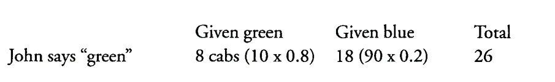

Posterior % = (10\*.8) / (90\*.2) + (10\*.8) = 8 / 26

Out of 100 cabs (90 blue and 10 green) John would identify 8 green
one\'s a green and 18 blue one\'s as green. The likelihood that the cab
was actually green when he is saying it was is 31% (8/26). It seems the
cab involved is more likely to have been blue.

### Misrepresentative evidence 

-   Failing to consider changes in factors, context or conditions when
    using past evidence to predict likely future outcomes. Includes not
    searching for explanations to why past outcome happened, what is
    required to make past record continue, and what forces can change
    it.

-   Overestimating evidence from a single case or small or
    unrepresentative samples.

-   Underestimating the influence of chance in performance (success and
    failure).

-   Only seeing positive outcomes - paying little or no attention to
    negative outcomes and prior probabilities.

-   Failing to consider variability of outcomes and their frequency.

-   Failing to consider regression - in any series of events where
    chance is involved unique outcomes tends to regress back to the
    average outcome.

### 
