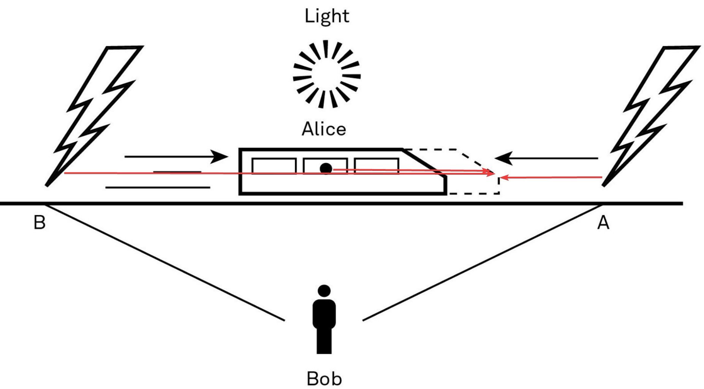

Thinking Concepts
=================

Thinking flaws
--------------

### Perspective

We have a hard time seeing any system that we are in. Galileo throwing
ball below deck on a ship vs. a fish seeing the vertical and the
horizontal movements.

### Ego

Investment into a specific opinion prevent us from seeing reality.

### Distance

The further we are from the results of our decisions, the easier it is
to keep our current views rather than update them.

Circle of Competence
--------------------

Try to stay mainly within the circle for when we stray too far, we get
into areas where we don't even know what we don't know. We may not even
know the questions we need to ask.

Try to learn the basics about areas outside your circle of competence
and try to learn from experts.

First Principle Thinking
------------------------

Clarify complicated problems by separating the underlying ideas or facts
from any assumptions based on them. What remain are the essentials. If
you know the first principles of something, you can build the rest of
your knowledge around them to produce something new.

The discovery that a bacterium, not stress, actually caused the majority
of stomach ulcers is a great example of what can be accomplished when we
push past assumptions to get at first principles.

To improve something, we need to understand why it is successful or not.
Otherwise, we are just copying thoughts or behaviors without
understanding why they worked.

Inversion
---------

There are two approaches to applying inversion in your life.

1.  Start by assuming that what you're trying to prove is either true or
    false, then show what else would have to be true.

<!-- -->

2.  Instead of aiming directly for your goal, think deeply about what
    you want to *avoid* and then see what options are left over.

The map is not the territory
----------------------------

A model is by definition a simplification of the real world, never
assume that it fully reflects the real world and update the model/map if
necessary.

Physics
=======

Relativity
----------

Different perspectives of whether lightning struck at the same time
(Bob) or first in front (Alice because of the train movement the light
from point B had to move further and thus was perceived later)

We often think someone is wrong because they see things from a different
perspective than we do. Relativity helps us to understand that there is
more than one way to see everything. That doesn't mean everyone's
perspective is equally valid, only that we might not have the most
complete view into a problem or situation.

The reality of multiple perspectives is critical to understanding the
world and your place in it. We can only see so much. In concrete terms,
relativity highlights a subjectivity of perspective that explains partly
why eyewitness testimonies have lost their credibility over the years.

Many problems become clearer if you extend the timeline. What does this
situation look like in the weeks, months, and years ahead? Assuming
different perspectives allows you to gain a more complete understanding
of what's really going on.

Reciprocity
-----------

In physics, reciprocity is Newton's third law, which states that for
every force exerted by object A on object B, there is an equal but
opposite force exerted by object B on object A. Every force involves the
interaction of two objects where the force asserted by one is
reciprocated with an equally powerful and directionally opposite force
by the other object. Forces always occur in pairs of the same type of
force, and it is not possible for one object to exert a force without
experiencing a reciprocal force.

Reciprocation teaches us that if you give people cynicism and curtness
or nothing at all, you are likely to receive the same. But if you give
people opportunity and the benefit of the doubt, you will, more often
than not, be on the receiving end of the same behavior.

Thermodynamics
--------------

1.  The first law of thermodynamics states that energy cannot be created
    or destroyed; it can only be transferred or changed from one form to
    another, such as from light to heat.

2.  The second law of thermodynamics states that entropy (a measure of
    disorder simply understood as energy unable to be used to do work)
    of an isolated system always increases. Isolated systems are those
    that spontaneously progress toward the state of maximum entropy of
    the system, also described as thermal equilibrium---no net heat flow
    between objects. The entropy of the universe only increases with
    time. One of the impacts of this law is that we need to expend
    energy to create order. Without the deployment of energy, all things
    move away from order.

-   There are more ways for things to be mixed up than sorted.

-   But there is value in contrast. If all the forces are balanced, a
    true state of equilibrium, there is no change, no growth, no
    movement. It is contrast that drives development.

-   There is a constant effort to maintain structure (avoid entropy) by
    consuming external energy (sunlight, food). In the process, life
    increases the entropy of (destroys) its environment and decreases
    entropy (builds or repairs) the organism's body.

-   

3.  The third law of thermodynamics states that as temperature
    approaches absolute zero, the entropy of a given system approaches a
    constant value.

4.  The fourth law of thermodynamics is known as the zeroth law. This is
    because it was formulated after the first three laws but is
    fundamental to and assumed by the others. It states that if two
    objects are in thermal equilibrium with a third object, then those
    two objects are also in thermal equilibrium with each other.

Inertia
-------

Starting something is hard, but so is stopping something. In physics,
inertia refers to the resistance a physical object has to a change in
its state of motion.

The relevance of mass has analogous application in our habits. The
longer we've been doing something, the more it has become part of both
our identity and our understanding of the world. Thus, the amount of
effort required to change a habit is greater proportional to the length
of time we've had it.

Getting started is the hardest part. Once something is moving in a
direction, it's much easier to keep it in motion.

To achieve our aims, reducing resistance is often easier than using more
force.

Friction and Viscosity
----------------------

While we can never eliminate the forces that impede our progress, we can
work to minimize them. Like a smooth surface provides less challenge to
a rolling ball, or how water is easier for a human to swim through than
a krill, shaping our environment to reduce the challenges of opposing
forces is a key to improving productivity.

Viscosity, which can be seen as the partner of friction, is the "measure
of how hard it is for one layer of fluid to slide over another layer."
If a liquid is hard to move it is more viscous. If it is more viscous
there is more resistance.

Velocity
--------

Velocity is often confused with speed, but the two concepts are very
different. Speed is just movement; even if you are running in place, you
have speed. Velocity has direction. You must go somewhere in order to
have velocity. This model teaches us that it's much more important to
pay attention to where you are going and not how fast you are moving

Chemistry
=========

Activation Energy
-----------------

In chemistry, activation energy is the energy that must be delivered to
a chemical system in order to initiate a reaction, breaking bonds so
that new ones can form. Molecules must collide to react, and movement
speeds up when temperature increases. All chemical reactions have a
required activation energy, but there is a range. We start with an
increase in temperature, which leads to an increase in molecular
velocity, resulting in an increase of the frequency of molecular
collisions. The more collisions, the more chances of having sufficient
energy to produce a reaction.

The bigger and more challenging an action is, the more activation energy
required. And it's important to remember that the buildup to doing
something is part of the activation energy required---this build up
includes everything.

When trying to change something it's not enough to put up the energy to
remove the unwanted thing or behaviour you also must anticipate what's
required to form a new structure once you break the old one apart.

Biology
=======

Adaption and Read Queen effect
------------------------------

We have to deal with the environment we are in, not the one we wish we
were in. Adaptations are successful relative to their performance in a
specific environment, relative to the pressure and competition the
organisms face. We don't have to be objectively best, just better than
those we are competing against. "In other words, living things do only
as well as they have to rather than optimize."[1](javascript:void(0))
