## Micro motives ≠ Macro behaviour

That is: observed macrobehavior does not automatically imply biased
micromotives!

Schelling model of segregation model (Schelling's Tipping Model -\>
Agent based model). When deciding whether to stay or move house within a
neighborhood each person has a threshold of how much they like to be
with alike people based on which they decide to stay or move (e.g.
Sonja\'s current threshold is 35%, i.e., she needs at least 35% of her
neighbors to be of the same type in order for her to remain at her
location.)

Sample Models/Social Science/Segregation

<http://www.netlogoweb.org/launch#http://www.netlogoweb.org/assets/modelslib/Sample%20Models/Social%20Science/Segregation.nlogo>

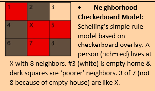

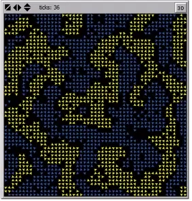
though people might be comfortable with only 30 to 40% of their
neighbors being like them, the mathematics of that preference shows that
sorting of the sort seen in the New York map above is the natural
consequence. The acceptable micropreferences (microbehavior) does not
produce the macrobehavior that is believed to be desireable by
politicians or even what X believes they would like in diveristy.

-   **Threshold = 40%:** =\> initially 28.8% unhappy and sorting yeilds
    79.5% similarity to neighbors and 0% unhappy

-   **Threshold = 52%:** initially 50.6% similar & 57.4% unhappy.
    Sorting yields 93.8% similar with 0% unhappy. Note 'black' boundary
    (empty) homes.

-   **Threshold \>= 80%:** Initially 50.6% similar and 89.6% unhappy.
    Sorting is not stable as happiness threshold cannot be met. In
    reality this suggests people move continuously. Moving continuously,
    churning

## How to make people follow examples (standing ovation model)

**Sorting** -- People that hang out together tend to act and look alike.
People that act and look alike tend to live and hang out together. (as a
result, people would move)

**PEER EFFECTS**- Stop smoking because of peer influences (looking,
acting like peers) (as a result people would switch)

<table>
<colgroup>
<col style="width: 100%" />
</colgroup>
<thead>
<tr class="header">
<th><ul>
<li>
<strong><u>Other Considerations:</u></strong> (a) layout of the
auditorium, (b) group you are with (e.g., date)
</li>
<li>
<strong><u>Layout:</u></strong> (a) Celebrity Effect – people in
front see far fewer ‘standing’ signals from the audience behind
them. 
They ‘don’t care’ what the others are doing, BUT others see them and are
thus, ‘influenced’ by whether they stand or not: hence, the Celebrity
Effect. 
(b) Those in the back see a large portion of the audience and are thus
more prone to stand, triggered by their X% threshold. But whether the
back-row folks stand or not, has significantly less effect than front
rowers. Note “they see what’s going on, but nobody pays any attention to
them [academics].”
</li>
<li>
<strong><u>Group (dates, pairs, groups):</u></strong> More likely
to do what your ‘group’ does.
</li>
<li>
<strong><u>Ways to foster standing ovation</u>: 1) Higher
Quality, 2) Lower Threshold, 3) Larger Peer Effects, 4) More Variation
(</strong>More Variation in perceived quality<strong>), 5) Use
Celebrities, 6) Many Big Groups</strong>
</li>
</ul></th>
</tr>
</thead>
<tbody>
<tr class="odd">
<td><ul>
<li>
<strong><u>Fertility:</u></strong> the Standing Ovation model is
a useful template for other problems, e.g., 
(a) <em><strong>Collective Action</strong></em>: (consider the value of
celebrities), 
(b) <em><strong>Academic Performance</strong></em>: (celebrities,
groups, raise quality, lower thresholds), 
(c) <strong>Urban Renewal:</strong> (‘fixing up your house’, small
amounts of $ for everyone may not trigger T, but large $ for a few
homeowners (E) may trigger a cascade as others try to match their
neighbor’s improved home), 
(d) <em><strong>Fitness / Health</strong></em>: (peer effects,
information by seeing other’s results, ..) 
(e) <em><strong>Online Course</strong></em> (celebrities,
etc.<strong><u>)</u></strong>
</li>
</ul></td>
</tr>
</tbody>
</table>

### Collective actions 

Threshold to buy a purple hat (if x amount has the hat, I buy it too):

| **Person**  | **Threshold** | **Will the buy?** |     | **Person**  | **Threshold** | **Will the buy?** |
|---------|----------|-----------|------|-----------|-------------|---------------|
| 1           | 1             | No                |     | 1           | 0             | **Yes**           |
| 2           | 1             | No                |     | 2           | 1             | **Yes**           |
| 3           | 1             | No                |     | 3           | 2             | **Yes**           |
| 4           | 2             | No                |     | 4           | 3             | **Yes**           |
| 5           | 2             | No                |     | 5           | 4             | **Yes**           |
| **Average** | 1.4           |                   |     | **Average** | 2             |                   |

**Collective Action:** More likely **(a) if lower thresholds** and **(b)
if more variation in the thresholds**\
Note that more variation implies more likely to have some lower
thresholds in the population to trigger and epidemic of behavior change.
Not just average thresholds but distribution of thresholds determines
cascades.

## Decision Trees

<http://silverdecisions.pl/SilverDecisions.html?lang=en>

<http://silverdecisions.pl/>

Imagine the following scenario. You\'re planning a trip to a city and
you\'ve got a ticket to go to the museum, let's say from one to two. And
suppose the museum is quite a way from the train station. So, you look
at train ticket prices and you see you can buy a ticket for the three
o\'clock train. For only \$200. But the four o\'clock train is \$400.
You know, should I try and save money by buying that ticket for the
three o\'clock train before it sells out? Now there\'s a 40 percent
chance you\'re not going to make. The train. So now you got to think, oh
my gosh, should I but the ticket or not? Give there\'s a 40 percent
chance I\'m not going to make it. And if I don\'t make it, then I\'m
going to have to buy two tickets. I\'m going to basically throw away the
\$200.

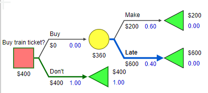

.6\*200+.4\*600 = 360 vs. 400 better go for the buy option.

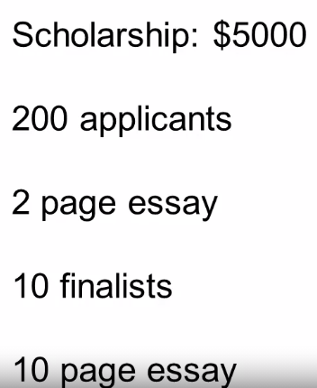

### Inferring probability

Investment opportunity to win 50,000 \$ while investing 2,000\$ what
probability of winning do we need to pay off?

50,000p -- 2,000 (1-p) \> 0

50,000p -2,000 + 2,000p \> 0

52,000p \> 2

p \> 52,000/2 = 4%

50 \* x + -2 \* (x-1) \> 0

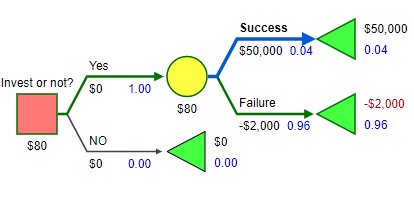

### Infer payouts

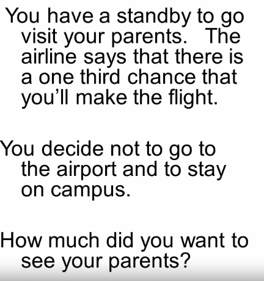

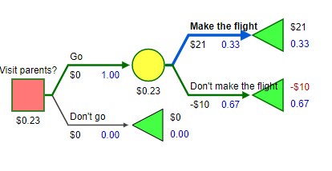

Assuming that there is a cost to go to the Airport

1/3 \* (VisitPayoff -- CostPayOff) + 2/3 (-CostPayOff) \< 0

1/3 VisitPayOff -- 1/3 CostPayOff - 2/3 CostPayOff \< 0

1/3 VisitPayOff - CostPayOff \< 0

1/3 VisitPayOff \< CostPayOff

VisitPayOff \< 3 \* CostPayOff (if you didn't go it means the visit
PayOff was less than 3 times greater than the cost payoff

### Value of information

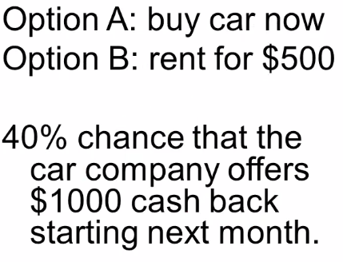

How much would I pay to know that there is going to be a cashback
program?

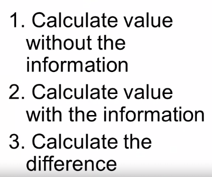

1.  Without information (I'm better of buying now with 0\$ pay off)

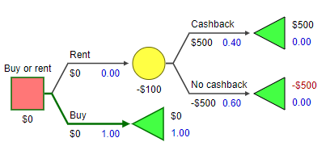

2.  With Information (I better rent and with a payoff of \$200)

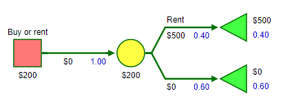

3.  \$200 -- 0\$ = **\$200**

## Modeling people

When we construct a model, we want to think about how the agents will be
acting: rationally, behaviorally, or according to simple rules. We
gather data about how agents will act and use this information to
construct the model.

### Rational

### When to expect rational thinking:

### Large stakes involved

### Repeated decisions offer learning

### Group Decisions

### Easy decisions.

-   "As if": Intelligent rule-based behavior may be indistinguishable
    from optimal or near-optimal behavior.

-   Benchmark: Optimal behavior provides a benchmark as an upper bound
    on people's cognitive abilities.

-   Logical but people are not always logical.

-   Will describe application to decision making and games.

-   Actors have an objective and optimize to that objective.

-   Firms -- maximize profits,

-   Individuals -- maximize utility,

-   Political Candidate -- maximize votes

-   Apply to: Investments, Purchases, Educational level, Vote for

-   Rational does not imply selfish

#### Optimize revenue

Revenue = price \* quantity

Quantity = q

Price = 50 -- q (more supply lowers price)

Optimize q for maximum revenue

Revenue = (50-q) \* q

### Behavioral

-   Observe people are not rational.

-   Prospect Theory -- gains and losses viewed differently

-   Hyperbolic Discounting -- how much we discount the future

-   Status Quo Bias -- tendency to stick with what we have and avoid
    changes.

-   Base Rate Bias -- influenced by what we are currently thinking

### Rule based

e.g., Schelling, simple rule that is close to what people do.

## Tipping points

Basic Idea: A small change in input makes a very large change in output
as seen in the graph. Note: Time charts can be misleading.

http://www.netlogoweb.org/launch#http://www.netlogoweb.org/assets/modelslib/Sample%20Models/Earth%20Science/Fire.nlogo

Tipping point = 59% in terms of tree density in a forest and the spread
of fires

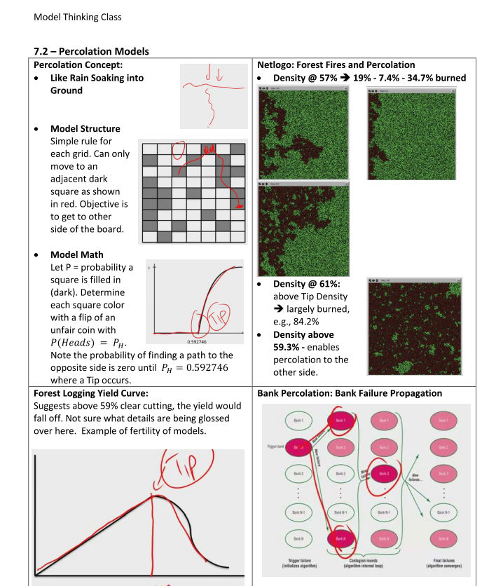

## Rule of 72

he **Rule of 72** is a simple way to determine how long an investment
will take to double given a fixed annual rate of interest. By
dividing **72** by the annual rate of return, investors obtain a rough
estimate of how many years it will take for the initial investment to
duplicate itself.

Exponential growth: If you start with 1 penny and double it every day
you have more than 10 Million after 31 days

## Why do some countries not grow?

-   Growth requires a strong central government to protect capital and
    investment

    -   BUT that government cannot be controlled by a select few.
        Extraction (by protected government supporters) limits growth by
        lowering investment and capital.

-   Increases in innovation means less labor is required.

-   Growth requires creative destruction

    -   Growth rates are supported by innovation in the long run.

## Innovation

**Teams:**

Teams have different perspectives and different heuristics, and all that
diversity makes them better than individuals on average.

**Recombination:**

Big Idea: Solutions from one problem and a solution from another problem
are combined to make a better solution.

Recombining solutions from a number of subproblems yields better
solutions.

## Culture

Summary: Basic Cultural properties: there\'s a lot of difference between
cultures, and those difference may arise because the fact that people
need to coordinate within groups with which they interact. There\'s also
consistency within cultures, and that happens because it gets
cognitively easier to do the same behavior in lots of different domains.
And then third, we see a lot of heterogeneity within cultures. And that
happens, as we saw by using a Markov analysis on our model, because if
people just make small mistakes or occasionally try an innovation, those
differences are going to propagate through the population in two ways;
within an individual and across individuals. And that\'s going to give
us a lot of within-culture heterogeneity. So cultures differ between
themselves. Cultures differ within themselves. But they still have this
consistency. They have what you might call a cultural signature. These
very simple models combined with our tools of Lyapunov functions and
Markov processes have helped us understand why that happens.

## Condorcet\'s Jury Theorem

Condorcet\'s jury theorem states that given a group of voters (a
\"jury\") independently choosing by majority vote between a correct
outcome with probability
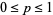
an incorrect one with probability
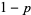

1\. If
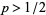
that each voter is more likely to vote correctly that incorrectly),
adding more voters increases the probability that the majority chooses
correctly and the probability of a correct decision approaches 1 as the
number of voters increases;

2\. If
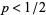
that each voter is less likely to vote incorrectly than correctly),
adding more voters decreases the probability that the majority chooses
correctly and the probability of a correct decision is maximized for a
jury of size one.

## Terminal velocity

**Terminal velocity** is the maximum velocity attainable by an object as
it falls through a [fluid](https://en.wikipedia.org/wiki/Fluid)
([air](https://en.wikipedia.org/wiki/Air) is the most common example).

Falling skydivers reach terminal velocities of 200 mph. Terminal
velocities scale with the inverse of mass. Assume that a skydiver has a
mass 400 times larger than the stuffed cheetah. For a heavy object, the
terminal velocity is generally greater than a light object. This is
because air resistance is proportional to the falling body\'s velocity
squared. The square root of 400 equals 20. Therefore, the terminal
velocity of the stuffed cheetah will equal 200 mph divided by 20, or 10
mph.

| Object         | Mass             | Terminal velocity                        |
|------------------------|------------------------|------------------------|
| Sky diver      | 100 kg           | 200 kph                                  |
| Stuffed animal | 100/400 = .25 kg | 200 kph / Sqrt(100 kg / .25 kg) = 10 kph |

<https://hypertextbook.com/facts/1998/JianHuang.shtml>

## Entropy

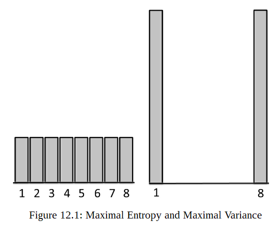

Entropy measures the uncertainty associated with a probability
distribution over outcomes. It therefore also measures surprise. Entropy
differs from variance, which measures the dispersion of a set or
distribution of numerical values. Uncertainty correlates with
dispersion, but the two differ. Distributions with high uncertainty have
nontrivial probabilities over many outcomes. Those outcomes need not
have numerical values. Distributions with high dispersion take on
extreme numerical values.

-   Capture the evenness of a distribution across types. (kinda
    variation for categorical values)

-   Also called Simpson's index

-   Does not take the differences between the types into account (e.g.
    differences between apples and peers vs. elephants and apples)

-   E.g. colors of tables

-   There is 1/3 red 1/3 white and 1/3 white tables

-   Square each result (i.e. 1/3^2^\*3) = 1/3

-   Take the inverse of the number = 3/1

-   The entropy is higher the more types there are

-   The entropy is lower if the proportions of the type are unequal
    (more of one type as compared to the others)

## Classes of outcomes

-   Equilibrium

-   Cyclic

-   Random

-   Complex

A pencil resting on a desk is in equilibrium. The planets orbiting the
sun are in a cycle. A sequence of coin flips is random, so are
(approximately) stock prices on the New York Stock Exchange, as we shall
learn in the next chapter. Finally, the neuronal firings in a person's
brain are complex; they do not fire randomly, nor do they fire in a
fixed pattern.

## Bernoulli 

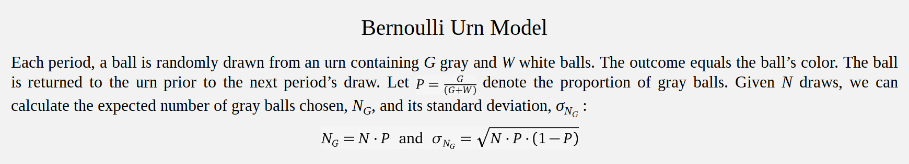

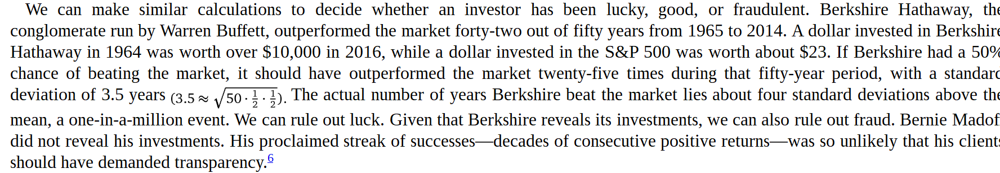

A player who makes 46% of his three-pointers has about
a 1/1000probability of making nine in a row (0.46^9^). If that player
keeps taking three-pointers, then in a ten-year NBA career (about 800
games), the odds of *not* making nine in a row at least once
(0.999^800^) are about 47%.

## Networks

### Degree 

Measure of connectedness of a network. For one node it is the number of
nodes it is connected to. For a network it is the average degree of all
nodes. But can also be measured as:

2 x \# Edges (because each edge connects to nodes) / Nodes

A network has 50 nodes and 100 edges. What is the Average Degree of the
network? 2 \* 100 / 50 = 4

Node = Dots

Edges = Connections

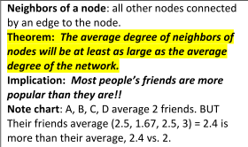

| Node        | \# friends |
|-------------|------------|
| A           | 2          |
| B           | 3          |
| C           | 2          |
| D           | 1          |
| **Average** | 2          |

<table>
<colgroup>
<col style="width: 22%" />
<col style="width: 22%" />
<col style="width: 22%" />
<col style="width: 32%" />
</colgroup>
<thead>
<tr class="header">
<th>Node</th>
<th>Friends</th>
<th># Friend’s friends</th>
<th>Average of friend’s friends</th>
</tr>
</thead>
<tbody>
<tr class="odd">
<td>A</td>
<td>
B

C
</td>
<td>
3

2
</td>
<td>2.5</td>
</tr>
<tr class="even">
<td>B</td>
<td>
A

C

D
</td>
<td>
2

2

1
</td>
<td>1.66</td>
</tr>
<tr class="odd">
<td>C</td>
<td>
A

B
</td>
<td>
2

3
</td>
<td>2.5</td>
</tr>
<tr class="even">
<td>D</td>
<td>B</td>
<td>3</td>
<td>3</td>
</tr>
<tr class="odd">
<td>Average</td>
<td></td>
<td></td>
<td>2.4</td>
</tr>
</tbody>
</table>

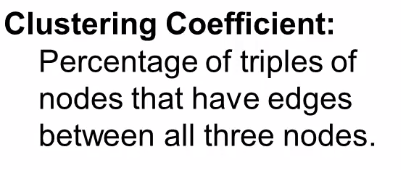

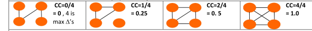

Numbers of triangles (see below) over of all possible triangles

Number of possible triangles = number edges choose 3.

E.g. 4 choose 3 = 4 =FACT(4)/(FACT(3)\*FACT(4-3))

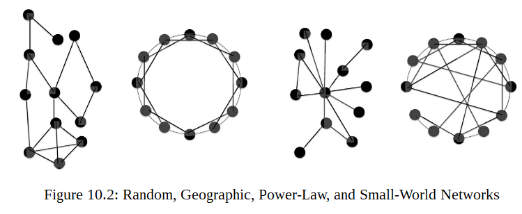

Small worlds network model
<http://www.netlogoweb.org/launch#http://www.netlogoweb.org/assets/modelslib/Sample%20Models/Networks/Small%20Worlds.nlogo>

Preferential attachment model
<http://www.netlogoweb.org/launch#http://www.netlogoweb.org/assets/modelslib/Sample%20Models/Networks/Preferential%20Attachment.nlogo>

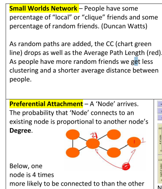

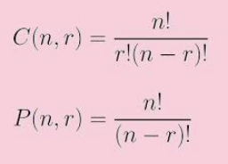

## Randomness

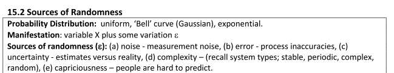

Outcome **= a (luck) + (1-a) (skill) -- with a 0 \<= a \<= 1**

-   Use performance to determine a.

-   If the outcome is consistent then a is small (luck doesn't play a
    big role). If the outcome is showing huge variations a is big.

-   

**Reasons to use this model**

\(a\) the model helps to assess outcomes

\(b\) anticipate reversion to the mean (if luck is involved people will
not win or lose consistently)

\(c\) give good discerning feedback (in case the outcome is due to
skill)

\(d\) fair allocation of resources (skill or luck(fairness).

**The Paradox of Skill (Maubossin): When you have the very best
competing, the differences in their skill levels may be close. So the
winner will be determined by luck!**

**Random walks.**

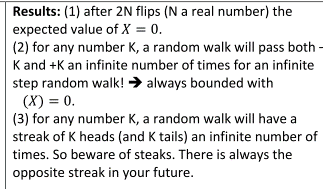

**Summary: An outcome may be a series of random events and thus we
should expect to see some big winners and some big losers. So we cannot
expect past performance to be a good indicator of future performance.
Thus key question is -- is this a random walk process -- or not? If so,
expect regression to the mean.**

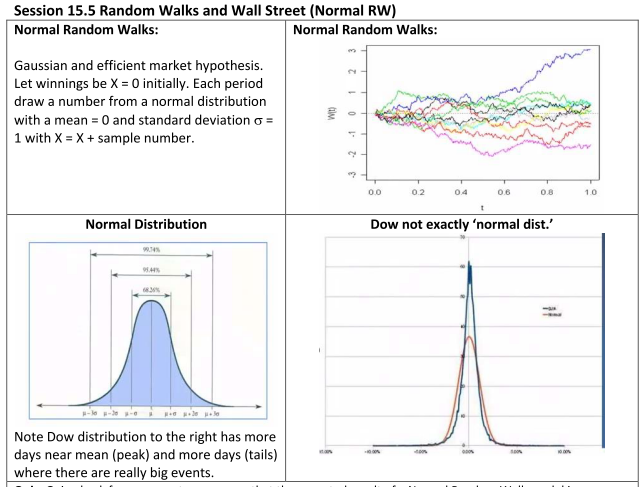

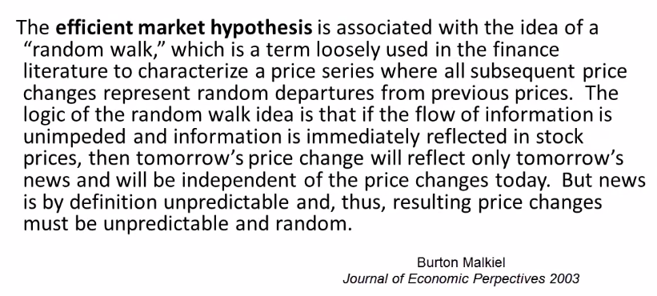

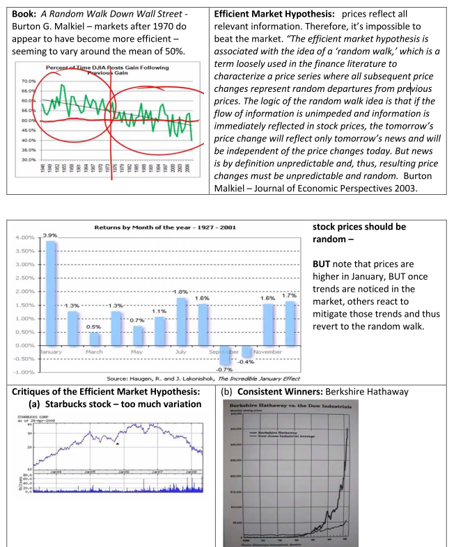

**Efficient Market Hypothesis helps explain although there may be some
deviations / challenges as noted in the critiques.**

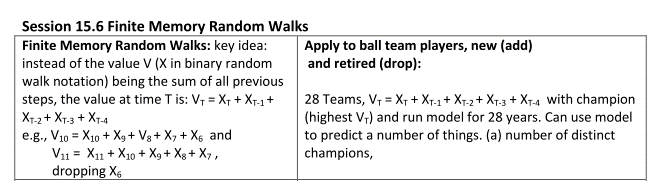

This is like a sliding window of randomness affects the overall outcome
(e.g. employees leaving and new employees getting hired; new and old
products, team's of players)

## Strategy

Colonel Blotto: A way to analyze competition, along multiple fronts
trying to find advantages through strategic mismatch your opponents
choices.

Insight: Weaker player improves opportunities by opening more fronts
(dimensions). Since this will make the stronger opponent to spread out
their troops more so that the weaker opponent has the ability to win on
some fronts at least. Example:

differentiation in products, terrorists attack in unexpected places.

## ~Prisoners'\ dilemma~

Two players who can either cooperate or defect. Collectively they are
better off if both cooperate but individually, they are better off if
they defect (avoiding 0 pay-off)

### Examples

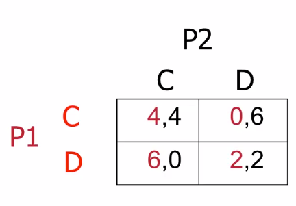

| First move | Second move | Pay-off P1 | Pay-off P2 |
|------------|-------------|------------|------------|
| P1 = C     | P2 = D      | 0          | 6          |
| P1 = D     | P2 = D      | 2          | 2          |

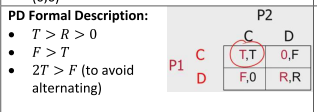

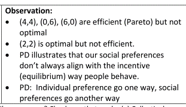

Different application of PD

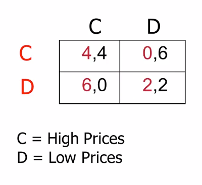

Firms would be better of with high prices but since they are
individually better off with lower (gaining more market share over the
competition) prices they will end up with lower prices.

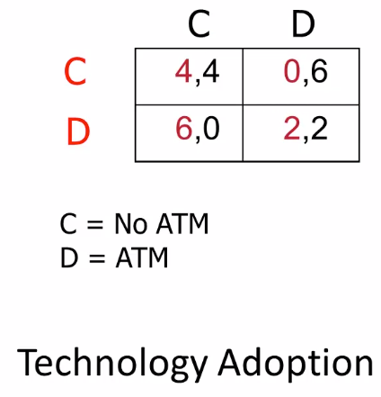

-   2 banks decide either not to buy ATM machines or to buy ATM machines

-   If they don\'t buy ATM  machines Both make profits of, let\'s say,
    four.

-   if one of them buys buys ATM machines, and puts them up all over
    town, everyone will go to that bank.

-   The other bank is forced to do the same. Now, both of them have
    probably the same customers they had to start out with, but 
    they\'ve spent all this money on ATM machines. So they\'re actually
    worse off. 

-   In fact, it could even be worse than that. Because maybe before,
    part of  the reason they made such profits is because they got
    geographic grants. People  who lived around the bank shopped at that
    bank. Now that there\'s ATM machines  anywhere, people can shop
    whatever bank they want. And that\'s created more price 
    competition, we end up with the consumers being better off. 

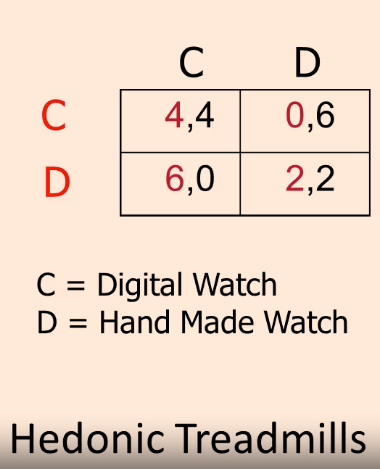

When player 1 gets the expensive hand made match he gets all the
attention.

### Ways to achieve cooperation

-   Repeated Interactions (direct reciprocity),

-   Reputation (indirect reciprocity)

-   Networks

-   Group Selection Influence

-   Kin Selection

-   Laws (prohibitions)

-   Incentives (fines, fees, and subsidies).

## Collective action problems

There is a cost to the individual if they take action but, yet a benefit
to all if they do so. (free rider problem)

Assume 10 people with cooperation payoff = 1 and defection payoff = 0
for everyone and ß = 0.6. If x~1~ defects his payoff is 5.4 but if
cooperates his payoff is 5.0 so it is his advantage to defect to the
expense of his colleagues.

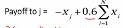

x~1~ takes action: 0 + .6 \* 9 = 5.4 - 0 because no cost of taking
action; 9 because x~1~ takes no action

x~1~ takes no action: -1 + .6 \* 10 = 5 - -1 = cost for x~1~ to take
action; 10 = including x~1.~

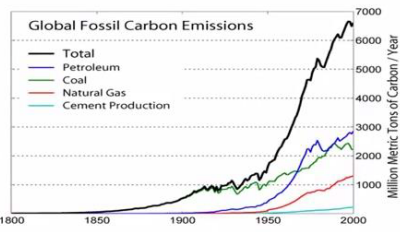

## Common pool resource problems

Limited resource available to be used by many

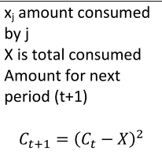

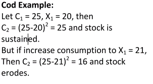

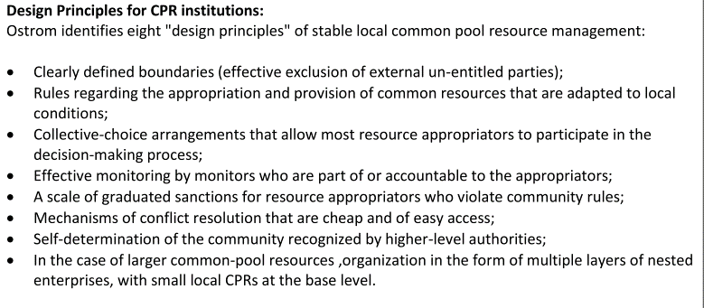

## Mechanism design

Designing incentive structures so that we get the sort of outcomes we
want.

Reveal hidden actions/information.

Incentive compatibility = It makes sense for a worker to put in effort
if the amount of money received minus the cost of effort must be greater
than or equal to the probability that if they slack off, the outcome
will be good anyways.

## Fisher's theorem

More variation = faster adaptation

Fisher's theorem vs. six sigma
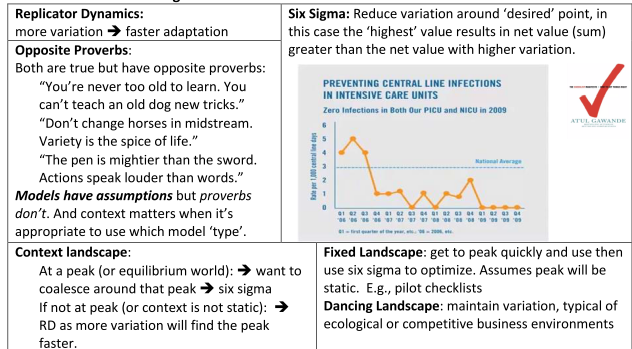

## Diversity Prediction Theorem

\(a\) more accurate individuals imply more accurate predictions

\(b\) more diversity in crowd implies more accurate predictions.

## Mechanism Design

An institution consists of a means through which people communicate
information as well as a procedure for making decisions, reallocating
resources, or producing outputs based on the information revealed. In
markets, people and firms communicate through prices to execute trades
and make production decisions. In hierarchies, people communicate
through written language to organize work plans. And in democracies,
people communicate preferences through votes. Voting rules then decide
policies. Well-designed institutions induce communications and actions
that produce desirable outcomes. Ineffective institutions do not.

Mechanism Design highlight four aspects of institutions:

1.  ***information**,* what the participants know and should be revealed
    to them;

2.  ***incentives**,* the benefits and costs of taking particular
    actions

3.  how the individual ***incentives*** actions translate into
    collective **outcomes**;

4.  ***computational costs**,* the cognitive demand placed on
    participants.

### Mount-Reiter diagram

A mechanism consists of six parts:

1.  an *environment* (the relevant features of the world)

2.  set of *outcomes,*

3.  a set of *actions* (called the *message space*)

4.  a *behavioral rule* that people follow to produce actions

5.  an *outcome function* that maps the actions into outcomes

6.  a *social choice correspondence* that maps the environment into a
    set of hoped-for outcomes.

Within a set of outcomes, an outcome is **Pareto dominated** if there
exists an alternative that everyone prefers. All other outcomes are
**Pareto efficient**.

For an example of Pareto efficiency, consider the following four payoff
profiles for three people:

-   {(3, 3, 4), (9, 0, 0), (0, 8, 1), (2, 2, 3)}

-   All except (2, 2, 3) are Pareto efficient. The allocation (2, 2, 3)
    is dominated by (3, 3, 4).

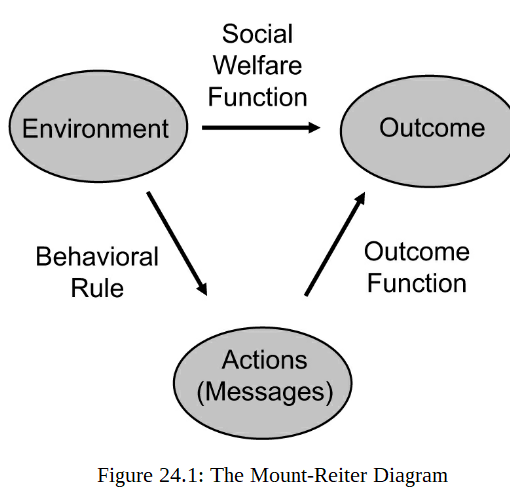
