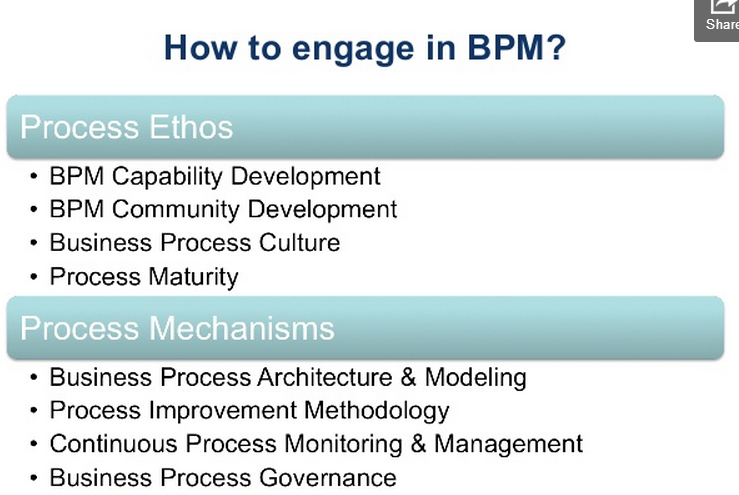
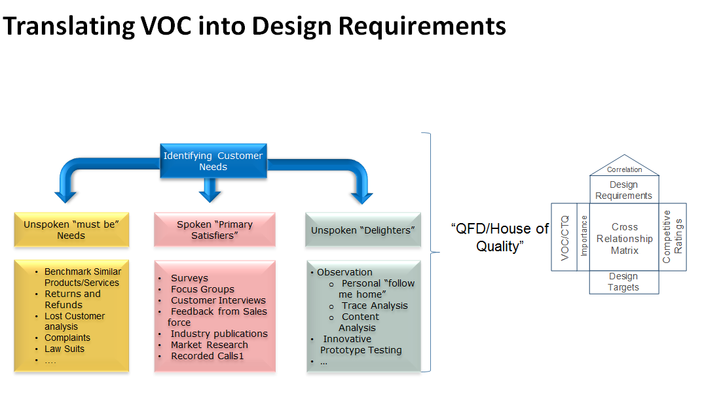
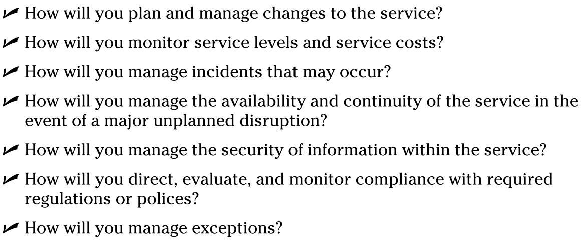
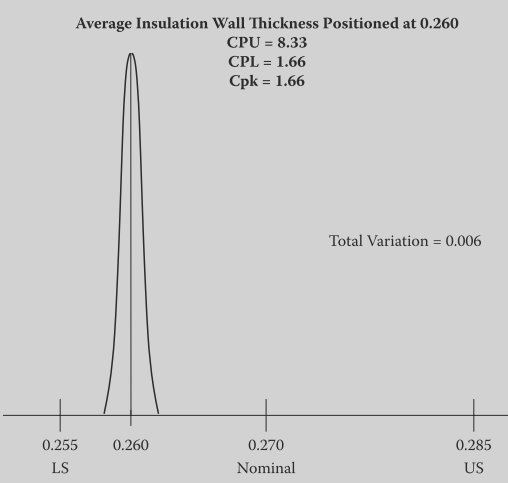

<http://www.slideshare.net/MarlonDumas/fundamentals-of-business-process-management-a-quick-introduction-to-valuedriven-process-thinking>

http://www.slideshare.net/marlondumas

Questions to ask about a process

-   What are the handoffs (it\'s not a process if there are not at least
    2-3 handoffs)

-   What are the ways the process can go wrong

-   What are the ways the process can produce positive/negative outcomes

-   What value does the process deliver to the customer?

-   Who are the customers of the process?

-   What business processes are affected by a business rule change

Separate business rules from processes

Process reference frameworks:

ITIL = for it services

BPMCBOK = for project management

BPM advantages
==============

-   Model business process

-   Understanding - Do we really know how work actually gets done?

-   Documentation - Is the intellectual capital embedded in our
    processes?

-   Innovation - Are we continuously improving org performance?

-   Manage business process

-   Control - Do we have control over the things that really matter?

-   Transparency - Are our operations suitably transparent and
    auditable?

-   Compliance - Are we meeting our obligations?

**BPM relation to other methodologies like 6 sigma, TQM\...**

BPM is about managing and improving processes, whatever tools it takes
to do so is most welcome.

**General goals of a process**

-   Reduce cost, faster delivery, better quality

-   Improve business process

-   Productivity - Are we making most of time and money?

-   Agility - Are we able to respond to demands and opportunities?

-   Satisfaction - Are customers and employees satisfied?

BPM lifecycle
=============

Process Architecture
====================

Business Process Modelling notation
===================================

Process Analysis
================

Qualitative Analysis
--------------------

CMMI for services
=================

CMMI ® (Capability Maturity Model ® Integration) models are collections
of best practices that help organizations to improve their processes.
The CMMI-SVC model provides guidance for applying CMMI best practices in
a service provider organization. Best practices in the model focus on
activities for providing quality services to customers and end users.

A Capability Maturity Model ® (CMM ® ), including CMMI, is a simplified
representation of the world. CMMs contain the essential elements of
effective processes.

The SEI has taken the process management premise, "the quality of a
system or product is highly influenced by the quality of the process
used to develop and maintain it," and defined CMMs that embody this
premise.

The CMM Integration ® project was formed to sort out the problem of
using multiple CMMs. The combination of selected models into a single
improvement framework was intended for use by organizations in their
pursuit of enterprise-wide process improvement. Developing a set of
integrated models involved more than simply combining existing model
materials. Using processes that promote consensus, the CMMI Product Team
built a framework that accommodates multiple constellations.

The CMMI Framework provides the structure needed to produce CMMI models,
training, and appraisal components. To allow the use of multiple models
within the CMMI Framework, model components are classified as either
common to all CMMI models or applicable to a specific model. The common
material is called the "CMMI Model Foundation" or "CMF."

The components of the CMF are part of every model generated from the
CMMI Framework. Those components are combined with material applicable
to an area of interest (e.g., acquisition, development, services) to
produce a model.

A "constellation" is defined as a collection of CMMI components that are
used to construct models, training materials, and appraisal related
documents for an area of interest (e.g., acquisition, development,
services). The Services constellation's model is called "CMMI for
Services" or "CMMI-SVC."

CMMI-SVC draws on concepts and practices from CMMI and other service
focused standards and models, including the following:

-   Information Technology Infrastructure Library (ITIL)

-   ISO/IEC 20000: Information Technology---Service Management

-   Control Objectives for Information and related Technology (CobiT)

-   Information Technology Services Capability Maturity Model (ITSCMM)

The CMMI-SVC model covers the activities required to establish, deliver,
and manage services. As defined in the CMMI context, a service is an
intangible, non-storable product. The CMMI-SVC model has been developed
to be compatible with this broad definition.

The Software Engineering Institute (SEI) has found several dimensions
that an organization can focus on to improve its business.

Organizations typically focus on:

-   People

-   procedures and methods

-   tools and equipment

What holds everything together? It is the processes used in your
organization. Processes allow you to align the way you do business. They
allow you to address scalability and provide a way to incorporate
knowledge of how to do things better. Processes allow you to leverage
your resources and to examine business trends.

This is not to say that people and technology are not important. We are
living in a world where technology is changing at an incredible speed.
Similarly, people typically work for many companies throughout their
careers. We live in a dynamic world. A focus on process provides the
infrastructure and stability necessary to deal with an ever-changing
world and to maximize the productivity of people and the use of
technology to be competitive.

Problem solving
===============

Y= f(x~1~,x~2~,x~3~\...x~n~) = Builds an strategic alignment

Y=output/effect consists of smaller y's. Y is a function of multiple
causes

x=causes

CCR = Critical customer requirements = translated from VOC into concrete
requirements

Kano Model
----------

**Must be** attributes are the expected attributes or "musts" of a
product, and do not provide an opportunity for product differentiation.
Increasing the performance of these attributes provides diminishing
returns in terms of customer satisfaction, however the absence or poor
performance of these attributes results in extreme customer
dissatisfaction. **Requirement that can dissatisfy, but cannot increase
satisfaction.**

**Primary Satisfiers** Performance attributes are those for which more
is generally better, and will improve customer satisfaction. Conversely,
an absent or weak performance attribute reduces customer satisfaction.
Of the needs customers verbalise, most will fall into the category of
performance attributes. These attributes will form the weighted needs
against which product concepts will be evaluated.

The price for which customer is willing to pay for a product is closely
tied to performance attributes. For example, customers would be willing
to pay more for a car that provides them with better fuel economy.

**Delighters** Excitement attributes are unspoken and unexpected by
customers but can result in high levels of customer satisfaction,
however their absence does not lead to dissatisfaction. Excitement
attributes often satisfy latent needs real needs of which customers are
currently unaware. In a competitive marketplace where manufacturer
products provide similar performance, providing excitement attributes
that address unknown needs can provide a competitive advantage. Although
they have followed the typical evolution to a performance then a
threshold attribute, cup holders were initially excitement attributes.
**If the requirement is absent, it does not cause dissatisfaction, but
it will delight clients if present**

**Other Attributes:** Products often have attributes that cannot be
classified according to the Kano Model. These attributes are often of
little or no consequence to the customer, and do not factor into
consumer decisions. An example of this type of attribute is a plate
listing part numbers can be found under the hood on many vehicles for
use by repairpersons

A relatively simple approach to applying the Kano Model Analysis is to
ask customers two simple questions for each attribute (Satisfied,
Neutral (should be that way), Dissatisfied, does not affect my
satisfaction):

**1. Rate your satisfaction if the product has this attribute?; and**

**2. Rate your satisfaction if the product did not have this
attribute?**

-   Basic attributes generally receive the "Neutral" response to
    Question 1 and the Dissatisfied response to Question 2. Exclusion of
    these attributes in the product has the potential to severely impact
    the success of the product in the marketplace.

Eliminate or include performance or excitement attributes that their
presence or absence respectively lead to customer dissatisfaction. This
often requires a trade-off analysis against cost. As Customers
frequently rate most attributes or functionality as important, asking
the question How much extra would you be willing to pay for this
attribute or more of this attribute? will aid in trade-off decisions,
especially for performance attributes. Prioritisation matrices can be
useful in determining which excitement attributes would provide the
greatest returns on Customer satisfaction

**Examples:**

Must Be = Customer receives refund

Primary Satisfier (more is better) = Refund received within timeframe

Delighter = Receiving extra present ( discount for next purchase)

CTQ = Critical to quality

Use SIPOC for stakeholder analysis

Look for waste in processes (mark value-added, non-value added and
value-added but necessary process steps)

Determine process capability

Data
----

-   Look at the distribution rather than only averages

-   Narrow range of distribution and reduce variation. Reduced variation
    = higher process stability

-   Look at defects rather than averages

-   Know the CCRs

-   At 6 Sigma the customer requirement is 6 standard deviations from
    the mean of the process output. If a process runs at 6 six sigma
    there are only 3.4 defects out of 1 million.

    

-   Measure performance against process capability

Process Improvement handbook
============================

In simple terms, the primary difference between a process and a
procedure is that a process is what you do and a procedure is how you do
it.

*Process Management* is the ensemble of planning, engineering,
improving, and monitoring an organization's processes in order to
sustain organizational performance. It is a systematic approach to
making an organization's workflow more effective, more efficient, and
more capable of adapting to an ever-changing environment. A business
process can be seen as a value chain or a set of activities that will be
used to accomplish a specific organizational goal in order to meet
customer requirements. Consequently, the goal of process management is
to reduce human error and miscommunication in these processes and to
focus stakeholders on improving their operating environment using
Process Improvement methods.

<http://www.acuityinstitute.com/design-for-six-sigma.html>

DFSS
====

-   Quantify the gap between as is and target for each KPI (e.g.
    comparison of current market share with current product on the
    market with intended market share with new product in target market)

-   Weigh KPI goals according to strategic alignment Benefit estimation
    based on alternative project approaches by quantification of
    expected contribution to "closing the gap"

-   Evaluate occurrence probability, i.e. probability that the
    respective product and/or process innovation can contribute the
    expected contribution to "closing the gap"

-   Conduct cost estimate for each project approach by estimating the
    project expenses up to initial revenue receipt (alternatively: up to
    first positive contribution to margin or until Break Even is
    achieved)

Service Management
==================

For all repeated services, a process is employed to carry out the
service, and a set of service management processes is used to manage the
service.

The expectations of the customer are defined primarily by context.

In evaluating service quality, measurements of customers' and
stakeholders' satisfaction are the most important.

Service management is the management of a service to ensure that it
meets the critical outcomes the customer values and the stakeholders
want to provide. The execution of a service is the process of performing
the task, whereas service management is the process of making sure that
the task is performed according to expectations.

To optimize your outcome over time, you need to monitor customers'
expectations on an ongoing basis; simply assuming that current service
goals will remain static isn't good enough. The situation is dynamic,
and when customers' expectations change, the service provider needs to
recognize and respond to the changes.

To achieve this goal, measure both performance and desired outcomes. You
can measure customers' expectations by conducting customer feedback
surveys and by monitoring customer responses to changes in price or
other factors that affect the delivery of services. Companies use a
variety of traditional surveys and Web-based monitoring tools to measure
sales and customer relationship effectiveness and to keep track of
performance at many levels. You must measure service activities for
aspects such as cost, duration, human effort, and quality. You also need
to measure progress toward the outcomes that both the customer and the
stakeholders had in mind when the service was established.

Process capability
==================

For discussion purposes, we will assign a customer diameter
specification of 0.5 ± 0.005 to the machined parts of Figure 2.3. The
low specification is 0.495, and the high specification is 0.505.

A 1.33 capability ratio is the minimum required by most manufacturers
and can easily be determined for the process using the following
arithmetic:

Customer nominal = 0.5

Customer upper specification = 0.505

Customer lower specification = 0.495

Customer specification range is 0.01 total (0.505 -- 0.495)

Process is centered at 0.5

Variation = 0.006 total (UCL -- LCL; 0.503 -- 0.497)

Diameter Capability Ratio = Total Specification/Total Variation

Diameter Capability Ratio = 0.01/0.006

Diameter Capability Ratio = 1.66

The process is stable and capable with regard to the product
characteristic "diameter."

Original idea originates from Ford quality manual for its suppliers:

**The lower and upper specifications were what Ford was willing to
accept, not desirable but acceptable.**

-   Over the years, the suppliers had become accustomed to consuming the
    entire range of specification.

-   No process is safe from minor process average shifts due to
    occasional periods of instability.

-   Ford would receive under low and over high parts when a supplier's
    process was consuming the entire range of specification and minor
    instability was experienced. Out-of-specification parts would result
    in rejects if found at incoming inspection and slowed production if
    found on the assembly line.

-   If a supplier was consuming less than the entire specification and a
    minor shift in the average due to instability, there would be a
    better chance that under low and over high specification product
    would not be produced and shipped to Ford.

-   Therefore, beginning with the publication of Ford Q101, all
    suppliers were required to demonstrate their capability of providing
    Ford with product that consumed no more than 75% of the agreed-on
    specification when the product average was centered at nominal.

> **A process can be stable and yet not capable.**
>
> The full range of samples selected randomly from a production run does
> not necessarily represent the full range of measurements that will be
> found if all the product were to be measured.
>
> **Calculate total specification (range of variation) required to reach
> a capability rate of 1.33:**
>
> CR =Total Specification/Total Product Variation
>
> CR (1.33 minimum) x Total Product Variation = Total Specification
>
> 1.33 x 0.04 (UCL 0.57-- LCL 0.53) = Total Specification
>
> 1.33 0.04 = 0.0532
>
> 0.0532 = Total Specification required to meet a 1.33 CR with the
> existing Total Product Variation.
>
> **Capability Index (Cpk) versus Capability Ratio (CR)**
>
> 
>
> The Cpk is the same concept as the CR. The only difference is that we
> use Cpk when the product average is not the same as the customer
> nominal specification.
>
> The arithmetic for CR develops one number such as 1.33 to describe the
> capability of the process. The arithmetic for Cpk develops two
> numbers:

-   The capability index for lower specification (CPL) describes the
    capability of the process in relation to the lower specification.

-   The capability index for upper specification (CPU) describes the
    capability of the process in relation to the upper specification.

-   One number, the lower number of CPL and CPU, is used to describe the
    capability of the process, and it is termed Cpk.

The question for management now becomes how to determine the Cpk when
the average is not on nominal while maintaining the industry standard
minimum Cpk of 1.33.

The answer is rather simple. Because the center of the normal curve will
no longer be on the nominal, the distance between product average and
the lower and upper specifications will no longer be equal. If the
distances are not equal, we now have two numbers to describe the
capability of the process. These numbers will take into account:

-   The customer's lower specification, nominal, and upper specification

-   The product average

-   The amount of wall thickness variation about the product average

One number will describe the distance from the low end of the product
variation to the lower specification, and the other number will describe
the distance from the high end of the product variation to the upper
specification. These numbers are called the CPL and the CPU.

Convention mandates that if either one of these two numbers is less than
1.33, we cannot call the process capable.

If management decided to change the SOP and place the wall thickness
average at 0.26, the arithmetic to determine the CPL and the CPU would
be as follows:

CPL = Product Average -- Lower Specification ÷ ½ Total Variation

CPL = (0.26 -- 0.255) ÷ ½ × (0.006)

CPL = 0.005 ÷ 0.003

CPL = 1.66

CPU = Upper Specification -- Product Average ÷ ½ Total Variation

CPU = (0.285 -- 0.260) ÷ ½ × (0.006)

CPU = 0.025 ÷ 0.003

CPU = 8.33

Generally speaking, product problems on the shop floor or at the
customer or supplier fall into one of two categories. The problem can be
one of instability or of incapability. Specifically, the problem exists
because the product average has shifted or because the product has too
much variation about a consistent average.

The purpose of a process capability study is to determine if the
manufacturing process is stable and capable by measuring the critical
product characteristic of interest. The product measurements are then
used to develop a statistical product control chart. By analyzing the
data patterns on the control chart, we determine if the process is
stable. If the process is stable, we then use the data to determine a
Cpk value in order to determine the degree of capability.

It is impossible to determine if a manufacturing process is stable if
the measurement process used to measure the product is not stable. This
is because an unstable measurement process will make a perfectly stable
manufacturing process appear to be unstable. Unfortunately, unstable
measurement processes in manufacturing are common.

Six Sigma
=========

<http://lean-six-sigma.pro/Documents/Explaining%20sigma%20shift%20v2.pdf>

<http://www.isixsigma.com/new-to-six-sigma/dmaic/scientific-problem-solving-dmaic-terms-y-fx/>

A Six Sigma project is successful when the team is able to solve Y =
f(x).That is, relate all the key inputs to each expected output within a
small magnitude of error

