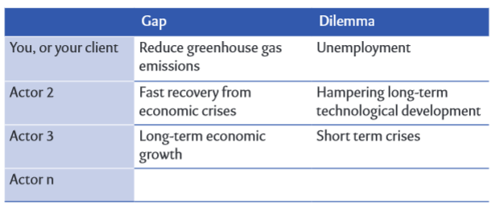
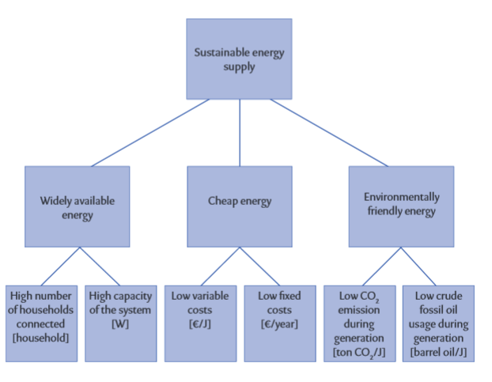
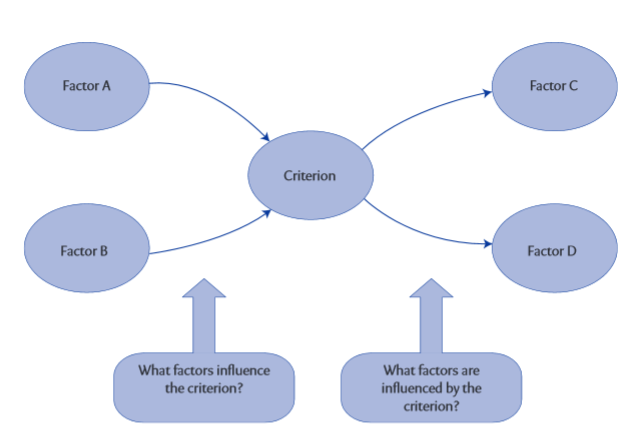
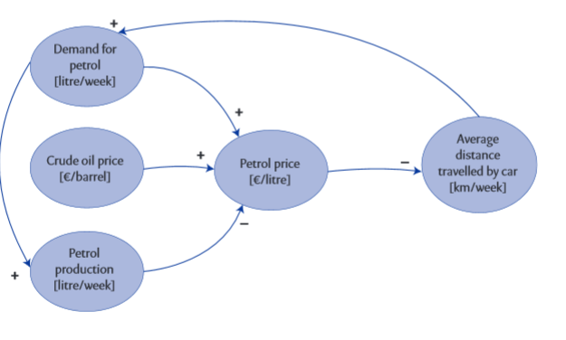
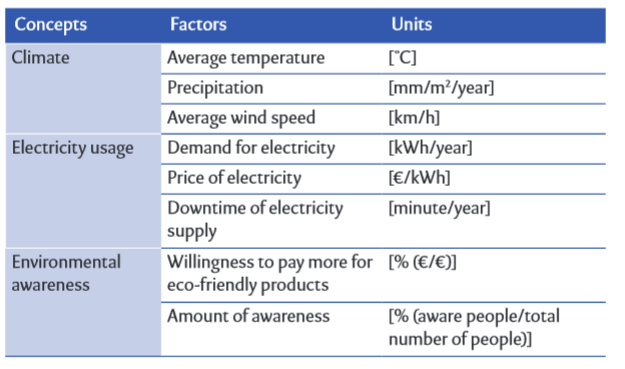
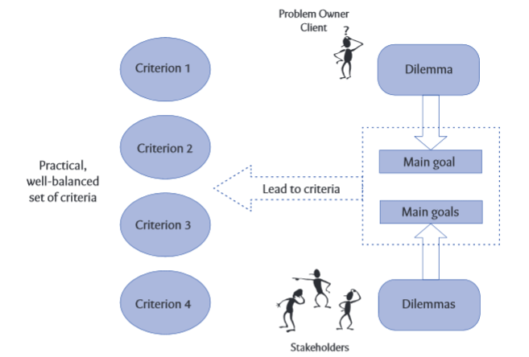
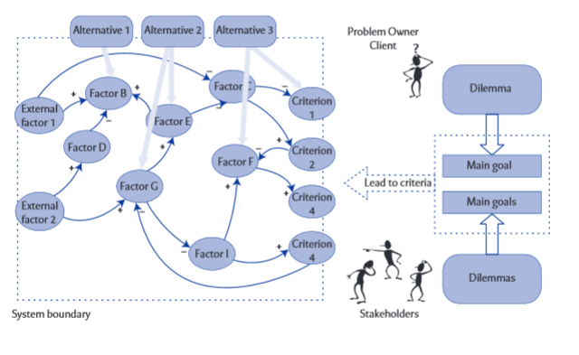

Conceptualizing the problem
===========================

In order to solve it analytically, ideally, it first has to become clear
exactly what the problem is. When that has been clarified, one can
identify:

-   Who is involved in this problem (actors)

-   What all these different actors want (their objectives).

You can make a model (a simplified representation of reality) that
describes the problem area in a simple but practical and useful way.
Finally, you can show which measures (alternatives) the different actors
can take.

Conceptualizing is iterative in nature. Initially, this analytical
process appears to be sequential. First, identify precisely what the
problem is, and only then take the next step of identifying the actors
involved. Although you might follow the steps successively, every step
forward will lead to a revision of one or more of the previous steps.
When you map out what all the actors want, you will often discover that
you have not defined the problem properly. When you gather alternatives,
you may notice that your model of the problem area isn't complete yet.
The process of conceptualizing the problem is iterative in nature.

Steps to conceptualize the problem:
-----------------------------------

### Problem statement

The proper definition of the problem before one starts working on a
project can prevent a lot of disappointment at the end. That is why you
should try to spend a realistic amount of time on the formulation of the
problem! 30% (or even more) of the total project time can easily be
devoted to precise definition of the problem, especially with complex
problems involving new technologies and/or many different actors with
conflicting interests.

At the basis of a problem, there are two situations: the current, or
future, undesired situation, and the desired situation that a particular
actor wishes to be in. The difference between the undesired and the
desired situations is called 'the gap' that should be bridged by the
actor. However, when trying to get from the undesired situation to the
desired one, there will always be a downside to the desired situation,
an effect that the actor does not like, even if his wish for the desired
situation has come about. This 'unwanted downside' to the desired
situation we call 'the dilemma'. The dilemma is the reason why that
desired condition of the system (no noise nuisance) isn't easily
accomplished.

The dissatisfaction of our actor about the undesired situation is due to
a certain condition of a system in which the problem occurs. Perhaps
this dissatisfaction is about possible alternatives too, but they are
not expressed in the problem statement. After all, in an analysis we
want to keep our options open, and weigh up different alternatives.
Focusing on certain alternatives already in the problem statement
refrains us from doing so, so avoiding alternatives in the problem
statement is essential to a thorough analysis.

In looking for the dilemma in your problem, it helps when you focus on
the wish of an actor (getting anywhere in the world cheaply and quickly)
and how that wish is classically fulfilled (by flying, resulting in
noise nuisance). Focus on what is problematic when fulfilling the
actor's wish.

Remember that a problem statement is always made from the perspective of
a certain actor. For every actor you can design a unique problem
statement, because every actor has different interests and thus will
have different wishes. Nevertheless, the main elements that form the
dilemma (and thus the problem) might naturally return several times in
those problem statements.

The art is to choose an alternative (a solution) that everybody supports
with the help of an analysis that was made with all parties involved**.
At first it may sound strange, but you do not have to agree on what you
want to accomplish (the goal) as long as you can agree on what you are
going to do (the means).** An increase of road taxes (alternative) on
old cars can be supported by an actor because that tax increase reduces
the environmental damage, as fewer old cars will be driving around.
Another actor, who possibly is not interested in the environment, can
support this alternative because people are then sooner inclined to
discard their old car and buy a new one, eventually leading to a rise in
car sales.

Initial problem statements are good starting points for a discussion
with your client or one of the other actors in the problem field. If you
have formulated an initial theoretically correct problem statement, it
is easier for them to give a short reaction, rather than an elaborate
story about what they think is the problem.

A useful way of presenting problem statements is to list the tensions
and dilemmas different actors face. Many actors will then realize they
feel the same dilemma, but only the other way around. Someone wants to
reduce Co2 emissions, but fears for the country's electricity
production. Someone else wants to keep the electricity production up to
keep up with expected required future capacity, but fears it might come
at the cost of emitting more Co2

Common mistakes when formulating problem statements:

1.  **No dilemma** -- every problem statement should contain both a gap
    (a difference between a desired condition of a system and a deferred
    current, or possible expected future, condition of a system) and a
    dilemma (a reason why that desired condition of the system isn't
    easily accomplished). Formulations without dilemma do not describe a
    problem. In other words, you know what someone wants but not why he
    cannot accomplish it. Because you do not know where the problem
    lies, you don't know what to focus on. As an analyst you will not
    show that you have sufficient knowledge of the system that you are
    analyzing, so your credibility eventually decreases. You will get
    less information, less co-operation, and, in the end, your analysis
    will fail.

    Problem statements without dilemmas are for example: 'We want to
    reduce the emission of harmful substances', 'How can we reduce the
    traffic jams?' or 'How can we increase our profit?'

    A characteristic of such formulations, without dilemmas, is that
    they can be solved with simple and 'strange' alternatives. In the
    examples named above, for example, close off the chimney, prohibit
    driving or rob a bank.

2.  **No wish or 'gap'** -- At first it is hard to see what a problem
    statement is without a wish. Nevertheless these statements occur
    frequently. They usually involve people that put the blame for a lot
    of things on other parties, other people, and other actors. They
    only mention reasons why something can't be accomplished. You could
    call these people 'complainers'.

    Because you do not know what to accomplish with such a problem
    statement, it is impossible to know what system to focus on, or how
    you can measure whether a system's condition is improving, and you
    do not know what kind of alternatives are actually possible.

    Problem statements without a wish or a 'gap' are, for example: ' i t
    is clear that we need a highway here, but they don't want to
    cooperate', 'We cannot reduce residential waste without the
    commitment of the citizens' or 'We would like to give the harbor a
    'facelift', but the municipality won't make a budget available for
    us.

3.  **An apparent dilemma** -- 'We want to generate environmental
    friendly electricity without increasing C o 2 emissions', 'How can
    we produce more efficiently without increasing the production
    costs?' or 'What can we do about the traffic jams without everything
    getting jammed?' All these problem statements seem to have both a
    wish and a dilemma, but when you look closer you will actually find
    that there isn't a real dilemma present.

    Fulfilling the wish is, in these examples, the same as solving the
    dilemma or the other way around: if you take care of the dilemma
    there is no wish anymore. Both wish and dilemma focus on the same
    thing. In fact there is no tension at all between the wish that a
    client has and the reason why that wish cannot simply be fulfilled.
    In his urgency to make clear what the problem is, the client or the
    analyst has made a mistake and has introduced the same thing twice.
    The same difficulties arise as in the situation of a problem
    statement without a dilemma: you have no idea what to focus on (and
    when you continue your analysis, your credibility will be questioned
    too).

4.  Double wishes and/or dilemmas -- it is also possible that people
    write a problem statement that seems to be well written and
    complete. let's take the following problem statement: 'How can the
    municipality create more recreational facilities and better access
    to the neighborhood, without creating nuisance for the inhabitants
    through heavy traffic and an 'empty' neighborhood off-season?'

    Look at it closely: what is the wish here? Actually, there are two:
    creating more recreational facilities (of which we can think: is
    there a wish behind this? perhaps attracting more tourists?) and
    improving accessibility (by car or public transport, for example).
    Having two wishes in the problem statement means that you will have
    great difficulty finding alternatives. What if we remove the
    recreational facilities from the problem statement? Now the problem
    statement becomes 'How can the municipality create better access to
    the neighborhood, without creating nuisance for the inhabitants
    through heavy traffic and an 'empty' neighborhood off-season?' now,
    suddenly, there is no dilemma anymore! Of course, that should not be
    the case, since the municipality does experience a problem. I you
    encounter this type of problem statement, ask your client if there
    is a wish behind the description he gave. 'Better access to the
    neighborhood' can also relate to the wish of attracting more
    tourists (who are stuck in traffic right now, and choose other
    destinations because of this), so the problem statement might
    become: 'How can the municipality attract more tourists to the
    neighborhood, without creating traffic nuisance for the
    inhabitants?' This way, you have a clear view of the wish the
    municipality has, and the 'solution space' is wide open: a large
    number of different alternatives can be considered.

5.  **Mentioning a specific alternative** -- The most common mistake is
    not so much the problem mentioned, but the alternative that someone
    has thought of to solve that problem. If the problem is about
    capacity for electricity generation, someone will talk about the
    'problem' of building power plants. If the problem is about
    transport capacity, people will talk about getting as many trains as
    possible leaving the station per hour. People find it easier to come
    up with an alternative, with advice, or with an idea, than to
    actually name the problem behind it all. A problem statement with an
    alternative in it causes you to think more narrowly and less
    creatively about possibilities to solve the problem. People will
    stay focused on that one alternative everyone has been talking about
    since the beginning of the analysis. Perhaps that alternative will
    eventually be implemented, but the question remains whether the
    right problem was solved.

    Examples of problem statements with alternatives named in them are;
    'How can we build that nuclear plant without exceeding the budget?',
    'We have to get the trucks off the motorway but we also have to
    maintain the flexibility of the transport system' or 'That tunnel
    has to be built there without damaging nature too much.' in these
    problem statements, one will probably not think of different
    alternatives than different types of power plants, reducing road
    freight or different forms of tunnels. This is a shame because
    alternatives like solar energy, reducing energy usage, other
    logistics, rewarding chauffeurs for desirable behaviour on the road,
    or reducing sound nuisance by placing sound walls could possibly be
    good alternatives too, depending on the real gap and dilemma of this
    actor

6.  **Using words like 'optimal', 'minimal', best, etc.** -- People
    generally tend to look for the solution to the problem. If they
    think a little longer, they might want to find the best solution.
    However, the problems we face are so complex, and no one can predict
    what the future will bring; no one can possibly predict the best
    alternative. Most likely, different actors will prefer different
    alternatives. In the end our facilitation of the decision- making
    process should help people to concur on a particular alternative to
    implement. Not necessarily for the same reason, but as long as
    people can agree on the alternative. Is this the best solution?
    Probably not, and, in addition, no one can know. Tomorrow, or in a
    year, the group of actors might agree on another alternative to
    implement. Or even today, if the group of actors are different, but
    the situation they face is the same, they might end up with a
    different alternative.

    Using words like 'minimal', 'best' and 'optimal' focuses on one
    particular alternative, the one that scores minimally on a certain
    criterion, or best, or optimally. Even if it were possible to agree
    with the group on how to translate the value of one criterion
    against another (so optimization would, at least mathematically, be
    possible), problem statements would still focus on finding one
    alternative. The idea is that a rational comparison of many
    alternatives on a set of well-balanced criteria facilitates
    decision-making in such a way that the actors involved can have a
    clear view of different alternatives and their effects, without
    looking for the optimal one.

### Actor objectives analysis, Criteria for decision making (goal tree)

Actors tend to promote 'their' alternative for 'the' problem. 'Wind
mills are the only serious option to tackle our energy problem, as they
are really sustainable.' Usually, another actor also starts promoting
his alternative, leading to lots of discussion and not bringing a shared
decision for one alternative any closer. The previous Section introduced
the problem statement to redirect the discussion from alternatives to
the problem, mainly to keep the solution space large enough and to
generate and compare several alternatives. When a list of alternatives
becomes available, we would like to know to what extent they solve the
problem and fit the preferences of the actors. Also, if we want to
compare alternatives, we need a set of criteria with which to compare
them.

What is needed is a well-balanced set of criteria, representing all
aspects (including the implicit ones) of our problem owner and other
actors involved in the problem field. Although it will be clear from the
beginning that it is difficult to take all criteria into account, it
would be impossible for our client to make a well grounded and carefully
considered decision if he is not aware of important criteria for all the
actors involved.

Remember the discussion with our problem owner about the problem
statement. Especially remember the implicit dilemma he had in mind when
you came up with a 'strange' solution to his problem. 'But that is not
what i mean!' A clear wish and dilemma can never be represented by a
single criterion. Gut, as we can guess, many more issues will be
implicit in the heads of our clients. We can expect that various
criteria are needed to represent all this. A structured approach to
reaching these criteria is to ask 'why do you want this?' Go back to our
client, our entrepreneur, who answered 'more turnover' when we asked
what he wanted. We can discern several implicit thoughts behind this
answer, by asking him the simple 'why?' question, over and over.

'Why do you want more turnover?' To create more profit? And why more
profit? To be able to continue the business? And why continue? Your
client is an entrepreneur. To ask him why he wants to continue his
business (apart from being a somewhat strange question) is to discuss
the 'being' of an entrepreneur: continuing the business. Hopefully there
is another, more abstract goal for our client when it comes to his life:
we have reached his interest, which is always there, independent of any
problem, even without the problem being perceived

In other words, goal trees are actor-specific. Only when all actors are
involved in criteria creation (i.e., all actors have their own goal
tree) can the analyst create a well-balanced set of criteria for further
analysis, and which can eventually be used in the decision-making
process.

In practice, it is useful to start by making a goal tree with, and for,
your client. Once this has been done, and your client agrees with the
result, you can discuss whether it is necessary and possible to create
goal trees for other actors as well. When you have a set of goal trees,
you can decide on which criteria to include in your analyses. Do not be
too picky about selecting criteria, since having too few criteria may
lead to alternatives being selected which do not live up to the goals of
the actors.

**What are commonly made mistakes and their effects in designing goal
trees?**

1.  **Causal relations and/or verbs in the goal tree** -- The most
    common error that people make in constructing goal trees is that
    they consider lower goals to be a means to reach higher goals. This
    comes close to our human habit of thinking in solutions rather than
    in problems, as we discussed earlier in this book. These people
    don't answer the question 'what is cheap energy?' They identify ways
    to reach cheap energy, like 'decrease production costs' or 'reduce
    transport costs'. These are means to reach the goal of cheap energy,
    not criteria to find out whether a certain alternative A results in
    cheaper energy than another alternative

    As soon as you see verbs in a goal tree, be alert. Verbs represent
    actions and, thus, cannot define goals. 'Increasing the number of
    thermal power plants' is an action, something that is done. It is
    done to reach a goal, like more environmentally friendly energy. It
    is, however, not defining what environmentally friendly energy is:
    it is a way to get it! In essence, all actions like these are
    alternatives that might (partly) solve the problem. Of course, we
    have to find out whether they really have potential but, in
    principle, they may have. Thus, when you use verbs in a goal tree
    you are basically introducing alternatives and, with this, creating
    substantial bias in your analysis.

2.  **Goal tree contains alternatives** -- often, people
    'Operationalize' objectives like 'environmentally friendly energy'
    in terms of 'more photovoltaic cells' and 'more wind mills'.
    However, these are two alternatives that in this problem some of the
    actors will consider as being 'the' solution. It is alternatives
    like these that we want to compare, or rationalize, on a
    well-balanced set of criteria as input for the decision- making
    process. We find criteria (or better: make implicit criteria of the
    actors explicit) using the goal tree technique. If we introduce
    alternatives in the goal tree, we basically create criteria for
    specific alternatives. Later, in the decision-making process, these
    alternatives would then be compared to each other on the full set of
    criteria, including their 'own' criteria. As such, an alternative
    will always have a good score on its own criteria, while other
    alternatives will not, and substantial bias will have been
    introduced in the analysis. To put it bluntly, an alternative that
    involves building wind mills will never score well on 'more
    photovoltaic cells'.

    If you do not recognize alternatives immediately, for all sub-goals
    ask yourself the question 'does this sub-goal lead to the higher
    goal, or, does it define the higher goal?' Alternatives will never
    have definition relations with higher goals, only causal relations.
    Useful goal trees only obtain definition relations and no causal
    relations

3.  **Main goal too** **generic** -- if you keep on asking the 'why do
    you want this?' question, you end up with the general interest of
    that particular actor. Car drivers want 'good mobility'. Presidents
    want to stay in power; entrepreneurs want 'continuity' of their
    business. These interests look like goals, but it is not practical
    to use them as the main goal in a goal tree. These interests are
    always there, also no problem is perceived and, thus, no
    alternatives to solve it are considered. The interest turns into an
    objective at the moment this interest is violated: then the actor
    perceives a problem or a challenge and wants to solve it. At that
    moment it becomes practical to translate the general interest into a
    concrete goal for that particular perceived problem.

    That concrete main goal is not the same as the general interest, but
    represents the general interest for this particular problem. The
    president of an electricity producing company might consider his
    interest 'continuity of his company', independent of a problem. When
    society wants to be more environmentally friendly, and people are no
    longer buying his coal-generated electricity, he might translate his
    general interest to 'sustainable energy supply'. In his case, part
    of the definition of sustainable energy supply could be that there
    needs to be a market for

    His production. Should 'continuity' be the main goal, no practical
    well- balanced set of criteria could be found. In this case,
    continuity would be measured in, for instance, \[year\], but other
    too generic main goals might lead to a lot of criteria of which the
    majority have nothing to do with the perceived problem. Both ways,
    the criteria are not supporting the decision-making process.

4.  **Goal tree too large** -- if you do not limit yourself while making
    the goal tree, you may end up with a goal tree that is too large to
    read. It will then probably contain a very generic main goal, and a
    number of branches that are not at all related to the problem field.
    Try to use 3 to 4 levels in your goal tree, and not more than 20
    goals.

### System description (causal diagram)

A certain action will be an interesting alternative for a specific actor
if it is 'doing something that solves his problem'. Now that the
problems held by different actors are represented in criteria using the
goal tree technique, an alternative becomes 'doing something that
influences the scores on the criteria'. Basically, anything that
influences the scores on the criteria can be treated as an alternative.
Needless to say not all of these alternatives are practical, not even
'good' (i.e., influencing criteria in the desired direction of change).
However, how 'good' certain alternatives are is a matter of interpreting
their scores on the criteria. First step is to find out what influences
the scores on the criteria

Practically, let's take a criterion from our well-balanced set (derived
from all the goal trees we made for the actors involved) and ask two
questions: 'what factors influence this criterion?' and 'what factors
are influenced by this criterion?' note that the questions we asked when
constructing a goal tree were definition questions ('what does it
mean?'), while these two questions are about causal relations ('what
influences?').

Of course, many other criteria matter as well, that is why we made the
effort to create all these goal trees for all actors involved to come to
a well-balanced set of criteria. Your complete causal diagram, including
all important criteria from the goal trees you designed, will be much
larger.

The causal diagram is very useful in connecting the alternatives to the
criteria. Its usefulness is that is shows how (i.e., through what
mechanism) the alternatives eventually change the value of the criteria.
It makes it possible to estimate the effects of different alternatives
on the set of criteria that is used. Therefore, it makes it possible
that a client, in the end, can compare the alternatives and choose one
to solve the problem. In this way, the causal diagram, like all other
techniques presented in this book, helps the client decide. In other
words, it facilitates the decision-making process.

What can help you practically when constructing a causal diagram is to
identify factors using a table with three columns: 'concepts', 'factors'
and 'units'. most of the time when you start studying a system, you have
some abstract ideas about things that are important. If the problem is
about alternative energy sources, you quickly might think about things
like 'climate', 'electricity usage', or 'environmental awareness'. These
factors are not yet explicit, operational factors, but mere concepts.

### Problem diagram

