Philosophy
==========

-   Pursuit of wisdom

The actual word philosophy is Greek in origin, and it is the composite
of two Greek roots: "philein", a Greek word for love, and "Sophia", the
Greek word for wisdom. Taken together, they mean the love or pursuit of
wisdom. Wisdom = ability to use and apply knowledge with great
intelligence.

Philosophy is committed to the truth rather than popular opinion,
prevailing norms, or conventional wisdom.

Aim of philosophy:

-   Thinking critically, questioning your beliefs

    -   **Open-minded:** In discussions they listen carefully to every
        viewpoint, evaluating each perspective carefully and fairly.

    -   **Knowledgeable:** When they offer an opinion, it's always based
        on facts or evidence. On the other hand, if they lack knowledge
        of the subject, they acknowledge this.

    -   **Mentally active:** They take initiative and actively use their
        intelligence to confront problems and meet challenges, instead
        of simply responding passively to events.

    -   **Curious:** They explore situations with probing questions that
        penetrate beneath the surface of issues, instead of being
        satisfied with superficial explanations.

    -   **Independent thinkers:** They are not afraid to disagree with
        the group opinion. They develop well-supported beliefs through
        thoughtful analysis, instead of uncritically borrowing the
        beliefs of others or simply going along with the crowd.

    -   **Skilled discussants:** They are able to discuss ideas in an
        organized and intelligent way. Even when the issues are
        controversial, they listen carefully to opposing viewpoints and
        respond thoughtfully.

    -   **Insightful:** They are able to get to the heart of the issue
        or problem. While others may be distracted by details, they are
        able to zero in on the essence, seeing the forest as well the
        trees.

    -   **Self-aware:** They are aware of their own biases and are quick
        to point them out and take them into consideration when
        analyzing a situation.

    -   **Creative:** They can break out of established patterns of
        thinking and approach situations from innovative directions.

    -   **Passionate:** They have a passion for understanding and are
        always striving to see issues and problems with more clarity.

-   The complete liberty of the mind

-   Freedom from all social, political, or religious prejudice

-   To care for the well-being of the soul

-   Answer the question, "What is it all about?"

Branches of philosophy
----------------------

Critical thinking process
-------------------------

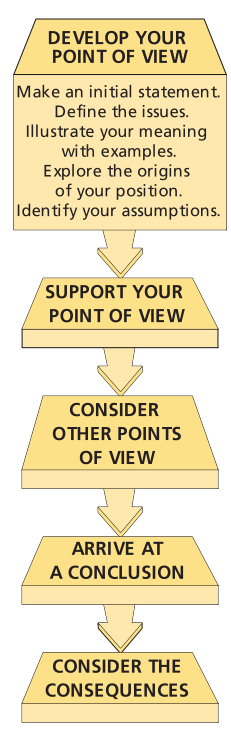

Arguments:
----------

### Deductive:

In a deductive argument, if the argument form is valid, and if you
accept the supporting reasons (also called premises) as true, then you
must necessarily accept the conclusion as true.

Reason/Premise: All men are mortal.

Reason/Premise: Socrates is a man.

Conclusion: Therefore, Socrates is mortal.

### Inductive:

An argument form in which one reasons from premises to a conclusion that
is supported by the premises but does not follow necessarily from them.
When you reason inductively, your premises provide evidence that makes
it more or less probable (but not certain) that the conclusion is true.

Socrates
========

**"The unexamined life is not worth living."**

The goal of life is to know thyself and improve our souls through
virtuous living.

The Socratic Method Seeking clarity and truth through penetrating
questioning and astute analysis

Socrates left no writing of his own, so all of what we know about him
comes through other sources. The richest source of his ideas comes from
the Dialogues, short dramas written by Socrates student and disciple,
Plato. Although Plato wrote these masterful and enduring Dialogues years
after Socrates death, most experts agree that at least the initial
Dialogues (Euthyphro, The Apology, Crito) are faithful portrayals of
Socrates ideas.

**"The truth lies within each of us."** By living an examined life, we
can discover the principles of right thinking and action within us. In
our effort to improve our souls and make them more godlike, we need only
to apply the divine gift of reason to look deep within ourselves and
discover immutable, universal truths. Of course, this process is aided
tremendously by engaging in shared explorations with others through
dialectical conversations. But the ultimate answers lie within us.
Socrates also extends this concept of implicit knowledge to other
insights regarding the nature of reality, such as mathematics.

**"We should strive for excellence in all areas of life."** As
previously mentioned, the Greeks in general and Socrates in particular
believed that happiness was a con- sequence of actively exercising all
of our soul s powers, and Socrates was a living example of this
commitment.

**"It is better to suffer wickedness than to commit it."** Why be moral?
As just noted, Socrates response is that becoming a moral person is the
only way to become a truly happy, psychologically healthy person. Often
adages are clichéd and empty of meaning, but for Socrates, the idea that
Virtue is its own reward contains a substantial measure of truth, a
point he expresses in his observation that doing wrong will harm and
corrupt that part of ourselves that is improved by just actions and
destroyed by unjust actions. As a thinking individual, you create
yourself through the choices that you make much as a sculptor gradually
forms a figure through countless cuts of the chisel.

Socrates was committed to making our actions reflect our convictions.
**For Socrates, striving to think well-meant striving to live well,
developing consistent and rigorous standards of conduct and then
following through with the choices that we make. For Socrates, there was
no distinction between theory and practice, thought and action in the
virtuous person, they are the same.** There is an intimate connection
between knowledge and virtue, and as we gain intellectual understanding,
we should naturally live more enlightened lives.

CONSCIOUSNESS, IDENTITY, AND THE SELF
=====================================

Rationalism 
------------

The view that reason is the primary source of all knowledge and that
only our reasoning abilities can enable us to understand sense
experience and reach accurate conclusions.

Empiricism 
-----------

The view that sense experience is the primary source of all knowledge
and that only a careful attention to sense experience can enable us to
understand the world and achieve accurate conclusions.

Materialism 
------------

The philosophical view that all aspects of the universe are composed of
matter and energy and can be explained by physical laws. Many
philosophers and psychologists view the self from a materialistic point
of view, contending that in the final analysis mental states are
identical with, reducible to, or explainable in terms of physical brain
states.

Mark Twain: **"How come the mind gets drunk when the body does the
drinking?"**

Socrates 
---------

The soul is immortal

For Socrates, reality is dualistic, comprised of two dichotomous realms.
One realm is changeable, transient, and imperfect, whereas the other
realm is unchanging, eternal, and immortal. The physical world in which
we live comprising all that we can see, hear, taste, smell, and feel
belongs to the former realm. All aspects of our physical world are
continually changing, transforming, disappearing.

In contrast, the unchanging, eternal, perfect realm includes the
intellectual essences of the universe, concepts such as truth, goodness,
and beauty. We find examples of these ideal forms in the physical world
for example, we might describe someone as truthful, good, or beautiful.
But these examples are always imperfect and limited: It is only the
ideal forms themselves that are perfect, unchanging, and eternal.

What is truly remarkable about these ideas is how closely they parallel
modern Western consciousness. A finite body; an immortal soul; a
perfect, eternal realm with which the soul seeks communion and eternal
bliss: All of the basic elements of Western (and some Eastern) religions
are present.

Plato
-----

Three-part soul/

1.  **Reason:** Our divine essence that enables us to think deeply, make
    wise choices, and achieve a true understanding of eternal truths.

2.  **Physical Appetite**: Our basic biological needs such as hunger,
    thirst, and sexual desire.

3.  **Spirit or Passion:** Our basic emotions such as love, anger,
    ambition, aggressive- ness, empathy.

Plato believed that genuine happiness can only be achieved by people who
consistently make sure that their Reason is in control of their Spirits
and Appetites (critique: overemphasizing the power and authority of
reason, and underemphasizing the importance of the body and emotions).
Plato illustrates his view of the soul/self in Phaedrus with a vivid
metaphor: The soul is likened to a chariot drawn by two powerful winged
horses a noble horse, representing Spirit, and a wild horse, embodying
Appetite. The charioteer is Reason, whose task is to guide the chariot
to the eternal realm by controlling the two independent- minded horses.
Those charioteers who are successful in setting a true course and
ensuring that the two steeds work together in harmonious unity achieve
true wisdom and banquet with the gods. However, those charioteers who
are unable to control their horses and keep their chariot on track are
destined to experience personal, intellectual, and spiritual failure.

Buddhism
--------

**Milindapanha, The Simile of the Chariot
(http://www.usna.edu/Users/history/abels/hh205/milinda.html)**

For Buddhists, every aspect of life is impermanent, and all elements of
the universe are in a continual process of change and transition, a
process that includes each self as well. The self can best be thought of
as a flame that is continually passed from candle to candle, retaining a
certain continuity but no real personal identity a concept very
different from the self of Western consciousness.

According to Buddhist philosophy, the self is composed of five
aggregates:

1.  physical form

2.  sensation

3.  conceptualization

4.  dispositions to act

5.  consciousness

Each self is comprised of the continual interplay of these five
elements, but there is no substance or identity beyond the dynamic
interaction of these five elements.

Descartes
---------

**Cogito, ergo sum = I think, therefore I am.**

Descartes confesses that he has come to the conclusion that virtually
everything he has been taught from authorities and other adults is
questionable and likely false. His radical solution? To establish a
fresh start on gaining true, well-supported beliefs by simply erasing
his endorsement of anything he has previously been taught.

**Cogito, ergo sum** is the first principle of Descartes theory of
knowledge because he is confident that no rational person will doubt his
or her own existence as a conscious, thinking entity while we are aware
of thinking about our self. Even if we are dreaming or hallucinating,
even if our consciousness is being manipulated by some external entity,
it is still my self-aware self that is dreaming, hallucinating, or being
manipulated.

**If your self-identity is dependent on the fact that you are capable of
being aware you are engaging in these mental operations while you are
engaged in them. If you were consistently not conscious of your mental
operations, consistently unaware of your thinking, reasoning, and
perceiving processes, then it would not be possible for you to have a
self-identity, a unique essence, a you.**

Locke
-----

1.  To discover the nature of personal identity, we're going to have to
    find out what it means to be a person.

2.  A person is a thinking, intelligent being who has the abilities to
    reason and to reflect.

3.  A person is also someone who considers itself to be the same thing
    in different times and different places.

4.  Consciousness being aware that we are thinking always accompanies
    thinking and is an essential part of the thinking process.

5.  Consciousness is what makes possible our belief that we are the same
    identity in different times and different places.

Kant
----

Our minds actively sort, organize, relate, and synthesize the
fragmented, fluctuating collection of sense data that our sense organs
take in. For example, imagine that someone dumped a pile of puzzle
pieces on the table in front of you. They would initially appear to be a
random collection of items, unrelated to one another and containing no
meaning for you, much like the basic sensations of immediate
unreflective experience. However, as you began to assemble the pieces,
these fragmentary items would gradually begin to form a coherent image
that would have significance for you. According to Kant this
meaning-constructing activity is precisely what our minds are doing all
of the time: taking the raw data of experience and actively synthesizing
it into the familiar, orderly, meaningful world in which we live. As you
might imagine, this mental process is astonishing in its power and
complexity, and it is going on all of the time.

**Unity of consciousness**. Thoughts and perceptions of any given mind
are bound together in a unity by being all contained in your
consciousness. This picture is uniquely your picture.

**Your self is able to perform this synthesizing, unifying function
because it transcends sense experience.**

How do our minds know the best way to construct an intelligible world
out of a never-ending avalanche of sensations? We each have fundamental
organizing rules or principles built into the architecture of our minds.
These dynamic principles naturally order, categorize, organize, and
synthesize sense data into the familiar fabric of our lives, bounded by
space and time. These organizing rules are **a priori in the sense that
they precede the sensations of experience and they exist independently
of these sensations.** We didn't have to learn these a priori ways of
organizing and relating the world they came as software already
installed in our intellectual operating systems.

FREEDOM AND DETERMINISM
=======================

**External vs. internal forces**

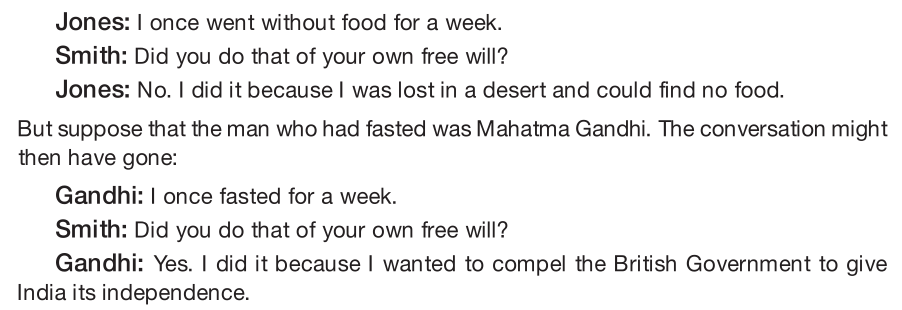

**If you are limited by external forces**, the way to free yourself is
to neutralize or remove them, so that you can make choices that reflect
your genuine desires. For example, if your choices are constrained by an
unreasonable boss, you have to either change that person s coercive
behavior or remove yourself from the situation to achieve genuine
freedom. If you believe that your choices are excessively limited by the
geographical location in which you live, you might have to move in order
to increase your possibilities.

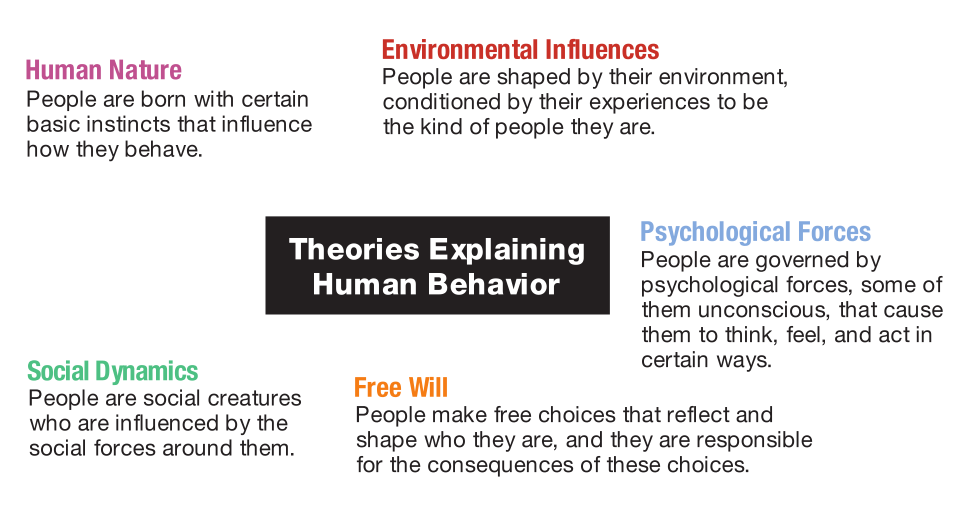

Existentialism, 
----------------

A philosophical movement that emphasizes the challenge and
responsibility of all people to create a meaningful existence through
the free choices they make. In seeking meaning, existentialists believe
that we cannot look outward to a supernatural creator or an intelligible
universe: We must look inward, to our own resources and possibilities,
as we struggle to create meaning in a world that often seems chaotic and
absurd.

Determinism
-----------

The view that every event, including human actions, is brought about by
previous events in accordance with universal causal laws that govern the
world. Human freedom is an illusion.

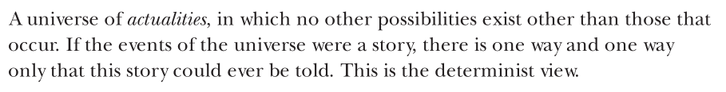

Indeterminism 
--------------

The view that some events, including human actions, are not necessarily
determined by previous events in accordance with universal causal laws.

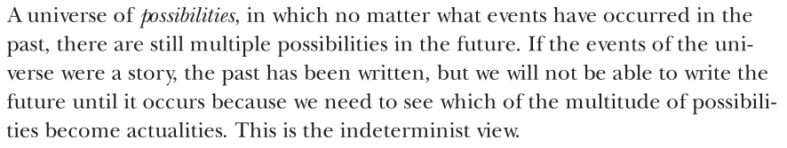

Libertarianism
--------------

The view that humans are able to make authentically free choices that
are not determined by previous events in accordance with universal
causal laws, that there is a meaningful sense that though we made one
choice, we could have done otherwise.

Compatibilism 
--------------

The view that all events, including human actions, are caused. However,
we can consider human actions free if they are the result of internal
motivations, not the product of external influences or constraints.

How can we know the nature of reality?
======================================

Metaphysics -- What is real?
----------------------------

Most generally, the philosophical investigation of the nature,
constitution, and structure of reality.

Epistemology -- What is true?
-----------------------------

The study of the nature of knowledge and justification.

Plato:

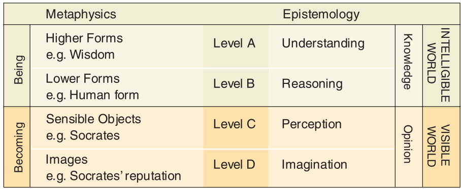

As we saw, Plato s metaphysical belief in the world of Being and the
eternal Forms is tied to:

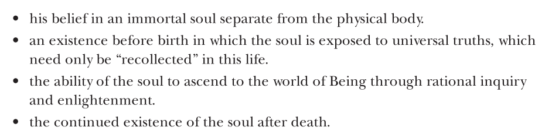

Kant:
-----

Sensations would be nothing to us, and would not concern us in the
least, if they were not received into our (orderly) consciousness.
Knowledge is impossible in any other way. . . . For perceptions could
not be perceptions of anything for me unless they . . . could at least
be connected together into (my) one conscious- ness. This principle
stands firm a priori, and may be called "the transcendental principle of
unity" for all the multiplicity of our perceptions and sensations.

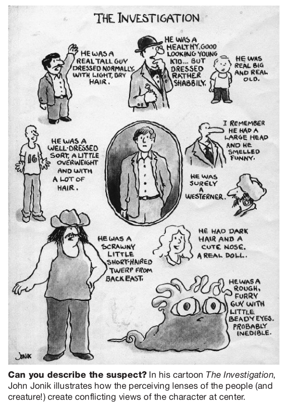

**The entire reality, which we assume to be completely independent of
ourselves, is in fact, as Kant maintained, constituted by the active
structuring of our minds. Categories or schemata (such as time, space,
cause and effect) are universally present in normally functioning
humans, we all share a common universe, constituted and defined by the
same basic qualities and relations.**

**Universal concepts:**

-   Unity, plurality, and totality for concept of *quantity;* 

-   reality, negation, and limitation, for the concept of *quality;* 

-   inherence and subsistence, cause and effect, and community for
    the *concept of relation;* 

-   possibility-impossibility, existence-nonexistence, and necessity and
    contingency for the *concept of modality.*

Emotions
--------

Emotions vs. feelings:

The point is that what we perceive in the world and our judgments about
these perceptions influence our emotional reactions. And conversely, our
emotions have a dramatic influence on what we perceive and how we
interpret it. And because our knowledge of the world begins with
perceptions, values and emotions are a natural and inseparable part of
this knowing process.

**Physiological feelings may accompany emotions, they are clearly not
the same phenomenon. As Jaggar notes, feelings are episodic in the sense
that they occur at a given moment in time, whereas emotions extend over
time: For instance, we may assert truthfully that we are outraged by,
proud of or saddened by certain events, even if at the moment we are
neither agitated nor tearful. In addition, although people may be
unaware of their emotional state angry, ambivalent, depressed they are
(nearly) always aware of what they are feeling at any given moment in
time. If emotions include but also transcend episodic feelings, what
else are they? One perspective the cognitivist point of view sees
emotions as involving intentional judgments as well as physiological
sensations. So, for example, you may be feeling anxious or agitated but
is the emotion involved related to concern about an upcoming exam or
concern about an upcoming romantic date? In other words, an important
component in emotions is the intentional judgment that is associated
with the physiological feeling. We may conclude, for instance, that it
is our (intentional) evaluation of an upcoming date that is responsible
for the anxiety ( butterflies ) we are feeling. Yet as important as
intentional judgments are for understanding the nature of emotions, we
still have not fully accounted for the complex nature of emotional
experience.**

**In addition to immediate feelings and intentional judgments, emotions
are also constituted by the social context in which they occur. For
example, individuals in each culture are taught the appropriate
emotional responses to people (strangers, authorities, religious
figures, romantic interests) as well as situations (competitive sports,
academic achievement, perceived insults). Each culture has its own
unique emotional vocabulary that members of the culture learn at an
early age, and this emotional vocabulary is an essential component in
what emotions are all about. This vocabulary is expressed in the
concepts and language of the culture, as well as in the actions and
attitudes of the members. Jaggar s example of the emotion romantic love
is pertinent here. Although there is general agreement regarding what
this emotional concept means, each culture also tends to define the
emotion and its affiliated attitudes and behavior in ways that are
distinctive to that culture. The net result is that these social
influences are integral elements in the construction of human emotions:
hence the notion of emotions as social constructs.**

Is there a spiritual reality - Religion
=======================================

-   A means to achieve ultimate spiritual transformation. And such a
    spiritual quest necessarily involves what we think, feel, and do.
    The way we live our lives becomes a vehicle for achieving ultimate
    spiritual transformation, and our religion provides us with the
    ethical roadmap.

-   Second, religion provides a metaphysical grounding for morality. If
    a person or people develop an ethical system and instruct us to
    abide by its principles, we can legitimately ask, why should I
    follow your principles? What gives you special legitimacy over any
    other person to determine ethical guidelines? However, if an ethical
    system is grounded in a supernatural creator or what is thought to
    be a fundamental principle of the universe, then the ethical system
    speaks with a special authority. Why should I follow these
    principles? Because God (or some other metaphysical authority)
    endorses these principles. That removes moral values from the level
    of human-to-human debate and raises it to a spiritual level.

A Brief Survey of World Religions
---------------------------------

### Hinduism

Hinduism is the term used to designate the complex mosaic of religious
beliefs and practices of the vast majority of the people of India.

-   One of the oldest living religions in the world

-   No single founder but evolved over a period of four thousand years,
    its history interwoven with **religious and cultural** movements.

-   Hindu -\> Sanskrit word sindu for river (Hindu referring to the
    Indus River)

-   Alternative term for Hinduism preferred today is Sanatana Dharma.

    -   Sanatana -\> eternal religion

    -   Dharma embodies a holistic approach to both personal spiritual
        fulfillment and social harmony.

-   Many manifestations of single God assuming different forms.

-   Vedas -\> Ancient scriptures revered by Hindus. 4 parts

-   **Upanishads** -\> The philosophical part of the Vedas, intended
    only for serious seekers.

-   The Upanishads are thought to have developed between 600 and 400
    B.C.E., about the same time that Gautama Buddha (c. 563 483 B.C.E.),
    the founder of Buddhism, lived on the Indian subcontinent.

-   Five main themes:

    -   **Contemplation of the luminous self.** Spiritual enlightenment
        can be achieved only by turning one's attention inward to
        discover a transcendent reality from within. The bodily senses
        are made for looking outward and are easily enticed by sensory
        pleasures and worldly spectacles. But these sensations are
        fleeting and impermanent, passing away when one dies, and
        obscure the search for the infinite, everlasting reality. This
        unseen but all-pervading reality they called Brahman, the
        Unknowable. From Brahman originate the multiplicity of all
        forms, including humans, and thus Brahman can be discovered in
        the soul (atman) within ourselves.

    -   **Reincarnation.** The belief that the soul leaves the dead body
        and enters a new one, being born over and over in countless
        bodies. Whether the body is that of an animal or other life
        form, the self remains constant. But rebirth as a human being is
        a precious and rare opportunity for the soul to advance toward
        its ultimate goal of liberation from rebirth and merging with
        the Brahman.

    -   **Karma**. Progress toward a merging with Brahman is the result
        of karma, which refers to one's actions as well as the
        consequences of one's actions. The ultimate goal of creating
        ourselves through good choices is to escape from the karmic
        wheel of birth, death, and rebirth, which is called samsara. To
        escape from samsara is to achieve liberation from the
        limitations of space, time, and matter through realization of
        the immortal absolute.

    -   **Yogic practices**. Disciplines that clear the mind and support
        a state of serene, detached awareness. This desired state of
        balance, purity, and peacefulness of mind is described as
        sattvic, in contrast with active, restless states or lethargic
        dull states. The practices for increasing sattvic qualities are
        known collectively as yoga, from the Sanskrit word for union (in
        this case the union of body, mind, and spirit).

    -   **Fire sacrifices**

### Buddhism

http://www.usna.edu/Users/history/abels/hh205/milinda.html

Nontheist religion that does **not believe in a super- natural God or
Creator**. Instead, the **ultimate transformation** to which Buddhists
aspire is to escape the world of suffering through our own efforts until
we finally **achieve Nirvana** (the ultimate egoless state of bliss).

-   originator of Buddhism -\> Siddhartha Gautama

-   4 noble truths of suffering:

    -   **Life inevitably involves suffering, is imperfect and
        unsatisfactory**. Suffering and frustration is an unavoidable
        part of living- Happiness is fleeting, with unhappiness its
        constant shadow. Even the self is an impermanent illusion. The I
        is really a perpetually transient bundle of fleeting sensations,
        impressions, ideas, and feelings. The metaphor often used for
        the Buddhist concept of the self is that of a flame being passed
        from candle to candle in continual movement.

    -   **Suffering originates in our desires**. Desires are wishes for
        things to be different than they are. We wish for good health,
        riches and fame, eternal life, perpetual happiness, permanence
        and security, and many other things as well. But none of these
        wishes can be achieved in a permanent fashion because life and
        the universe are essentially impermanent. And because our wishes
        are continually thwarted and events in the world are beyond our
        control, frustration and suffering are unavoidable.

    -   **Suffering will cease if all desires cease**. This can be
        achieved only by realizing and accepting the fact that there is
        no unique, separate, permanent, immortal self. Once we
        understand that our self is simply an impermanent flow of energy
        tied to the larger energies of the cosmos, we are freed to
        realize that desires and suffering are irrelevant. In practical
        terms, accepting the non- existence of a permanent self
        encourages us to live happily and fully in the moment, liberated
        from self-centeredness and full of compassion for others.

    -   **There is a way to realize this state: the Noble Eightfold
        Path.** Extinguishing desire and suffering is a process that can
        be achieved by following the guidelines embodied in the Noble
        Eightfold Path, devoted to pursuing morality, focus, and wisdom.
        The Noble Eightfold Path is a systematic philosophy of life that
        enables people gradually to free themselves from desire and
        suffering and achieve the ultimate peace of Nirvana. This
        process typically extends over multiple lifetimes, as we are
        caught in the perpetual cycle of death and rebirth. Once again,
        the self is not a permanent, immortal entity but is akin to a
        flame being passed from moment to moment, lifetime to lifetime.
        The Noble Eightfold Path includes right understanding, right
        thought and motives, right mindfulness, and right mediation.

### Daoism/Taoism

At the time that India was giving birth to Hinduism and Buddhism, East
Asia saw the creation of Daoism and Confucianism (in China) and Shinto
(in Japan). Daoism, on the other hand, is a way of life inspired from
the rhythms of natural phenomena. Daoism promotes a constant interaction
with our environment and the importance of being aware of it.

Dao is believed to be the first cause of the universe. It is the
unnamable and eternally real force that flows through life, and each
believer s goal is to become one with the Dao. Although Dao can be
translated as path or the way, it is basically indefinable. Reality
cannot be named or known through language, logic, or concepts it must be
experienced. Dao refers to a power that envelops and flows through all
things, living and nonliving. The Dao regulates natural processes and
balances the universe.

Daoists do not pray to a Supreme Being; instead, they seek answers to
life s problems through inner meditation and observation. For the
Daoist, time is cyclical, not linear as in Western thinking. The entire
cosmos is a manifestation of an impersonal self-generating energy called
qi (ch i). This force has two aspects whose interplay causes the
ever-changing phenomena of the universe. Yin is the dark, receptive,
female aspect; Yang is the bright, assertive, male aspect. The Yin is
considered to be the breath that formed Earth, whereas the Yang is the
breath that formed the heavens. These two forces symbolize the pairs of
opposites that are seen throughout the universe, such as good and evil,
light and dark, male and female. Wisdom lies in recognizing the
ever-shifting, but regular and balanced, patterns of movement of Yin and
Yang and moving along with them. The Dao is this creative rhythm of the
universe. Daoists follow the art of wu-wei, which is to let nature take
its course, rather than trying to impede it. To take a metaphor from the
natural world, one should allow a river to flow toward the sea
unimpeded, instead of erecting a dam that would interfere with its
natural flow. Analogously, we should be like flowing water ourselves,
bypassing and gently wearing away obstacles rather than aggressively
attacking them, effortlessly moving through life without struggling,
leaving all accomplishment behind without trying to hold on to them.

Even when difficulties arise, the Daoist does not panic and take
unnecessary action. This is a philosophy that Daoists believe should be
practiced on a social and political level as well.

### Judaism

Judaism traces its roots to about 3,800 years ago, when, according to
the holy scriptures known col- lectively as the TaNaKh, God entered into
a covenant with Abraham. According to the covenant, Abraham and his
descendants would give God (Yah- weh) their exclusive devotion and
obedience, and God would choose them to enjoy special consideration and
protection (thus the idea that Jews are God' s chosen people ). Jewish
scripture also states that God promised Canaan (now Israel) to the Jews
as their homeland.

First and foremost is monotheism, a belief in one Creator God, all-pow-
erful, all-loving, and ever-present. In stories from scripture, this God
demands obe- dience, metes out rewards and punishments, and issues a
moral code (the Ten Commandments). Religious holidays and rituals are
based on key events in Jewish history as recorded in Jewish scriptures.
These events serve as moral paradigms, symbolically rich stories that
have continued relevance to contemporary lives. Divinely inspired laws
that cover every aspect of Jewish social, communal, and religious life
are another core element of Jewish religious faith. These laws have been
codified in the Torah, a word which has a variety of meanings. One
meaning refers to the first five books of the TaNaKh, believed to be the
word of God as told to Moses. These teachings have evolved over time
through the ongoing study and writings of Jew- ish scholars.

### Christianity

Christianity emerged and split off from Judaism some 1,800 years after
Abraham. At its core is the belief that Jesus is the son of God and
savior whose sacrificial death and resurrection make it possible for
souls to have eternal life in heaven. Chris- tian scriptures consist of
the Hebrew TaNaKh, which Chris- tians refer to as the Old Testament, and
the writings of Jesus s followers, known as the New Testament.
Christianity is the largest of the world s religions, with approximately
2.1 billion adherents. The New Testament contains the teachings of
Jesus, a Jew who lived in Palestine under Roman rule at the beginning of
the first millennium C.E. Jesus describes God as a loving Father who
will take care of those who love Him and want to follow the path of
righteousness. Jesus message was to reveal this path, through words and
actions, so that all could achieve spiritual perfection and salvation in
preparation for life after death. He makes clear that each person s
relationship with God is intensely personal, nurtured through worship,
reflection, and personal prayer.

Jesus preached a radical ethic, focusing his attention on the most
disinherited people of the day, including the poor, the outcasts, the
prostitutes, and even the most despised people of the day, the Roman tax
collectors. What s more, Jesus preached that, in the next life, the
favored individuals would include the poor in spirit, the meek, the
mourners, the seekers of righteousness, the pure in heart, the merciful,
the peacemakers, and those who are persecuted for the sake of
righteousness and for spreading the gospel. In addition to complete
devotion to God, the core of Jesus message was a love and devotion to
others. In fact, Jesus preached that in extending ourselves to the less
fortunate in society, we are symbolically worshiping God.

### Islam

The world s second largest religion, Islam, views itself as the ultimate
expression of the monotheistic tradition that began when God spoke to
Abraham. Muslims believe that Muhammad, who lived in the Arabian
pennisula from 570 to 632 C.E., is the last and final prophet to receive
the word of Allah (Allah is the Arabic word for God). Jesus is also
viewed as a prophet, but Muslims believe that his message was corrupted
by followers who insisted on his divinity. According to Islam, God
revealed his messages to Muhammad through the angel Gabriel over the
course of twenty- three years. These revelations constitute the text of
the Qur an, the unchanged, untranslated word of God.

The Five Pillars spell out the way of Muslim life and its purposes:

-   The First Pillar is shahadah, **the profession of faith**. There is
    no God but Allah, and Muhammad is his Prophet. This is the
    foundation stone of Islam, incorporating both a monotheistic belief
    in God and the recognition that while Muhammad is not divine, he is
    the last and greatest prophet of God. Although Islam believes that
    there might be many names for God, it is a religion built on the
    firm conviction that there is only one God, and it is our
    responsibility to submit totally to God s will in every dimension of
    our lives.

-   The Second Pillar of Islam is salat, **the performance of a
    continual round of prayers**, a response to the natural yearning of
    the human heart to pour forth its love and gratitude toward its
    Creator. Regular prayer also keeps a Muslim s life in proper
    perspective, a reminder to submit to God s will as rightfully
    sovereign over his or her life. A Muslim should pray five times
    daily on rising, at noon, in midafternoon, after sunset, and before
    retiring.

-   The Third Pillar is zakat, **the yearly setting aside of a portion
    of one's wealth for the benefit of others.** There are always those
    who possess more material things than others, and Islam tries to
    bring a balance to this situation by asking those who have much to
    help lift the burden of those who have less. In addition to the
    zakat, Muslims are encouraged to give alms to charities. The

-   Fourth Pillar is sawm, **the observance of Ramadan**, the holy month
    in the Arabian calendar. This was the period in which Muhammad
    received his initial commission as a prophet and ten years later
    made his historic flight from Mecca to Medina. To commemorate these
    two occasions, those who are physically able to fast during the
    entire month. From dawn to sunset, Muslims do not eat, drink, have
    sexual intercourse, or smoke. Fasting underscores humankind s depen-
    dence on God and, by experiencing what it is like to feel hunger and
    suffering, helps make us more compassionate.

-   The Fifth Pillar is hajj, **the pilgrimage to Mecca** where one
    performs a set of rites. Once in a lifetime a Muslim is expected, if
    physical and economic conditions per- mit, to make this journey to
    Mecca where God s ultimate revelation was first dis- closed. Here
    again, similar to fasting during Ramadan, the purpose is to heighten
    the pilgrim s devotion to God and to His revealed will.

"Leap of faith" Soren Kierkegaard
---------------------------------

> Then how do we achieve a confidence in God s existence? Kierkegaard
> says we must let go of our efforts to prove God s existence with
> logical, rational means and instead simply let the reality of his
> existence become manifest. But this act of letting go is difficult: We
> naturally strive for objective certainty, demonstrable proof that will
> satisfy the demands of reason. To let go of this compulsion requires
> an act of will, a leap of faith in God s reality. And when we truly
> let go of our rational efforts, our faith is rewarded by our
> experiencing the reality of God s existence in nonrational or supra-
> rational ways. We can again see the analogy with nurturing a loving
> relationship: We need to let go of our need to analyze every dimension
> of the relationship for the authentic emotions to be released and
> suffuse our shared experiences.

ETHICS
======

The study of ethics is derived from the ancient Greek word ethos, which
refers to moral purpose or character as in a person of upstanding
character. Ethos is also associated with the idea of cultural customs or
habits. In addition, the etymology of the word moral can be traced back
to the Latin word moralis, which also means custom. Thus the origins of
these key concepts reflect both the private and the public nature of the
moral life: We strive to become morally enlightened people, but we do so
within the social context of cultural customs.

In philosophy, one of the most important value domains includes your
moral values, those personal qualities and rules of conduct that
distinguish a person (and group of people) of upstanding character.

But most people in our culture today have not been exposed to these
teachings in depth. They have not challenged themselves to think deeply
about ethical concepts, nor have they been guided to develop coherent,
well- grounded ethical systems of their own. In many cases people
attempt to navigate their passage through the turbulent and treacherous
waters of contemporary life without an accurate moral compass, relying
instead on a tangled mélange of childhood teachings, popular wisdom, and
unreliable intuitions. These homegrown and unreflective ethical systems
are simply not up to the task of sorting out the moral complexities in
our bewildering and fast-paced world, contributing to the moral crisis.

Which of your moral values are clearly articulated and well-grounded?

Which are ill-defined and tenuously rooted?

Do your values form a coherent whole, consistent with one another, or do
you detect fragmentation and inconsistency?

The fatal flaw of **ethical subjectivism** is that it does not entail
tolerance for the views or interests of others. It simply invests each
individual with the moral authority to determine what is morally right
and wrong, even if this means violating the rights or interests of
others.

Gandhi:

The golden rule of conduct, therefore, is mutual tolerance, seeing that
we will never all think alike and we shall see Truth in fragments and
from different angles of vision. Conscience is not the same thing for
all. Whilst there, it is a good guide for individual conduct, imposition
of that conduct upon all will be an insufferable interference with
everybody s freedom of conscience.

The popular statement "Everyone is entitled to his or her own belief "
suggests that no individual person has the right to say to another,
"Your belief is wrong you should believe this instead." In fact, it's
often considered bad manners to question the beliefs of others and to
suggest that their beliefs are confused, unfounded, illogical, or
outright wrong. This approach seems to be tolerant and democratic, and
it often works well for matters of taste. It doesn't make sense for you
to say to someone else, You are wrong to wear your hair in a mullet,
sport a tattoo, and eat chunky peanut butter directly from the jar. You
might reasonably say, That's not my style, or I prefer a different look,
but not that a person with different tastes is wrong.

But moral beliefs are very, very different. If someone says, I agree
with Hitler there is only one super-race, and all others are inferior,
it does make sense to disagree and say, I think your belief is unethical
and wrong. On what rationale do you base it? Similarly, if someone says,
I think that the sexual abuse of children is all right, that person is
not simply stating a personal belief: The individual is enunciating a
general moral value that he or she believes applies to everyone. That s
the unique logic of moral beliefs: When I say that something is right or
wrong, I am by definition suggesting that it is right or wrong not just
for me but for everyone.

Moral beliefs implicate and influence our relationships with others in a
way that matters of taste never will. Because moral beliefs affect the
treatment and well-being of others, they are held to a much higher
standard of evaluation and justification than other types **The point is
that our moral beliefs, whether openly acknowledged or implicit, have
real-world consequences.**

Ethical egoism
--------------

Ayn Rand

The virtue of altruism that traditional ethical theories and religions
recommend is actually a vice because it encourages people not to pursue
their own self-interest as their top priority.

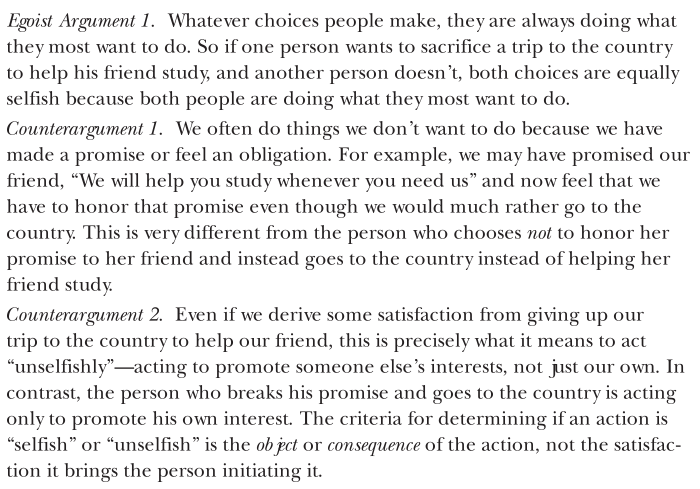

Again ethical egoism

-   Confusion 1: It is false to believe that selfishness means the same
    thing as self-interest.

-   Confusion 2: It is false to say that every action is done either
    from self-interest or from other-regarding motives.

-   Confusion 3: It is false to assume that a concern for one's own
    welfare is incompatible with any genuine concern for the welfare of
    others.

> Do the gods love piety because it is pious, or is it pious because
> they love it? In other words, is a moral value good or right because
> God commands it to be so, or is the moral value good or right
> independently of God s commands (though it is presumably consistent
> with divine moral values)?

Character: Virtue Ethics
------------------------

For Aristotle and other believers in virtue ethics, it is the
cultivation of a virtuous character that is the goal of ethics, to
become a virtuous person. The assumption is that genuinely virtuous
people will act in morally principled ways as a natural expression of
their moral goodness. And these moral actions will in turn strengthen
their virtuous nature.

Aristotle points out that, though we desire pleasure, wealth, fame, and
success, we desire them mainly because we hope that they will bring us
happiness. Similarly, people often strive to achieve virtues such as
honor and intellectual insight, though again the ultimate aim is to be
happy.

Doctrine of the Golden Mean, a moral philosophy that is based on the
concepts of temperance (moderation), self-discipline, and balance (an
approach analogous to the Middle Way practiced in Buddhism).

Virtue then is a state of deliberate moral purpose consisting in a mean
that is relative to ourselves, the mean being determined by reason, or
as a prudent man would determine it.

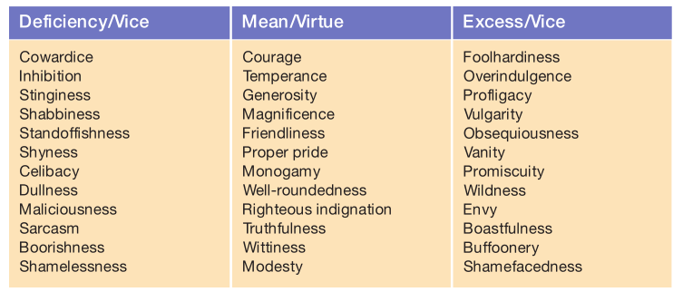

Existentialism
--------------

For existentialism the questions are more along the lines of: How do I
live my life authentically? How can I create myself to be a uniquely
significant individual? How can I invest my life with meaning while
existing in a universe that lacks ultimate meaning? How can I develop an
approach to moral responsibility that is grounded in my absolute freedom
of choice?

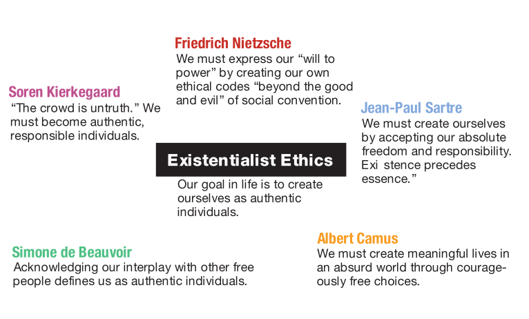

Once you have developed a clear understanding of your moral code, the
struggle has just begun. Becoming a morally enlightened person a person
of character and integrity requires not just an insightful moral compass
but also the commitment to use the compass to navigate the way through
the storms and shoals of your moral life. As a reflective critical
thinker, you will be conscious of the choices you are making and the
reasons you are making them, and you will learn from experience,
refining your code of ethics and improving your moral choices through
self-exploration. Achieving moral enlightenment is an ongoing process,
but it is a struggle that cannot be avoided if you are to live a life of
purpose and meaning, created by a self that is authentic and, as
Aristotle would say, great-souled.
